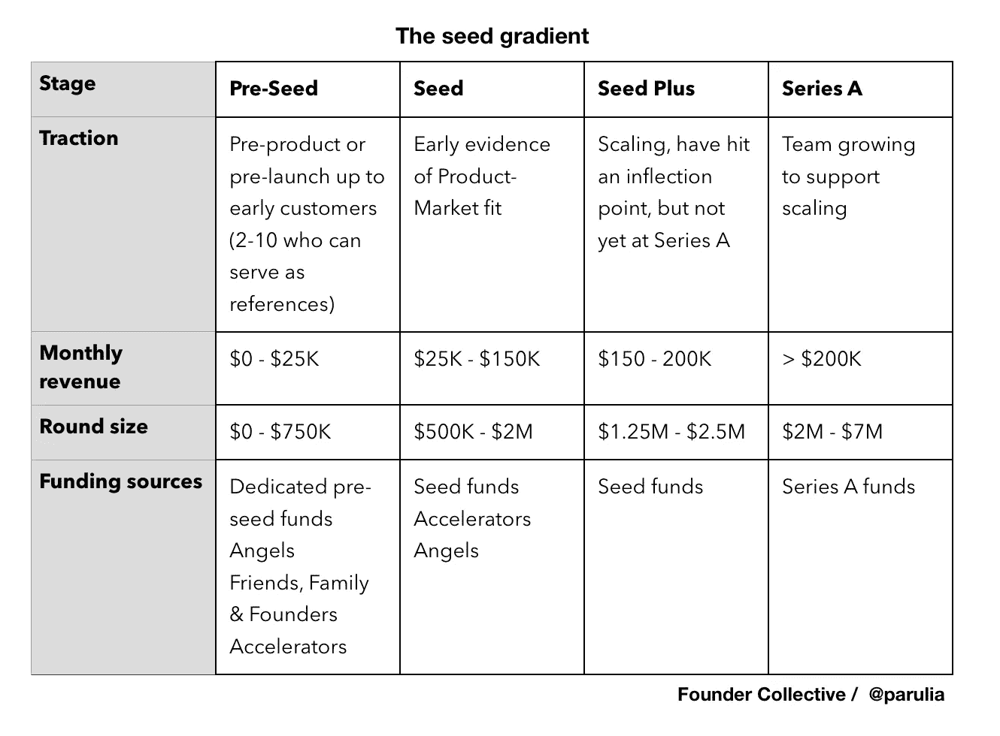

# 筹集种子资本？这是我的成功指南

> 原文：<https://medium.com/swlh/raising-seed-capital-heres-your-2018-guide-on-how-to-do-it-successfully-c73c42530598>

每个企业家都应该回答的 6 个重要问题，以便为你的推销做准备，无论你是产品前期，还是创业和盈利。

你如何为你的创业公司找到合适的投资者？

如果你是一名企业家，你可能不止一次问自己这个问题。

事实上，这是企业家问我的第一个问题。我是[创始人集体](http://www.foundercollective.com/)的投资者，这是一个种子期风险投资基金，在过去的 9 年里支持了数百家初创公司，包括 Buzzfeed、Trade Desk、Pillpack 和优步。

答案并不像看起来那么简单。我亲眼目睹了初创企业的种子基金是如何在短短几年内迅速发展的。考虑以下宏更改:

随着整个科技行业走向成熟，资本更加充裕(但矛盾的是竞争激烈)，技术成本不断下降，代码日益商品化。这导致更多的公司以更快的速度和更低的成本建立起来。这一切的高潮？更少的空白空间，更多的连续创业者争夺种子资金。

考虑到这一点，作为一个创始人，你需要知道什么才能在竞争日益激烈的种子融资中胜出？以下是你应该问自己准备的 6 个问题:

# **1。实际上，你的风险规模？**

即使没有风险投资，你也可以建立一个有价值的企业。你可以[自举走向成功。但是，如果你想筹集资金，你最好准备好满足以下标准:](https://www.linkedin.com/pulse/50-big-companies-started-little-money-joseph-flaherty)

*   **10 倍回报:**正如我的同事大卫·弗兰科尔[所写的](https://techcrunch.com/2016/08/29/you-earn-a-million-dollars-a-year-and-cant-get-funded/)如果你不能把 1 美元变成 10 美元，投资者凭什么相信你能把 100 万美元变成 1000 万美元？要建立一个风险投资的企业，你需要创造这个规模的价值(或者更多。)
*   **速度:**你能成长多快？在 6 个月或 6 年内达到 100 万美元的年收入有着巨大的差异。这很重要，原因有两个:1)投资者会从你过去的表现来推断你未来的增长率 2)当你筹集风险资金时，你是在用别人的钱进行建设，这其中有一个[通常不为人知的成本](https://techcrunch.com/2017/10/26/toxic-vc-and-the-marginal-dollar-problem/)——即你的所有权和最终投资者的[回报](https://techcrunch.com/2016/10/15/overdosing-on-vc-lessons-from-71-ipos/)。
*   **产品<业务<资产:**风投正在寻找高速度、高回报的投资。拥有明确长期资产的初创公司更有价值，这可能是一个比任何竞争对手都大 20 倍的基因信息数据库，或者是一个锁定期超过 15 年的行业的市场份额。最起码，确保你是在建立一个企业，而不是一个产品。(如果你的走向市场计划是把这个任务留给你计划在未来某个时候雇佣的销售人员，这最终是行不通的——当然对风险规模来说是不行的。)

底线是，如果你还没有达到风险投资的规模，但你正在像现在这样筹集资金或支出，那你就有问题了。

# **2。你的竞争力如何？**

作为一名创始人，你专注于解决眼前的挑战。虽然在某种程度上“保持自己的风格”很重要，但如果你想获得风险投资，你不能忽视这三个绝对重要的竞争动力:

*   **群体效应:**当你开始筹集资金时，无论你是否意识到，你都自动成为同龄人群体的一部分，其他筹集了和你一样多的资金，或者在更小程度上有可比指标(收入、牵引/采用。)如果你在同龄人中远远落后，在其他条件相同的情况下，你不会在每周的风投合伙人会议上脱颖而出。你仍然可以领先，但你的团队、市场和防守能力必须更加令人印象深刻。
    这就是为什么我通常建议创始人根据吸引力来决定如何称呼他们的一轮融资，并使用最早适用的标签。加入一个你可以有效竞争的群体:这是运动队的成人版红衫军。
*   **赢家通吃:**假设你的初创公司很成功，你正在抓住一个有价值的市场机会，你的领域可能会出现 2-4 个直接的、强大的竞争对手。大多数创始人不会看得这么远，但到了那时，你要么处于领先地位，要么就不是——在后一种情况下，你将失去投资者的资金。
    由于技术的赢者通吃效应(市场领导者获得了大部分价值)，很少有风投会理性地将资金投入某个领域的第三或第四大竞争对手。这就是为什么我们从第一次见面就开始评估竞争力，因为谁愿意在一项业务上投入 4-6 年的时间，却在未来遇到一堵砖墙呢？无论是创始人还是我们。如果从第一天起就没有计划和执行这个计划，你根本不可能成为你所在领域的第一或第二名(这里强调一下，杰夫·贝索斯的第一天的信——亚马逊是一个激烈的竞争对手，是我们这个时代最好的公司之一)。
*   **行业偏好:**不要因为你在一个竞争不那么激烈的基金行业而气馁。尽管许多基金都是多面手，但现实情况是，它们通常会专注于最赚钱的行业，而医疗保健或教育等存在结构性风险的行业可能更难完成投资。这也是专注于行业的基金变得越来越普遍的一个很好的原因。你应该利用他们和你所在行业的战略天使，他们可以通过他们的行业关系帮你打开难以打开的销售大门。

# **3。你是否根据基金动态来确定你的筹资规模？**

想知道风投公司的真相？只要看看基金的规模，你就能判断你的公司是否合适。大多数风投的秘密经验法则是:任何单笔投资都需要能够回报整个基金。例如，一位 8 亿美元基金的朋友向我坦承，除非她能清楚地看到一家 3 亿美元的企业，否则她不会参加会议。根据经验法则，她实际上是宽容的。

另一方面，天使投资者可能会对一家 5000 万美元的公司产生意想不到的结果，因此可能会更早地愿意承担风险。如果不合适，不要浪费你早期的融资周期，尤其是不要为你的投资条款单追求一个品牌名称。

# **4。你在种子梯度上处于什么位置？**

虽然每一轮的指标每年都在变化，但我们在内部观察到，即使是种子公司也在种子梯度[的不同点上掉队](https://hackernoon.com/the-seed-stage-is-now-the-seed-gradient-d0e5fa65698e)(向我的同事[诺亚](https://www.forbes.com/sites/noahjessop/#777f404a5b7f)脱帽致敬)。)了解你这一轮的阶段、指标和数量，这样你在你的团队中就有了最好的机会——再次回顾我的第二个问题。

(两个快速注释:我们定义了一个类别，我们称之为种子加，用于那些还没有准备好迎接竞争性并购，但具有显著吸引力，可能已经度过增长拐点的处于中间阶段的公司。此外，这些类别适用于软件等资本密集型程度较低的业务，而不是硬件或高科技。)

# **5。你有创业奥林匹克的心态吗？**

那些被创始公司吸引的人有勇气、创造力和决心。高增长公司需要所有这些，甚至更多。我有时把寻找伟大企业家的过程比作寻找奥运选手。很多人(包括我)偶尔会在周末跑 5 公里或 10K，以此为乐。但是想象一下周末战士和奥运选手之间的区别，奥运选手将她的生活配置为支持训练，有一个团队来处理成长的各个方面，并无情地尝试可行的和放弃不可行的。

在企业家精神方面，我的同事埃里克·佩利称之为寻求真相:你能面对你的企业的事实而不进行辩护或否认吗？你能面对严峻的现实并找到解决办法吗？

如果一个投资者没有前进，请不要把它当成个人恩怨，或者把它视为针对你正在建立的企业的致命一击。寻求反馈，从中学习，寻找对你的企业感兴趣的投资者。

# **6。你愿意为投资者进行优化吗？**

没有什么比看着初创公司被投资者亏待更痛苦的了，这些投资者对它们的优势或市场动态没有最好的理解，或者只是有不同的价值观。你可能在想，“好吧，只要能得到资助，我不在乎适不适合”。是的，但是当你花了几年时间在创业上时，在谈判桌上有合适的合作伙伴是值得的。最糟糕的情况是，你建立了一个 8 位数的企业，结果你的一个投资者否决了一个有利可图的退出，这不符合她/他的经济利益。

你如何防止这种情况？确保你和你的投资者在以下方面相匹配:

*   走向市场战略
*   产品原则和优先顺序
*   你希望他们有多投入
*   当事情不顺利时，他们是如何处理的

此外，与他们投资组合中的其他企业家交谈，这将有助于你回答我提到的关键标准。证明人调查是双向的！最后，记住不要忽视你的直觉。与团队成员和投资者一起，问自己一个问题，“与谁合作最让我兴奋？”

作为一个创业公司的创始人，成功在于打造令人惊叹的东西，但也在于建立关系、支持你的团队，以及在旅程中获得乐趣。当你为种子期做准备时，花点时间反思和重新聚焦。

— —

*这里还有几篇关于筹集种子资金的优秀文章:*

*   [如何筹集种子期资金:贾斯汀·坎的创业指南](https://www.atrium.co/blog/seed-stage-funding-startups/)
*   [如何筹集 200 多万美元的种子资金](/techstars/how-raising-a-2-m-seed-round-really-actually-went-b1c53ff9096a)
*   [如何筹集种子资金:通过 Rob Go 了解的关键步骤](https://nextviewventures.com/blog/how-to-raise-seed-capital/)
*   Geoff Ralston 的《种子资金筹集指南》(稍早——尤其是圆形尺寸，不是最新的)

— —

*如果你觉得这个有用，我刚刚写了* [*一个筹集种子资金的清单*](/swlh/a-checklist-for-my-friend-raising-a-seed-round-2520b205914) *你可能也会喜欢。*

祝你好运建设！如果你想得到我下一篇博文的通知， [**请把你的名字添加到我的新邮件列表中。**](https://parul.substack.com/)

## 这篇文章发表在 [The Startup](https://medium.com/swlh) 上，这是 Medium 最大的创业刊物，拥有+ 372，020 名读者。

## 在这里订阅接收[我们的头条新闻](http://growthsupply.com/the-startup-newsletter/)。

