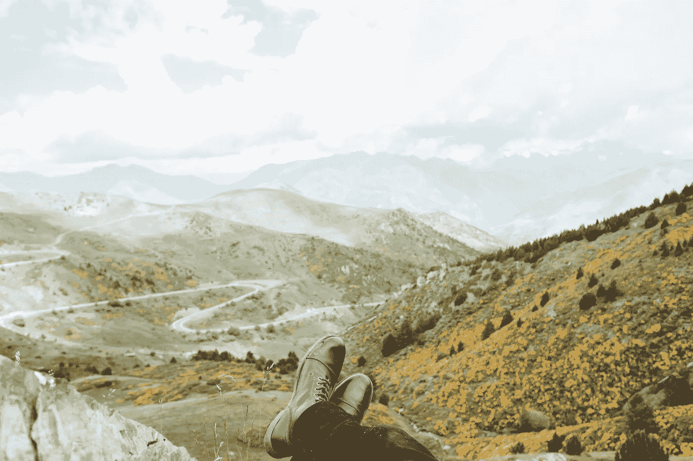

# 随机决策和放手的力量

> 原文：<https://medium.com/swlh/random-decisions-and-the-power-of-letting-go-3a4b679c962b>

Photo by [Sid Leigh](https://unsplash.com/photos/YxqLwUeS0Bs?utm_source=unsplash&utm_medium=referral&utm_content=creditCopyText) on [Unsplash](https://unsplash.com/?utm_source=unsplash&utm_medium=referral&utm_content=creditCopyText)

如果太有计划性和预见性，那就不是自己的人生。

一年半前，我决定搬到伊朗。那是在核协议之后，我想我可以在伊朗市场建立一个营销机构。

我的计划是为所有涌入伊朗市场的欧洲公司提供服务，为他们提供当地市场洞察和服务提供商网络。

为了拿到签证，我申请了伊朗研究的硕士学位。这样，我就可以学习波斯语，了解一些市场环境，然后用剩下的时间发展我的公司。

那个计划彻底失败了。

**首先，欧洲公司的热潮从来没有来过。**

进入一个 5000 亿美元的市场的机会，这个市场具有很高的消费能力和对欧洲产品的热爱？公司更愿意选择观望的方法。尤其是因为制裁的不确定性。

**其次，我根本没有准备好迎接这个挑战。**

我以前从未创建过公司。我在这里，试图在一个高度不确定的环境中建立一家公司，并且对当地市场条件没有足够的了解。

**第三，恐惧让我裹足不前。**

我听说过很多欧洲公司进入市场，由于各种不同的环境而悲惨失败的故事。出于这个原因，大多数欧洲公司不再向伊朗派遣外国代表。

他们没有把风险放在一个外国人身上，而是把所有的责任都交给了一个当地雇员。通过这样做，这些公司的员工为自己减轻了风险，同时从第一天起就注定了他们在伊朗市场的成功。

然而，对我会成为这些失败者之一的恐惧深深地影响着我。

# 每个决定都会带来一些积极的东西

> 尽管我不再打算在伊朗建立公司，但我一点也不后悔搬到这里的决定。

人们一直对我说:“如果你能在伊朗生存，你就能在世界任何地方生存”。

这是胡说八道。

生活在伊朗并不比生活在世界上任何其他地方更困难。当然，有些问题有些不寻常。但如果说有什么的话，这些问题比什么都烦人。

举个简单的例子，从另一个国家的银行账户向伊朗的银行账户转账仍然非常困难。这有时确实会让你的生活变得复杂，但这并不是一个无法逾越的障碍。

**但重点是:**

尽管住在伊朗既没有给我带来我想要的商业成功，也没有做任何与伊朗有关的工作，但我仍然认为我在这里的时光是成功的。

为什么？

因为我在这里的生活让我的世界观发生了巨大的转变。它教会了我很多关于人性的东西。它教会了我很多关于社会对个人的影响。而且，最重要的是，它教会了我很多关于我自己的事情…关于我的信仰，我的优点和缺点，以及我想要怎样生活。

> 没有什么比一个人世界观的转变更有力量的了。

现在，我正试图围绕那些有能力对我的世界观产生巨大影响的经历来组织我的生活。

有时候，这意味着你正在积极寻找新的经历。有时候，这意味着当一些机会出现时，简单地跟随你的直觉。有时候，这意味着除了你自己的好奇心之外，你并没有特别的原因去做一些事情。

> …但这总是意味着你需要相信这个过程，而不是知道它会把你引向何方。

当我搬到伊朗的时候，我知道我想在那里做什么；我想如何谋生的一些大致想法。但最主要的是，驱使我去探索似乎是“未被发现的土地”的好奇心。

搬家也有一些意想不到的好处。例如，我不能在这里建立我的公司，这迫使我完全专注于基于互联网的工作。

这让我能够将所有的精力投入到建设我的作家生涯中，而不是被纸上谈兵但对我个人来说根本不合适的机会分散注意力。

事实上，我可能一直都知道，把大部分精力放在创建一家公司上对我来说不是一件正确的事情。

我只是太喜欢做创造性工作和开发内容的过程了。但是在搬到伊朗之前，我没有勇气专注于我的写作，因为我认为那样谋生是极其困难的。

换句话说，我在伊朗工作时受到的限制实际上给我的生活带来了更多的关注。

# 放下期望

Photo by [Jan Phoenix](https://unsplash.com/photos/SQYeNwwCYZ4?utm_source=unsplash&utm_medium=referral&utm_content=creditCopyText) on [Unsplash](https://unsplash.com/?utm_source=unsplash&utm_medium=referral&utm_content=creditCopyText)

> 期望往往是社会在你头脑中根深蒂固的东西，是你需要在某个时间或年龄实现的东西。从你需要拥有的东西的意义上来说，他们倾向于物质主义，或者从你需要在社会秩序中达到某个位置的意义上来说，他们倾向于等级主义。

这些事情都不会让你快乐。

为什么不呢？

因为它们不是你的梦想和愿望。它们与你自己的人生道路无关。他们所做的只是让你左顾右盼，拿自己和周围的人做比较。

> 当你遵循传统的道路时，你是在一场比赛中竞争，而这场比赛的目标只是一个幻想。你在一个永无止境的循环中奔跑，这个循环根本不会通向任何地方。

看似随意的决定，才是打破这个圈子的方法。

人们会问你:“为什么？你生活中的一切都很顺利…现在你想这么做？你想用它来达到什么目的？”

没有人能理解这些决定，除了你自己。

有什么东西像无形的力量一样把你拉向他们。它在告诉你，你必须这么做，如果你不尝试一下，你会后悔的。

不幸的是，做出这样的决定非常困难。一种是选项 A，它应该引导你走向可预测的结果(成为一名医生),另一种是选项 B，它除了平息你的好奇心之外，没有任何客观的东西。

除了每个人都认为你疯了，你自己也会很快开始怀疑这些想法是否会把你带到任何地方。

一个强大的认知偏见在这里也起了很大的作用:。

我们更害怕失去一些东西，而不是对赢得一些东西感到兴奋。即使失去某些东西的风险很小，而赢得的风险很高，我们也不会去冒这个险。

当然，与遵循常规路线相比，做出随机决策的风险实际上似乎相当高。

# 行动号召:做决定，放手。

> 有没有什么事情是你很久以来就想做，但又不确定的？真正让你害怕的事？一些其他人长期以来不屑一顾，但你却一直在想的事情？

下定决心去做。今天就做。然后就干脆放手了。

没有哲学思考这将带你走向何方。不用担心失去下一次晋升的机会。不要总是在做或不做之间来回移动。

> 要相信自己有能力充分利用随机决策带来的一切。

你有能力做出决定，但你无法控制接下来会发生什么。

这就是你害怕的原因。

除了你个人所能控制的因素之外，这个旅程将带你去哪里取决于很多因素。

因此，担心接下来会发生什么根本没有意义。你不能预测它。你控制不了。你不能影响它。但是你可以充分利用这些发展，从中学习并成长。

> 当你把自己置身于不可预知的情况中，经历这些情况，并把它们作为反思的机会时，转变就发生了。

你今天做了什么随机决定？

**如果你喜欢这篇文章，请吧👏并与你的朋友分享。记住，你最多可以鼓掌 50 次——这对我真的很重要。**

蒂姆·雷蒂格是一位研究跨文化交流的作家。你可以在 www.timrettig.net 的 [**找到更多他的文章。**](http://www.timrettig.net.)

## 这篇文章发表在 [The Startup](https://medium.com/swlh) 上，这是 Medium 最大的创业刊物，拥有 277，994+读者。

## 订阅接收[我们的头条新闻](http://growthsupply.com/the-startup-newsletter/)。

