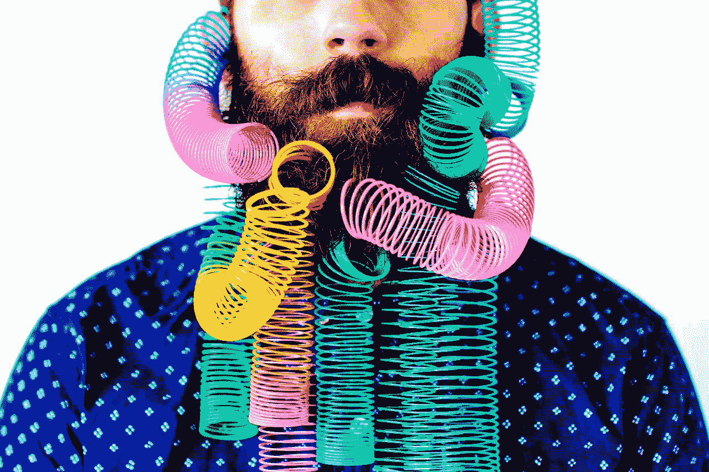
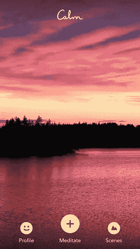

# 我喜欢的随意的东西，你可能也会喜欢。

> 原文：<https://medium.com/swlh/random-stuff-i-love-that-youll-probably-love-too-6905456ed8c5>

Image Credit: Red Poppy Photos by Stacy Thiot

很容易把注意力集中在所有你讨厌的垃圾或让你生气的事情上。生活中太多的时间花在抱怨或谈论没有达到目标的经历或产品上。

## 相反，我想分享一些我喜欢的东西，你也会喜欢的:

# 鼓励交谈的咖啡馆。

打扰。喧闹的音乐。尽快让你坐下和离开餐桌的需要。这些都是咖啡馆的传统缺陷。

我喜欢的咖啡馆是那些懂得交谈的力量的咖啡馆。对话是恋人诞生、企业创建、职业改变和情感分享的地方。任何事情都不应该妨碍这一点。

如今咖啡馆比办公室更重要。真正的工作是在咖啡馆完成的。

# 早起。

在地球上其他人之前起床是一件非常酷的事情。

有一种奇怪的平静感，你可以不受干扰或噪音地思考。早上工作对我来说就像一天中多了几个小时。

我喜欢早晨，因为它们让我可以做事情，也可以和大家分享。

# 表现出原始情感的人。

就像我在 YouTube 上看到的一个美国人唱迈克尔·杰克逊的《我的女孩》的片段，他把它改成了一首关于他女儿的歌。它有原始的情感，激情，沉默的时刻，它给了我灵感。

任何表现出原始情感的人都是勇敢的，我喜欢这样。

# 澳大利亚美丽的乡村。

我刚从澳大利亚的袋鼠岛回来，我看到了沙袋鼠、巨蜥、袋鼠(很明显)、鹰、海豚和海豹。

我居住的国家很美丽，如果你来自海外，那么很值得一游。这是一个如此美丽的地方，它将带你走出你的脑海，回到现在。

# 看到结果。

我喜欢看人们一次拼尽全力数年，然后最终得到结果。我的一个朋友是一个失败了很长时间的音乐家。在文件共享音乐时代，每个人都告诉他，他永远也赚不到钱。

虽然他自己从未成为大牌音乐家，但他现在已经拥有数百万美元的音乐和娱乐业务，并且正在摧毁它。

他也是最好最谦虚的人，这一点我更喜欢！难道你不喜欢看到人们得到结果吗？

# 使用起来非常简单的软件。

我们每天都有足够多的事情要做，需要手动操作的软件浪费了我们的时间。我喜欢简单易用的软件，就像盒子上说的那样。

我使用的一些软件示例如下:

–语法上

–平静冥想应用程序

–Mac OS 高塞拉

# 我 iPhone 上的幸存者手机套。

我的手机从四轮自行车上掉了下来，在跑步的时候从我的口袋里掉了出来，甚至还有健身房的重物砸在里面。

通过这一切，我的幸存者手机盖保持我的手机安全，不会破裂。大多数塑料手机套都是垃圾，但这个不是。

# 第一次见人就敢玩。

在我工作的公司里，一个级别相当低的人找到我，请我做他的导师。他所表现出的勇气是我喜欢的。不管结果如何，他都不会忘记那次经历，并希望能沉迷其中。

# 精心制作的视频。

EA 王子在 YouTube 上做了一些很棒的。它们是原本作为说唱创作的诗歌作品，旨在改变整个文化，让我们以不同的方式思考。它们短小精悍，显然是经过深思熟虑的。

以这种方式讲述融合了内容的故事是我喜欢的。它通常也会像病毒一样传播。

# 鼓舞人心的人。

有些人天生就有激励他人行动的能力。托尼·罗宾斯就是一个例子。马丁·路德·金是另一个。我喜欢被激励，这也是我做同样事情的动力。

鼓舞人心是我喜欢的事情，因为它承载了如此多的力量。

> *“通过使用灵感，你可以让世界发生翻天覆地的变化”*

# 公共交通。

**这是我冥想和听播客的地方。**

有些人讨厌通勤，但我喜欢。我不需要开车，火车会带我去我想去的地方。

最棒的是，当公共交通晚点时，我有更多时间听播客。为什么会有人开车？

# 我最爱的终极事物是什么？

生活本身。

> *“如果你能停止看手机 5 秒钟并注意到它，世界上会有太多的经历和太多的积极因素”*

我们内心隐藏着无尽的可能性，我们每个人都可以做自己想做的事情。尽管我们注定要经历生活中的所有苦难，但我们可以选择仍然享受我们在地球上的时光。

生活是我最爱的。你也可以爱它。

*原贴于*

# *行动呼吁*

*如果你想提高你的工作效率，学习一些有价值的生活窍门，那就订阅我的私人邮件列表吧。你还将获得我的免费电子书，它将帮助你成为改变游戏规则的在线影响者。*

*[**点击这里马上订阅！**](http://timdenning.net/free-ebook)*

**

## *这个故事发表在 [The Startup](https://medium.com/swlh) 上，这是 Medium 最大的创业刊物，拥有 314，551+人关注。*

## *在这里订阅接收[我们的头条新闻](http://growthsupply.com/the-startup-newsletter/)。*

**