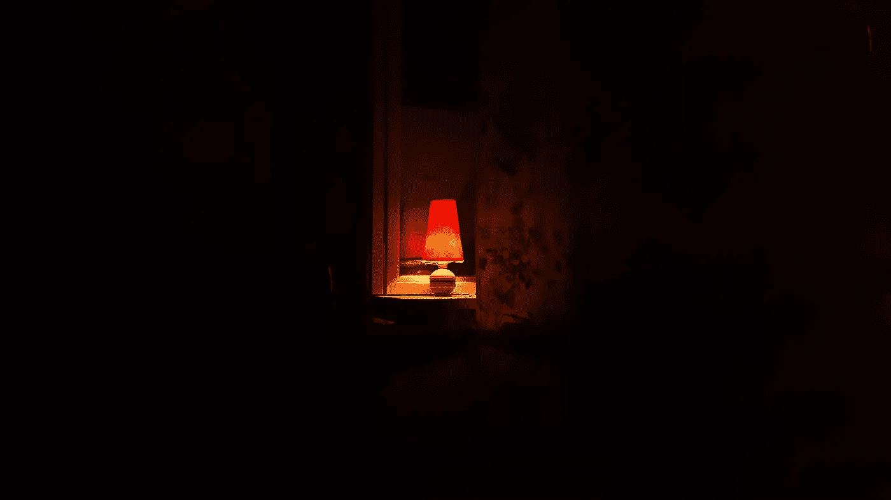

# 随机与计划

> 原文：<https://medium.com/swlh/random-vs-planned-9fc5d3276986>

Photo by [Daniil Kuželev](https://unsplash.com/photos/KaVPZvzlLhs?utm_source=unsplash&utm_medium=referral&utm_content=creditCopyText) on [Unsplash](https://unsplash.com/?utm_source=unsplash&utm_medium=referral&utm_content=creditCopyText)

> 有时候，事情会发生在你身上。其他时候，你会遇到一些事情。

我今天和我的一个熟人聊天，他经营着自己的民意调查公司。因此，他们主要在政治和经济领域进行民意调查，同时也为其他公司做市场调查。

但是让我们先回到过去一点。

所以，在我们几周前的谈话中，他告诉我他真正喜欢做的一件事是投票。当他对我说这话时，我看得出他是真心实意的。

这一直留在我的脑海里。

为什么？因为这看起来太不可思议了……随机。留给我的问题是，一个人怎么会爱上做政治和经济调查。这看起来并不像是某个人的梦想。

这正是我今天问他的:

那么，一个人如何决定成为民意测验专家呢？

他的回答很有趣，但并不令人惊讶。当时，他基本上是在攻读博士学位，并在大学兼职教书。一家民意调查公司急需有人来帮助他们。他们找到他，问他是否认识适合这份工作的学生。

没有一个学生想要这份工作。

所以他自己举手说他想要这份工作。由于他是一名博士生，这份工作是一个更可靠的收入来源，而不是兼职的教学工作。

慢慢地，他开始喜欢上了它。随着时间的推移，他完全爱上了这项工作。

因此，当他完成学业回到自己的国家时，他发现自己的国家缺少高质量的民意调查公司。所以他决定迈出这一步，让它成为现实。

# 生活中的大事

就在那时，他对我说了一些话，立刻引起了我的共鸣:

> “我生活中发生的几乎所有大事都是随机的。它们就这么发生了。与我之前的计划相比，他们把我带到了一个完全不同的方向”。

当然，他完全正确。

生活中，会发生很多意想不到的事情。我们制定的任何计划都不会成功。我们做的任何事都不会永远。

如果我们所做的只是坚持我们为自己制定的计划，那么我们永远也不能充分利用生活。因为生活为我们提供了太多的东西，这些东西是我们根本想不到的。

但是，问题变成了:

> 这难道不是对我们所处环境的反应吗？我们不应该是自己人生的主动导演吗？

我想到了莎士比亚，他说:

> “我很久以前就注意到，有成就的人很少坐视不管，让事情发生在他们身上。他们出去了，发生了一些事情”。

似乎生命是不断平衡的结果。一方面，我们需要充分利用我们的环境。另一方面，我们需要积极塑造我们的环境。

我们需要对未来的生活有一个愿景。为了实现这一目标，我们需要采取必要的步骤。

但我们也需要灵活地识别即将到来的机会，并说:

“嘿，听起来也不错。让我试试看”。

# 具体愿景，松散持有。

在“[泰坦们的工具](https://www.amazon.com/Tools-Titans-Billionaires-World-Class-Performers/dp/1328683788)”中，马克·安德森认为，我们应该有强烈的观点，不要抱太大的希望。他说，大多数人“在生活中从未对事物形成强烈的观点，或者明确地附和并认同共识”。

他说拥有自己的独特观点很重要。但是，当你面对新的和矛盾的信息时，要保持开放的心态去提炼它们。

我认为同样的原则也适用于我们的愿景。

我们需要有一个非常具体的愿景，关于你在生活中想要达到的目标。只有当我们有这样的愿景时，我们才有努力的目标。

但是有时候，有些事情发生了，根本就不是我们能控制的。这些事情可能会极大地改变我们的生活，以至于我们不得不改变我们的愿景，改变我们努力前进的方向。

以我为例。

在我成年后的大部分时间里，我有一个非常明确的愿景:我想成为世界上最好的跨文化交流作家。为了到达那里，我有意识地每隔几年就从一个国家搬到另一个国家，这样我就可以在生活的每一天都获得不同文化的实践经验。

但是后来，父亲意外去世了。

我彻底动摇了我的假设。

我不再确定，我是否愿意做出必要的牺牲来追随我的梦想。毕竟，我已经远离家人七年了，我妈妈现在完全独自一人回到了德国。

所以，我在生活中做了一些剧烈的改变。

我决定搬回德国。我甚至暂时搁置了关于跨文化交流的写作。我决定寻找其他话题来写。

有一天，我可能会回到我的跨文化交际写作上来。但与我最初的设想相比，它将采取完全不同的形式。

我到达那里的道路将会完全不同。甚至最终的结果，看起来也会完全不同。

我总是对自己的生活有一个明确的愿景。

但随着情况的变化，我愿意修改它。

我的熟人也是如此。我敢肯定，他的愿景从来就不是经营一家民调公司。但后来事情发生了，他在一家民意调查公司找到了一份随机的工作，他慢慢地找到了一个更适合他生活的愿景。

首先，他出事了。

然后，他发生了事情。

这一过程的结果是，他在自己的国家建立了最成功的民意调查公司之一。

# 结论:

生活充满了随机的事情，阻碍了我们当前的道路。这些事情似乎阻碍了我们实现愿景的道路。但有时，出乎意料的是，这些东西也成为新修订的愿景的基础。

> 拥有一个非常明确的愿景并不断朝着它努力，是在生活中取得成功的最有力的方式。

但是随机的事情发生了。

我们需要保持开放，因为他们就是我们。

这并不意味着我们应该允许自己成为环境的受害者。我们自己需要保持对我们生活和事业前进方向的控制。

这只是意味着我们需要对生活中发生的事情保持开放。这只是意味着，如果有必要或可取，我们需要灵活地修改我们的愿景。

有时候，事情会发生在你身上。

其他时候，你会遇到一些事情。

有时受随机环境的影响是正常的。事实上，那是生活中不可避免的一部分。只要确保你仍然控制着你生活的方向。

如果你觉得这篇文章有用，请👏并与你的朋友分享。记住，你最多可以鼓掌 50 次——这对我真的很重要。

**您也可以通过** [**点击**](https://mailchi.mp/b0d1e1fba452/struggle-first-thrive-later) **re 免费订阅我的简讯。**

## 这篇文章发表在 [The Startup](https://medium.com/swlh) 上，这是 Medium 最大的创业刊物，有 330，853+人关注。

## 在此订阅接收[我们的头条新闻](http://growthsupply.com/the-startup-newsletter/)。

