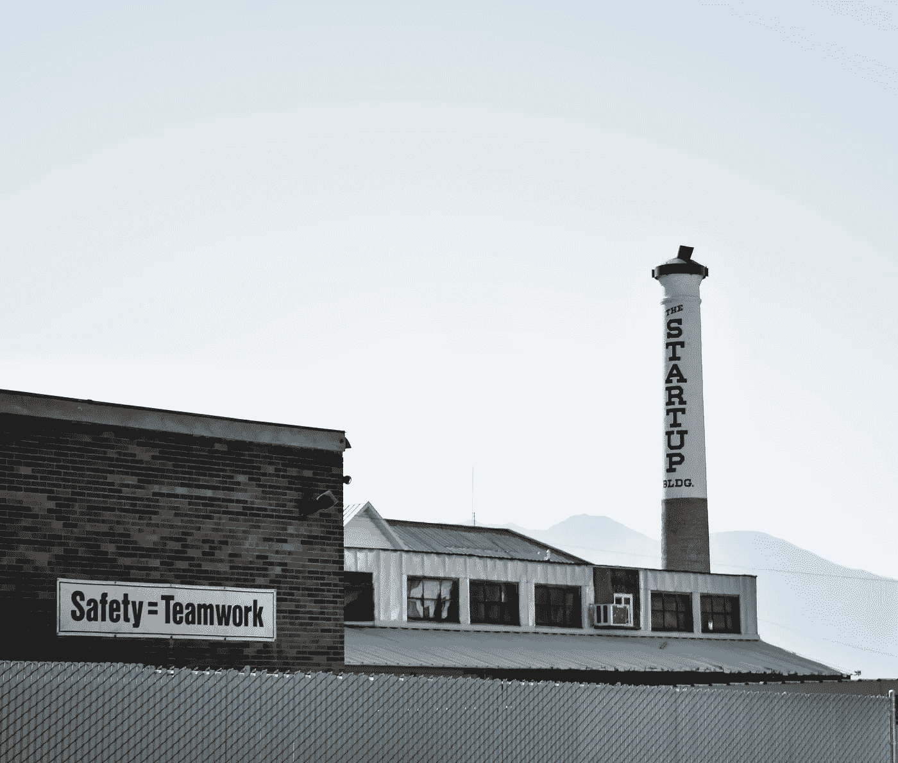

# 重新思考工作

> 原文：<https://medium.com/swlh/re-think-work-8d2c226c2d9b>

Photo by [Paul Bence](https://unsplash.com/photos/KuUxlN0ZjtQ?utm_source=unsplash&utm_medium=referral&utm_content=creditCopyText) on [Unsplash](https://unsplash.com/search/photos/work?utm_source=unsplash&utm_medium=referral&utm_content=creditCopyText)

2018 年将标志着人工智能(A.I .)的年龄和作用意识的重要一年。事实上，这种意识将成为今年及以后的主题。

最易受此影响的群体？千禧一代。

不幸的是，对人工智能的研究已经吓到了很多人，并被用作一个政治术语来吓唬和激怒选民。尤其是年长的选民。千禧一代了解并开始真正将大量人工智能融入日常生活，但它将如何影响我们的职业生涯和工作？随着千禧一代在各自的职业生涯中不断成长，这一点仍有待观察。

马克·扎克伯格(Mark Zuckerberg)或埃隆·马斯克(Elon Musk)等知名企业家一直在谈论 2017 年人工智能的崛起，但 2018 年将推动人工智能成为主流，并真正在一些行业留下印记。

世界经济论坛已经将人工智能在我们日常生活中的崛起称为标志着 T2 的第四次工业革命。从无人机、我们的手机到无人驾驶汽车，我们随处可见这种情况，其影响是惊人的。

Photo by [Allie Smith](https://unsplash.com/photos/qMPdpJcvAx8?utm_source=unsplash&utm_medium=referral&utm_content=creditCopyText) on [Unsplash](https://unsplash.com/search/photos/industrial-revolution?utm_source=unsplash&utm_medium=referral&utm_content=creditCopyText)

[麦肯锡全球研究所进行的一份新报告研究表明，由于自动化，到 2030 年，多达 7300 万美国工作岗位将被完全淘汰。该研究所还提到，人工智能的发展速度是工业革命的 10 倍，规模是工业革命的 300 倍。](https://www.usatoday.com/story/money/2017/11/29/automation-could-kill-73-million-u-s-jobs-2030/899878001/)

前进过程中必须意识到的几个因素:

# 灵活

[该研究所强调的报告提到，未来十年将有多达 5400 万人需要接受再培训，公共客户服务和流程工作将实现自动化](https://www.usatoday.com/story/money/2017/11/29/automation-could-kill-73-million-u-s-jobs-2030/899878001/)。因此，教育至关重要。

教育，不是一般的*获得另一个学位*意义上的教育，而是不断地阅读和学习，并抽出时间不断地重新培训自己的技能。必须提高对自然和个人成长的好奇心，因为一旦一个组织发生剧烈变化，过渡的敏捷性将变得越来越重要。

这一切的美妙之处？有多种学习平台可供选择。

# 教育平台

我们生活在一个科技时代和共享经济时代。这很棒，因为不用花费数千美元去获得另一张纸(作为学位)，只需拿起你的电脑或 iPad，甚至你自己的手机。

你想学的东西现在都可以在 YouTube 上找到，而且内容是免费的。如果你在寻找一条更有条理的道路？LinkedIn Learning 是一个很好的平台，因为他们在各自的培训专业中提供数字认证，当你通过这些模块时，你可以获得“产品管理”或“项目管理”和“设计”的认证，因为它们都提供了更多通向最终目标的线性教育途径。

Coursera 和 Udacity 是其他一次性上课的平台，以加强你的核心技能。

另一个平台是我一直以来最喜欢的平台之一，它可以让你每天都变得更好，提高你的智慧？可汗学院。该学院现已与美国银行(Bank of America)等几家大型机构合作，提供个人金融宣传技巧和课程。

# 技能

该研究所提到，需要更多“专业知识”的职业是那些将从自动化中拯救出来的职业。职业，如:

1.  医生
2.  律师
3.  工程师
4.  园丁
5.  管道，到…
6.  为住宅建造天井
7.  房屋建筑
8.  个性化教学

这些技能和劳动才是真正无法自动化的(至少目前是这样)。那么，我们现在要注意什么呢？**我们自己**。

千禧一代处于应对这一快速变化的最前沿，因为他们总体上仍处于工作年龄的早期。

# 结果

人工智能崛起的关键点不是为了吓唬任何人，而是为了教育和提高意识，因为这是一个现实。意识到要继续自我教育，发展新技能，继续培训和再培训。

很多出版物都在写人工智能，那么底线是什么？

打造自己的品牌。找到你的定位。找到你的主要技能，没有人可以从你身上拿走，**成为这方面的“专家”**。

此外，学习如何为你自己的生活赚钱，并采取那种*制片人*的心态。技术就在你身边，一步步完成这一步，*。*

它将变得至关重要，尤其是当我们给自己的生活增加了更多的义务时。

这就是为什么创业的世界变得如此诱人，因为它要求你掌控一切。负责你自己的品牌，你自己的消费者基础和你提供给大众的专业知识。

**我们需要开始把我们每一个独特的个体视为我们自己的名字，公司或名字，有限责任公司。**

> "掌握你自己的命运，否则别人会"
> 
> —杰克·韦尔奇

在推特上关注我

Photo by [sydney Rae](https://unsplash.com/photos/geM5lzDj4Iw?utm_source=unsplash&utm_medium=referral&utm_content=creditCopyText) on [Unsplash](https://unsplash.com/search/photos/motivation?utm_source=unsplash&utm_medium=referral&utm_content=creditCopyText)

## 这个故事发表在 [The Startup](https://medium.com/swlh) 上，这是 Medium 最大的企业家出版物，拥有 288，884+人。

## 在这里订阅接收[我们的头条新闻](http://growthsupply.com/the-startup-newsletter/)。

