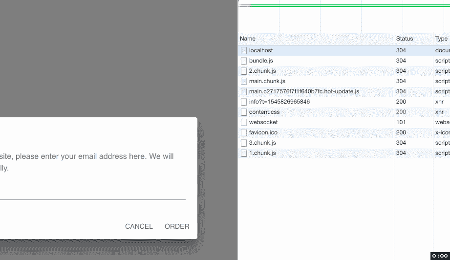
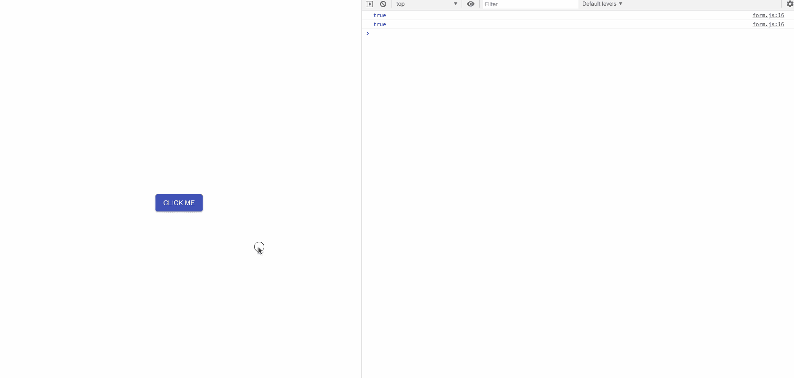

# 反应上下文 Api 和延迟加载

> 原文：<https://medium.com/swlh/react-context-api-and-lazy-loading-4c4b0a48f696>

React

# 什么…

我正在做一个新的电子商务网站，我想分享一些我在这个项目中学到并使用的东西。首先，关于这篇文章的两个主题，有大量的文献和讨论。然而，我将演示如何使用 React 的上下文 api 和代码分割(也称为延迟加载)来创建一个模型，我稍后将充实该模型以服务于更高的目的。这个博客提醒我自己我学到了什么，也是如何让这两件事发挥作用的指南。

# 为什么…

我想用 React 最新最棒的*按需加载代码。我喜欢这个库提供的开箱即用、易于使用的工具。我是一个相当新的懒人加载，因为它是在我工作的时候介绍给我的。我知道很多人不喜欢 Angular 7 或之前的六种 Angular 风格，也不喜欢 AngularJS，但我会让它工作，😏。也就是说，在那里学习它让我想在 React 中尝试一下，因为我立即看到了它的好处。*

也就是说，我们将继续用一种方法来解决这个问题。对于读者来说，我先写代码，然后展示它。

# **准备**进行:

首先来看看我的`app.js`。我为我的组件使用了 [Material-UI](https://medium.com/u/9d99f1b2974b?source=post_page-----4c4b0a48f696--------------------------------) 来帮助启动项目。这个文件是基本的，用一个`<Button />`渲染一个`<Grid />`。我想要的是，当这个按钮被点击时，包含表单的模态应该被呈现到屏幕上。

这就是延迟加载的用武之地。当延迟加载时，我们希望我们没有使用的代码，或者用户第一次加载应用程序时不需要的代码在他们需要的时候加载。在这种情况下，我们希望在单击按钮时加载另一个组件。

目前还没有，但我们会实现的。

接下来，让我们来看看我们的`form.js`。这个代码是当我们的按钮被点击时我们想要延迟加载的代码。它是我们库的一个组件集合，用来创建一个模型。

我们稍后将修改它，这样它将没有状态对象，而是它的状态将取自`Context`，这是一个帮助我们从一个组件到另一个组件获取信息的伟大工具。这是用来替代 Redux 或者传道具的。在这种情况下，我们可以传递道具，但这将意味着**而不是**利用*新的* `Context-Api`。

现在我们有了一个起点，让我们开始修改这段代码，这样我们就可以使用延迟加载了。我们应该做的第一件事是更新我们的`<App />`中的`<Button />`,这样当点击时它将显示表单。我们将通过*惰性地导入它来做到这一点——*参考下面的片段。`line 1`拥有我们需要延迟加载的重要代码。它使用 React 的`lazy()`方法和动态的`import()`方法来完成这个任务。

我们在`line 8`上添加了一个`handleClick()`方法来触发事件加载并打开我们的对话框。

在`line 27`上，我们将使用短路来帮助我们渲染`<Form />`组件。这里有更多关于短路[的内容](https://codeburst.io/javascript-short-circuit-conditionals-bbc13ac3e9eb)。我们还需要将惰性加载的`<Form />`包装在一个`<Suspense />`组件中，并向`<Suspense />`传递一个`fallback`道具。`fallback`是当我们的`<Form />`组件加载时将向我们的用户显示的内容。

现在有些人会注意到我们可以就此打住——我在文章的前面提到过。如果我们想单独延迟加载组件，并将属性`open`传递给`<Form />`，这将是一个布尔值，而属性`toggleOpen`将是一个函数，我们可以这样做，而不必担心`Context`。你也会取得同样的成就。

我们仍将继续…

我们还需要修改我们的`lazy-load-context-form.js`文件，使其自动设置为打开`true`。这只是为了测试我们的惰性负载的功能，以后会被替换。这种变化看起来像这样:

现在，我们可以开始偷懒了。我们可以通过查看我们的开发工具*网络*标签来测试我们的组件延迟加载表单。我们应该看到，当应用程序最初加载时，我们将有一个已经加载的`2.chunk.js`文件。点击我们的按钮后。我们将看到两个新的块文件添加到我们的历史中。

# **上下文……**

既然我们是懒惰的加载大师，让我们通过添加`Context`来控制对话框的打开和关闭部分。首先，我们需要创建一个上下文对象。我创建了另一个文件来做这件事，但是我们真正需要的是在我们的`React`实例上调用`createContext()`方法，并把它存储在一个我们将导出的变量中，这样我们就可以在需要的地方导入它。明白了！？

酷！现在有趣的部分来了！

我们现在必须为我们的`FormContext`添加一个`Provider`和`Consumer`到我们的应用程序中。首先，我们将跳回我们的`<App />`并导入我们新创建的`FormContext`。参见下面的`line 1`。接下来，我们将把我们的`<Button />`包装在一个`<FormContext.Provider />`中，并传递给它一个`value`道具。这个道具将是我们的消费者可以访问的状态。换句话说，我们放在这里的内容可以并且将会在我们导入`FormContext`的应用程序的其他地方共享。我们传递两个东西:一个布尔值和一个函数。参见下面的`line 28`至`line 31`。我们对`<App />`的改进现在允许我们远程控制表单的行为。它现在保持状态，并提供一个函数来控制表单所需的 open 属性是`true`还是`false`。这些变化看起来会是这样的:

我们快完成了！最后，我们需要在`lazy-load-context-form.js`中使用提供的上下文。首先我们导入我们的`FormContext`。我们还移除了这个组件的原始`state`及其所有方法。我们在这里不再需要它们，因为我们正在从我们的`<App />`组件远程控制一切。然后，我们将我们的`<Dialog />`组件包装在一个`<FormContext.Consumer />`中，并使用匿名函数返回我们的模态。你会看到这个函数将一个`Object`作为参数，我们正在[析构](https://developer.mozilla.org/en-US/docs/Web/JavaScript/Reference/Operators/Destructuring_assignment)它，这样我们就可以通过它们的变量名来访问它的属性。这是我们在`<App />`中的提供程序中创建的同一个对象。我们现在将这些变量用于我们的`<Dialog />`和`<Button />`组件中的`open`、`onClose`和`onClick`道具。

就是这样！我冒昧地在我们的匿名函数中添加了一个`console.log(open)`,尽管我没有在上面的代码片段中包含它，这样我们就可以确保我们得到了适当的上下文。见下图 gif 求证。

这就是所有的人！我希望你喜欢这个博客。请留下评论/建议。感谢阅读！

更多关于延迟加载的信息请点击。

github 上的项目链接[这里](https://github.com/JNaeemGitonga/lazy-load-context)。