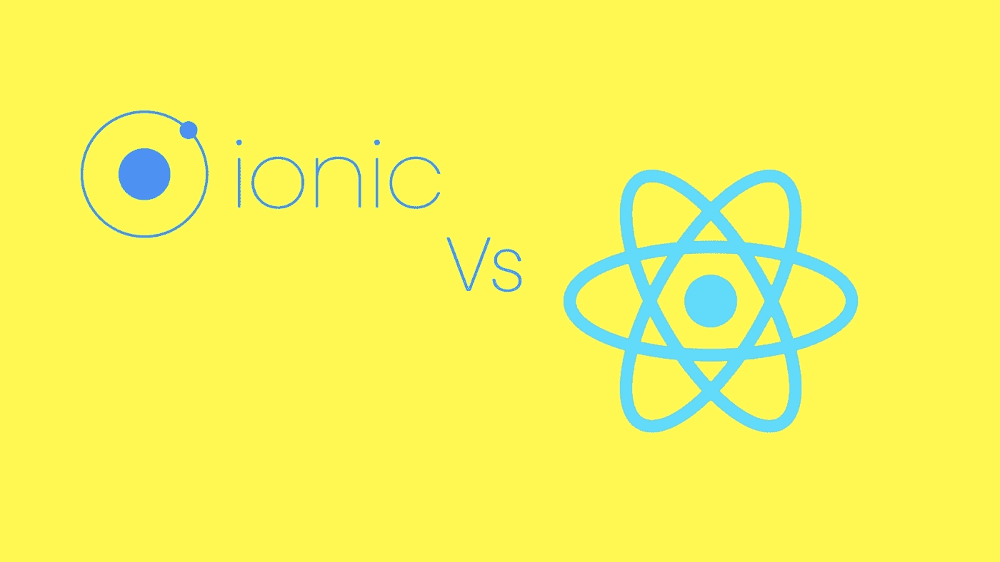
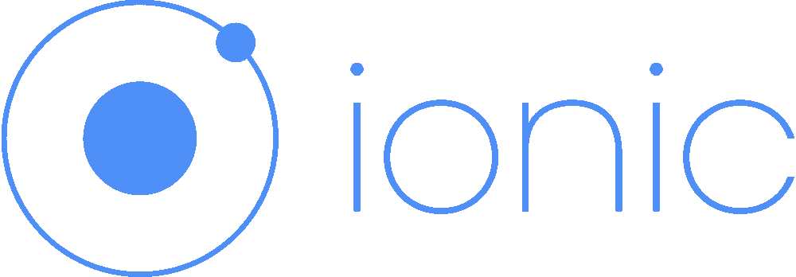

# 反应自然与离子 2:比较

> 原文：<https://medium.com/swlh/react-native-vs-ionic-2-comparison-50aba900be6c>

今天，全球约有 50 亿智能手机用户。这些智能手机几乎每时每刻都伴随着您的用户。如果你在寻找一个能给你最大[用户参与度](https://www.datadab.com)的平台，手机就是你的目标。难怪“移动优先”的方法已经席卷了所有行业，取代了以前从一个网站开始，一路向下的工作流程。随着移动平台越来越受欢迎，许多技术被引入，使我们更容易进军智能手机领域。

它始于[混合应用开发框架](https://www.cognitiveclouds.com/insights/approaches-to-multi-platform-app-development/)，允许我们使用 HTML、CSS 和 JavaScript 等基本网站语言在多个平台上编译和部署应用。然后出现了原生框架，它不仅允许我们使用 web 工具进行移动开发，还允许我们使用 Android 或 iOS 的原生 API。

这些平台服务于相同的目的，即支持通过 web 技术(如 HTML、CSS、JavaScript)创建移动应用程序。使它们与众不同的是它们提供的特性以及它们如何与特定平台的 API 通信。

# 离子 2

*Ionic 2*

Ionic 2 是混合移动开发框架家族的一部分。Ionic 2 不仅是对之前 Ionic 框架的重写，它拥抱了 AngularJS 2 的结构和设计，同时也从 Android、材料设计和 iOS 中获取了他们设计语言的灵感。如果你有 AngularJS 的背景，你会很容易使用 Ionic 开发应用程序。此外，它是 TypeScript 就绪的，这意味着您也可以使用当前的 AngularJS 2 组件。Ionic 还带有预开发和风格化的组件，使开发人员更容易创建应用程序的 UI。虽然 UI 不是原生的，但是可以给出原生 UI 的外观。

Ionic 是 Cordova 之上的一个框架，用于访问手机硬件功能。换句话说，科尔多瓦旋转你的系统浏览器来呈现你的应用程序，被称为 WebView。请记住，Cordova 不是混合应用程序的唯一框架，Ionic 也不是使用 Cordova 的唯一框架。WebView 是一个免浏览器的网页加载器，让您可以访问移动功能，如照相机、联系人等。它将会比 [React Native](https://www.cognitiveclouds.com/insights/all-you-need-to-know-about-react-native/) 慢，因为在这里你必须在你的 Android 活动中编写 HTML 代码。如果用户的智能手机处理器速度较慢，可能会导致性能问题或图形问题

您需要下载插件来访问本机功能。例如，如果你想使用谷歌地图，你需要下载 Cordova 插件。Ionic 2 支持 Ionic Native，与旧版本相比，它可以更顺畅地通过 JavaScript 访问设备的本机功能。所有插件都有一个公共接口，这使得使用原生功能更加容易。

与直接使用本机 API 相比，使用 Ionic 2，TypeScript 组件会使任务变得更慢。然而，Ionic 2 确实借助其结构克服了许多性能问题。

# 优点:

*   快速开发-测试周期。
*   它可以交叉编译到 iOS 和 Android。
*   Ionic 易于学习和使用。
*   您可以用 TypeScript 编写代码，如果您有 AngularJS 2 的背景，这很容易。
*   您可以使用 TypeScript 为所有平台开发应用程序。
*   您可以通过插件系统访问用户设备的原生功能。
*   对于较小的项目，Angular 本身比 React 更容易学习和使用。

# 缺点:

*   如果您需要使用大量对本机代码的回调，可能会有性能问题。
*   如果你的用户喜欢原生的 UI 外观，那么所有设备上相同的 UI 外观可能会让他们失去兴趣。
*   高级图形或交互式过渡的开发将被证明是困难的。

以前，在 Webview 上工作很慢，在某种程度上，由于性能的原因，应用程序的评分很低。现在，这不再是一个问题，因为新的智能手机配备了更好的系统浏览器和更好的手机规格。但是，与本机相比，这仍然是一个明显的性能差异。
Ionic 易于使用和学习，但在使用设备的原生功能方面有一些限制。你可以使用 Cordova 或 PhoneGap 来弥补这一差距，这两个软件都有插件，可以提供你可能需要的几乎所有原生功能，比如 GPS、文件系统等。

Ionic 是原型开发、有快速开发需求的项目，或者如果您有许多预算较低的应用程序需求，并且其应用程序性能评级不是最重要的，那么它是一个很好的选择。

# 反应自然

*React Native*

使用 React Native 构建的应用是真正的原生应用，而不是“混合应用”或“HTML5 应用”。您在 React 组件中编写代码，而它们在您的移动应用程序中呈现为本机 UI 组件。通过系统的 JS 引擎处理的 JavaScript，依然是你的 app 逻辑。话说回来，就性能而言，UI 是混合框架的瓶颈，因为 DOM 性能，而不是应用程序逻辑。因此，React Native 可能需要更多的学习、努力和维护，但你已经创建了一个更高质量的应用程序。

由脸书开发的 React Native 是 React.js 的扩展，使用了相同的原理，例如用于更新 UI 的虚拟 DOM。您在后台计算需要对 UI 进行的更改，一旦这些更改被合并，它将被批量应用。这样做的好处是，你不需要接触 UI 线程，这给了你一个响应迅速的 UI。缺点是，与底层本机操作系统的通信速度很慢。如果你熟悉 React，你会知道它非常注重用户界面，React Native 也是如此。

与 Ionic 2 不同，React Native 使用原生 UI 组件。你仍然用 JavaScript、HTML 或 CSS 编写组件，但是 React Native 在幕后使用本地组件。这可确保您的用户拥有与原生应用相似的用户体验。此外，这不是像 PhoneGap 或 Ionic 的 Cordova 那样基于浏览器的应用程序，因此实现速度更快，在移动设备上运行更快。

React Native 是跨平台的，这意味着相同的代码基础可以用于开发 iOS 和 Android 的应用程序。它某种程度上包装了特定平台的本机代码，因此逻辑层在 web、移动和其他操作系统中是相同的。与 Ionic 不同，它不是设计成一次编写，到处运行，所以你需要在你的程序中改变一些特定于平台的代码，因为目标是创建尽可能接近的本机外观。

# 优点:

*   Ionic 应用程序使开发人员能够使用相同的代码，将跨平台部署和移动 web 部署作为渐进式 Web 应用程序。
*   你可以使用相同的代码库为 Android、iOS 和 Windows Phone 开发应用程序。比 Ionic 2 更好的性能，因为硬件功能的处理是由特定的平台进行的，而不是 Cordova。
*   如果您有大型项目，React 更容易维护，因为它遵循更严格的设计模式和范例。
*   React Native 更稳定，感觉像是原生 app。

# 缺点:

*   将 HTML 代码转换为本机代码的过程有时会出错，要解决这个问题，您需要了解 ObjC/Swift。
*   它是为 iOS 创建的，因此 Android 的某些组件可能需要您的工作。JavaScript 的使用可能会给你一种过时的感觉，尤其是如果你来自 TypeScript 背景。
*   React Native 的座右铭是“一次学习，随处编写”，这意味着你使用相同的框架，也许是共享的组件，尽管你为你的 Android 和 iOS 应用程序维护单独的代码。这意味着在陡峭的学习曲线上有更多的工作要做。
*   在 React Native 中，你可以使用设备的原生功能，而不需要任何插件。React Native 不在平台上使用 web 层，而是利用设备的核心功能，给用户一种原生应用程序的感觉。
*   React Native 适用于性能至关重要且预算较高的“硬核”应用。

> Ionic 2 和 React Native 的目的相同，但项目要求不同。如果你正在寻找性能，响应能力和想要一个本地渲染应用程序，毫无疑问 React Native 是你的选择。另一方面，如果你时间不够，预算不够，希望获得原生浏览器应用的支持，并愿意牺牲性能，那么就选择 Ionic 2。

*最初发表于 CognitiveClouds 的产品洞察博客:Top* [***Node JS 开发公司***](https://www.cognitiveclouds.com/custom-software-development-services/node-js-development-company)

## 这篇文章发表在 [The Startup](https://medium.com/swlh) 上，这是 Medium 最大的创业刊物，拥有 294，522+读者。

## 在这里订阅接收[我们的头条新闻](http://growthsupply.com/the-startup-newsletter/)。

