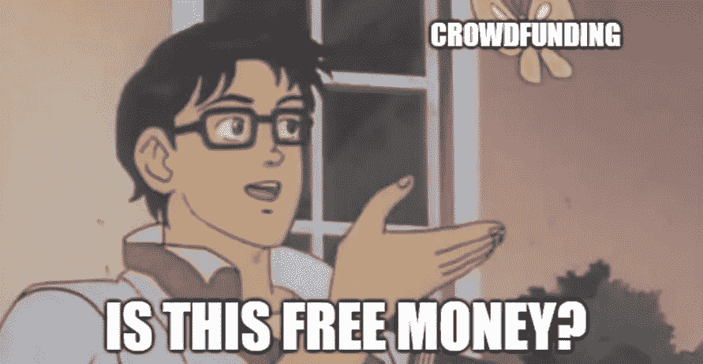

# 在你考虑众筹之前，先看看这篇文章

> 原文：<https://medium.com/swlh/read-this-before-you-even-think-about-crowdfunding-9dede644cf09>

## 否则你可能会很不开心。

Photo credit: Samuel Zeller

除非你一直生活在一堆袜子下面，否则你一定听说过众筹。最近，在线筹款活动在新闻和社交媒体上更加普遍，可能至少有一个人在你的时间线上发送了他们的 GoFundMe 页面的链接。

当然，你的第一印象可能会有很大的不同，取决于你是否看到一个温暖人心的故事，一个 [**养父**](https://www.gofundme.com/bzeek) **收养身患绝症的孩子，或者一些节日组织者试图建造一个** [**巨型充气莱昂纳尔·里奇头**](https://www.kickstarter.com/projects/daveglass/lionel-richies-head-bestival-2013) **。**

本质上，众筹是一个简单的概念。个人或团体(通常通过 Kickstarter、GoFundMe 或 Indiegogo 等在线平台)提出一个想法或事业，他们需要帮助融资，如果他们足够幸运，感兴趣的人会向他们扔钱，同时希望它成为现实。

这是这个等式的两大部分:运气和希望。像任何其他风险投资一样，众筹在双方都充满了许多不确定性。这是大多数新加入这场众所周知的“淘金热”的人无法理解的。

After reading an article about teens who crowdfunded supplies for their local animal shelter, Bob is ready to crowdfund his $100,000 trip to Cancun during Spring Break.

我从 2015 年开始为众筹活动写文案。我的大部分工作都是个人项目和创业，这意味着我的很多客户对这个游戏完全陌生。他们有着新鲜的面孔和明亮的眼睛，所以非常愿意支持者资助他们的梦想，帮助他们实现梦想。

自然，我的首要任务就是把他们盲目的乐观情绪，扔到最近的砖墙里。

> 因为众筹*难。*

不管你是在为这个半球有史以来最酷的设备筹集资金，还是为一个我们所知的有望改变世界命运的初创公司筹集资金，还是为一个你的保险不覆盖的救生程序筹集资金，你都有可能失败。

众筹不是有保证的资金。没有一大群人在他们的电脑屏幕前等着你发布你的竞选活动，这样他们就可以支持它。每天都有数百个众筹页面被创建出来，其中只有不到三分之一的页面能够成功融资，随着众筹越来越受欢迎，这个数字可能会下降。

现在，这不应该让你气馁。很多失败的战役[都是](https://www.gofundme.com/artistmusician)[这种](https://www.gofundme.com/whipping-ass-in-europe) [口径](https://www.kickstarter.com/projects/800612063/twerk-island-a-real-contest-movie)的，所以只要你的拼得好，你已经站在稍微高一点的成功几率了。然而，你需要一个行动计划，不仅仅是为了活动的创建，也是为了营销、推广和实现。

你应该确切地知道如何让人们访问你的页面，了解你的项目，关心你的项目，并捐款。接下来就看你自己了，确保你能兑现任何承诺——除非你的目的是[花上 75 万美元](http://crowdtoolz.com/sorry-ibackpack-backers-you-got-scammed/)然后悠闲地走向夕阳。

还有一点很重要:*失败不是世界末日*。如果有的话，它可以提供有价值的洞察力，让你知道哪里错了，让你更好地准备再试一次。**众筹并不是一门精确的科学**(没有任何涉及人类变量的东西是精确的)，但你可以采取一些措施，以最少的尝试提高你成功的几率；理想情况下，一个。

在你开始一项活动之前，有三个问题你需要问自己，你的回答应该非常诚实。

1.  我的想法会得到人们的支持吗？
2.  我有执行计划吗？
3.  我是否承诺将事情进行到底？

这不需要成为猜谜游戏。除了合法的慈善活动和个人需求，如果你正在创造一种产品或业务，总会有数据和市场研究来衡量你是否有潜在的受众。一旦你确定了一个想法，并向几个会给你诚实反馈的人传达了这个想法——*(我是说* ***而不是*** *意思是你那位善良的中年阿姨，她不知道什么是电力银行，但认为在烤箱上安装一个电力银行是个好主意)*——然后你可以开始从头到尾概述你的过程。

如果你没有时间投入到自己的竞选活动中，但是你有*的金钱，你总是可以选择付钱给别人帮你做这件事。几家众筹机构提供从活动管理和营销到开发你的产品的全套服务。确保他们的条款允许你保留你的想法的权利，并且你清楚地了解他们的成本和可交付成果。在你的领域有活动经验的机构也是一大优势。*

*尽管是一个相对较新的概念，众筹已经飞速发展成为[数十亿美元的产业](https://www.statista.com/topics/1283/crowdfunding/)，并且没有放缓的迹象。既然你已经更好地掌握了它所包含的东西，那就去寻找属于你的那一份吧。*

*如果你喜欢这篇文章，只需一秒钟就能表达你的支持！👏🏻*

**

## *这篇文章发表在 [The Startup](https://medium.com/swlh) 上，这是 Medium 最大的创业刊物，有 355，974 人关注。*

## *在这里订阅接收[我们的头条新闻](http://growthsupply.com/the-startup-newsletter/)。*

**