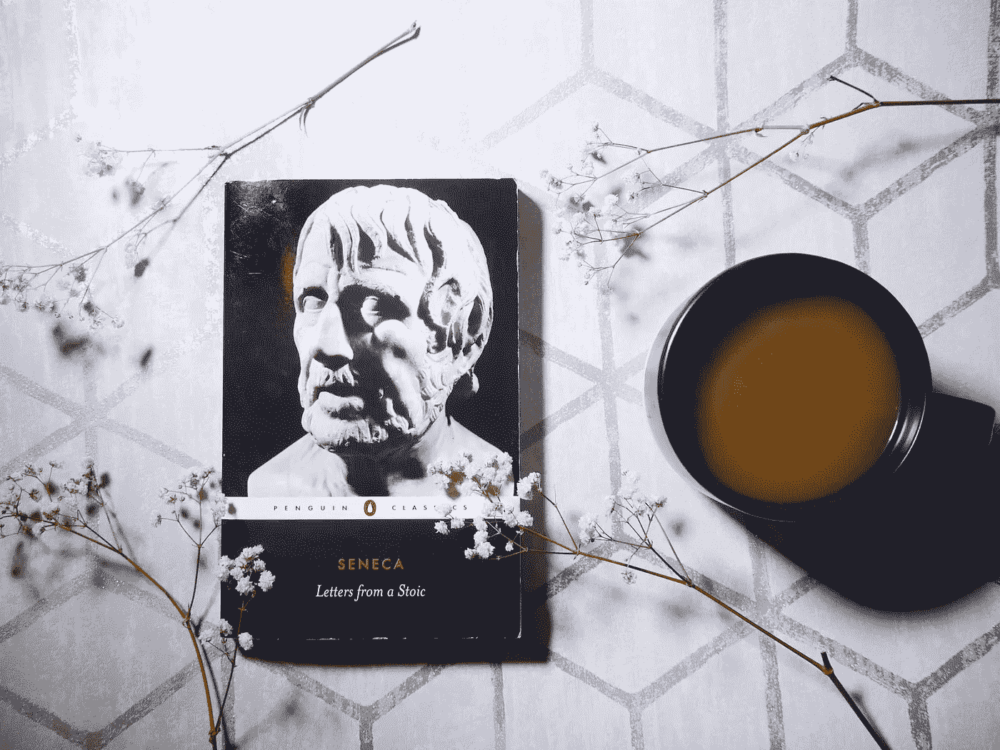

# 如果你无法停止想象最糟糕的事情即将发生，请阅读这篇文章

> 原文：<https://medium.com/swlh/read-this-if-you-cant-stop-imagining-the-worst-is-about-to-happen-671737065b4f>

> “一些破产的商人开始着手创办新的企业。其他人从三十楼的窗户跳下。
> 
> 后一类人表现得好像生命中没有第二次机会，好像他们完全依赖于目前从事的任何事业的成功来维持他们的自尊，而不考虑过去的幸福或未来的可能性。
> 
> 好像他们过去赢得的任何爱或认可都不算什么；好像他们内心没有任何东西可以依靠，没有内在的价值感。”——*安东尼·斯托尔，*孤独

[Source.](http://www.rosieleizrowice.com)

# 如此多的生活是基于[默认](https://www.rosieleizrowice.com/blog/unhappiness)，习惯，惯例，自动反应。

那些不是真正选择的选择。被忽视的决定。以他们一贯的方式做事。想着你一直以来的想法。

默认操作。闹钟一响就按贪睡键。一到办公室就煮咖啡。打开笔记本电脑后直接进入收件箱。排队掏出手机。询问*你好吗？*

有数据显示我们一天中有多少时间被习惯性行为占据了——大约 40%—50%。但我认为它远不止如此。这些缺陷不仅仅表现在明显的行为上。它们也存在于我们的思维中，存在于我们对压力、危机或失败的反应中。

## 灾难性思维就是这样一种缺陷。

Storr 给人的印象是一个破产的商人从窗户跳出，相信自己没有未来，无视自己的过去，这是一个极端的例子。但是我们很容易陷入总是做最坏打算的心态。

什么是灾难性思维？事情是这样的:

你给你的猫打电话，她没有马上出现，你以为你忘了关窗户，她掉下去了。你惊慌失措，开始在屋子里跑来跑去，喊她的名字，然后她打着呵欠，满脸皱纹地从床底下出现，朝你眨眼。

一个朋友见你迟到了，没有接你的电话，所以你开始想她一定是被车撞了，开始想象在你的余生中责怪自己是什么感觉，因为如果你没有安排这一切，这一切都不会发生。几分钟后她出现了，她只是被耽搁了一下，没有接你的电话，因为地铁上没有信号。

一个同事没有回邮件，然后你意识到另一个同事昨天也没有回你的邮件。你感到恐慌，你认为你做了一些可怕的事情，你搞砸了，你被解雇了，你做了一些可怕的事情，你会被列入黑名单，再也不能工作。就在你开始争论先卖哪个器官的时候，你收到了他们两个的来信，这只是巧合，他们都很忙。

它一直在继续。它将成为默认值。任何微小的挫折、不幸或错误都会导致世界末日。一切都预示着你将孤独终老，身无分文，没有朋友。不管事情多么顺利，你总是焦虑不安。你总是想象死亡、毁灭和痛苦。

**难道我们人类不擅长创造自己的私人小地狱吗？**

灾难性思维一直是我的默认。无论事情进展得多顺利，总感觉那么脆弱。总感觉一切都随时可能崩塌。

**但是作为人类的好处是我们的行为很少是天生的。大部分是学来的。我们生来就是一张空白的画布，世界会填充剩下的部分。我们的默认是可塑的。**

斯多葛主义有一个心灵黑客，可以大大有助于克服灾难性思维引起的恐慌。

我们大多数的痛苦发生在我们的思想中，而不是现实中。

如果你害怕最坏的事情发生，你会遭受两次痛苦。最坏的事情偶尔也会发生。非常偶尔。

当它发生时，我们希望——用塞内卡的话说——*自由、崇高、无畏和坚定*。冷静。能够处理好。斯多葛派当然不反对考虑最坏的情况，但他们认为这是一种准备的手段，而不是恐慌。

有事发生了。你想象一场大灾难。然后，你不再害怕，而是承认这可能会发生。如果真的发生了，你会去处理它— *因为这就是人们所做的，我们处理狗屎，即使我们不想或认为我们不能。*

处理它需要心灵的平静。所以你专注于[平静下来，理清思绪。然后，如果真的发生了，你会更好地处理它。如果它不发生——很可能不会发生——你就省去了先发制人的痛苦。](https://www.rosieleizrowice.com/blog/churchill-on-journaling-and-anxiety)

这是我最近一直反复灌输给自己的想法。

*附:如果你希望我的帖子每月发送一次到你的收件箱，请在这里* *注册* [*。*](https://rosieleizrowice.substack.com/welcome)