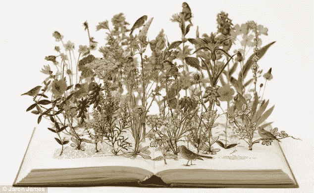

# 每天阅读和写作

> 原文：<https://medium.com/swlh/read-write-every-day-d37f3412d459>

# 每天阅读和写作

我们都应该每天阅读或写作。越原创越好；尽可能接近困难线。

阅读和写作是一项基本技能，自从交流出现以来，我们已经在不同的文化中集体采用、接受和发展。他们进化出互动和联系或生存的必要性。它们共同代表了我们交流和传递思想、感觉和传感器输入的能力。

这些都不是天生的；他们不断地学习、适应和强化。随着我们物种的进化，我们的交流方式以及我们如何概念化和描述我们的世界的深度也在进化。它从未停止。但是我们有。或者至少，我们放慢了脚步。

在我们早年和成年之间的某个时候，我们的进程变慢了。我们学习基础知识，依靠我们所拥有的，不断地反应，而不是积极进取的心态。我们变得相当自信和自给自足，忽略了沟通和有效沟通之间的重要性、力量和差异。

在成人的世界里，我们被期望与不同文化和分散的团队进行交流和合作。我们真的知道怎么做吗？我说的话、传达的信息或试图传达的信息是否被理解为是有意的？我是否以一种可以被理解为有意的方式展示了我的作品、我自己和我的立场？

斗争是真实的，影响可能是关键性的。如果我们不能有效地沟通，这是一条通往底部的漫长道路或角落里的孤独点，这是我们的选择。为了更好地服务自己和他人，我们应该更有同理心、更清晰、更简洁，这样我们就不会浪费彼此的时间、注意力和生命。

怎么会？练习。坚持不懈地、有目的地练习，每天如此，因为我们在乎。

每天读或写一些东西。越是原创或极具创意越好。这就是主动学习如何从多种角度思考，并在这个过程中变得更加聪明。你会因此成为一个更好的人。

# 2017 年，我学会了如何阅读

在过去的 5 年多时间里，除了短到中等形式的公开的数字文字，如文章、博客或数字杂志，我没有读过任何东西。

2017 年 1 月 1 日我承诺读一本书。5 月 31 日，我终于完成了那本书。

然后我承诺在接下来的 6 个月里再读 3 本书。我把它们分成两部分阅读。

然后在九月，我承诺每月写一本书。简单。所以我在今年剩下的时间里买了 6 本书。

十月份我已经读了其中的两本。所以在 11 月，我承诺每周写一本书。

我在 11 月读了 4 本书。加上几本晚报，因为我想看些小说。

那么这种胡言乱语有什么意义呢？

设定一些合理的目标，然后摧毁它们。你可能会惊讶于它们会带来什么，你的生活和心态会因为它们而改变，当然，因为如果你不规划自己的生活，别人会的。

我知道你在想什么..我认为这是胡扯。

这些是什么样的书？他们在一起多久了？有 250-400 页的混合非小说类的哲学、科学、商业，当然还有巨人的工具。给我发消息要一份清单或一些推荐。

你真的阅读并理解了它们吗？是的，每一篇都有笔记和重点，下一篇是概念和应用的日志。

那不是太消耗一个介质了吗？为了平衡，我还…

*   听了 400 多个小时有注释的播客，以及通过“Blinkist”的 200 篇每日书籍摘要和 150 篇斯多葛派散文的音频集(两次)。
*   完成了 James Clear 和 Mark Manson 的整个博客存档，以及一些免费和付费的在线课程。
*   哦，对了，在过去的 11 个月里，我平均每晚睡 8.25 到 8.50 个小时。是的，我跟踪那东西。是的，这是一个绝对的生活改变者，通过今天的紧张来真正地承诺明天。

所以，到目前为止，2017 年的表现相当出色。这个故事的寓意是永远不要停止学习和挑战自己。设定一些合理的目标，然后抓住每一个机会彻底摧毁它们。

我还计划在 2018 年承诺/购买 15-20 本书，所以分享一些建议吧！

## 这个故事发表在 [The Startup](https://medium.com/swlh) 上，这是 Medium 最大的企业家出版物，拥有 284，454+人。

## 订阅接收[我们的头条](http://growthsupply.com/the-startup-newsletter/)。

