# 房地产 ICOs:繁荣还是萧条？

> 原文：<https://medium.com/swlh/real-estate-icos-boom-or-bust-1c3d0504074b>

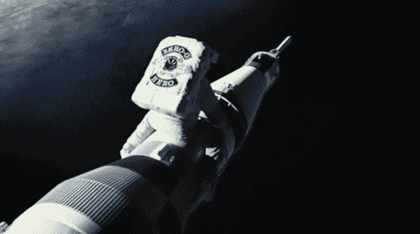

**首先，我们超级支持区块链**，总体而言是好的 ICO 和加密货币。我们也支持有意义并保护投资者的好投资，或者如果它们具有高度投机性，那么不对称的上行看起来值得冒下行风险。我们也深信，在许多失败的 ICO 的灰烬中，将会出现一些令人难以置信的改变游戏规则的公司和商业模式。

**房地产 ICO 是可持续的趋势吗？**房地产 ICO 最终会繁荣还是萧条？在我们推测未来之前，让我们看看 ICO 的世界。

**回到开头，**房地产是最古老(uhemm，可能是第二古老)和最大的行业之一，也是创新和技术发展最慢的行业之一。现在，我们开始看到最新的投资“形式”( ICO)开始在房地产行业展现自己，所以我们认为我们应该向我们的投资者群体概述一下我们今天看到的情况，我们期待什么以及我们看到未来会发生什么。

**ICO(**[**首次公开募股**](https://www.investopedia.com/terms/i/initial-coin-offering-ico.asp) **)** —是的，这个名字很聪明地“取自”了“首次公开募股”，从积极的方面来说，它为区块链的初创公司提供了一个新的超动态资金来源，允许快速试验新的想法和概念，否则这些想法和概念可能永远不会通过“传统渠道”获得资金。这里是纳斯达克对 ICO 的解释 。请注意，“硬币”也被称为“代币”。

ICO 或初始硬币发行是区块链初创公司通过发行自己的硬币来换取投资的一种融资方式。在 ICO 期间，投资者购买一定比例的硬币，以换取货币、证券或其他法定货币，或其他加密货币，如以太坊或比特币。这个过程类似于首次公开募股，投资者利用区块链技术购买公司的硬币而不是股票——然而，在 99.9%的 ICO 案例中，投资者并不拥有发行硬币的创业公司的任何股权。然而，这些硬币打算在二级市场上交易，其价值在于它们在正在建设的新区块链平台上的使用(通过出售硬币筹集的收益)，而且一些投资者认为这些硬币还有额外的投机价值。

ICO 的概念对投资者很有吸引力，因为整个网络的价值增值的一部分给了令牌持有者。这个空间中的一些社区也有一个巨大的积极的文化(几乎像邪教一样)元素，即“我们将成为建设一个新系统、一个替代宇宙的一部分，并拥有这一价值创造的一部分”。

另一个要点是，迄今为止，ICO 的大部分资金来自投资者对项目的加密货币投资，而不是法定货币。这是区块链初创公司的新世界，也是加密的新世界，它有自己的语言、应用、dapps 和社区。

**区块链**是数字化的、分散的、数字交易的公共分类账。与 Excel 电子表格类似，区块链最初是为比特币创建的一种会计方法，允许许多不同的用户跟踪数字货币交易，而不必有一个中央记录系统。**更上一些**[T5【区块链】这里 ](https://blockgeeks.com/guides/what-is-blockchain-technology/)

**对区块链初创企业来说，ICO 融资现在已经超过了风险投资，这是一个非常有趣的转折点，吸引了很多人的目光**

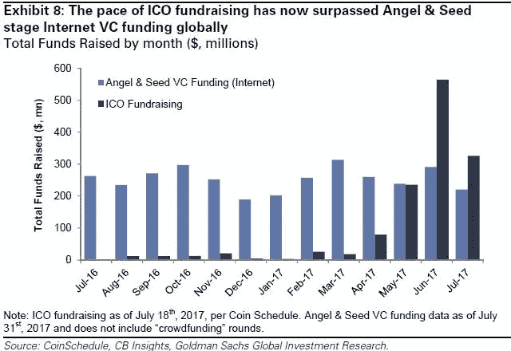

对于那些在风险投资领域的人来说，这是一本很好的读物

我们发现 ICO 背后的原始 DNA 和概念在智力上非常出色，这对我们理解密码经济学非常有用，有助于揭示比特币、区块链和 ICO 相关的所有事情。密码经济学是利用激励机制和密码学来设计新的系统、应用和网络。我们在这里强烈推荐这些文章，以便更深入地研究主题**、**、[、**、**、](https://www.coindesk.com/making-sense-cryptoeconomics/?utm_source=BITCOIN+Letter+Distribution+List+%3A%3A+Nov+2017&utm_campaign=d15eb74f1c-November+Public+Letter+2016&utm_medium=email&utm_term=0_3557a6d6f6-d15eb74f1c-185222073)、、[、**、**、](https://hackernoon.com/cryptoeconomics-in-context-6435ad6839be)中的“为严肃的精神刺激而阅读”的内容。

人们的理解是，妥善完成的最佳 ICO 旨在结合使用加密技术来确保安全性、经济激励(奖励和惩罚)来构建和保护系统、计算机科学和网络效应来构建全新的“价值交换”生态系统，所有这些都不需要第三方中介来监督、批准和检查任何交易的真实性。

比特币目前是区块链迄今为止最突出的应用。阅读 Satoshi(比特币的创始人)关于比特币(她/他称之为点对点电子现金系统)从一开始就要做什么的白皮书,它读起来像乌托邦技术的数字梦想……现在已经 8 年了，似乎运行良好(尽管硬分叉支持者会不同意)Satoshi 几年前失踪了，没有人真正知道是谁，为什么，在哪里或什么， 如果比特币保持活力(我们认为它会)，并继续增长(我们认为它会)成为令人难以置信的大东西，这只是比特币的另一个左场元素，使其如此迷人。

**因此，目前市场上有两种不同类型的 ICO**(尽管混合代币也即将出现)，用于销售/投资的“硬币”要么是 1)公用代币，要么是 2)安全代币

对于投资者来说，理解两者的区别越来越重要。

**这里有两篇文章，你可以更深入地研究实用令牌和安全令牌:**

1) [了解硬币、实用代币和安全代币的区别](/startup-grind/understanding-the-difference-between-coins-utility-tokens-and-tokenized-securities-a6522655fb91)

2) [代币经济学代币使用、效用和价值的商业指南](http://www.blockchaindailynews.com/Tokenomics-A-Business-Guide-to-Token-Usage-Utility-and-Value_a25563.html)

如果投资者想投资一个 ICO 项目，他们必须知道(发行人也知道)他们能得到什么。有许多欺诈性 ICO 作为公用令牌推出，这些令牌显然是安全令牌，然而，发行者没有获得许可，同时实际上违反了全球多个司法管辖区的证券法，因为他们通过互联网从各种类型的投资者那里筹集资金，而没有进行[**【KYC】**](https://www.investopedia.com/terms/k/knowyourclient.asp)或 [**AML**](https://www.investopedia.com/terms/a/aml.asp) 检查。在这些情况下，越来越明显的是，政府正在追踪这些项目，并对明显违反证券法的项目进行罚款或关闭。这意味着投资者的钱可能会在一夜之间化为乌有，或者在旷日持久的法律诉讼中被扣留，或者没有追索权。

在最近 ICO 繁荣的几个月里，世界各地的监管机构都发布了声明，表明了他们对 ICO 的立场，或者目前正在评估下一步该做什么，在这里可以找到以下国家的一些相关文章- [**澳大利亚**](http://asic.gov.au/regulatory-resources/digital-transformation/initial-coin-offerings/) **，** [**美国**](http://fortune.com/2017/07/25/sec-says-digital-tokens-are-securities-warns-of-fraud/) **，** [**香港**](http://www.sfc.hk/web/EN/news-and-announcements/policy-statements-and-announcements/statement-on-initial-coin-offerings.html) **，** [**中国**](https://www.coindesk.com/chinas-ico-ban-understandable-reasonable-probably-temporary/)

在新加坡国内，一些外国创业公司最近在没有适当的资本市场许可证或提交必要的招股说明书的情况下推出了 ICO，这将给投资者带来问题，这里有一篇最近的文章显示了新加坡金融管理局对 ICO 的 [**的本地立场，以规范涉及数字令牌**](http://www.businesstimes.com.sg/banking-finance/mas-to-regulate-crowdfunding-involving-digital-tokens) 的众筹

**所以说房地产 ICO 的…**

房地产 ICO(RE ICO)是最初的硬币产品，允许人们投资于拥有 PropTech 或 FinTech 平台的公司或直接投资于房地产。目前，大多数 RE ICO 都是由迄今为止几乎没有业绩记录的初创公司推出的。现在还为时过早，但让我们来看看引擎盖下的情况:

[**Propy**。com 致力于解决跨国购买房产的问题。Propy 自称是世界上第一个国际房地产市场。Propy.com 的团队促进了国际实体之间的联系，首次实现了国际房地产的无缝在线购买。这个项目的真正挑战是说服世界各地的政府在他们可以建立自己的系统时，将他们的产权存储在第三方的区块链系统上..顺便说一下，Propy 在他们的 ICO 中筹集了 1600 万美元…](https://tokensale.propy.com/)

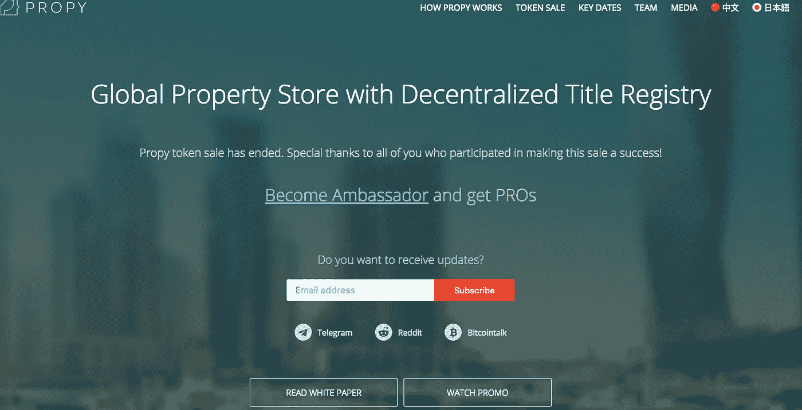

[**SmartRE**](https://www.smartre.io/) **，**通过使用以太坊区块链将房屋中的一小部分股权兑换为 SmartRE 代币，帮助房屋所有者从房屋价值中获得流动性。代币的价值来源于房屋的价值。SmartRE 说，“为什么不在一处房产中投入一美元，在另一处房产中投入另一美元呢？想象一下，在你希望的领域持有部分财产，而不是由基金经理决定，并拥有定制的保险政策以获得额外保护，让你高枕无忧。没有中间人，只是你决定在哪里。”那么和房主的关系是什么，如果他们去胭脂会发生什么？？？这个概念背后没有太多实质内容

[**地产币**](https://estate-coin.com/) **建造房屋开采钱币。**如何？首先，有数据中心将废热转移到附近的住宅取暖。然后是瑞士的一个为社区游泳池供热的设施。现在，开采加密货币时产生的热量可以回收用于加热。这就是房地产硬币的意义所在——让投资者有机会同时投资于住房和采矿项目。在初始 ICO 之后，投资者可以回售他们的公用设施令牌，或者继续投资于项目进行长期投资。这确实是一个很大的问题，你并不清楚到底发生了什么…

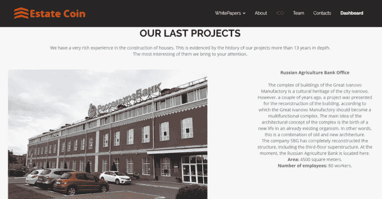

然而，这是现在在他们的主页上，让我们非常困惑…

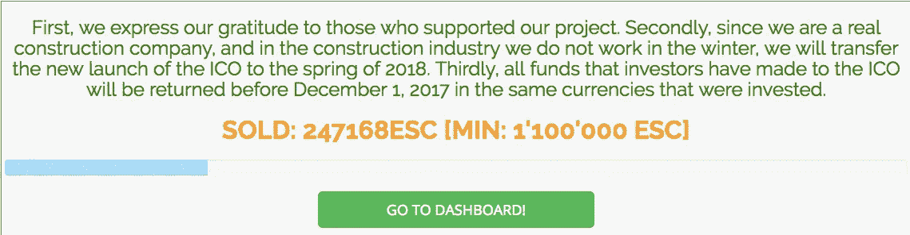

真正的 ICO 是最近做的

它说 [REAL](http://www.real.markets/) ，房地产资产分类账，将区块链技术应用于房地产投资，允许投资者使用加密货币进行投资，而不是占用他们的现金储备或证券。ICO 的重点是购买租赁商业地产投资、转手机会、贷款票据投资和高质量酒店资产。皇马在他们的 ICO 中筹集了 1080 万美元…

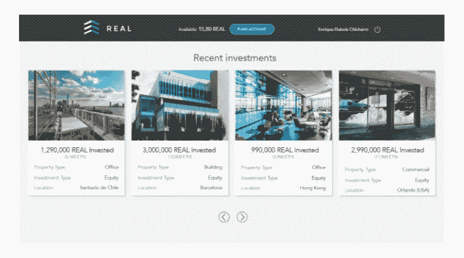

贝尔纳多·埃尔南德斯等硅谷高管也参与了 ico。这位前谷歌产品管理总监和 Flickr 负责人在一位同事帮助阿拉贡的 ICO 取得成功后加入了 REAL。就在那时，他亲眼目睹了众筹和房地产结合的力量。正如埃尔南德斯告诉比特币岛的那样，“作为一名风险投资家，我看到了 ico 给生态系统带来的巨大好处。”

这是另一个 ICO 发布，现在被称为[Caviar](https://caviar.io/)——它声称让你获得多样化的房地产和加密货币篮子，由算法模型驱动。“Caviar 将通过将对快速升值的加密资产的投资与由美国房地产支持的创收短期贷款相结合来实现这些目标。通过在加密和房地产市场之间重新分配资金，Caviar 旨在通过单一令牌的双重市场敞口来提供收入和增长”。所以我想这个产品是部分加密/部分房地产，也是这个项目中的许多移动部分。以下是 ICO 可交付成果的计划项目时间安排..

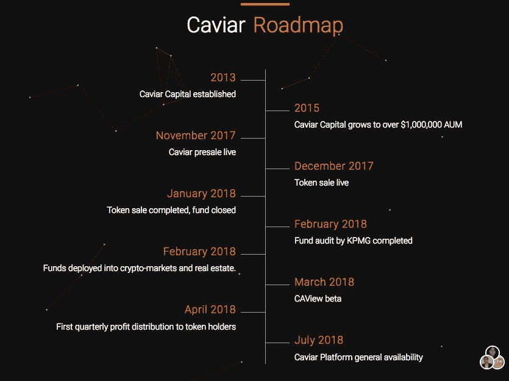

**最后是一些关于 ICO 基金的有趣事实**

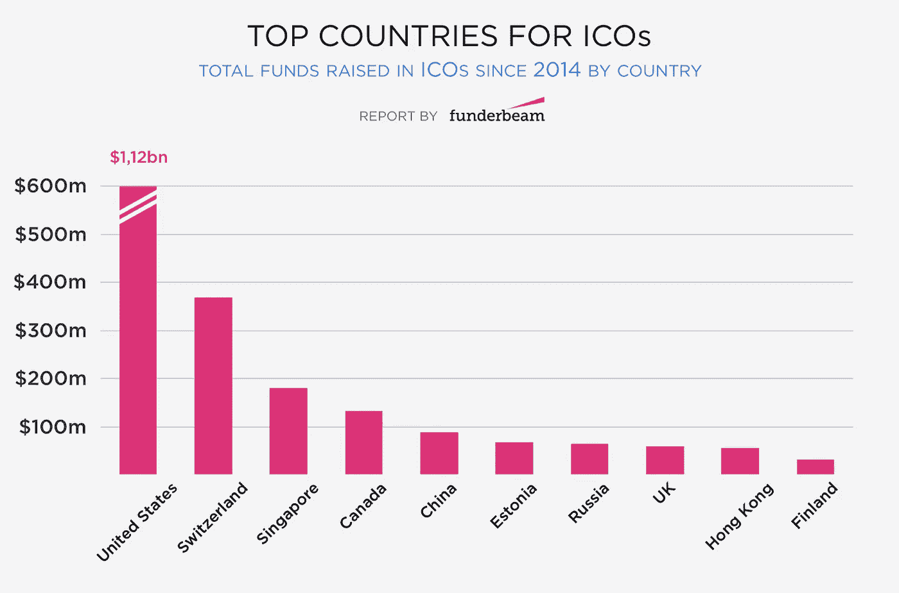

r

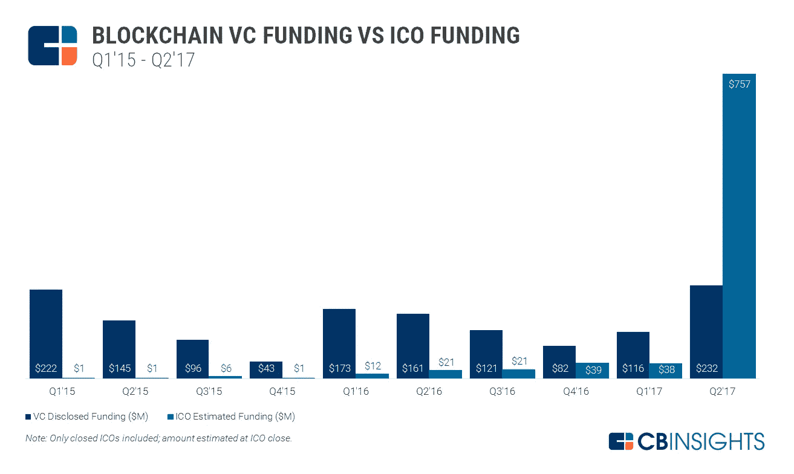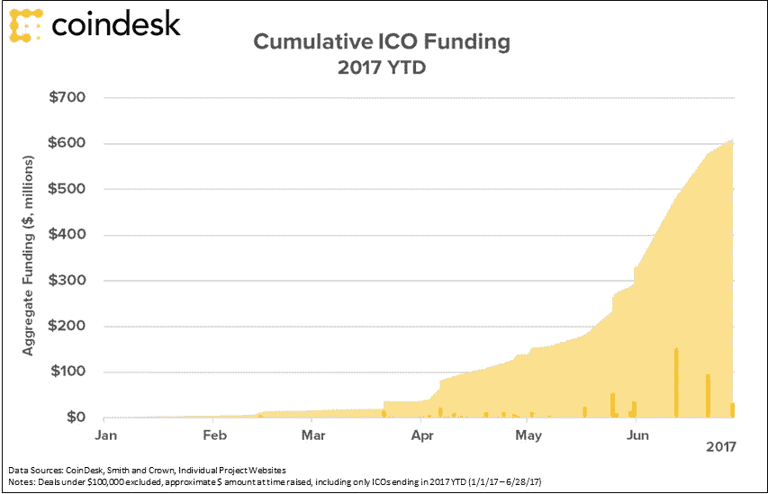

**结论**

我们正在等待一些真正改变游戏规则的计划出台，但这需要一些时间。我们祝愿所有 ICO 的过去和现在一切顺利，并希望他们为投资者带来回报，而不是玷污一个伟大 ICO 的所有令人难以置信的好元素或区块链可能拥有的承诺。

**现在还为时尚早**，迄今为止，我们在房地产 ICO 领域看到的极少数项目似乎还没有强大的用例，也没有适当的金融服务许可证来提供他们正在提供的产品。

以下是本故事在[栏目中提到的 ICO 世界中的一些残酷现实。托克。嘣？](/@twobitidiot/icos-tick-tock-boom-5682220ee6c5)但业内也有许多优秀的演员和公司在努力提高透明度，为所有人创造一个更美好的世界，在很大程度上，我们从区块链创业世界中获得的能量和氛围是超级积极和令人振奋的。

对投资者来说，真正的问题是他们得到了什么，价值多少？如果任何 ICO 计划都没有重大中断，那么它可能不值得投资。**如果提议的 ICO 不能为当前的工作方式提供 10 倍的改进，**如果有一个现实的用户采用计划，那么它可能不值得投资。

但是像所有新事物一样，在我们开始看到一些真正成功的房地产 ICO 投入使用之前，我们将不得不看到许多尝试和错误。我们认为，在房地产领域，大多数象征性项目最好作为由房地产资产支持的证券出售，而不是在用例不强大或不需要时试图成为公用事业象征。然而，这回避了一个问题，加密投资者会喜欢在现实世界中有意义的“实物资产”投资吗，因为它可能不会有任何疯狂的投机价值，因为它是一种真实的投资。

除此之外，我们认为我们将看到许多安全令牌由具有良好记录的房地产公司(不仅仅是零记录的初创公司)和必要的许可证进入市场，以保护投资者的方式提供可靠的投资产品，同时为加密货币投资者提供对真实世界资产的访问。**这是一个巨大的机会。**

**势头还能保持吗？**

钱币中心研究部主任彼得·范·瓦尔肯伯格等专家将 ICO 比作早期网络公司的成功。根据 Ars Technica 的 Timothy B. Lee 的说法，Van Valkenburgh 认为“我们很可能处于泡沫之中。”但他认为这不一定是一件消极的事情，继续说，“你可以把泡沫看作是具有社会生产力的。”看看互联网泡沫，同样的繁荣产生了失败的公司，也创造了许多非常成功的公司，如易贝、脸书和谷歌。

**所以，在所有这些之后，如果你仍然对投资 ICO 的**感兴趣，或者至少对一篇有趣的阅读感兴趣(我还没有核实这篇文章中转贴或链接的任何内容是真是假)，试试这个——[ICO 投资的 6 条规则](http://albertmurphy.com/) …。对我们来说这听起来很合理，祝结果好运，我们对读者在阅读这篇文章后可能采取的任何行动不承担任何责任。

上述所有主题都是高度二元的，投资者似乎坚定地站在轨道的两边，所以这里有 2 篇最后的文章，让你考虑轨道的对立面。

 [## 为什么人们对比特币如此狂热

### 比特币现象并不是一群人都认为加密货币是一种好的投资。那是…

www.technologyreview.com](https://www.technologyreview.com/s/609313/why-people-get-religious-about-bitcoin/)  [## 加密货币爱好者可能不会告诉你的八件事

### 注意:我既不拥有也没有任何加密货币的交易头寸。我没有得到任何一方的补偿来写作…

www.ofnumbers.com](http://www.ofnumbers.com/2017/09/21/eight-things-cryptocurrency-enthusiasts-probably-wont-tell-you/) 

**关于我们**

[InvestaCrowd](http://www.investacrowd.com/) 是一个资本市场许可的 Proptech 平台，面向总部位于新加坡的全球房地产投资者。我们帮助我们的投资者成员获得私人中端市场房地产投资项目，这些项目总是有资产支持的，具有合理和强劲的回报，最低的税收和相对短期的投资期限。我们为合格的投资者、家族理财室、HNW 和特定机构提供服务。

InvestaCrowd 只与有良好业绩记录的房地产公司合作，因此要了解更多关于 [InvestaCrowd](http://www.investacrowd.com/) 如何帮助你的信息，请在[www.investacrowd.com](http://www.investacrowd.com/)注册

加入我们的[电报频道](https://t.me/investacrowd)了解所有关于密码、区块链+房地产投资策略的最新消息。这不是一个聊天小组，我们只为严肃的投资者广播非常相关的新闻和想法

请注册观看实时投资并接收我们的每周简讯@【www.investacrowd.com T2

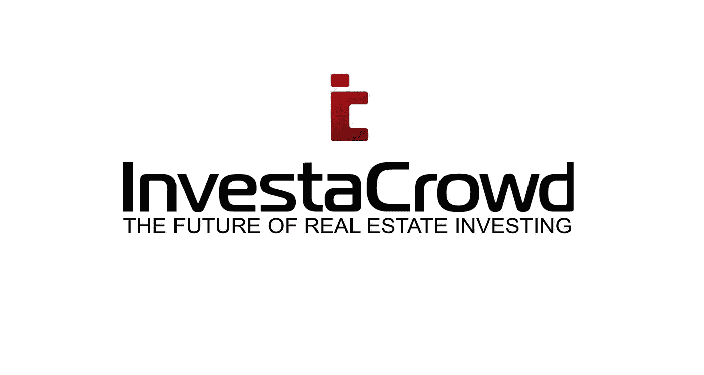

## 这个故事发表在[的《创业](https://medium.com/swlh)上，这里有 264，100 多人聚集在一起阅读 Medium 关于创业的主要故事。

## 在这里订阅接收[我们的头条新闻](http://growthsupply.com/the-startup-newsletter/)。

