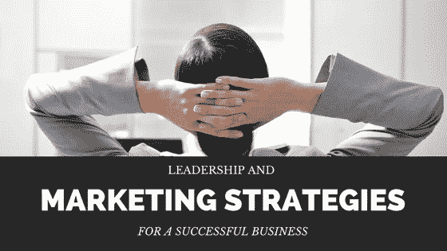

# 商业上真正的成功来自于把客户放在第一位——播客专家迈克尔·布伦纳

> 原文：<https://medium.com/swlh/real-success-in-business-comes-from-putting-the-client-first-podcast-w-expert-michael-brenner-1d307257f58e>

Marketing for Business

如果你像大多数企业主一样，你会不断地研究领导力、提高商业技能和最新的市场营销。这很快会让你感觉像是一份全职工作，你收到的所有信息可能会让人不知所措。

要想在商业中获得真正的成功，求助于那些真正知道自己在说什么的人是至关重要的。像迈克尔·布伦纳这样的人已经并继续取得商业成功。

迈克尔是一名作家，[福布斯 CMO 最具影响力人物](https://www.forbes.com/sites/kimberlywhitler/2017/01/08/the-top-influencers-of-cmos-in-2016/2/#5631c5e924e8),[营销内部团队](https://marketinginsidergroup.com/)的首席执行官，曾在 SAP、尼尔森和欣欣向荣的初创公司等全球品牌的销售和营销部门担任领导职务。

换句话说，当迈克尔·布伦纳谈论营销和商业成功时，请仔细听，因为他知道自己在说什么。

最近，我有幸与迈克尔一起做了一个播客，他指出的最重要的事情之一是，商业成功总是来自于把客户放在第一位。

# 老派营销把公司放在第一位

如今，数字营销已经改变了商业运作的方式。

过去，大多数公司会将营销资金投入到广告上。他们喜欢在 NFL 比赛期间看到自己的名字或标志出现在广告牌和电视上。

尽管仍有一些公司将所有资金集中在这种[类型的广告](http://www.magnificent.com/magnificent-stuff/ppc-advertising-for-beginners)上，但这种营销方式正在迅速过时。

事实上，迈克尔说这会对公司的底部造成很大的损害。为什么？

电视、杂志和广告牌广告的目标是将公司及其产品展现在消费者面前。看起来很聪明，不是吗？

不幸的是，消费者已经厌倦了这种营销方式。

迈克尔说，在一场普通的足球比赛中，一家公司可能有 40 个或更多的广告。他们认为这很聪明，因为他们把他们的商标或产品的形象烙进了观众的脑海。

研究发现，一旦一个人在相对较短的时间内接触了 40 个或更多的广告(比如一场 NFL 比赛)，他们很快就会失去兴趣。他们要么不买该产品，要么对该品牌的偏好下降——这两者都会导致销售额下降。

# 把客户放在第一位是什么意思？

另一方面，一家以消费者为中心的公司如今会取得更多的成功。关注消费者意味着什么？

这意味着公司必须避免根深蒂固的倾向，以促进他们的公司，他们的品牌，他们的产品或服务。

这似乎完全违反直觉，不是吗？

不过，说真的，这是增加收入的最佳方式，也是营销策略获得良好投资回报的最佳方式。

企业主必须相信消费者知道他们想要什么。多年来，营销人员已经“知道什么对消费者最好”,并据此进行营销。消费者已经受够了。他们知道自己想要什么。他们知道自己需要什么。

他们一直在发出信号。关注这些信号并创造出针对这些信号的产品、服务和[营销活动](http://www.magnificent.com/magnificent-stuff/benefits-of-ppc-campaign)非常重要。

你可以通过关注社交媒体来做到这一点。人们的疑问或担忧是什么？你如何回答这些问题或解决他们的担忧？

这种个性化的营销方式会让你受到消费者的喜爱。他们不仅更有可能投资你的产品或服务，他们也更有可能定期这样做。他们可能会在 Yelp 等评论网站和[社交媒体](http://www.magnificent.com/magnificent-stuff/the-power-of-sales-and-social-media)上称赞你，并推荐他们的朋友和家人给你。

当你吸引你的顾客而不是用产品促销轰炸他们时，你更有可能做成生意，并在消费者中有很好的声誉。

# 营销和战略变革始于良好的领导

改变你的营销策略需要一段时间，开始时可能不容易实施。基于客户的营销意味着你通过告诉人们他们想听什么来改变你的策略。

这也需要你的企业内部进行一些改变。为你工作的每个人定期有效地交流是很重要的。这需要大量的倾听。

你办公室里的每个人都能从其他人身上学到东西。如果你——作为公司的领导者——树立愿意倾听他人意见的榜样，你的员工很快就会效仿。

下次你召开营销会议时，一定要问一些关于你的客户的问题——他们想要什么，他们在寻找什么。然后，坐下来听。关于如何迎合客户的需求和愿望，你的员工可能有一些好主意。

# 优秀的领导者创造和谐愉快的工作环境

领导力对一家公司的成功至关重要。重要的是要注意，我们不再生活在一个老板告诉他或她的员工该做什么就足够了的时代。那些日子早已过去。

今天的市场更多的是关于协作、沟通和结盟。首席执行官需要听的和说的一样多。他们需要从员工那里寻求反馈。

这样做可以让 CEO 有机会学习一些他们可能不知道的东西。没有人是超人或女超人。没有人能做到这一切。这是企业主雇佣员工来帮忙的原因之一。员工可以提供 CEO 们可能一无所知的大量信息。

开放的交流不仅有助于雇主知道如何改变他们的营销努力，还有助于让每个人都保持一致。员工会感到被重视，他们会觉得自己是某个特殊事物的一部分，他们会想为公司努力工作。

这是一致的，它不仅对你的底线有好处——它有助于营造一个快乐、健康的工作环境。

你认为你的领导才能可以派上用场吗？你并不孤单。从迈克尔的博客 ***或*** [***查看更多关于领导和结盟***](https://twitter.com/BrennerMichael?ref_src=twsrc%5egoogle|twcamp%5eserp|twgr%5eauthor) [***的信息，在 Twitter***](http://michaelbrenner.monumentalshift.com/)*[***或 LinkedIn***](https://www.linkedin.com/in/michaelbrenner)***上关注他。****

**

*Michael Brenner*

# *关于迈克尔·布伦纳*

*[Michael Brenner](https://www.linkedin.com/in/michaelbrenner) 是全球知名的主题演讲人，[内容公式](http://www.amazon.com/Content-Formula-Calculate-Marketing-Never/dp/0997050802/)的作者，[营销内幕集团](http://marketinginsidergroup.com/)的首席执行官。他曾在 SAP 和 Nielsen 等全球品牌以及蓬勃发展的初创公司的销售和营销部门担任领导职务。今天，Michael 分享了他对交付客户价值和业务影响的领导力和营销策略的热情。他被《赫芬顿邮报》评为顶级商业主题演讲人，被《福布斯》评为顶级 CMO 影响力人物。在 Twitter 上关注迈克尔[迈克尔布伦纳](https://medium.com/u/d83f238edc31?source=post_page-----1d307257f58e--------------------------------)*

**

*Magnificent Marketing Digital Agency — Austin, TX*

**

## *这篇文章发表在 [The Startup](https://medium.com/swlh) 上，这是 Medium 最大的创业刊物，拥有+383，380 名读者。*

## *在此订阅接收[我们的头条新闻](http://growthsupply.com/the-startup-newsletter/)。*

**