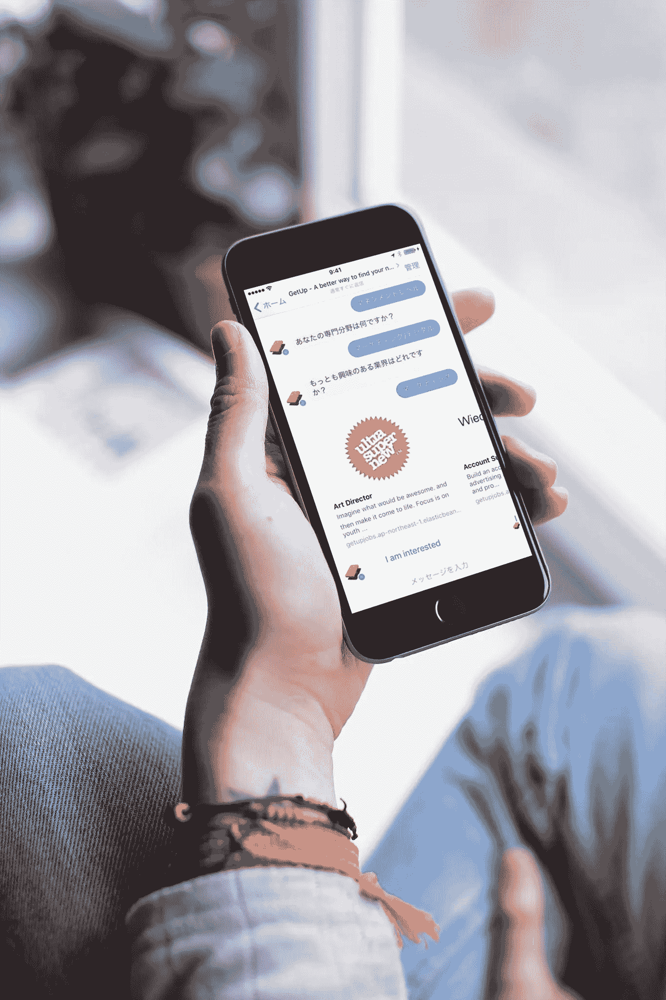

# 在日本，当没人关心你的创业时，真正的话题是如何获得媒体的关注

> 原文：<https://medium.com/swlh/real-talk-on-getting-press-in-japan-with-no-pr-agency-c14cdfd5a8e2>

经过一年的努力工作，是时候将我们闪亮的新公司放归自然了；[起床](http://getup.jp/)职业搜索聊天机器人。以目前的形式发布产品似乎为时过早，但有一件事我们必须知道，如果我们继续前进，会有人使用它吗？这必须经过测试，这样我的共同创始人才能辞去日常工作，专注于这项全职工作。是时候认真做一个新闻发布了

总之，我们对发布的结果很满意，这足以让我的联合创始人全职工作，所以现在我们正在开发一个真正值得骄傲的产品。我觉得我对数字营销有很好的理解，但是我对新闻发布的旧世界知之甚少，我希望这能节省你一些时间。

在日本获得媒体关注到底有多难？在过去的 5 年里，我选择专注于营销空间，在东京做招聘人员。作为招聘人员的一个好处是，你会从许多专业营销人员那里听到很多关于他们如何在日本建立品牌的故事，但是我没有听到太多人谈论如何做好一份新闻稿。

> “做招聘人员的一个好处是，你可以从许多专业营销人员那里听到很多故事”

我寻求 press 的原因是我最近和一个朋友创办了一家公司。这是一项名为 [GetUp](http://getup.jp) 的服务，它是一个职业搜索聊天机器人，帮助双语求职者在日本找到新的职业。

在 12 月份新版本发布之前(1 月的第一周),我制定了一个雄心勃勃的增长目标，我们的目标是将用户数量增加 10 倍。这将使我们的用户从数百人增加到数千人。

媒体关注通常不会带来巨大的用户增长，但我觉得我应该报道它，因为这是我们必须解决的问题。也许写关于如何得到媒体的报道会比我试图得到更多的媒体报道…

在接下来的几周里，我会非常坦诚地告诉大家我们在尝试什么，什么可行，什么不可行。让我们开始吧，这是我们发布新闻发布会 GetUp 时做的第一件事。

## 写新闻稿

我知道我们应该把新闻稿写成故事，就好像有人在写我们一样。关于我们的业务，我们有两点兴趣，首先，我们的产品是独一无二的，我们刚刚在一周前的创意商业杯竞标赛中获得了[奖](http://www.photolife14.com/20161101cbc)，所以我在新闻稿中包含了这一点。

我用英语写了新闻稿，然后让一个朋友翻译并改编成日语版本。这位朋友是 Yelp 的 Alex Kubota，他与媒体/公关机构合作，有很好的建议，他改变了格式，试图将所有信息放在两页上。我们把它打包成一个新闻包，里面有我们的商标，我领奖的照片，一些截图等等。

让截图看起来更好的一个资源是[mocku ups](https://www.mockuuups.com)，你可以简单地将截图拖到照片上并下载。

新闻资料袋链接:【http://getup.jp/news.html 

> “我有一个秘密武器，我有一份几百个媒体联系人的名单”

所以我准备好了我的新闻稿，我还有一个秘密武器；几百个媒体联系人的名单(通过偷偷摸摸的猎头方法获得)我甚至把“独家新闻”给了日经新闻(日本最负盛名的新闻公司)，给了他们一天的时间，然后把完整的名单发给媒体，这显然会让我们的初创公司出名。

没有回复我们制作精美的日本邮件。我想是时候大展拳脚了，所以我们寄出了名单…

## 没人关心我的新闻稿

没有采访，没有网上帖子，没有电话。我把它寄给了我妈妈，她不在乎，没人在乎。

我联系了名单上的一名记者，他是我在几次活动中遇到的。作为一名来自亚洲科技行业的作家，我在脸书与他取得了联系，并给他发信息询问我为何如此优雅地失败，以下是他给我的建议摘要。

> 没人在乎你创办了一家企业，除非它非常独特，你有一大堆用户，或者你得到了一家大型风险投资公司的投资。彼得建议我写一些关于我们正在经历的事情的故事，或者以文章的形式分享我们的一些见解。

很伤人的话，但我已经准备好听了。我们在这个阶段做的最好的事情是在桥上创建一个会员网站，并从脸书链接到它，以获得一些良好的流量，这使我们获得了我们的第一个 100 名用户，但是我会在另一次更新中很快介绍 Facebook。

## 公关电讯服务

这实际上起了作用，通讯社是公关机构用来向记者和博客发布新闻故事的。我们使用了 [PRtimes](http://prtimes.jp/) ，收费约 30，000 日元。你需要一个日本人来正确填写表格，并帮助你安排邮件。有很多选择，所以留出几个小时，他们会核实你的业务，甚至可能会打电话给你，然后你就可以走了。

我对结果很满意，从[我们在 PRtimes 上的帖子](http://prtimes.jp/main/html/rd/p/000000002.000022680.html)开始，我们被发布在多个媒体网站(超过 20 个)上，这应该会给我们在 google 上提供很好的链接。还有一家主要的科技新闻媒体联系我们进行采访，这是我们真正想要的。我一定会再次使用这项服务。

## 我受到了一些压力，现在怎么办？

所以你希望得到一些媒体，现在你能做些什么呢？你不应该期望从它那里得到大量的用户，但是你可以把媒体的标志放在你的网站上，让用户/潜在投资者看起来更合法，并且给你的网站增加更多的链接。

我认为值得投入时间来完善新闻稿。这个被称为[科技记者想要的](http://1rick.github.io/iosmeetup/)的幻灯片非常有用(由[瑞克·马丁](/@1rick)制作，他是《桥的前主编)

现在回到获取用户的问题上，很快会有更多的内容。