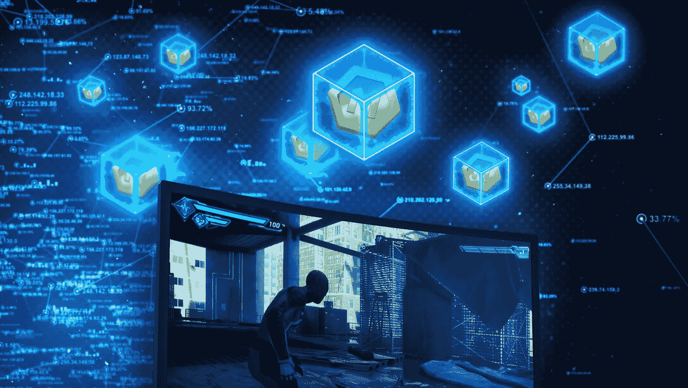

# 真实价值奖励——1380 亿美元游戏产业的下一件大事

> 原文：<https://medium.com/swlh/real-value-rewards-next-big-thing-in-the-138-billion-usd-gaming-industry-d2373f6f6b5c>

脸书改变了我们互动的方式，谷歌改变了我们搜索和使用信息的方式，易贝改变了购物习惯。[monomer](https://www.themonetizr.com/)通过为游戏玩家的游戏时间提供可衡量的真实价值，并为游戏开发商带来新的收入来源，提升游戏体验。

Monetizr 使游戏开发商能够在整个游戏过程中以实物商品的形式给予玩家奖励。记录的终身价值增长高达 25%。公司使用区块链在业务方面与客户保持透明，并从游戏中收集数据，以在游戏开发者生态系统中共享，帮助改进所创作的游戏。

有一种观点认为“[终端用户并不真的想使用区块链](https://www.forbes.com/sites/jasonbloomberg/2017/05/31/eight-reasons-to-be-skeptical-about-blockchain/#546847425eb1)”。这是 100%正确的，因为此时此刻，世界上还没有一种区块链产品可以被任何不具备丰富技术知识的人使用。

区块链本身就是创造一种无价的资产——信任。或者完全没有。Monetizr 开始在区块链账本中记录一切，以实现对客户的完全透明，现在正在测试分散式云计算。

我们生活在一个隐秘的泡沫中。上一次大泡沫是 90 年代的网络泡沫。它为亚马逊、谷歌、易贝和其他已经成为传奇的科技巨头铺平了道路。目前，没有告诉什么基础设施加密泡沫正在建设，但将会有和已经有许多奇迹走出这个空间。

从技术的角度来看，区块链肯定会找到自己的位置，成为不变的账本，不可信的系统。世界上从来没有一个系统能够让整个经济体在没有信任元素的情况下存在和运行。

正如[货币化](https://monetizr.io/)倾向于技术——我们相信基于数据的决策和观察。到目前为止，我们只看到了使用区块链技术可能实现的一小部分。和货币化是决心，博彩业将铺平道路，区块链的成功。

## 这篇文章发表在 [The Startup](https://medium.com/swlh) 上，这是 Medium 最大的创业刊物，有+383，719 人关注。

## 订阅接收[我们的头条新闻](http://growthsupply.com/the-startup-newsletter/)。

