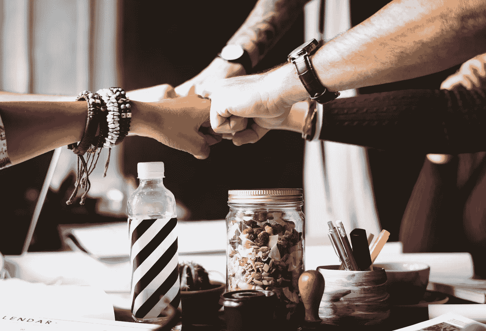
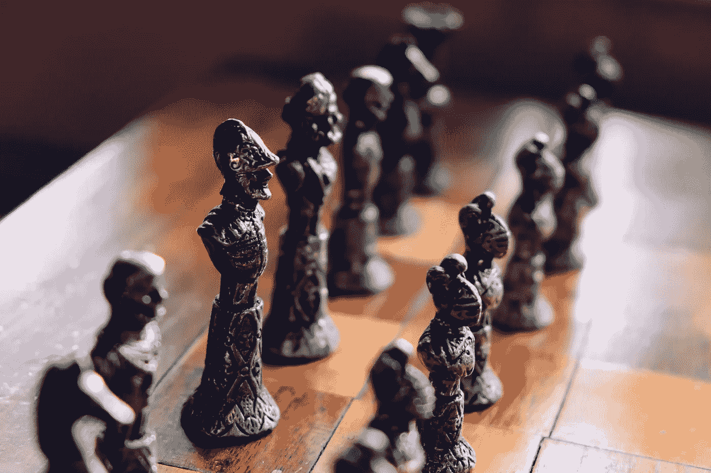
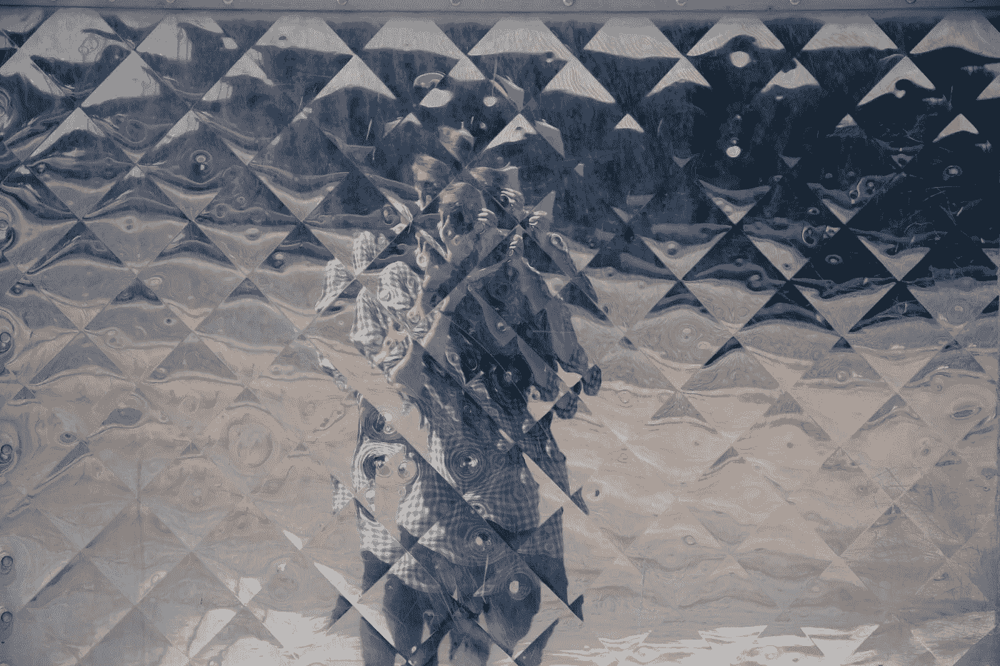

# 检验现实:让你的所有决定变得更好的基本要素

> 原文：<https://medium.com/swlh/reality-checked-54e2e5af78ff>

Photo by [rawpixel.com](https://unsplash.com/photos/3BK_DyRVf90?utm_source=unsplash&utm_medium=referral&utm_content=creditCopyText) on [Unsplash](https://unsplash.com/search/photos/business?utm_source=unsplash&utm_medium=referral&utm_content=creditCopyText)

你想知道…

我怎么可能知道围绕你的决定的因素，并为它们提供一个指导原则呢？

事实是，我不知道你这辈子面对的是什么。

但是，因为我们都是人，我知道我们有一些重要的共同点。我明白，我们总是与他人“保持关系”，即使是在独自思考的时候。

我也明白了做决定只有两种方式:睁着眼睛或闭着眼睛。

## 对什么开放或封闭？

简而言之，在我做的每一个决定中，我——在某种程度上——对他人的人性打开或关闭**。**

我要么把参与我的决策并受其影响的人视为像我一样的完全独立的个体——有问题、希望、梦想、担忧、弱点和优点(就像我有问题、希望、梦想、担忧、弱点和优点一样)——*要么*我以一种贬低他们人性的方式看待他们。

***换句话说，我不是把人当人看，就是把人当别的东西看。***

我可能认为参与这个决定的人是我想要的东西的障碍。

我可能把它们视为达到目的的一种手段——作为我成功的工具。

也有可能，我会认为它们是“无关紧要的事情”，对我正在努力完成的事情无关紧要。

***在每一个时刻，在每一个决定中，我在，我重复，要么把人当人看，要么把人当物看。***

这个至关重要的概念是一个名为阿宾格研究所的组织的工作的一部分。Arbinger 教授冲突转化、内在完整性和外向心态。很快会有更多的报道。

## 请举例

当我们在自己的生活中认识到这一点时，这种“人对物”的观点就会受到很大的冲击。看看下面的故事是否能让你想起你最近经历的事情…

> 安德鲁丢了他的汽车钥匙。他确定他把它放在厨房的柜台上了。他的室友(或配偶，或孩子)是这个地区唯一的另外一个人，从他放下它到现在他急着离开。
> 
> 安德鲁找了又找，四处打听，变得沮丧，提出要求，甚至断定钥匙被别人动过。
> 
> 然后，在他的大口袋里的那个小口袋里，他意识到钥匙在那里。真是松了一口气！对吗？
> 
> 但是等等。安德鲁仍然很生气。为什么钥匙找到了，他却想责怪别人？为什么他还怨恨 **可能** *动了钥匙的人？*

和我一起思考:

这里涉及到什么决定或选择？
如何回应丢失的钥匙……以及如何着手寻找。

*在这种情况下，旁观者是如何被发现的？*
作为准时的障碍，也许？在这种情况下或者其他情况下头疼？

## 下一个故事

> 泰勒负责一项活动。她收集了原创的、有创意的、可行的想法。她知道自己想做什么，以及如何实现。她着火了！
> 
> 事实是，她也是一个委员会的成员。是时候见面了。泰勒是主席。每个人都有自己的计划。泰勒的更好，她肯定。另外，她真的很想看到这个活动圆满结束。
> 
> Taylor 听取了每个人对活动的意见，并坚信她的方式就是正确的方式。到了做出最终决定的时候，她坚持自己的观点(尽可能礼貌地)，并巧妙地操纵团队接受她的提议。感觉棒极了！
> 
> 会议结束时有点不正常，但泰勒认为这是因为其他人太小气了。这是个好计划。他们以后会感谢她的。

再说一遍:

这里涉及到什么决策？嗯，批准哪项活动……但也可能是首先如何进行决策过程。

泰勒如何看待她的委员会成员？也许他们与这个过程有些不相干。也许他们是她计划的潜在障碍。也许他们是工具性的对象(棋子？)来得到她想要的。

Photo by [Lou Levit](https://unsplash.com/photos/B4op5oZ4x5Q?utm_source=unsplash&utm_medium=referral&utm_content=creditCopyText) on [Unsplash](https://unsplash.com/search/photos/chess?utm_source=unsplash&utm_medium=referral&utm_content=creditCopyText)

## 我在安德鲁或泰勒身上看不到自己

这可能是因为我分享的故事与你的生活不平行。

我小心翼翼地说，也可能是因为我们(你、我、其他人)习惯于将人视为物品，以至于我们不仅对他们的人性封闭，也对我们自己的人性封闭——通过个人视角的现实，我们将他人视为障碍、工具和无关紧要的东西。

只是一个想法。

这里有一些在这种封闭状态下的行为和心态的例子:

*   频繁使用*失败者、白痴、混蛋、怪人、垃圾、笨蛋*等术语来称呼他人。
*   经常解雇与自己不同的人:*下等人，那些家伙，他们的同类等。*
*   如上所述，对特定性别、年龄组(青少年、千禧一代、老年人等)的刻板印象。)特别是带着鄙视或者嘲笑。这将包括种族主义。
*   经常感到自卑或害怕别人比自己优越。
*   对一个人在社会环境中的排名的长期沮丧或“抑郁”——学校、工作、教堂、健身房、你住在城镇的哪个部分、你正在进行的依赖外部支持的项目。

## 如果这感觉不舒服

鼓起勇气。人是会变的。如果我所描述的与你圈子里或周围的人相似，那是有帮助的——我们可以看到我们不想做的活生生的例子...或者我们在做什么。我们可以向他们学习。

如果这些例子让你想起你自己，那实际上也是有希望的。你刚刚完成了做出更明智、更基于现实的决定的第一步，因为你已经注意到一些迹象，表明你可能不了解你周围的事物(和人)的真实情况。

## 这有帮助吗？

能够认识到我们将人视为物品影响了一切。这也是朝着更清晰的思维迈出的重要一步。它让我们了解周围人的真实情况。

在*高效人士的 7 个习惯*中，斯蒂芬·R·科维分享了一个乘坐地铁的故事，旁边是一个有孩子的吵闹家庭。他们的父亲看起来漠不关心，不关心他们的愚蠢或他们给同路人带来的不适。这种情况会持续一段时间。

最后，沮丧又有点愤怒的柯维和那个男人说话了。

“先生，你的孩子真的打扰了很多人。我想知道你能不能多控制他们一点？”

那人似乎苏醒了。

“哦，你说得对。我想我应该做点什么。我们刚从一小时前他们母亲去世的医院回来。我不知道该怎么想，我猜他们也不知道该怎么处理。”

心落了，对不对？

这种观点的突然转变，有时被称为范式转变，让柯维先生睁大眼睛回应了这个人的人性。他的假设得到了调整(现实检验)，这个男人不再是一个疏忽的父母。

## 这对我的决定有什么影响？

正如我所提到的，伴随着将人视为物品的心智状态(或心灵)是封闭的；这是不准确的，片面的，偏见的，扭曲的，模糊的，扭曲的。

Photo by [Kaleb Nimz](https://unsplash.com/photos/siImCpX0m1I?utm_source=unsplash&utm_medium=referral&utm_content=creditCopyText) on [Unsplash](https://unsplash.com/search/photos/mirror?utm_source=unsplash&utm_medium=referral&utm_content=creditCopyText)

当我需要采取合理的、公平的、有见识的、有远见的、合理的、合乎道德的、经过仔细推理的、明智的*和*行动，并带来有益的、可持续的、成功的、最终积极的结果时，我需要我的事实是正确的，我的头脑处于正确的位置。

我如何通过一扇被错综复杂、偏见或模糊的思维扭曲和弄得坑坑洼洼的窗户做到这一点？

对参与我的决策或受我的决策影响的人有一个诚实、真实的了解，将会影响我的计划和执行的质量。 ***永远。***

## 但是如果有人真的是个混蛋呢？

…或者坏，或者腐败，或者卑鄙，或者危险，或者不可靠？

奇妙的问题。

事实是:

把人当人看并不意味着我们忽视他们的错误或者因为“他们也是人”或者因为“这很好”而放过他们。这意味着超越任何错误的、单向的、不准确的假设(或判断),这样我们就能清楚地看到参与我们选择的活生生的人。

事实上，当因为表现或性格上的缺陷而需要做出艰难的决定时，尤其重要的是抛弃对他人的物化的、狭隘的信念，看清他们的真实面目——我们所能辨别的全部真相，除了真相别无其他。

**然后，当我们运用我们的知识、智慧、培训、建议、专业技能和直觉时，我们会更加坚定和自信，认为我们在尽最大努力，做正确的事情。这怎么能不影响我们的成果和后续步骤的质量呢？**

## 我如何在做决定前达到这种现实检查的方式？

如果你对把人视为物品有一种刺痛(或更强烈)的认同，那你就在路上了。

下一步往往是最简单的，也是最难的。事实上，它是如此简单，以至于在我们努力成为关于人和关系的清晰思考者时，我们往往会跳过它，直接进入我们已经制定的无偏见地生活和决定的可怕计划！这就是困难所在。

我们，就像斯蒂芬·柯维在《失去母亲的孩子》的故事中一样，必须经历由以下因素引发的转变:

a)我们认识到，在某种程度上，我们对一个人(或人们)的人性是封闭的，以及

b)愿意看到真相。*“我想了解更多。”*那么，我们需要

c)一种我们将人视为人的思想(和心灵)状态。

这就是一些自学的用武之地。我们需要非常非常了解两件事，然后才能了解他人的全部自我。

Photo by [freestocks.org](https://unsplash.com/photos/pUvMN3j2kGc?utm_source=unsplash&utm_medium=referral&utm_content=creditCopyText) on [Unsplash](https://unsplash.com/search/photos/thinking?utm_source=unsplash&utm_medium=referral&utm_content=creditCopyText)

我们需要找到我们感到最被接受、最被欣赏、最被爱、最与世界和平相处的时间、地点、关系(过去或现在)、环境和记忆。(想法:列个清单。)

然后，我们需要去那里，无论是身体上还是精神上，并且——在那种精神状态下——做出决定去做对那个人(或其他人)最好的事。

在这个过程中，你我决心要做的行动可能会让我们大吃一惊。

这个决定可能看起来违反直觉或激进，或者感觉非常自然；这也可能会带来某种程度的不适，因为离开了习惯的、通常的做事方式。可能需要与参与选择的其他人进行一些协商，以达成相互清楚的理解。

但是，如果我们的头脑和心灵从顽固的偏见中解放出来，如果我们自己未经检验和未经支持的先入之见的阴霾被清除，我们将能够更加自信地行动，相信这个选择是我们在这种情况下能够做出的最好选择。

## 下一步做什么

简单地说，练习把人看成人。

对我有用的是研究这种决策方法的基础，然后首先在我最亲近的关系中尝试这些概念。

下面是我极力推荐的三本书:
[***【领导与自欺】***](http://arbingerinstitute.com/shop.html)
[***【和平的解剖】***](http://arbingerinstitute.com/shop.html)
 *都是由[阿宾格研究所](http://arbingerinstitute.com/)完成的。这些可读性很强的书中的观点每天，有时每小时都在改善我的生活。*

## *我将如何提供帮助*

*首先，你可以从我的错误中吸取教训！*

*我最近遇到了一个把人当成物品的事件。这很尴尬，但却是事实，一个简短的例子，在这里等着你。*

***你也可以点击** [**这里的**](http://eepurl.com/dhwtwz) **获取一页纸的“思考表”，帮助你做出清晰、符合现实的决策。免费的！***

## *你能提供什么帮助*

*如果阅读这篇文章让你有所启发，我想请你通过电子邮件或社交媒体与他人分享。复制 [*这个链接*](/@Heatherby/reality-checked-54e2e5af78ff) *并粘贴到你的推特、脸书或其他更新中。**

**此外，如果你在下面“鼓掌”(比如“喜欢”它，从 1 到 50 次)，这有助于把这个变革性的“提示”带给别人。愿你传播的善能回到你身上！**

*感谢您的阅读！*

**

## *这篇文章发表在 [The Startup](https://medium.com/swlh) 上，这是 Medium 最大的创业刊物，有 286，184+人关注。*

## *在这里订阅接收[我们的头条新闻](http://growthsupply.com/the-startup-newsletter/)。*

**