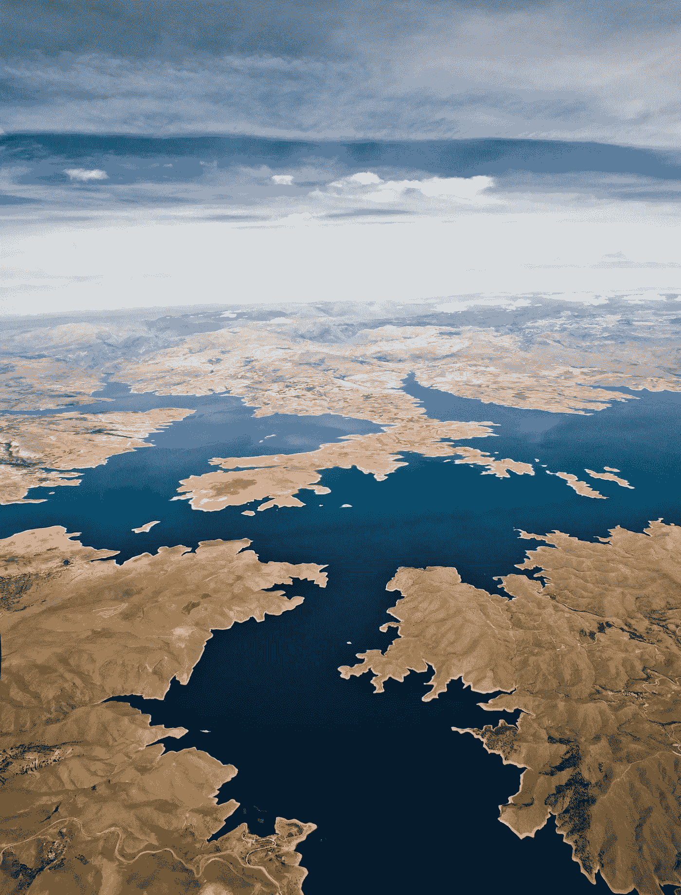

# 现实是对整体的优化

> 原文：<https://medium.com/swlh/reality-is-optimizing-for-the-whole-5d82392aab77>

Photo by [Serkan Turk](https://unsplash.com/photos/-gmNizU6ZCE?utm_source=unsplash&utm_medium=referral&utm_content=creditCopyText) on [Unsplash](https://unsplash.com/search/photos/globe?utm_source=unsplash&utm_medium=referral&utm_content=creditCopyText)

今年早些时候，当我慢慢阅读雷伊·达里奥的*原则*时，我开始写这篇在一堆未完成的帖子中找到的文章。去想那些半生不熟的想法，去看看在那个时刻你的真相是什么，并且能够把它和现在的自己结合起来，这是一件很好的事情。

无论如何，这篇文章一半写在过去，一半写在今天。

本着追随雷伊·达里奥反思的精神，我想强调一些让我印象深刻的精彩花絮。

# *真人*还有你

现实是我们出生时就被赋予的一系列约束。通过了解它们是什么，了解它们如何影响我们的行为，以及了解它们如何为我们带来好处或阻碍我们实现目标，我们可以更好地理解这些限制。

然而，当讨论现实时——我们倾向于关注自己，关注与我们的身体和精神相关的世界*。贯穿全书的一个教训是，在这个我们称之为自然的大机器中，有更大的力量在起作用。*

我们必须意识到，我们是这个世界的一部分，就像下一个人、松鼠或树一样。

知道了这一点，我们就可以把现实，或者我个人认为的自然，看作是世界上每一点每一片的总和。为了保持一切平稳运行，大自然必须通过对 DNA、竞争和时间的巧妙控制来优化自己。

当我们开始缩小我们的身体，第一人称视角和思维，放大缓慢而持续的进化，我们可以开始看到一切事物的美，并意识到现实不是关于你的。

你是整个画面的一部分。杰作左下角的一笔。

听起来有点… *伤感*？

然而，并不是所有的都失去了。如果你利用了自然在自我优化的事实——那么如果你在其中发挥了作用([不管多小](/swlh/ideas-in-our-day-and-age-5268b4665355))，那么你将会得到回报。

这就像乘着你喜欢的任何趋势的浪潮，但要理解推动它前进的真正长期趋势。这种优化可以是人类智慧的任何东西，通过艺术创造美，或者帮助那些得不到充分服务的人。如果你的视野与自然的视野一致，那么你将**受益**。

找出大自然的发展方向。了解技术的发展方向。理解你的同事在说什么——以及他们在说什么。这些是事物本质的线索。

如果这太模糊，这里有一些更实际的东西。

你不需要发明下一个苹果公司，成为一家公司的首席执行官，或者写一大堆博客文章来感受被认可，只要跟随阿什顿。

> 用阿什顿·库彻的话说:
> 
> 放聪明点。考虑周到。慷慨大方。

感谢阅读。

## 这篇文章发表在《初创企业》杂志上，这是 Medium 最大的创业刊物，拥有 358，974 名读者。

## 订阅接收[我们的头条新闻](http://growthsupply.com/the-startup-newsletter/)。

