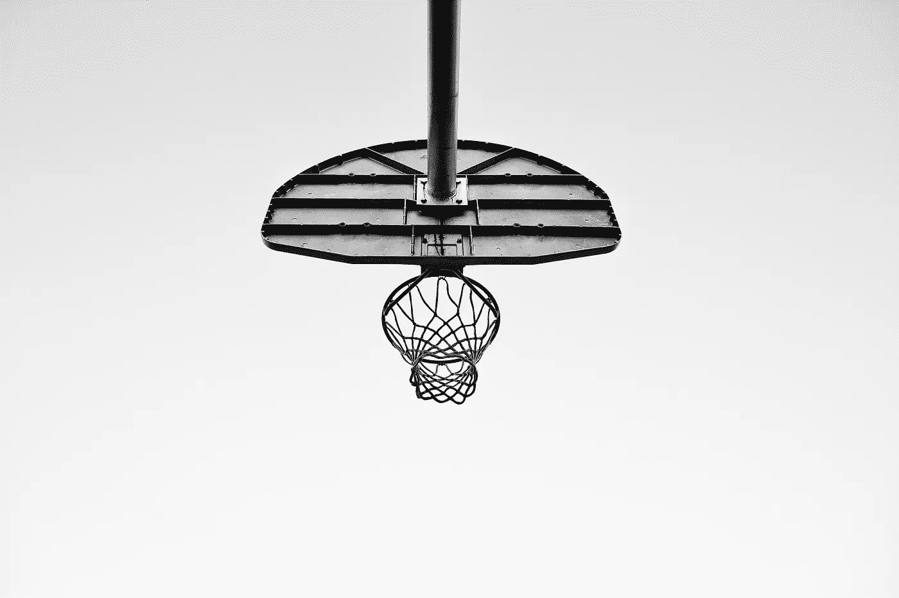

# 生活就像蹦床

> 原文：<https://medium.com/swlh/rebound-dd9e647e1cb2>

Unsplash.com

有时候事情会变得艰难。

有时候，那些海浪冲下来，你刚刚游完泳。你不想再尝试了——你完了，你退出了。

今天我想谈谈反弹——从失败中恢复过来。

我认为有必要先引用一句话:

> 摔得最重的人，反弹得最厉害。
> 
> 尼山潘沃。

当你走上街头时，要记住三件事——你不想再微笑，你不想起床，整天睡觉似乎是一个更可行的选择。

不要那样想。

# 1.还记得那些可爱的小孩吗

有个去我教堂的小男孩，他甚至还不会说话。我非常钦佩他，因为自从他学会走路以来他所做的一切。他走路的时候有点犹豫，但是他不怕做。他选了一个地方去，然后就去了——几乎没有犹豫，笨拙地冲过房间。

从中吸取教训。

像一个蹒跚学步的孩子。

不要害怕跌倒。

# 2.把粗糙的地方看做蹦床

我们大多数人都知道蹦床是如何工作的。你走得越艰难，你就走得越远。现在，这只是简单的物理学——但是必须进行类比。你走得越艰难，陷得越远，你就知道你会飞得越高。毕竟，没有杀死你的东西会让你变得更强大？对吗？

你在一个疯狂的蹦床上。这叫生活。翱翔。

"生活就像蹦床，它让你高兴又让你失望."

> 箴言 24:16“因为义人虽七次跌倒，仍必兴起。”

# 3.上帝不会让你掉进一个你出不来的更大的洞里。

> 诗篇 146:8 耶和华开了瞎子的眼睛。耶和华扶起被压的人。上帝爱虔诚的人。

你会对你爱的人做什么？你不让他们受苦。你是上帝的孩子——他不会让你经历你无法处理的事情。相信这一点。

**爱你的凯蒂**

> 我想把弗朗西丝·巴蒂斯特利的歌曲《蹦床》的歌词留给你们
> 
> 生活就像蹦床
> 它让我高兴又让我失望
> 它不是最安全的地方
> 但是当我的脚离开地面的时候我发现了一件事
> 
> 我坠入你的怀抱
> 你是我的救世主，你是我的救世主
> 哦，你是如何俘获我的心
> 你是我的救世主
> 
> 在地球和天空之间，我试着测试重力有时我觉得我能飞起来，然后突然我失去了所有的希望，因为我独自面对这个世界
> 
> 我坠入你的怀抱
> 你是我的救世主，你是我的救世主
> 哦，你是如何俘获我的心
> 你是我的救世主
> 
> 我知道我只是一个处于最佳状态的人
> ，因为我尝试过独自飞翔却没有成功
> 我需要你，我需要你
> 
> 我坠入你的怀抱
> 你是我的救世主，你是我的救世主
> 哦，你是如何俘获我的心
> 你是我的救世主
> 你是我的救世主

## 这个故事发表在 [The Startup](https://medium.com/swlh) 上，这是 Medium 最大的创业刊物，有 290，182+人关注。

## 订阅接收[我们的头条](http://growthsupply.com/the-startup-newsletter/)。

