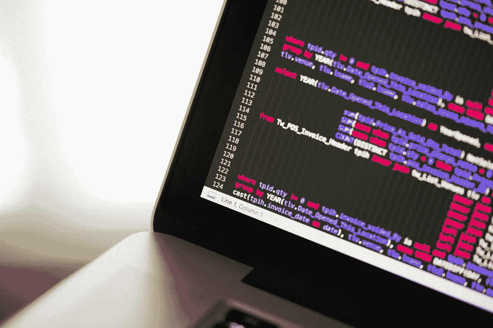
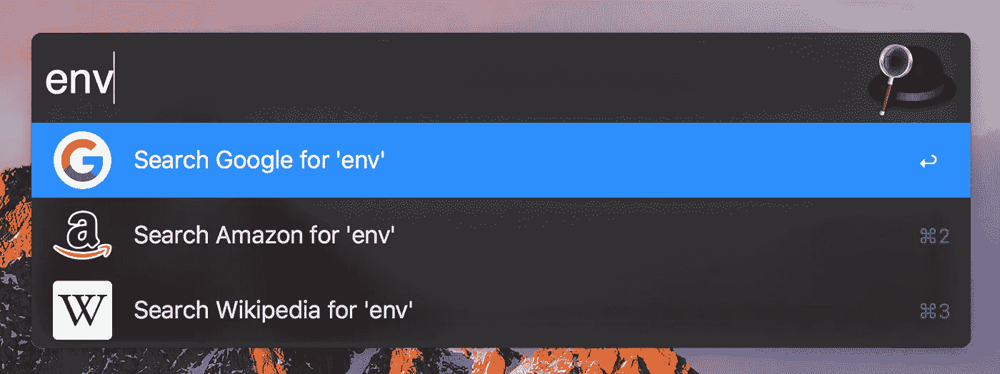
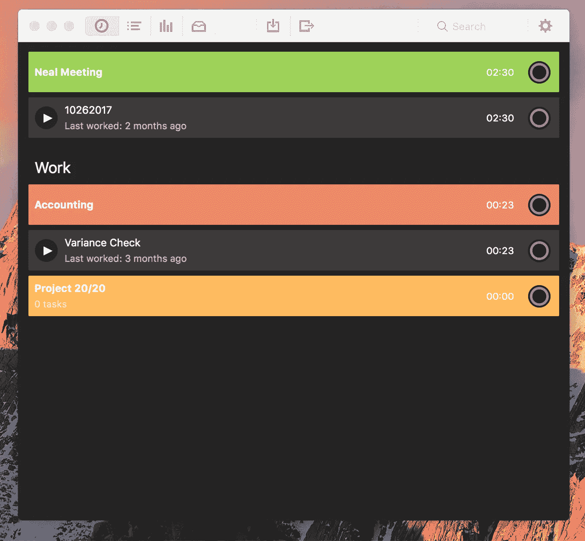
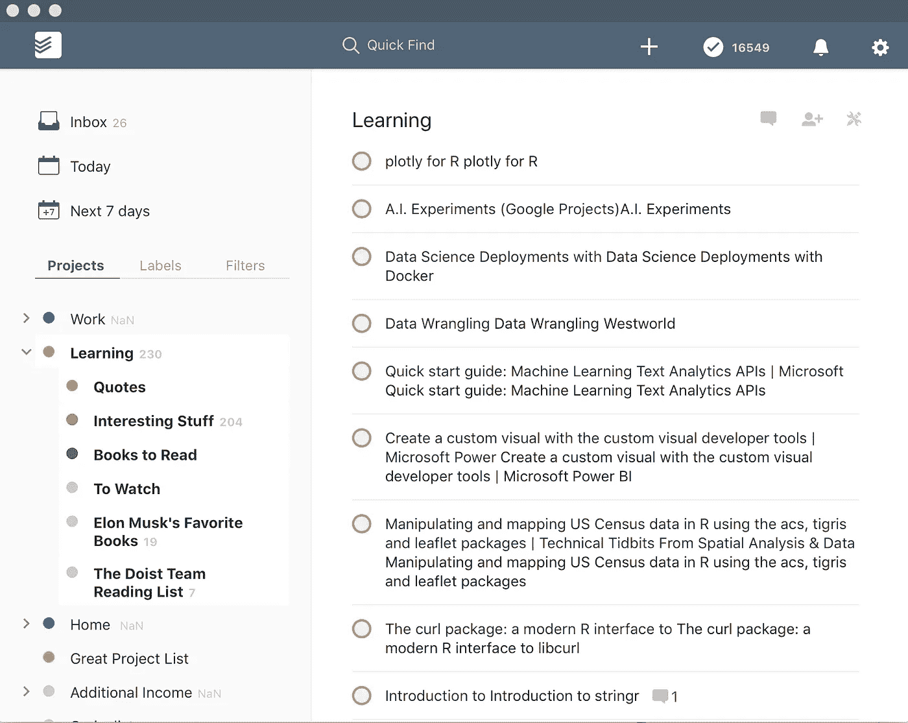
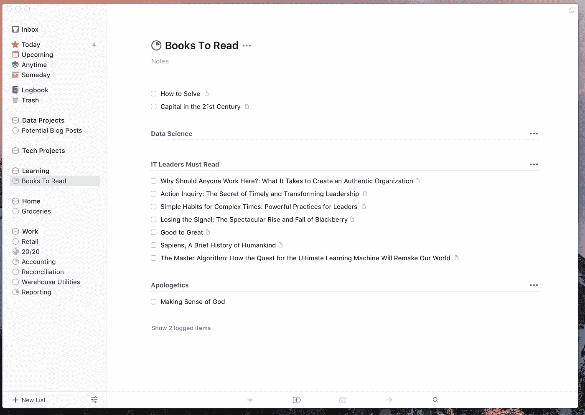
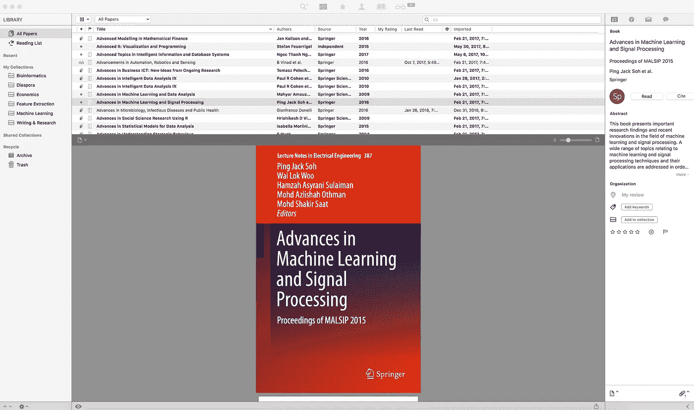
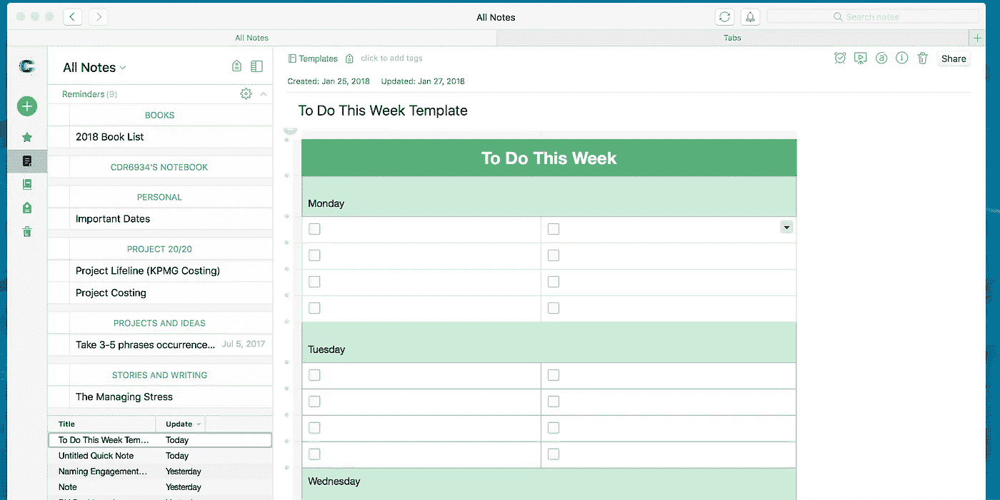
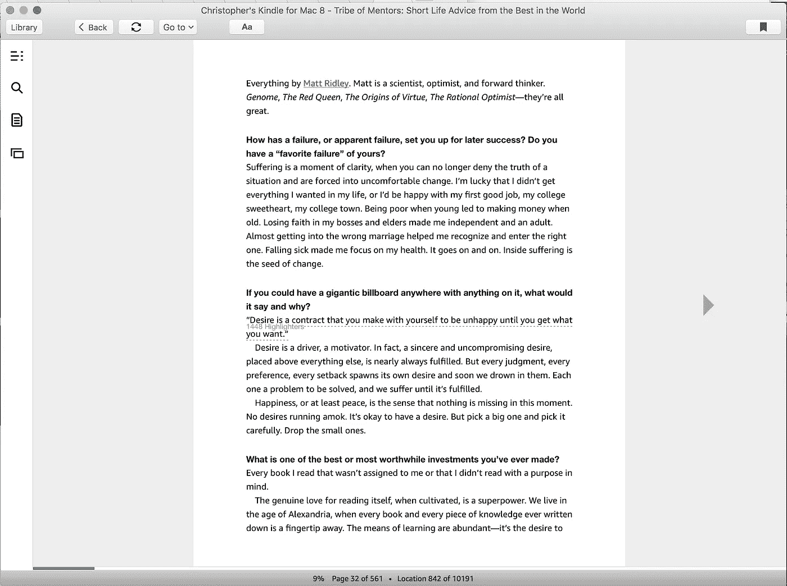
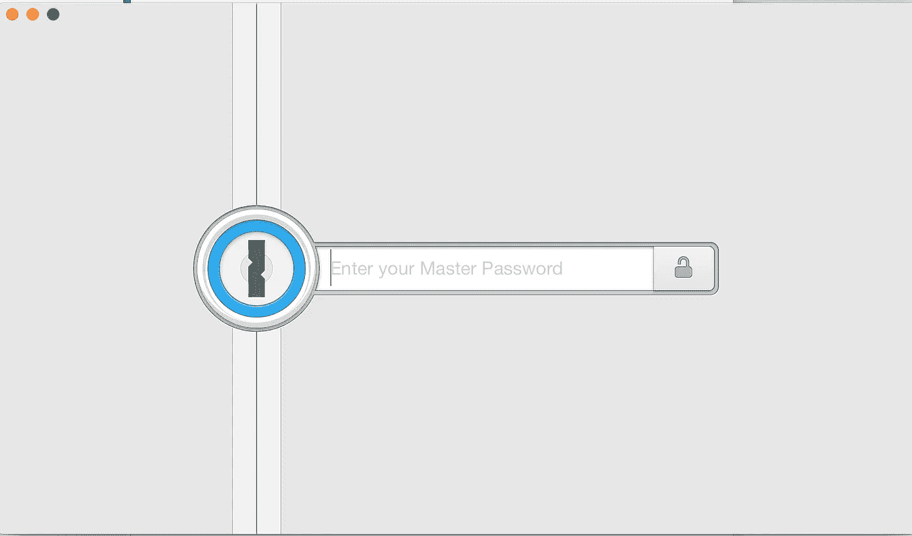

# 以出色的工作效率节省时间

> 原文：<https://medium.com/swlh/recovering-time-with-beautiful-productivity-d424f52c48e4>

## 2018 年漂亮的生产力软件

Photo by [Chris Ried](https://unsplash.com/photos/3FT0OAPBoKw?utm_source=unsplash&utm_medium=referral&utm_content=creditCopyText) on [Unsplash](https://unsplash.com/@cdr6934?utm_source=unsplash&utm_medium=referral&utm_content=creditCopyText)

> “万物皆有美，但不是每个人都看得到。”
> ― [**孔子**](http://amzn.to/2DUZX4D)

现在，我有点不同意你的观点，孔子先生。我还没有发现一台标准的戴尔笔记本电脑有什么漂亮的地方。它很实用，但不美观。运行戴尔的硬件可能是工程师的杰作，但对眼睛来说，它不是。

我观察到的是美丽和生产力融合得很好。尤其是当美显示出它自己的干净和简单的时候。它们共同提供了灵感帮助创造非凡的前景。

因为没有美，生产力最终会变得繁重，本质上，它会妨碍表现。

我们大多数人所说的倦怠。

通常不是工作时间的长短，而是工作的质量。美激发并提供了一条跳出框框思考的道路。类似于远足对大脑的影响(这里有一篇关于这方面的[好文章](/@jameshorrox/the-science-of-hiking-53e8260ab46d))。

对我来说，使用 Mac 就好像我有机会在日常生活中使用一件艺术品。当你的手指滑过键盘时，就好像魔法从你的手指中滴落。鉴于这种**魔力，**很大程度上与用户体验和界面 [(UI/UX)](https://developer.apple.com/ios/human-interface-guidelines/overview/themes/) 中使用的设计口径有关，我通常倾向于使用的所有生产力应用程序都遵循这些模式，并且我通常会非常强烈地坚持它。

所以我想向你们展示我发现的在过去 10 年里对我有效的方法。在这段时间里，我尝试了[不同的工作流程](/@cdr6934/take-back-your-time-evernote-4f0f9a4083e9)，尝试了各种软件，并在软件中构建了抽象框架，以找到最高效的途径。因此，我想分享一下对我有效的方法。

作为生产力技术极客，在我的电脑上快速访问任何地方是我最喜欢的事情之一。我讨厌你不得不在一个又一个文件中寻找所需要的东西的时候。

## 阿尔弗雷德

一旦你掌握了击键(又名芝麻开门)，我可以保证，你不会很快回去。你可以看到它们的许多用途，比如随意停止进程，或者快速查看天气的 T2。但是那很好，那么我怎么去追踪这些新发现的时间呢？有一款应用程序就是专门为这个设计的！它们将永远源源不绝。但特别是我发现 Tyme 很简单，但也让我能够在手机和 Mac 上无缝同步这些信息。

## [Tyme 2](https://www.tyme-app.com/)

即使你发现自己在一个薪水的位置上；衡量你在一个项目中的生产力总是很有趣的。这给你时间的感觉，以便调整时间效率。一个特定的用途可能是跟踪与特定的人开会所花的时间。Tyme 提供关于你的小时预算花在哪里的快速反馈。然而，你需要一些东西来提醒你记住时间。哒哒待办事项清单。现在我使用两个不同的平台， [Todoist](https://medium.com/u/9593ea611ff6?source=post_page-----d424f52c48e4--------------------------------) 和东西。

## [Todoist](http://todoist.com/)

现在我不用 Todoist 作为一个任务列表的正常用法；相反，我喜欢 Todoist 的 API 产品，因为它给了我自动使用它作为轻量级链接保护程序的能力。例如，我使用 IFTTT 直接将 Craiglist 列表提供给一个项目，这样我就可以快速浏览，而不必浏览网站。我还将它作为一个简单的 RSS 提要聚合器，并与 [Feedly](https://feedly.com/) 一起使用。

## [事情 3.0](https://culturedcode.com/)

这个待办事项应用程序一直是我的至爱。老实说，我不知道当它第一次出现时，我对它垂涎了多少。它似乎是直接来自天堂的产品。为什么呢？这是第一个真正遵循苹果应用程序设计指南的应用程序，我觉得很有用。

正如你在待办事项列表中看到的，我列出了几本我一直在通读的书。在其他时候，这个列表会是一个 PDF 列表，里面全是我可能会阅读的不同文章。大多数时候它会在 [Evernote](https://medium.com/u/cc5554e706bb?source=post_page-----d424f52c48e4--------------------------------) 中，但其他时候，特别是当我快速浏览关于新技术的文献(科学论文)(最近是关于下一代测序)并需要轻松创建参考图书馆的能力时，我会使用[论文](https://www.readcube.com/papers/)。

## [论文](https://www.readcube.com/papers/)

论文基本上是研究者最好的知识组织工具。它跟踪(一旦你添加了元数据，或者至少在论文中搜索了一篇特定的论文)任何特定项目所需的所有参考资料。并提供了一种简单的方法来标记 PDF 并在一个地方保存参考及其适当的参考样式。但是，还有其他一些本质上不那么“学术”的东西仍然需要标注。这些都将住在 [Evernote](https://medium.com/u/cc5554e706bb?source=post_page-----d424f52c48e4--------------------------------) 的房子里。

## [Evernote](https://evernote.grsm.io/ChrisRied)

Evernote 是所有笔记的瑞士军刀。我用它做很多不同的事情，所以我会让你在这个[以前的帖子](https://goo.gl/8KMKun)中读到它们。然而，我开始更多地使用的一件事是重复性任务的模板。尤其是在连续开会的时候，最好使用相同的形式来确保格式保持不变。如果我有一个需要打印的任务列表或待办事项列表；我使用以下模板。

*   简单的[待办事项](https://www.evernote.com/l/AAEaIFTK9zpMnYYQDhnB3fQyByNTWEwMUXg)模板
*   [每周待办事项模板](https://www.evernote.com/l/AAEaIFTK9zpMnYYQDhnB3fQyByNTWEwMUXg)
*   [甘特图模板](https://www.evernote.com/l/AAGYjK_gJa1CqJoZkC5ciuArxOBHX7dPI3Q)

出于几个原因，我也喜欢收集引语(在 [Evernote](https://medium.com/u/cc5554e706bb?source=post_page-----d424f52c48e4--------------------------------) )。

1.  供以后在另一篇文章中分享/再利用
2.  思考引用的意义和含义
3.  因为文字是灵魂的食粮。

最简单也是最有效的方法之一就是拥有一个电子图书收藏。我更喜欢用亚马逊来买书，因此默认的阅读器是 Kindle 应用程序。

## [点燃](https://www.amazon.com/Kindle-eBooks/b?ie=UTF8&node=154606011)

Kindle 应用程序简单、漂亮，而且非常高效。我使用*高亮*和*书签*功能来发现我正在阅读的书中的任何信息。我还沉迷于在所有设备之间同步这些信息。如果在路上只带着我的手机；我可以在我最后停留的地方停下来，继续阅读，而不必找到我最后知道的位置。然后，如果我回到电脑前，我可以浏览我所有的精彩部分，并将所有重要的笔记复制到一个文档中，以便存档。这导致了最后一个选择。

## [1 密码](https://1password.com/)

鉴于安全性如此重要，我需要注意两件事。1).我花很多时间在互联网上。2)我在过去养成了一些坏的密码习惯。因此，投资一个像 1Password 这样的密码管理器非常方便，并且能够在我的帐户受到威胁时不向我的朋友发送垃圾邮件。它能够使用由应用程序生成的复杂密码，而不必记住这些密码，并防止容易使用密码的[坏习惯或生成“一环治天下”密码。](https://www.wired.com/2016/05/password-tips-experts/)

当你尝试这些生产力工具时，你会发现它们在功能和设计上都有美感。它们给使用者力量，让他们从困难的预兆中解脱出来。

我希望你会喜欢。

Christopher Ried 是零售业的数据科学家。我相信生成智能分析，生成有用的材料，从数据中创造引人入胜的故事。在 [LinkedIn](https://www.linkedin.com/in/chrisried/) 上和我联系或者在 [Twitter](https://twitter.com/cdr6934) 上打招呼，提及这个故事。

## 这个故事发表在 [The Startup](https://medium.com/swlh) 上，这是 Medium 最大的企业家出版物，拥有 292，582+人。

## 在这里订阅接收[我们的头条新闻](http://growthsupply.com/the-startup-newsletter/)。

