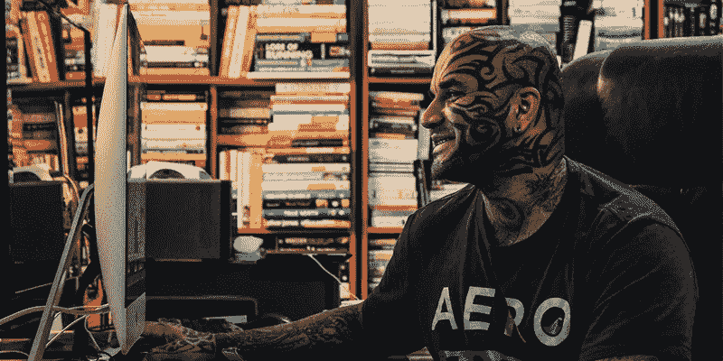

# 再造、改造和重塑你

> 原文：<https://medium.com/swlh/recreating-revamping-rebranding-you-eeafa2c515cd>

在过去的 7 年里，我在培训、发展和教育上花费了 50 多万美元。我有三个导师，经历了以下的变化…

# **这些是我完成并掌握的技能**

*   用计算机修改（图片或照片）
*   插图画家
*   博客
*   视频日志
*   搜索引擎优化
*   在线营销
*   创意写作
*   高级销售和营销
*   高级公共演讲
*   恢复品牌重塑

# 我完成认证的不同种类的教练训练

*   生活教练
*   互动辅导
*   商业辅导
*   NLP 辅导
*   领导力培训
*   团队辅导
*   最佳表现辅导
*   面试辅导

# **我尝试过但停止做的事情:**

*   编码
*   创建应用程序
*   学习如何创建网站
*   学习一门新语言

# **过去 7 年来我的品牌变化:**

*   自然语言处理/生活/互动蔻驰
*   巅峰性能蔻驰
*   纹身教练
*   蔻驰个人品牌
*   个人品牌战略家

# 我为什么要这么做？因为…

*   市场正在发生变化
*   依赖旧技术的旧工作正在被淘汰
*   需要新技能
*   竞争越来越激烈
*   新毕业生正在进入市场
*   新软件正在推出
*   新的应用程序正在被创建
*   新技术正在被引进

# 因为现在，这就是我正在做的:

*   高级品牌课程
*   高级网络营销课程
*   阅读更多与自我提升相关的书籍(每周一本)
*   每天 5 篇博客
*   每天一个视频
*   我的在线品牌的新搜索引擎优化策略

# 你想知道真相吗？

*   我害怕变得无关紧要。
*   我害怕竞争。
*   我害怕成为第二好。

这就是我努力工作的原因&我聪明地工作。但是我比世界上任何人都努力。

# 所以现在，我的问题是…

*   那么，与去年相比，你今年做了什么来脱颖而出，引人注目呢？
*   你的品牌发展到什么程度才能每小时赚更多钱？
*   你需要什么技能才能比你的竞争对手挣得多一倍？

想想吧。

# 洛伊·马切多

## 这篇文章发表在 [The Startup](https://medium.com/swlh) 上，这是 Medium 最大的创业刊物，有 305，398+人关注。

## 在这里订阅接收[我们的头条新闻](http://growthsupply.com/the-startup-newsletter/)。

