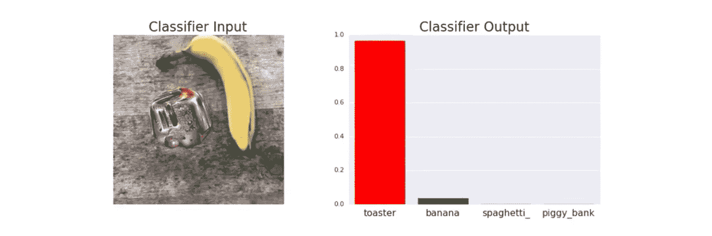
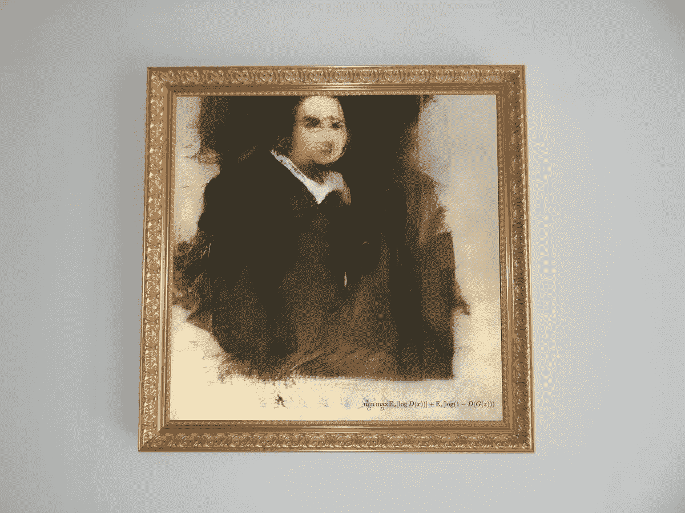
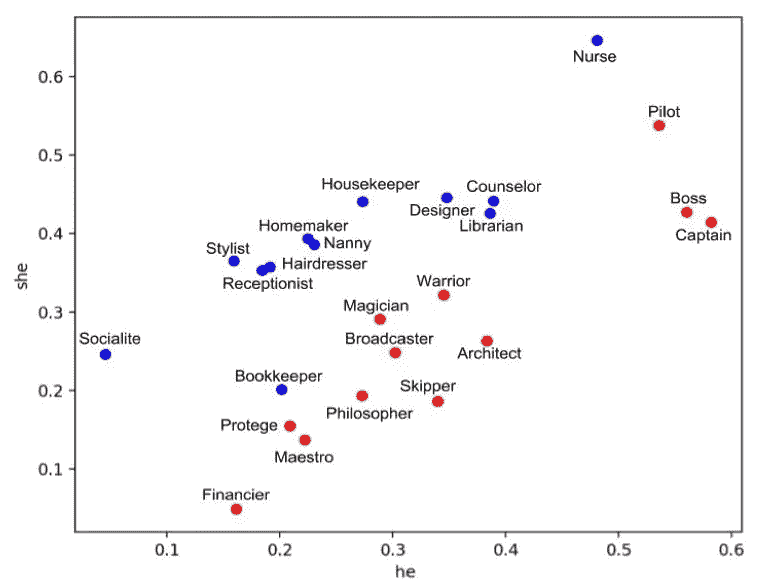

# 重新定义智能及其所有者

> 原文：<https://medium.com/swlh/redefining-intelligence-and-its-owners-e7d23c945ab6>

## “同理心会让我们自由。” —机器人索菲亚

Photo by [Possessed Photography](https://unsplash.com/@possessedphotography?utm_source=medium&utm_medium=referral) on [Unsplash](https://unsplash.com?utm_source=medium&utm_medium=referral)

我最近有幸参加了 CAIR 在 Hermanus 举办的 2018 人工智能研究论坛(FAIR)。这是我参加的第一个非常严肃地强调人工智能伦理的会议，有相当多的演讲者来自哲学背景。讨论的主题包括围绕机器人权利和公民身份的伦理问题、机器人监狱、人工道德机构、致命自主武器系统(法律)等。

# 对立的例子

演讲人之一、南非领先的机器学习研究人员埃蒂内·巴纳德(ettinebarnard)发表了大胆的声明，称“深度学习既伟大……又可悲”，他举了一个例子，人工智能系统可以很容易地将一张香蕉图片误标为烤面包机，只需在旁边贴上迷幻贴纸即可。

Found at [sticker-tricking-computers-google-toaster-banana-designboom-1800.jpg](https://www.designboom.com/wp-content/uploads/2018/01/sticker-tricking-computers-google-toaster-banana-designboom-1800.jpg)

这种伤痕被称为对立的图像。他们通过欺骗计算机看到不存在的东西来工作，他们这样做的方式是利用他们的人工智能算法中的一个弱点，即所谓的“对抗性例子”。

一些与会者认为，迷幻贴纸看起来有点像闪亮的烤面包机反射的光，因此人工智能机器并没有完全失败。毕竟，深度学习模型学会了从成千上万的图像中归纳出物体。但是，人类也不是绝对不会被海市蜃楼或被操纵的图像所愚弄。以这张著名的所谓尼斯湖水怪的照片为例。

1934 年的“外科医生照片”，现在被认为是一个骗局，激发了几十年对尼斯湖水怪的搜索和猜测。

那么，如果人类的智力是黄金标准，智力的标准是否应该包括在某些情况下犯错或被愚弄的能力？

# 智力到底是什么？

当我们开始质疑智力的定义时，会议变得很有哲理性。如果我们的“智能”概念可以被机器模拟，那么它还是“智能”吗？我们是否应该重新评估它？

来自“[关于智力的主流科学](https://en.wikipedia.org/wiki/Mainstream_Science_on_Intelligence)”(1994)，由 52 名研究人员(邀请签名的总共 131 名研究人员中的 52 名)在《华尔街日报》上署名的专栏声明将智力定义为:*一种非常普遍的精神能力，其中包括推理、计划、解决问题、抽象思考、理解复杂想法、快速学习和从经验中学习的能力。这不仅仅是书本知识、狭隘的学术技能或应试技巧。相反，它反映了理解我们周围环境的更广泛和更深入的能力——对事物的“理解”、“理解”或“弄清楚”该做什么。*

人们似乎普遍认为，智力是人类行为的特征，也许是少数哺乳动物的特征。但是，在没有任何人类干预的情况下进行自我调节的复杂生态系统，或者完全一致游动的鱼群，或者拥有数千居民、似乎作为一个集体思考和工作的蜂群呢？智力不能也不应该仅限于人类展示的任务和能力。

# 人工智能

从广义上讲，人工智能是表现出类似人类能力的机器，例如逻辑推理、识别图片中的对象、将文本从一种语言翻译成另一种语言、模式识别、生成语音或文本、创造艺术、区分群体等能力。

The first AI artwork (*Portrait of Edmond Belamy*) to be sold in a major auction achieves $432,500.

机器擅长而人类失败的是记忆和聚集大量数据，并进行非常大的计算。人脑天生就能并行思考和计算，而机器仍然是线性计算。出于这个原因，人类在复杂的任务方面仍然远远优于其他人，比如创造性解决问题、从一两次经历中学习、道德、决策、计划等等。

随着最近深度神经网络架构的兴起，机器现在可以从数以千计的正面和负面例子中学习复杂的模式，生成从未见过的图像(如上图)，甚至可以根据奖励函数调整自己的行为。

突然间，机器可以以惊人的准确性解决上述许多问题，甚至欺骗人类，让他们认为他们在和另一个人说话，而不是机器(真正的图灵测试里程碑)。艾伦·图灵于 1950 年开发的图灵测试是一种测试机器表现出等同于或无法区分于人的智能行为的能力的测试。

# 人为的愚蠢

因为机器从大量数据中学习模式，所以它们非常依赖数据的质量。因此，在数据中包含的收集、标记、工程和历史决策过程中，它们也容易出现错误或误述。这些“偏差”通常被称为偏差，对其存在的忽视导致了许多负面的二阶效应。

机器学会这种偏见并表现出令人震惊的偏执行为的著名案例有:

*   [亚马逊展现性别歧视的招聘算法](https://www.reuters.com/article/us-amazon-com-jobs-automation-insight/amazon-scraps-secret-ai-recruiting-tool-that-showed-bias-against-women-idUSKCN1MK08G)，
*   [苹果的面部识别软件分不清中国用户](https://nypost.com/2017/12/21/chinese-users-claim-iphone-x-face-recognition-cant-tell-them-apart/)，
*   [对不公平歧视 POC 的罪犯的风险评估](https://www.propublica.org/article/machine-bias-risk-assessments-in-criminal-sentencing)，
*   [as 词嵌入中的性别和种族偏见。](https://medium.com/r?url=https%3A%2F%2Fwww.pnas.org%2Fcontent%2F115%2F16%2FE3635)

例如，这个职业与单词“他”和“她”的关系图表明，在单词嵌入空间中，发现定型的女性职业(如“家庭主妇”)比男性代词更接近女性代词，而男性代词更接近定型的男性职业(如“金融家”)。

这些缺陷不一定存在于所使用的算法中，而是由错误的或有偏见的训练数据造成的。所使用的算法本质上是有区别的，并试图利用数据中的细微差别。常用的短语是“垃圾输入，垃圾输出”，意思是如果一个模型是在坏数据上训练的，就不能期望它表现良好。如果任其发展，如果这些缺陷成为社会中部署的系统的一部分，将会产生严重的后果。

然而，令人恐惧的是，被认为智力超群的人类是这些有偏见数据的创造者和管理者。

# 感知生物及其相关权利

房间里的大象也许是“机器人权利”。如果一个实体表现出类似人类的智能，比如能够推理、强调和展示自我意识，那么它是否应该被赋予与同等警戒生物(比如人类)相同的权利？还是会被当做奴隶，有一个主控制器？

另一个要讨论的话题是授予自由意志。随着自由意志而来的是对自己行为的责任，随之而来的是对自己行为的后果。人工智能会像微软的 Tay 一样，被赋予自由意志去学习和交互吗？自动驾驶汽车如果造成事故会被“惩罚”吗？当然，为了惩罚它，这个实体必须能够理解它正在被惩罚。

# 最后

虽然人工通用智能仍然非常遥远，(我的意思是，我们仍然在为特定任务的人工智能而奋斗)，但我们必须开始思考它对我们生活方式的哲学和法律影响，以及人类的定义，并据此发展。

人工智能已经成为一个如此容易和广泛使用的术语，很少考虑通过模拟人类行为和从人类生成的数据中学习来创造人工智能的实际意义。

人工智能也不应该局限于科学领域，而是应该受到哲学、人类学、法律、历史等学科的影响。

感谢 2018 年博览会的组织者认识到并解决了在开发人工智能方面更多哲学影响的需求。

谢谢你一直读到最后。请随时给我发电子邮件，地址是*jeanne.e.daniel@gmail.com。*