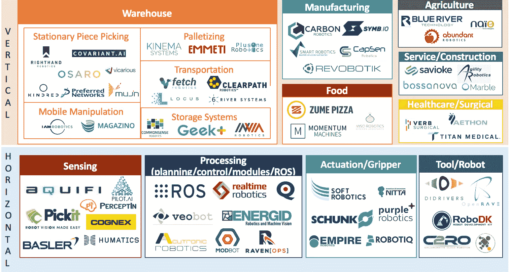

# 重新定义机器人:揭开下一代人工智能机器人的神秘面纱

> 原文：<https://medium.com/swlh/redefining-robots-demystify-next-generation-ai-enabled-robotics-fec64bfeb66c>

Robotics Startup Landscape (source: Bastiane Huang)

## 这是一系列关于机器人和人工智能对各种行业和未来工作的影响的第一篇文章。在接下来的文章中，我们将讨论深度强化学习(DRL)如何释放的潜力…