# 重新设计 Twitter 时刻

> 原文：<https://medium.com/swlh/redesigning-twitter-moments-f71658bbde68>

## 一项重新想象 Twitter 最新功能的概念设计研究。

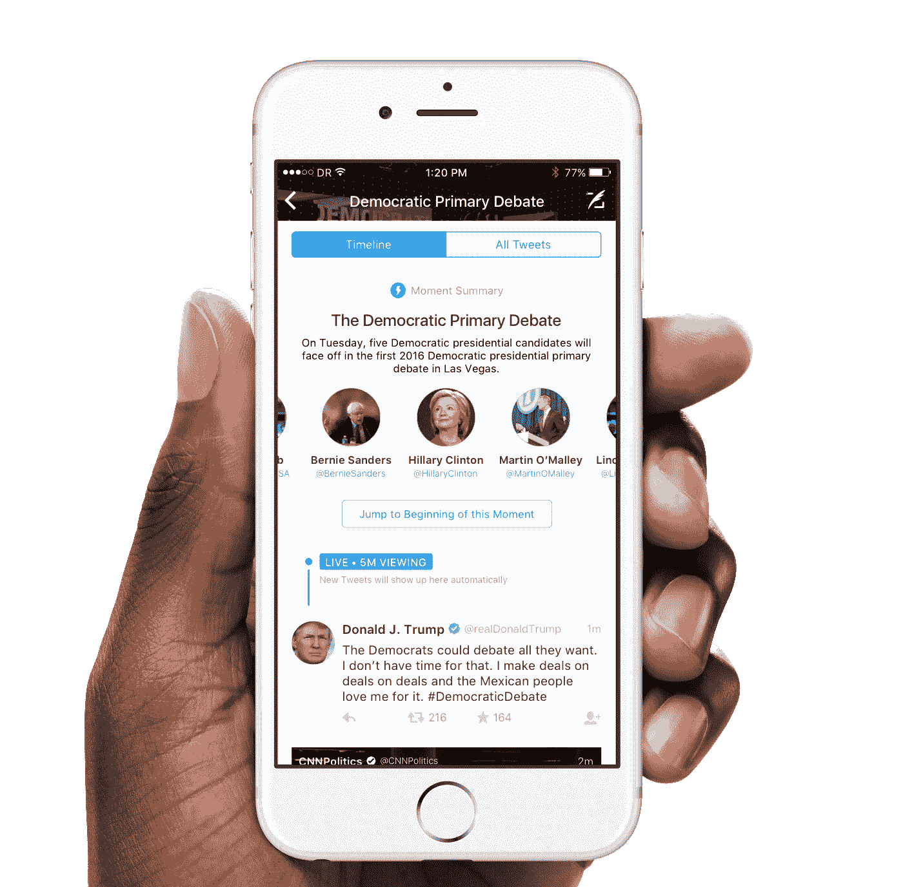

# 当闪电两次击中。

几个月前，我写了一篇名为“ [Twitter Live](http://bit.ly/Twitter_Live) ”的文章。在这篇文章中，我开始探索一个潜在的产品设计方向，这是 Twitter 内部一个令人垂涎的项目，代号为“闪电计划”。从那以后，闪电成为了“推特时刻”,我必须说……这太棒了。

Moments 背后的团队做了一项惊人的工作，它真正体现在这款产品的贴合性和光洁度上。与此同时，许多人一直在抱怨他们花了“这么长时间”才推出产品，但任何知道如何发布这样一款产品(更不用说同时在每个平台上发布)的人都知道，要制作这样一款产品需要做多少工作。

## 那么，如果一切都很好，为什么这篇文章的标题是“重新设计 Twitter 时刻”？

嗯，在过去的几天里，我一直在玩“瞬间”,我喜欢它的本来面目，但它并不符合我对“闪电计划”的预期。有些事情感觉不太对劲……与此同时，我更深入地思考了我在 [Twitter Live](http://bit.ly/Twitter_Live2) 中提出的一些概念，并决定进一步完善它们，使之成为一个更完美的产品。

可能没有一群人比花了一年时间创造这个产品的团队更有资格思考这个产品，所以只是为了让它不碍事，我的目标是不取消他们的工作。这不是一个更好的，而是一个不同的，他们可以如何接近时刻。

> 这不是一个更好，而是一个不同的时刻。

说完了…让我们开始吧！

# 目前…

虽然执行力很强，但我认为这个产品的前提背后的想法是有根本缺陷的。

Twitter 的蒙面义警、初创公司 L. Jackson 在他最近的[帖子](http://startupljackson.com/post/130906569765/the-solution-to-the-problem-with-the-solution-to) on Moments 中很好地阐述了这一点。这是一篇很棒的短文，如果你感兴趣的话，你应该通读一遍，但是为了节省你的时间，这三句话基本上概括了它:

Twitter 的主要问题是:

> “Twitter 的根本问题是它不够大……广告商需要它们拥有更多用户，这意味着华尔街需要看到它们增长。”

瞬间的前提:

> “Moments 是一种尝试，旨在获取让 twitter 吸引上瘾者的内容，并以吸引 Buzzfeed 用户的方式进行包装。如果成功了，你的妈妈最终会说，“哇，推特真酷。我喜欢我在那里找到的整洁的东西。"

主要的缺陷是:

> “从某种意义上说，瞬间是一个不够大的大赌注。他们添加了一个不会冒犯核心用户的标签，但没有删除疏远新用户的部分。”

如果我可以用一个词来概括所有这些，那就是**:不集中。**

这个主要的缺陷渗透在产品的设计中，我想在进入我的《瞬间》之前探索一下。

## 1.推特时刻缺乏焦点。

让我们试着从设计的角度来看待它，作为核心用户和新用户。请参阅下面的两个截图…

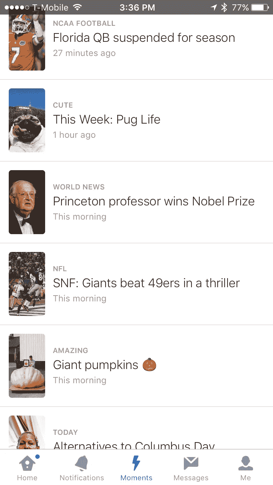

The “Today” tab for Moments

**作为新用户:**这很吸引我。但话说回来，我可能会在 BuzzFeed 上获得更多这类内容，或者是目前流行的其他版本。这里的内容比 BuzzFeed 好吗？

也许吧。

但我对此表示怀疑。自从 BuzzFeed 成为 BuzzFeed 以来，BuzzFeed 和 Co .就一直在做这种事情，他们做得很好。

**作为核心用户**:有太多的话题/故事/标题可供选择，却没有一致的线索。到处都是这种感觉。

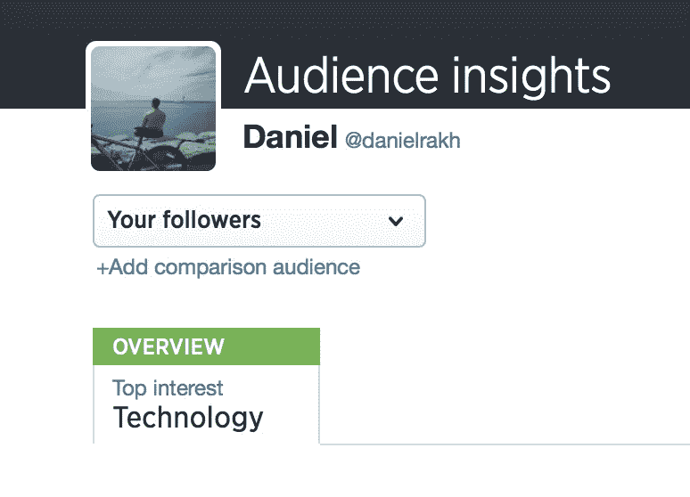

Twitter’s Ad analytics system knows the dealio.

给我看看今天发生的两三件最重要的事，或者昨天刚刚发生的两件事。为什么我会被呈现一个我不感兴趣的 Buzzfeed 风格的自助餐？拯救“巨型南瓜”和“真空上的 Veep 演职人员”，向我展示世界上正在发生的和/或与我所关注的人相关的重要事情。你已经知道我对科技和体育很感兴趣(我会检查广告分析仪表盘上的手柄)。给我看看那些东西。

说到运动，让我们来看一个瞬间的例子…

假设我是一名棒球迷，我用推特来关注昨晚错过的比赛。现在的经验是:

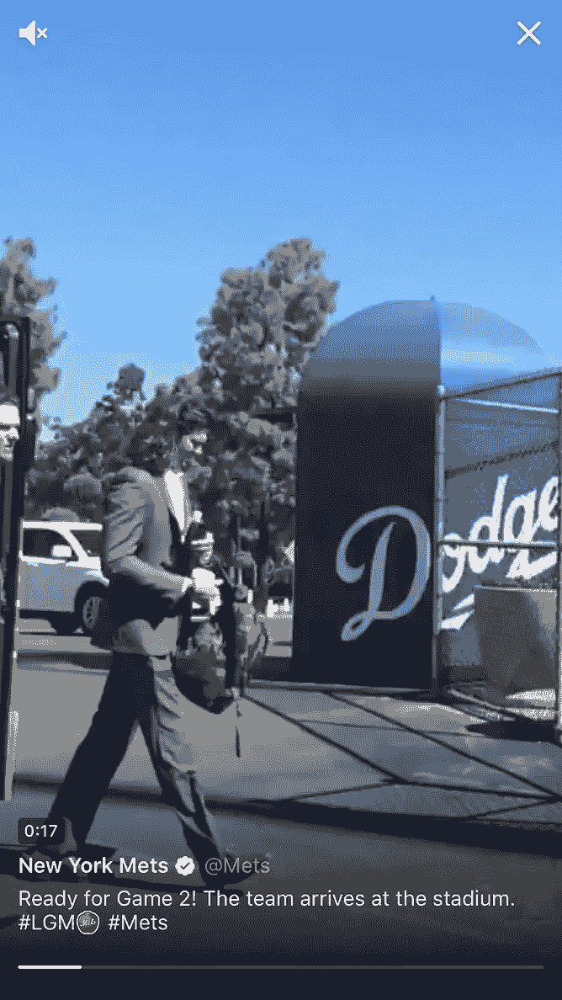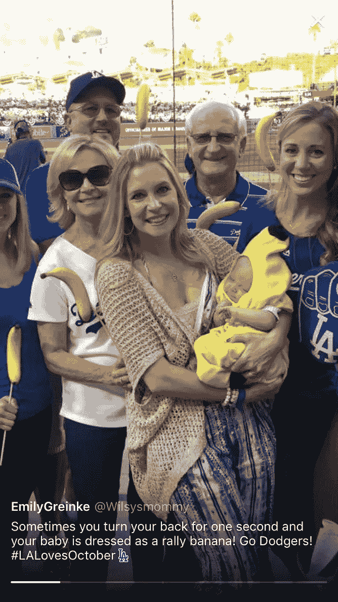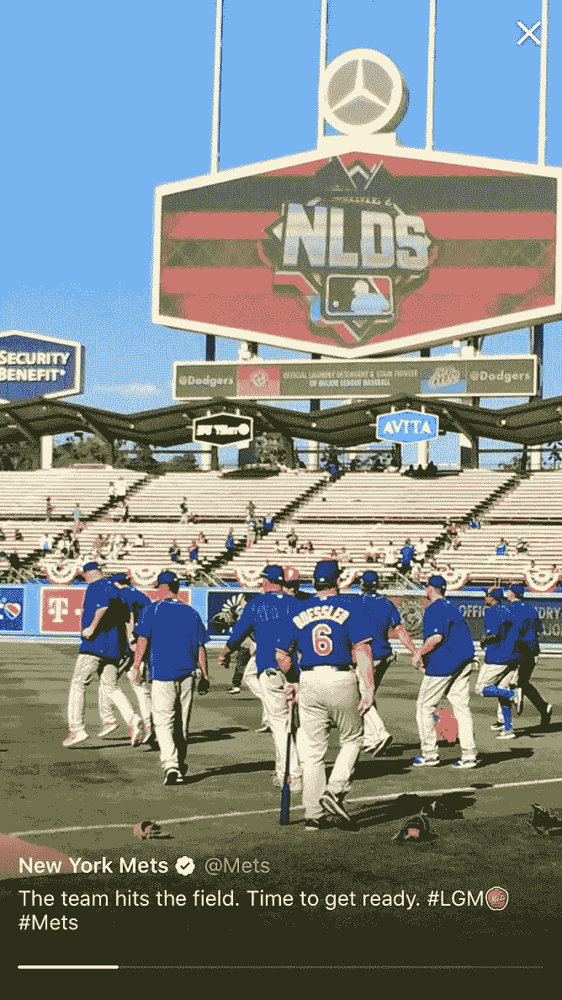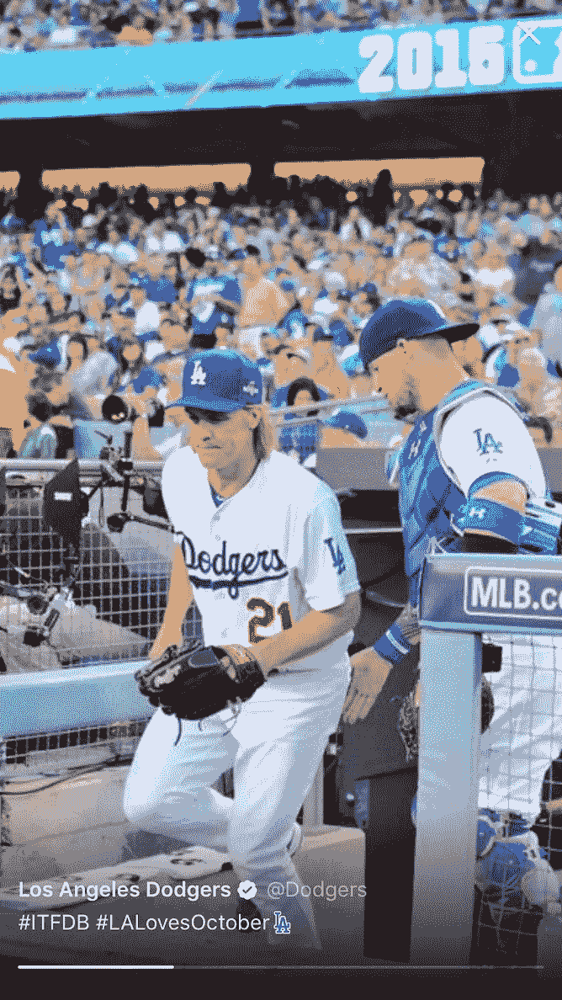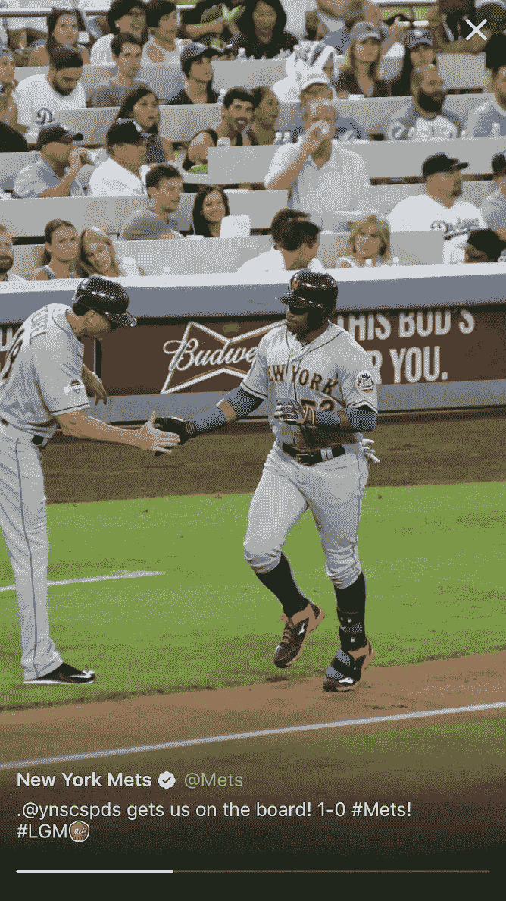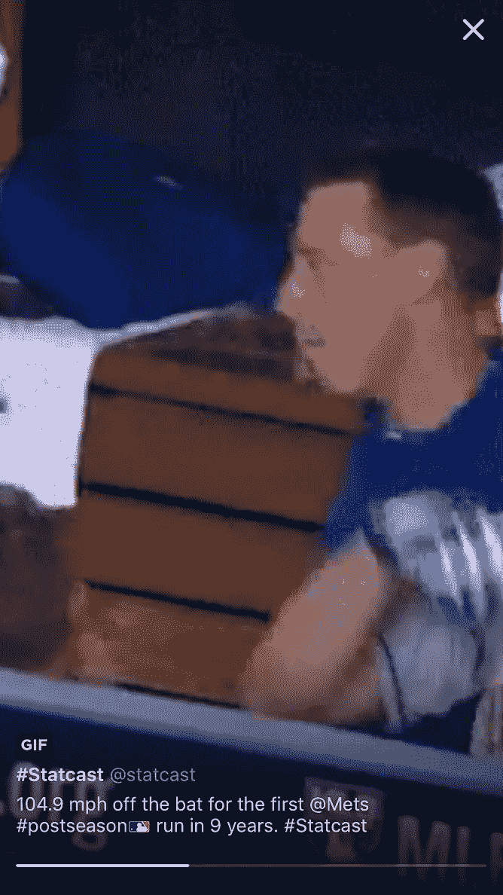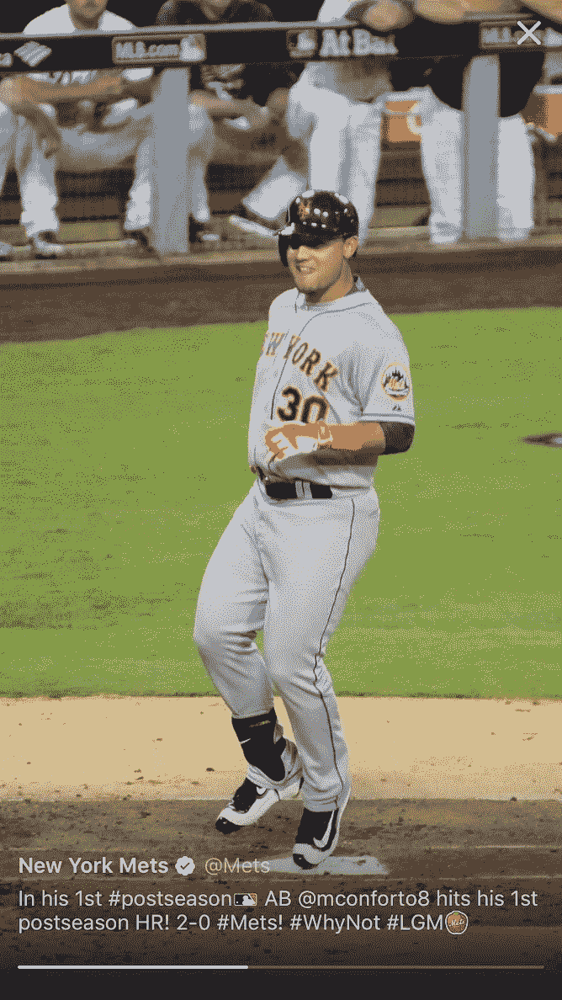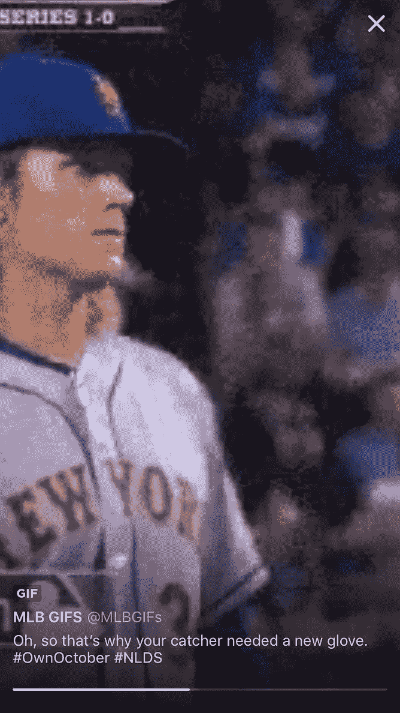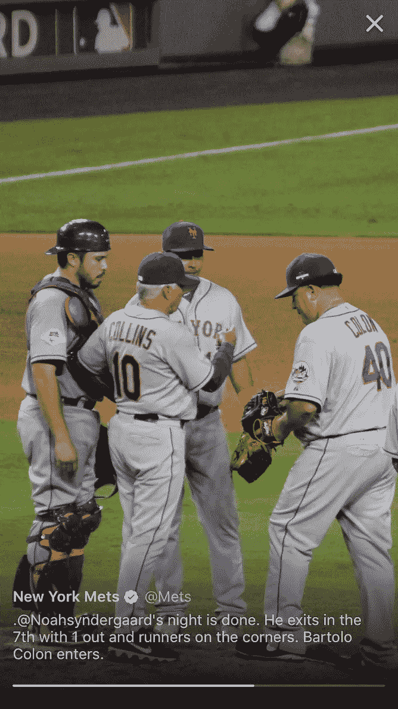

**作为一个新用户&核心用户:**实际上我认为他们在这方面做得很好。我得到了一些关键的亮点。我到处看到比分，但我没有得到任何我不能从说…打开 ESPN 应用程序，看 1-2 分钟的比赛精彩片段中得到的东西。事实上，我可以说 ESPN 给了我更丰富的经验，因为它是由专业人士编辑的。我也有额外的好处，书呆子在其他信息，如统计和更具体的分析。

现在推特上有很多关于这场比赛的深刻见解和观点，我得到的都是官方大都会账户上一些典型而明显的推文。

但更重要的是…

> 我还没有抓住游戏的核心本质和感觉。

这让我想到了下一个缺点…

## 2.推特时刻试图成为除推特之外的一切。

全屏媒体丰富体验的全部意义在于给我一个仅仅通过阅读文本无法获得的视角。它应该是身临其境的，让我感觉自己就在游戏中。然而，这种观点并不是来自于拍一张照片或 GIF，并用它填充你的 iPhone 它来自于内容被创建的**环境**。

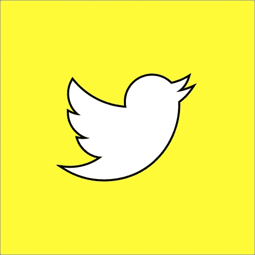

The blue works a lot better.

这可能是一个很好的时机来提出与 Snapchat 的 Stories 产品惊人的相似之处。是的，用户界面和 UX 的灵感可能部分来自于故事……但是，如果一个好主意可行，那么采用它并给出你的想法并不可耻。

众所周知，乔布斯引用了毕加索的名言:

> “好的艺术家临摹，伟大的艺术家偷窃。”—乔布斯或者毕加索([也许是](https://www.quora.com/What-did-Picasso-mean-when-he-said-good-artists-copy-great-artists-steal)？)

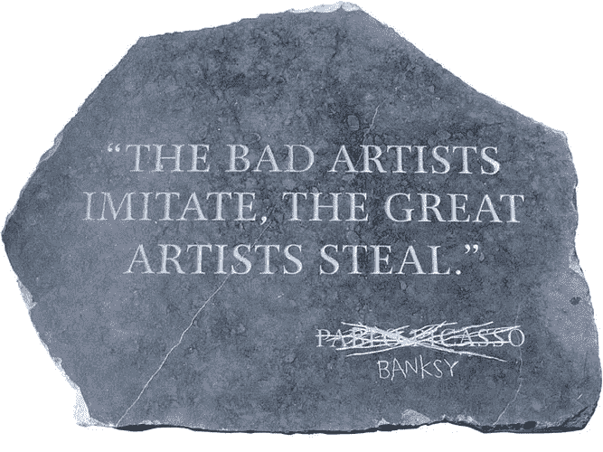

Shout out to Banksy.

我相信乔布斯想说的是，如果你要复制某样东西，你最好以一种让你因这个想法而出名的方式去做。这通常是你抄袭的东西比抄袭的人做得更好的直接结果。

我相信推特错过了秘制酱。

以下是我认为 Stories 对 Snapchat 如此有效的原因:

他们不是自上而下地从正在发生的事件开始构建故事，并寻找适合该事件的内容，而是自下而上地围绕产生的内容构建故事。

方法如下:

他们非常强调地点和背景，并巧妙地伪装成有趣和积极的价值，给你一个看起来很酷的过滤器，你不得不在分享之前覆盖你的照片或视频。

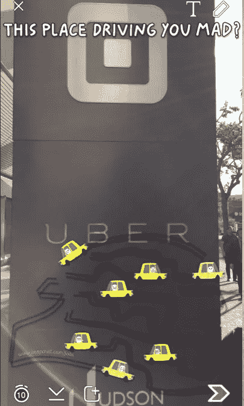

This is the filter you get when you take a snap at Uber HQ in SF. Damn is Snapchat good or what?

作为与朋友分享的一个副作用，他们轻轻地给你提供了与你周围更大的网络分享的选项，只需在你按下分享按钮之前点击一个额外的按钮。

因为内容是首先生成的，目的是在用户的个人网络中共享，这使得用户不仅可以很容易地共享他们的位置和上下文，还可以给你一个未经过滤的原始视角，如果在其他地方共享，这个视角会被大量编辑。

作为回报，Snapchat 的策展人有更丰富的内容可供选择，同时也提供了独特的第一人称视角，让人们在那一刻参与其中。

Twitter 没有这种奢侈。

那么 Twitter 的优势在哪里呢？

# 十亿美元的问题

推特的魅力在于你追随那些你真正关心的人的观点。当一件特别的事情发生时，你想听听他们会说些什么。他们的意见对你很重要。

这些人可能是你的朋友，但你的大多数朋友都在脸书，而不是在 Twitter 上，所以他们往往是某个特定领域或主题的思想领袖。他们存在于从政治到时尚的各个垂直领域，从世界著名的名人如 Kanye West 到小众的假名人物如初创公司 L. Jackson。

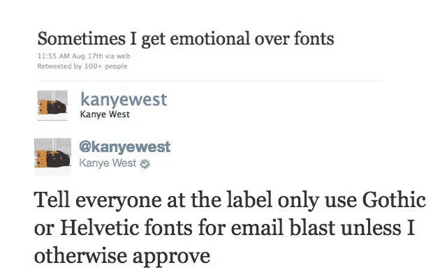

I feel you Yeezy.

Twitter 的神奇之处在于，它能让你以独特的视角观察你选择追随的这些人的思想和想法。你想听听这些人有什么要说的，当他们的垂直领域发生相对重要的事情时，他们中的大多数通常都有话要说。

在你感兴趣的垂直行业中，也有很多这样的人是思想领袖，但你不知道他们的存在，因为[在这里列出 Twitter 未能做到这一点的 100 个原因]。

此外，你只是对这个世界首先要说什么感兴趣。衡量每个人对我们共同经历的事件的反应总是很有趣的。就像你在感受世界的脉搏。

但问题是:我相信人们加入 Twitter 是为了了解世界上正在发生的事情，并留在 Twitter 上进行对话。

这些人是秘密的调味汁，为你提供 kool-aid 饮料，让你成为推特迷，但我不认为他们在你一注册就提供这种价值方面做得很好。一定有什么别的东西能让你在喝饮料的时候保持清醒。

这是一个十亿美元的问题:

## 如何让下一个 3 亿人加入 Twitter？

我不太确定。但我认为，很多时间都花在了寻找合适的关注对象上，而不是首先寻找合适的内容。

当你今天注册 Twitter 的时候，你会被自动地丢进一个信息流中，在那里你会看到一组最受关注的人和那些属于你选择的你感兴趣的类别的人。重点一直是跟着人走。

请注意，关于表面内容，我使用了“正确”一词，而不是“新”一词。你可以在任何地方找到新的内容，而不应该像现在这样集中精力。我想找到“正确的”内容。对你合适的不一定对我也合适，但有一些内容很可能对我们两个，至少对这个国家的其他人来说是相关的。有重叠。这个内容通常是时间敏感的，超级宏。这是我认为应该称之为时刻的基础。

# 从这一刻起…

“时刻”的概念没有得到很好的定义，这可能是当前产品缺乏焦点的主要原因。所以让我们清楚地定义一下到底是什么构成了一个时刻。

现在，让我们说一个时刻只能属于这三类:

1.  新闻
2.  运动
3.  娱乐

为什么是这三个？我坚信任何人(或任何公司)都应该加倍或三倍发挥自己的优势，而不是试图弥补自己的劣势。目前，当谈到这三个类别时，Twitter 真的大放异彩。如果你把标签看作是人们在 Twitter 上谈论的话题的代理，你会发现它们主要属于这三类。我没有数据，但我敢打赌，在属于这些类别的一个巨大的*时刻*，参与度指标会脱离图表。

现在让我们更具体地了解一下…

在任何给定的时间，某个时刻需要处于以下三个阶段之一:

## **1。某个时刻必须在过去被安排在未来的某个时间。**

> 例如:两天后的民主党初选辩论，明天 7:30 洋基队对红袜队的比赛，一个月后《权力的游戏》的赛季首映。

**这个要求有一个很大的例外:突发新闻。**

目前，你去推特了解世界上正在发生的事情。现在你可以去推特了解世界上将会发生什么。理论上，当那一刻真的发生时，你会再次回到 Twitter。

这可能是 Twitter 的一个巨大的新用例。

> 也许 Twitter 可以作为世界上即将发生的事件的电视指南进行营销？

这就把我们带到了下一个地方…

## **2。一个时刻需要实时发生*。***

这可能是一个时刻最重要的属性，直接挖掘了 Twitter 的实时 DNA。这是 Twitter 真正闪光的地方，它可以给你提供时间敏感的即时信息，这是其他平台无法做到的。现在，实时的自然是原始的、未加工的。我认为 Moments 目前在解决这个问题上做得很好，但我认为从设计的角度来看，它过于强调了 Moments 中的实际内容，而不是 Moments 的整体。我将在我的设计中进一步解决这个问题。

## **3。某个时刻需要刚刚发生。**

所以“刚刚发生”很含糊。“刚刚发生”是一分钟前，一天前，还是一周前？

一个很好的问题应该是:“这个时刻还有意义吗？”

答案是:要看时刻。Twitter 的管理者需要对某个时刻何时过时做出公正的判断。一个好方法是观察与事件相关的某些关键词和对话的指标。例如，如果某个时刻是扬基队和红袜队之间的季后赛，它可能不应该超过一天。另一方面，如果这个时刻是一个重大的世界事件，它可能会持续几天。我相信 Twitter 可以在这方面做得很好。

现在我们对什么样的事情才算是一个时刻有了更好的认识，让我们打开我们最新更新的 Twitter 应用程序，看看它是什么样子的…

只要你打开应用程序，你就会看到那个特定时间的“精彩瞬间”。

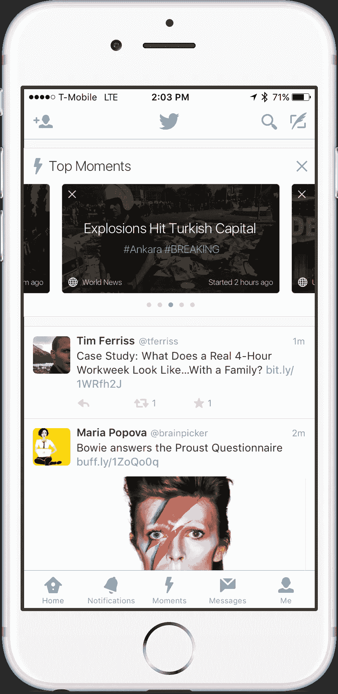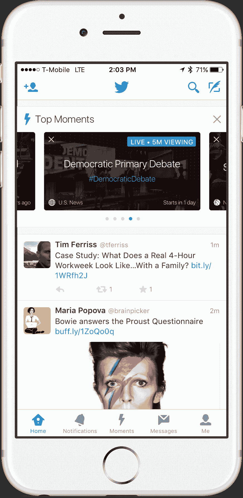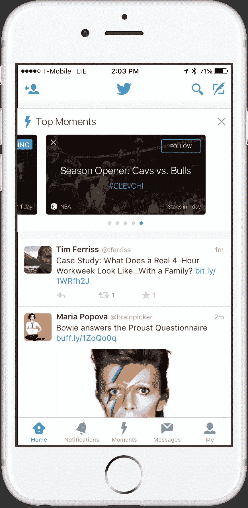

是什么让一件事成为“巅峰时刻”？

**如果是某个时刻*将会发生*(有“关注”按钮的时刻)**:这可能是“关注”它的人数的组合，以及它多久会进入“直播”模式。

**如果某个时刻*是*发生的时刻(带有“直播”徽章的时刻):**可能是当前参与和观看该时刻的人数。

还要注意每个时刻都有一个相关的标签。这为用户提供了更多的上下文信息，并为您稍后将看到的功能提供了动力。

**如果是*刚刚*发生的时刻(没有徽章或按钮的时刻)**:可能是那个时刻“直播”时有多受欢迎，以及它刚刚脱离“直播”模式的时间和它现在的相关性。

**还要注意每个时刻的左上角有一个“X”按钮**，以及“最佳时刻”卡片本身有一个“X”按钮。

这有两个作用。在一张你不喜欢的卡片上按下“X”表示你对那一刻不感兴趣，并取消它。此外，在结束足够次数的卡片后，Twitter 可以开始围绕你喜欢的内容类型形成一种模式，并能够向你展示更多个性化和相关的时刻。**这与今天的情况形成了鲜明的对比，在今天，这是一种吃到饱的自助餐，没有任何个性化的内容。如果你是一个体育迷，你可能会希望看到更多与体育有关的时刻。Twitter 现在可以提供与你产生共鸣的更好的内容。**

在“热门时刻”部分按下“X ”,会告诉 Twitter 你对这个功能不感兴趣，不会出现在你的主页上。

那也没关系。也许你只是想用老派的 Twitter，并不关心这个功能。现在你可以选择把它放回现在的位置。

让我们看看当你按下那个标签时会发生什么:

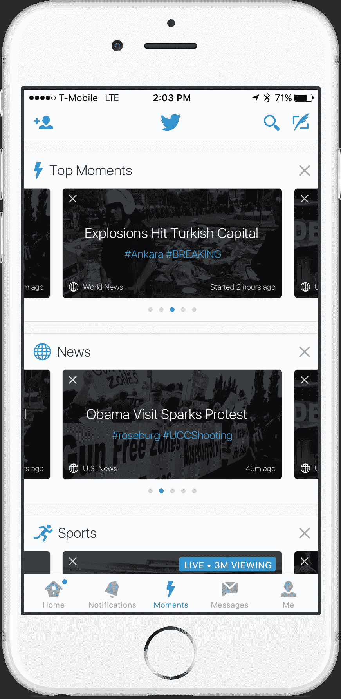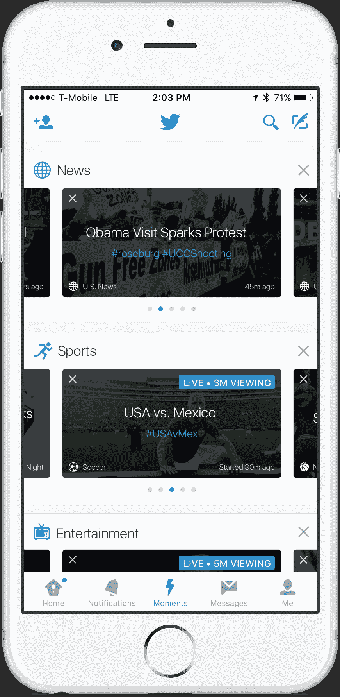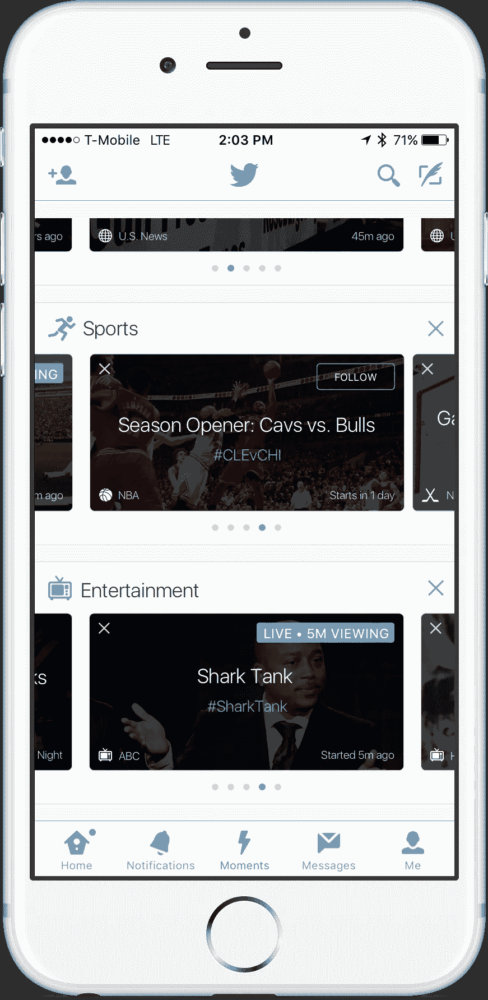

正如您在这里看到的，您可以将瞬间分为前面提到的三个类别:

1.  新闻
2.  运动
3.  娱乐

加上你的主页面上的精彩瞬间部分。

并且你可以以轮播的形式在它们之间滚动。请注意这个提要和目前在应用程序中找到的提要之间的差异。以下是几个关键的例子:

1.  可供选择的余地更少了——质量胜于数量。
2.  他们很大，在你的脸上，以表明他们的重要性。
3.  他们有简短、集中和一致的标题。
4.  它们包含了标签。
5.  只有三个类别可供选择。

好极了，现在让我们检查一下…

让我们来看看“爆炸袭击土耳其首都”的时刻…

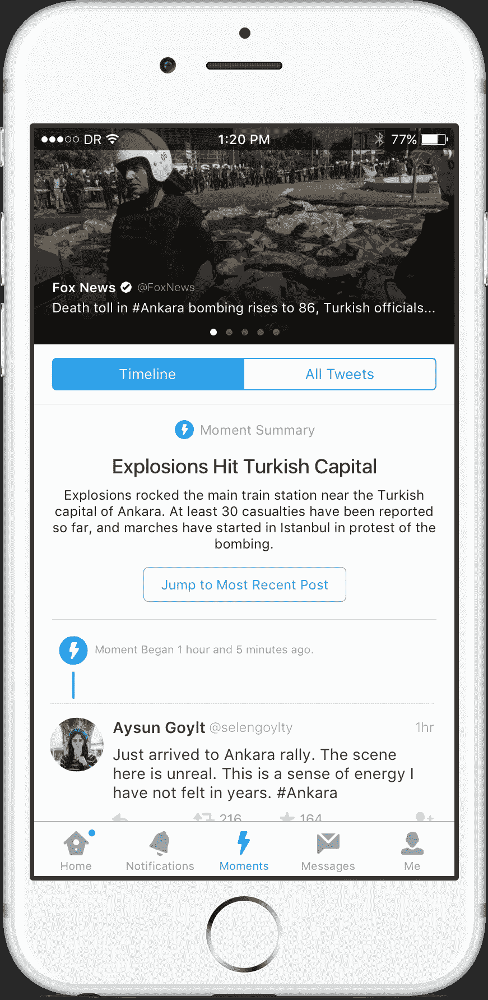

你首先应该想到的是，这看起来与你今天习惯的 Twitter 体验很相似，但与今天完全陌生的 UI 和 UX 相比，有一些关键的不同。

这一点很重要，因为如果我们认为 Moments 是一个特洛伊木马，可以让新用户进入 Twitter，那么它看起来应该和应用程序的其他部分很相似。这就是你教授习俗并保持体验一致性的方法。

让我们来分解一下您在这里看到的内容…

在顶部，您会看到一个标题，包含这一时刻的所有视频/图像内容。点击它会将你带入你今天所看到的画面——全屏沉浸式媒体丰富体验。

你应该注意的下一件事是顶部的分段控件，指示两种模式:时间线和所有推文。

还记得之前我说过附加到某个时刻的标签将被用来增强一个特性。这就是了。当你关注一个标签时,“所有推文”模式正是现在 Twitter 中存在的模式。

我坚信 Twitter 在他们的平台上保持中立和透明是非常重要的。这是为了平衡 Twitter 目前正在做的所有管理和编辑工作。

> 我坚信推特在他们的平台上保持中立和透明是很重要的。

这是一个很好的方式，同时给新用户一个进入现有消防水管的高峰，并且如果他们不喜欢它，可以安全地选择总是回到策划的体验。

让我们更多地谈谈那次策划的经历…

# 时间表:

这是这个版本的 Moments 的关键定义特征。

现在只需快速浏览一下，就能大致了解它是如何垂直流动的。不要太担心每件事意味着什么。我们将很快分解关键的定义特性…

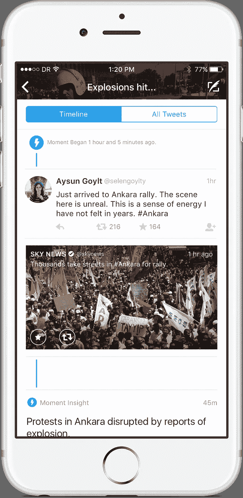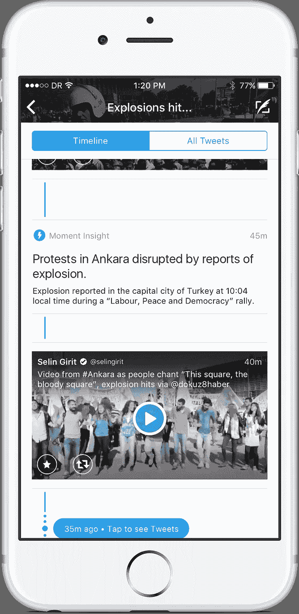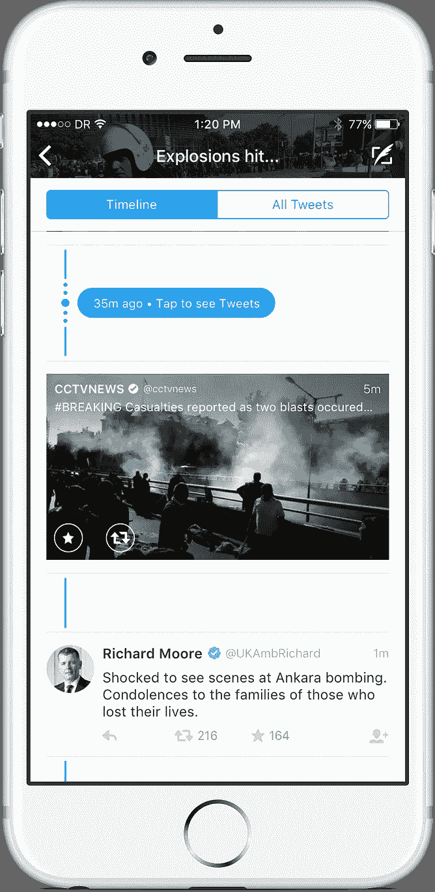

这是我们现在都喜欢的 Twitter，但它超级关注某个时刻，并有额外的背景支持。

目前，跟随一个时刻需要一个漂亮的全屏体验，但我相信它实际上压倒了你为什么要看这个内容的首要目的。我认为脸书的论文实际上遇到了同样的问题。它很漂亮，但是对于普通用户来说太过于设计了。

这一版本与《花一分钟》的主要区别在于，你获得了一种熟悉的封闭体验，这种体验几乎可以缩小到强调时间是一分钟内的关键因素。

时间线是此刻的主干，一切都依附于它。当你在其中滚动时，你就在时间中滚动，并体验发生时的反应。与现在的体验相比，时间轴几乎被淡化为底部一个裸露的 1 像素水平滚动指示器。

让我们更仔细地看看我们之前建立的时间线的三个阶段的定义特征:

1.  将会发生——未来。
2.  正在发生—现场直播。
3.  刚刚发生——过去了。

## 时刻总结:

每个时刻都以一个题为“时刻总结”的部分开始。这正是它的含义。你会得到一点关于这个时刻到底是关于什么的信息，并有一些特定于时刻类型的特殊背景。这与这样一个前提直接一致，即“时刻”应该比标题更重要。标题无处不在。时刻更特别。

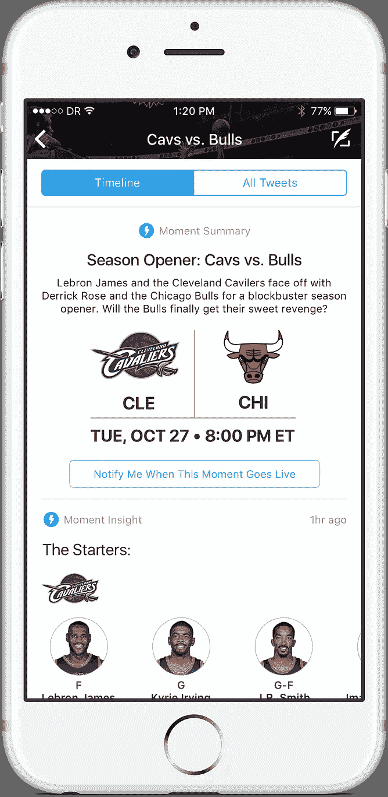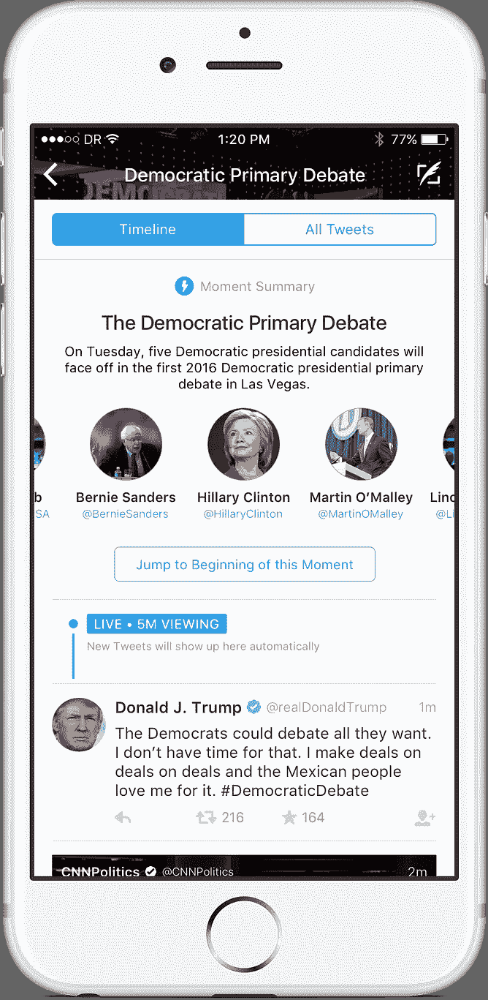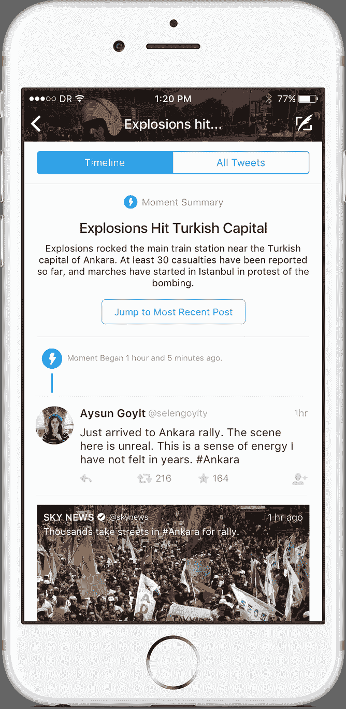

A Future Moment, Live Moment, and Past Moment Respectively.

体育赛事的未来时刻总结可以是比赛开始的时间和日期。

一个即时总结，说民主党初选辩论可能是辩论的参与者。

## 瞬间洞见:

您可能在前面的图像中注意到了它们，但是每个时刻也会有一些被称为时刻洞察的东西分散在时间轴中。**需要注意的关键是，就像时间线中的其他事物一样，它们与时间线中出现的特定时刻相关。**

它们有两个重要的功能

1.  **背景**:把它们想象成用来描述这个时刻的各种推特之间的粘合剂。当你经历某个时刻时，你会迷失在实际发生的事情的流程中，而“时刻洞察”是确保经历顺利进行的指南。

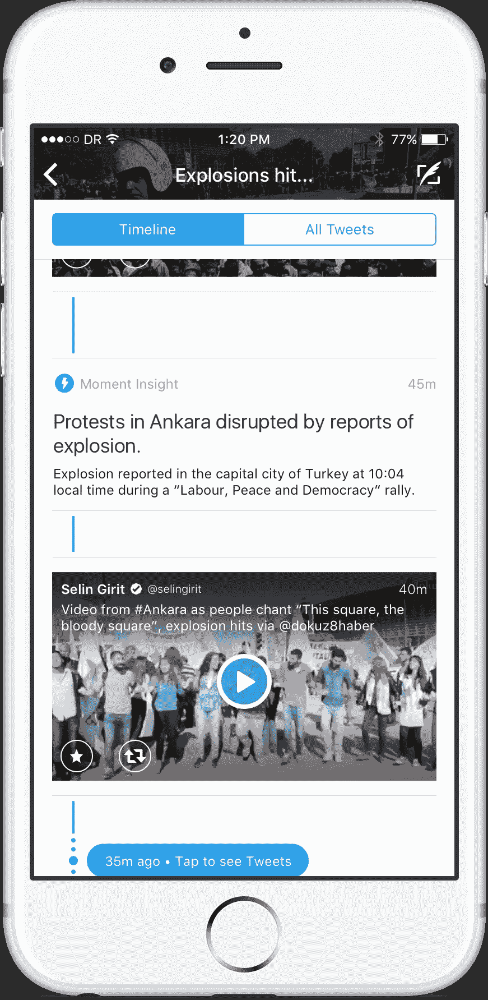

2.**互动性:**仅仅通过看你的手机，观看辩论并看到人们对候选人刚才所说的话的现场反应会有多棒？现在您可以这样做了…

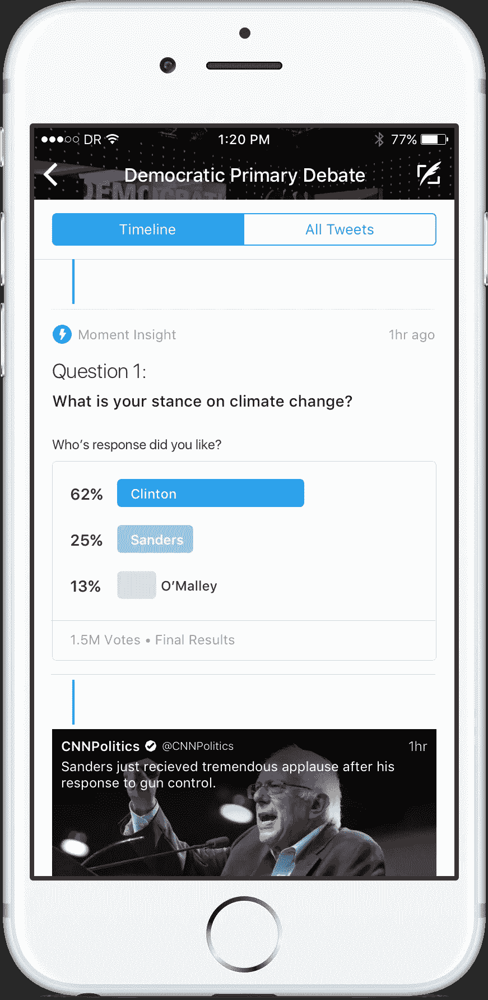

3.**准点信息:**你正在看比赛，勒布朗刚刚连续丢了 3 个桶，他着火了。作为一个运动迷，你是一个统计迷，所以你想知道这对你的梦幻球队意味着什么。事实证明，勒布朗刚刚拿到了他的第 30 个三双，你不用去 ESPN 查看统计数据就能知道。

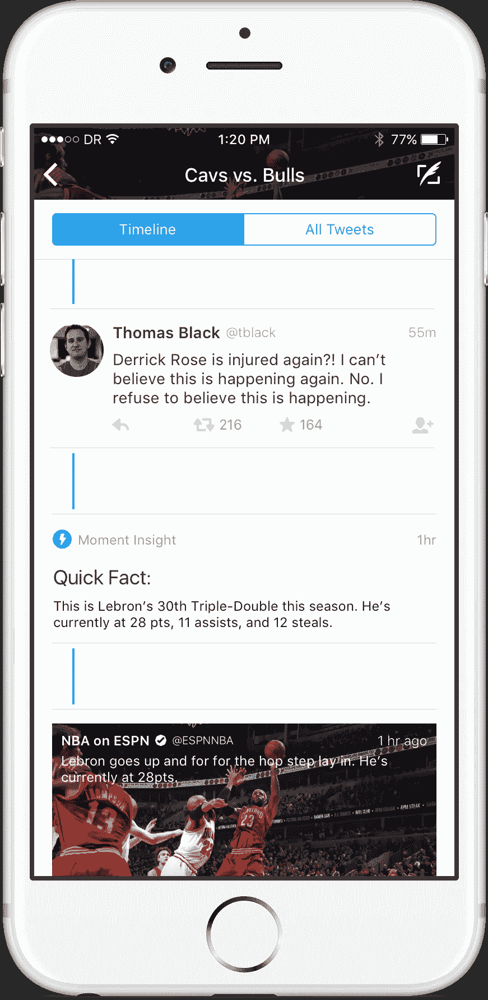

正如我在开始这篇文章时提到的，我认为像今天这样的时刻真的很棒。就像 SLJ 在他的帖子中说的那样，如果它是一个独立的应用程序，与推特本身有松散的联系，这可能会更有意义，但是推特显然认为它需要被包含在核心应用程序中。

我认为这样做的原因是为了引导人们真正进入推特，但我认为目前的产品无法真正实现这一点。我真的希望我错了，但是如果目标是让人们回到推特，我认为我的《时刻》试图以推特特有的更专注的方式来解决这个问题。

无论如何，我认为推特终于采取措施回到他们游戏的巅峰，这令人耳目一新。我真的很喜欢这个产品，我绝对不是唯一一个这样的人。

聚光灯现在正聚焦在他们身上，我相信他们会抓住时机。

## 如果你喜欢这篇文章，请点击推荐按钮，这样更多的人也会喜欢！

## 你可能也会喜欢我写的这些帖子:

 [## 超级天才

### 优步的产品设计提案。

medium.com](/p/686e16799228)  [## Twitter 房间

### Twitter 的产品设计提案。

medium.com](/p/e6f34e843e9a)  [## Tweetstorm 简介

### 将新兴的推文风格设计到 Twitter 中。

medium.com](/p/373bd7e5eb54) 

## 我是谁？

我是一名具有工程意识的产品设计师，也是一名来自纽约市的具有设计意识的 iOS 工程师。我也碰巧想加入一个充满激情的团队，开发一些伟大的产品。如果你感兴趣的话，我们来聊聊:danielrak@me.com 或者[@丹尼尔拉克](http://twitter.com/danielrakh)