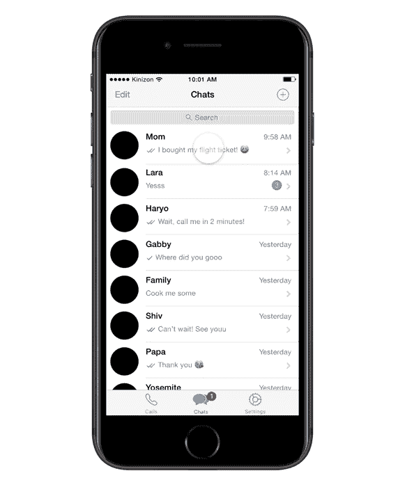

# 增强 WhatsApp 的功能

> 原文：<https://medium.com/swlh/redesigning-whatsapps-features-7c53e16fc72f>

当一个公司变成一个动词时，你就知道它已经达到了顶峰。"你能把 WhatsApp 给我吗？"

不幸的是，美国的情况并非如此。但我的童年是在印度尼西亚度过的，WhatsApp 是那里占主导地位的即时通讯应用。无论是在印度尼西亚还是在国外与印度尼西亚人交流，这都意味着这种交流将通过 WhatsApp 进行。

我想知道为什么会这样。当然，还有其他应用程序，如 Facebook Messenger、iMessage 或 LINE(印度尼西亚另一款流行的消息应用程序)。但我选择 WhatsApp 的个人原因是因为:

1.  WhatsApp 可以跨设备运行(不像 iPhone 上的 iMessage)
2.  WhatsApp *觉得*最安全(不像 Messenger，它直接关联到你的脸书账户)(另外，WhatsApp 提供端到端加密)
3.  WhatsApp 简单易用(不像 LINE，我觉得它让人不知所措，让人分心)

但是，当然，我的主观理由不足以概括 13 亿 WhatsApp 用户。为了更深入地了解 WhatsApp 的用户，或者至少是一个利基市场，我需要测试一下我的研究技能。我想深入了解人们为什么选择 WhatsApp 而不是其他应用。此外，我想知道人们不喜欢 WhatsApp 的什么。最后一步，我用 Framer 制作了我的解决方案的原型。

# 阶段 1:收集数据

我的方法是对五个现有用户进行定性研究。根据[这篇](https://www.invisionapp.com/blog/ux-usability-research-testing/)文章和我进行可用性研究的经验，五是一个神奇的数字，可以检测出界面中 85%的问题，并获得显著的结果。

我问了我的参与者一些宽泛的问题，例如:

*   为什么是 WhatsApp？
*   你最常用的功能是什么？你不用什么？
*   你喜欢 Whatsapp 的什么？你不喜欢什么？

我以宽泛的问题开始的原因是为了尽可能不带偏见，避免把它们引向我想要的答案。我又问了一些更详细的问题。比如问完“你最常用的功能是什么？”我会问，“为什么你最常用这些功能？”如果我先问后一个问题，我会*假设*这个信息。

## 好人

当我问参与者为什么选择 WhatsApp 而不是其他消息应用程序时，我发现的模式是，他们认为该应用程序是通用的——无论是联系家人和朋友，同事，甚至是教授。换句话说，他们觉得在正式和非正式的场合使用 WhatsApp 都很舒服。

很明显，参与者重视他们的安全并寻求方便。当我让他们告诉我描述 WhatsApp 的三个词时，我收到了诸如*专业、通用、方便、安全、*和*轻松*等正面词汇。

## 坏事

我的两个参与者也告诉我，他们不喜欢 WhatsApp 缺乏组织。一个参与者用 Slack 作为一个有组织的系统的例子，这个系统具有“渠道”的功能。

## 丑陋的

从我的五次采访中可以清楚地看出，所有五名参与者都希望删除“状态”功能，并向我解释说，还有其他应用程序可以分享 24 小时消失的照片和视频。他们表示，他们在 WhatsApp 上的主要目的是发送消息和打电话，并且这项功能与 WhatsApp 的核心品牌无关。

# 阶段 2:重新设计

重新设计该应用的第一步是了解 WhatsApp 的目标用户。毕竟，WhatsApp 是一个全球应用，其顶级市场范围广泛，这是一个有趣的项目。那么，我如何通过改进他们已经拥有的东西来设计任何人都能直观理解的东西*？*

Design improvement #1: Removing Status and Camera

## 设计改进#1:移除状态和摄像头

我从参与者的回答中发现了一个明显的发现，他们主要使用 WhatsApp 来发信息和打电话，而且他们真的不喜欢状态功能。在 WhatsApp 中，状态是一个功能，它的工作方式很像 Snapchat。由于其术语，一名参与者将状态误认为是 WhatsApp 所谓的关于的*。由此，我得出结论，状态和相机这两个功能可以从应用程序的主登录页面中删除。WhatsApp 目前底部导航栏的布局分别包括*状态、通话、相机、聊天、*和*设置、*。相机位于导航栏的正中央，这表明相机功能*应该是*人们经常使用的应用程序的一个重要功能——但它不是。*

Design improvement #2: Implementing an Add button

## 设计改进#2:实现添加按钮

Design improvement #3: Swipe to navigate

就组织而言，一个解决方案可能是包含一个*添加*按钮来发起新的对话。这样，用户不必点击“新聊天”并导航到不同的页面，而只需在一个页面上完成即可。用户将能够在这个选项中创建新的聊天或新的组。认知负荷越少越好。

## 设计改进#3:滑动导航

在我看来，WhatsApp 可以用更好的交互体验来提升 App 的导航流量。它不需要非常生动——因为那会有损 WhatsApp 的简单性——但可能需要更微妙的变化。一个例子是增加了滑动进入聊天页面的功能，这样用户只需一个动作就可以无缝地来回导航。

Design improvement #4: Swipe left to access options

## 设计改进#4:向左滑动进入选项

截至目前，在聊天界面上向左滑动会导致两个选项；未读和固定。向右滑动导致更多和存档。这种结构进一步说明了应用程序内部缺乏组织。WhatsApp 可以简单地将一些选项放在一边，而不是将一些选项放在向左滑动和向右滑动上。通过把所有的东西都归到 More 下面，用户就不必费力去寻找一个选项。

## 这个故事发表在 [The Startup](https://medium.com/swlh) 上，这是 Medium 最大的创业刊物，有 287，184+人关注。

## 订阅接收[我们的头条新闻](http://growthsupply.com/the-startup-newsletter/)。

