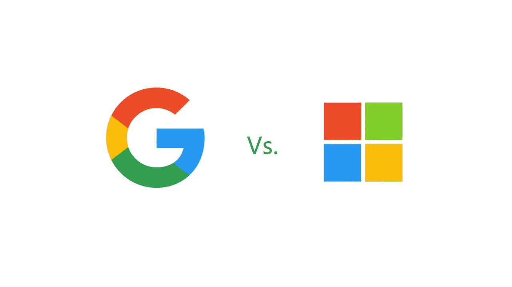
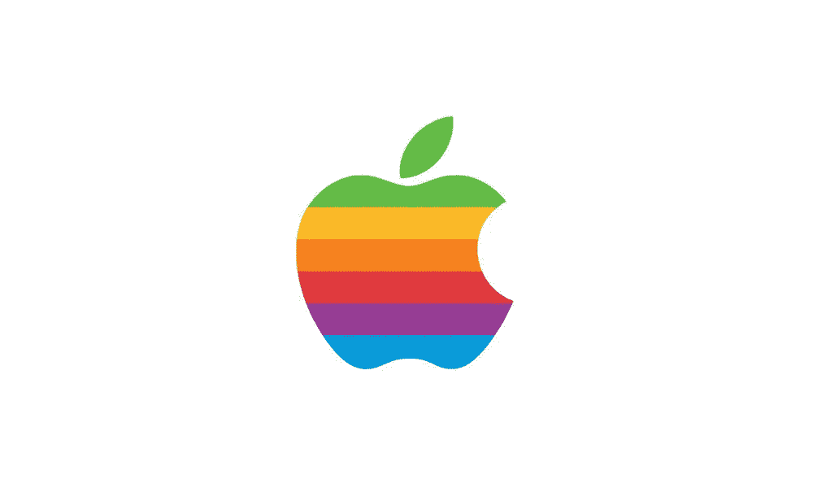
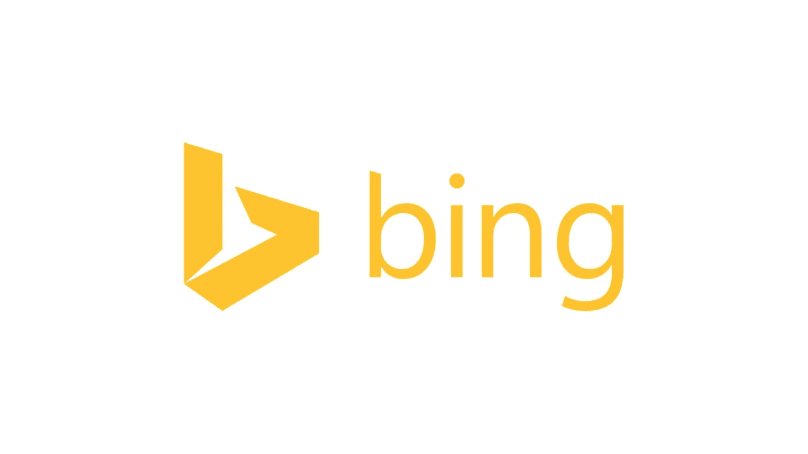

# 重新发现微软的灵魂

> 原文：<https://medium.com/swlh/rediscovering-microsofts-soul-8b3ed85a76d4>

## 比尔·盖茨，塞特亚·纳德拉，劣质产品，有害竞争，设计，重新思考什么是商业。

自从我得到第一台电脑，我就一直在使用微软的产品。我与微软产品的关系一直存在争议，但我总是被它们的潜力所吸引。

在他们最好的时候，他们给了我第一批面向大众市场的伟大产品之一:Office 和 Windows。但在最坏的情况下，令人愤怒。他们总是那么接近比他们更好。但不知何故，他们每次都没能越过那条线。

微软为什么不断推出不好的产品？他们不是有一个最优秀的人才在他们的产品上工作吗？难道他们没有最先进的技术和最多的钱来做点什么吗？显然，这还不够。但是还有更多。

# 一个关于一个书呆子给每个人一台电脑并改变了世界的故事

比尔·盖茨可以被认为是一个传奇，因为他是这个行业的第一批开拓者之一。由于他的工作和努力，今天我们所有人都可以使用他们的产品，影响我们的生活。他灌输的使命和他带给这个世界的改变是惊人的。每家每户都有一台装有视窗操作系统的电脑是难以想象的。我很感激他所做的。如果不是微软，我现在也不会写这篇文章。

但是盖茨不像史蒂夫·乔布斯那样有远见。他更像是一个实践者，总是希望为每个人提供最好的、负担得起的技术。他完成了这个使命。微软确实拥有市场上最好的技术。其他公司应该向他们学习如何去做。见鬼，他们是如此先进，以至于他们的发明可以帮助微软巩固其作为最具创新性公司之一的市场地位。**你能想象让微软而不是苹果来设定行业标准吗？**但是他们输了。为什么？他们缺乏端到端的设计思维，他们的自我意识太强，他们把精力过多地集中在竞争对手身上。

# 微软是第一名，但最后一名

微软是市场上第一个推出平板电脑的公司。在乔布斯推出 iPad 的十年前。苹果的 iPad 是一款革命性的产品，它改变了个人电脑行业。但这不是史蒂夫·乔布斯的主意。在乔布斯 2010 年推出 iPad 整整十年前，比尔·盖茨推出了微软的触摸输入平板电脑。但是你看他们比苹果好吗？没有。

# 他们的电子阅读器领先于亚马逊

你能想象如果这些人实现了这些发明吗？市场上不会有人站在他们面前。你看他们做电子阅读器，做的最好吗？没有。发生了什么事？如果创新的目的是率先推出市场上的产品或拥有最多最好的功能，为什么他们不是创新的领导者呢？

> 这是因为微软害怕破坏其成功的产品。这样你就拥有了微软 Office 这个历史上第二成功的产品。其余的呢？他们是剩下的。

# 为什么他们不能破坏它的产品？

如前所述，微软缺乏端到端的设计思维。他们组织得不够好。他们对最先进软件的自我膨胀得如此之大，以至于错过了火车。他们一直在挤牛奶(办公室和窗户)，直到他们变得如此之大，他们不得不去寻找新的市场，但已经迟到了。

> 他们在创作过程中打过电话。他们不尊重它，制造了一个平庸的产品，妥协，告诉自己:“我们以后会解决剩下的问题”。这意味着产品很可能在完成之前就注定要失败。这样一来，这场战斗将是徒劳的——而且代价高昂。

看看微软在过去十年里所做的一切——从 Zune 到 Bing。这家可怜的公司似乎只能认命地花费数十亿美元来营销赔钱的产品。与此同时，微软 Office 在 25 年后仍是一棵摇钱树。这就是为什么保持清醒的头脑是至关重要的。不要把精力浪费在和竞争对手无意义的争斗上。但这仅仅是关注你的产品吗？没那么容易。

# 微软 vs 谷歌

让我们以微软和谷歌，盖茨和施密特这两个科技巨头之间正在进行的竞争为例。回想起来，这两家阿尔法公司之间的冲突似乎是不可避免的。但这是可以避免的。一开始，两人都有自己的定位。一个做操作系统，另一个做搜索引擎。你会问自己，他们为什么要竞争？很多商业动机。但主要是贪婪和嫉妒。

作为一家初创公司，两家公司都一直专注于提供一款优秀的产品。但随着他们的成长，需要更多的市值，他们开始互相关注。微软迷恋谷歌，反之亦然。你自己看到的结果:**ie 浏览器 vs Chrome，Bing vs Google 搜索，Office vs Docs，Surface vs Nexus，Cortana vs Google Assistant。**

# 与此同时，两个哥哥为了糖果打架，小的那个过来拿走了。

微软和谷歌之间的争斗如此激烈，沉醉于自我，他们没有注意到周围的任何事情。你都那么大了为什么还要去？当苹果出现时，不关注其他公司的代价是失去对市场的垄断。

这场斗争如此激烈，以至于 2011 年微软与谷歌合并后的市值还不如苹果。你能想象吗？这个星球上最大的两家科技公司已经争斗了很长时间，以至于苹果在沉默中坐上了最佳公司的宝座。不，这不是夸大其词。

# 竞争导致我们过分强调旧的机会，并复制对别人有用的东西

当你关注竞争时，复制就变得更容易了。复制一个模型比制造一个新东西更容易。做我们已经知道的事情对你公司的未来没有任何价值。除非你投资于创造新事物的艰巨任务，否则无论公司今天的利润有多大，将来都会失败。

任何人都会为重要的事情而战。但是有些人固执得很厉害，他们会为无关紧要的事情而争斗。这种扭曲的逻辑是我们人性的一部分。但这在商业上具有破坏性。如果你能认识到竞争是一种从内部慢慢侵蚀你的酸，而不是一种有价值的东西，你就已经拥有了显著的优势。

# 点击 Microsoft 的刷新

最近我读完了一本书，书名是《热门刷新》,作者是微软新任首席执行官塞特亚·纳德拉。读完之后，我不知何故看到了希望的火花，未来比我们想象的更光明。但最重要的是，纳德拉正试图重新定义我们合作的方式。

简而言之，塞特亚·纳德拉意识到，微软应该停止与其他公司争夺更大的市场份额，最终做两件事:制造你擅长的东西，与他人合作。他意识到，经过这么多年的竞争，失去了对本质的关注，是时候后退一步了。从试图成为市值最高的公司退一步，成为与其他公司合作的最佳公司。

> 未来不是竞争，而是合作。未来属于那些愿意为更人道的生活方式牺牲自我的人。与他人合作，而不是竞争。

例如，当纳德拉决定向苹果推出微软 Office 时，微软的人认为他疯了。他想让它成为 iOS 设备的原生产品。你需要勇气。这是他迈向更加合作的未来的大胆举措之一。结果呢？苹果公司对这个想法很感兴趣，邀请他们参加一个会议，讨论为他们即将上市的 iPad Pro 建立办公室的可能性。

> 当你改善了某人的生活，或者增加了一种新产品或服务，给一个陌生人带来了价值，你就参与了整个宏大的人类故事。

# 这对我们有什么好处？

我们必须重新定义竞争这个词，为我们所有人设计一个更有意义、更美好的未来。当你帮助别人生活得更充实时，这就是我们所说的商业。重新发现如何支持他人并与其合作应该是我们的目标，而不是为了更大的一块蛋糕而推出新产品。否则，我们很有可能成为微软。

## 还有一点

如果你是一个博客写手、作家或者喜欢在业余时间写作的普通人，你可能想去看看 [Shosho](https://shosho.co) 。我创造了一些东西来鼓励有创造力的灵魂写出更多更好的作品。Shosho 是一款风格化的应用程序，它可以帮助你删除写作中难以读懂的流行词汇、行话和单词。如果你能试一试，我将不胜感激。

## 我的其他故事

 [## 皮克斯的智囊团——为什么它对创意文化很重要

### 人应该诚实吗？几乎每个人都会说是。人们必须诚实。否则，你鼓励不诚实…

blog.prototypr.io](https://blog.prototypr.io/pixars-braintrust-why-it-is-important-for-a-creative-culture-7dcbee3aa8f5)  [## 设计中用户行为的 7 个阶段

### 或者说为什么我们在设计产品的时候需要了解人的心智？

uxplanet.org](https://uxplanet.org/7-stages-of-users-action-in-design-853f3de146b9)  [## 如何不像其他人一样设计产品

### 为什么市面上的产品看起来都一样？

uxplanet.org](https://uxplanet.org/how-not-to-design-a-product-like-everyones-else-18b6c32b342)