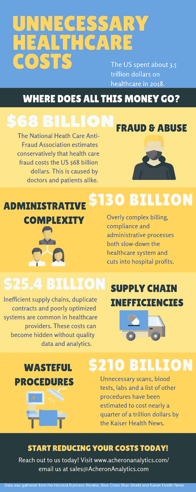

# 2019 年降低医疗成本第一部分

> 原文：<https://medium.com/swlh/reducing-healthcare-costs-in-2019-part-1-c7062841e3a2>

*[*民主党人和唐纳德·川普可能达成一致的少数事情之一是降低医药费用*](https://www.nytimes.com/2018/10/20/us/politics/trump-pharmaceutical-industry-healthcare.html) *。**

*为什么？医疗保健费用每年都在上涨。不断增加的药品成本、技术进步和浪费的程序每年都在让美国付出更多的代价。*

*每个人都开始感受到医疗费用的上涨。一些人负担不起，而另一些人挣扎着支付医药费。你们中的年轻人现在可能不理解，但是 30 年后，当你在 2048 年需要去医院时，一片泰诺药丸要收 200 美元，这可能是有意义的。如果我们现在不开始解决问题，你可能会明白医疗费用已经变得多么荒谬。*

*为什么医疗费用持续上涨？*

*推高医疗成本的原因确实很多。许多原因导致了许多改善情况的解决方案。然而，让我们首先从财务角度定义一些最大的问题。下面是一张信息图，展示了存在大量降低医疗成本机会的领域。数十亿美元的支出为降低美国整体医疗账单提供了机会。*

**

# ***您如何降低医疗保健成本？***

*降低医疗保健成本首先要认识到最大的问题，这些问题解决后会产生最大的影响。欺诈、浪费和低效系统等问题是医疗系统最大的成本。*

*你如何识别最大的成本？这就是数据的来源！当我们研究一些像亚马逊这样的大公司的成功时，他们与不太受数据驱动的公司的一个区别是，他们避免使用“我认为”这样的术语，而没有数据来支持它。*

*我们的团队将在接下来的几天里公布如何利用数据降低医疗保健成本。[如果您在此之前对主题有任何疑问，请联系](http://www.acheronanalytics.com/contact.html)！*

**

## *这篇文章发表在 [The Startup](https://medium.com/swlh) 上，这是 Medium 最大的创业刊物，拥有+402，714 名读者。*

## *在这里订阅接收[我们的头条新闻](http://growthsupply.com/the-startup-newsletter/)。*

**