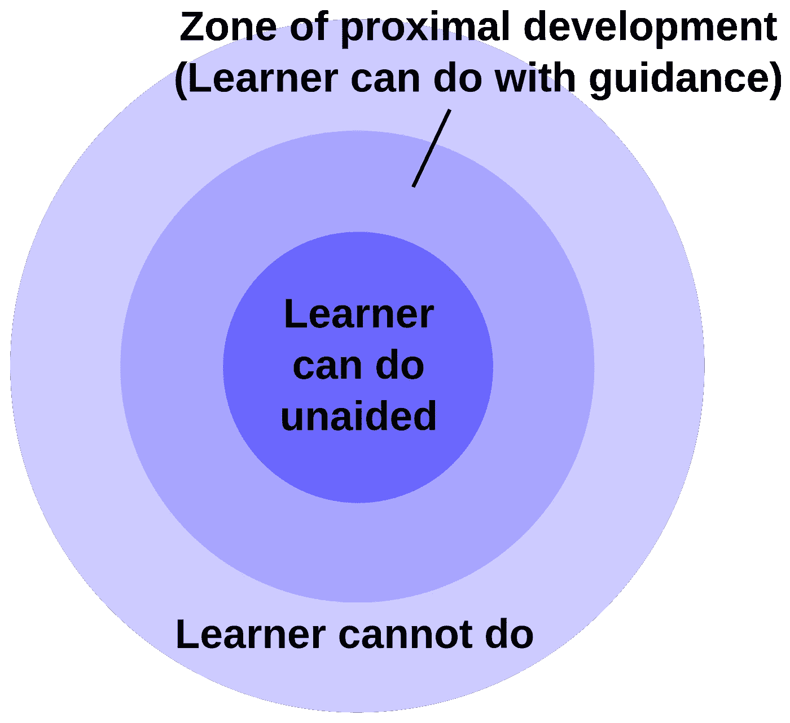
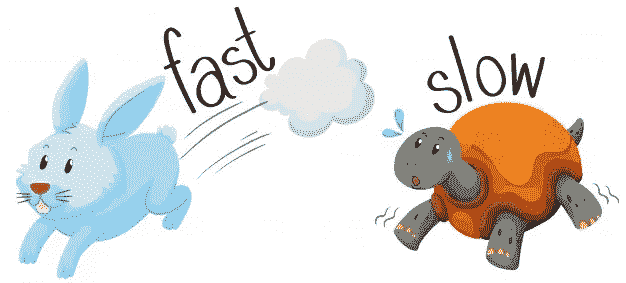

# 对轻微倦怠的反思

> 原文：<https://medium.com/swlh/reflecting-on-a-minor-burnout-571dd0e51ff5>

## 你是怎么坚持下去的？

Photo by [Samuel Zeller](https://unsplash.com/@samuelzeller?utm_source=medium&utm_medium=referral)

我的快乐与我的生产力直接相关。完美的一天是当我做一些事情的时候。不止如此，当我完成一件事。

我喜欢制作内容。所以这里的问题很清楚:

*为什么过去两周我什么都没做？*

让我们反思一下。这些疑问中的一些一直在我的脑海中闪现。

你是怎么坚持下去的？

你*真的*会累垮吗？

你叫*那*一句话？

你*真的*没有好点子吗？

不久前，我有了一个制作视频的想法。我有动力，我坚持写作，每周在 Youtube 上发布一次。一切都很好。

> "你想在这个城市里骑吗？"

我对这个想法感到兴奋，并赞同它。这里的交通越来越糟糕，我讨厌在车里浪费时间。我试着用一个助推板来解决。

它是邮寄来的，我开着它兜了一圈。然后我突然想到。我要在镇上骑一圈，记录下所有的坑坑洼洼和崎岖不平的人行道。

通过这个[视频](https://www.youtube.com/c/MartinUhnak)，我想展示(并向自己证明，因为我已经买了它)即使在一个道路和人行道都很糟糕的城市，人们也可以很容易地将电动滑板用作交通工具。

在我脑中听起来很棒。但是我想享受一下。

拍摄进行得很顺利，我绕着几个街区转了一圈，除了几个例外，旅途并不太颠簸。这一点已经说明了。

然后我坐下来编辑。所有这些想法执行起来比我想象的要困难得多。即使我真的做了，也没有任何意义。

我为此挣扎了四天两夜。我想在星期二晚上完成。我改变了二十次结构。

在经历了所有这些痛苦之后，我在一个星期三的早上 6 点完成了这篇文章，并在同一天把它发了出去。

结果很好。我学到了很多。但是接下来的几天我都筋疲力尽，接下来的一周我都没有做视频。后来工作忙了，又一周没拍视频。然后一些旅行，没有视频了。

**借口**

三周后，没有视频。

# 最近发展区

当你自学的时候，很容易忘记这个事实。

By [Dcoetzee](https://commons.wikimedia.org/w/index.php?curid=20903046)

最近发展的[区域](https://www.simplypsychology.org/Zone-of-Proximal-Development.html)是你在学习新东西时能够运用的新能力的范围。如果你目标太高，你会泄气。你变得疲惫不堪，变得怨恨和挑剔。突然没有一个想法值得追求，没有一句话对内心的批评家来说是足够好的。

如果你的目标太低，你什么也学不到。为了有效地学习，你必须一次又一次地在那个区域内伸展。通过这种方式，这个区域慢慢走向曾经不可能的目标。

一个优秀的老师会让你在那个区域里伸展。但是当你自学的时候，你必须学会平衡你的“功课”。

> 小而持续的步骤。缓慢但稳定。就像乌龟一样。

by [Brgfx](https://www.freepik.com/free-vector/rabbit-runs-fast-and-turtle-runs-slow_1172853.htm)

简称:

> 今天把目标定得足够低。

这个视频远远超出了我最近开发的范围，所以我必须非常努力才能及时完成。这反过来又危及到我正在努力改善的所有其他领域。

注:*马特两天前发布了这个。我去拿我的频道网址的时候偶然发现的。他对创作和倦怠给出了一个健康的视角。*

伸展运动是必要的，但我的首要任务是无限期地坚持下去，同时保持健康，对我的家人有用。所以我也需要坚持一小步一小步来。

今天不要做什么。

输入一天的工作，关闭笔记本电脑。