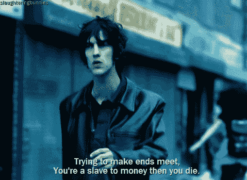

# 回顾一年来关于加密的写作

> 原文：<https://medium.com/swlh/reflecting-on-a-year-of-writing-about-crypto-711d2d947acf>

Photo by [Adolfo Félix](https://unsplash.com/photos/Yi9-QIObQ1o?utm_source=unsplash&utm_medium=referral&utm_content=creditCopyText) on [Unsplash](https://unsplash.com/search/photos/writing?utm_source=unsplash&utm_medium=referral&utm_content=creditCopyText)

12 个月前，我开始认真撰写关于 crypto 的文章，幸福地无视它将开启的新的职业道路和机会。一年过去了，我觉得值得回顾一下我所学到的东西。这也许是一种自我放纵的反映，但是正如有很大的需求去理解 crypto 一样，我也认为现在会有很多人希望写关于 crypto 的东西。在过去的一年里，我学到了很多东西，我相信我的经历远远不限于我。

# **为什么要写？**

我开始写作主要是出于无聊。我从事着一份收入不错但智力有限的工作，在这份工作中，我通常会花 4-5 个小时浏览互联网，阅读所有关于密码的东西。与此同时，朋友和家人越来越多地要求链接，向他们解释以太坊和加密更普遍。

我写了一系列的文章，形成了对所有加密技术的介绍。人们似乎很喜欢它(尽管它现在非常需要更新)。所以我继续写。在我发表第一篇文章之前，我有一个痛苦的疑问，我并不真正理解技术，我缺乏开发背景会暴露我，人们会立即指出我的错误。

这从未实现。这并不是说我没有写过不正确的东西——随着我理解的增加，我对所有我不知道的东西有了更多的了解。然而，反应非常积极，我总是非常感谢那些花时间与我联系或留下评论的人。

因为我因此涵盖了更多的主题，这也意味着写作是增加我自己理解的一个极好的工具。你自己理解一个概念的最好方法，莫过于尝试向他人解释它。随之而来的对自己知识的信心的增加是开始写作的最好结果之一。

这并不总是容易的——我在 [Maidsafe 的 PARSEC](/@flatoutcrypto/project-spotlight-maidsafe-and-parsec-part-1-4830cec8d9e3) 上的文章几乎让我绝望，因为我在很长一段时间里都无法理解它。这可能是我最引以为豪的一篇文章，因为我发现它难以理解，需要我反复阅读，并画出自己的图表，试图弄清楚到底发生了什么。即使完成了，团队仍然不得不纠正我的一些观点。然而，这篇文章从一个紧密团结的社区获得了很多掌声，我认为他们会感谢为此付出的努力。

这种与团队的互动是写作的另一个好处。由于我经常关注那些几乎没有现存资料或者更加晦涩的项目，我从许多真心希望帮助完善我对他们项目的理解的人那里受益匪浅。这样做不是为了公关或宣传目的(这总是很容易区分)，而是因为我认为他们经常看到的是已经投入写作的时间。

# **以写作为生**

我与一个团队的关系最终标志着一个转折点。它伴随着我写的第一篇【T2 项目聚焦】文章而来，聚焦于 DLT 根。Radix 是一个我已经关注了一段时间的项目，所以我把完成的文章发给了 Radix 团队，以防有任何不准确的地方(当然也希望有更多的宣传)。这引发了与团队的工作关系，这有两个好处:

*   从根本上提高我的加密知识，让我专注于撰写文章，不仅解决显而易见的主题(如分解各种共识算法)，而且解决协议本身的技术基础(如数字签名、哈希函数等)
*   让我意识到人们会为我之前免费写的东西付钱

我对这份带薪工作感到如此惊讶，以至于当被问及工资时，我不知道该说什么。就像，我甚至没有一个大概的数字——我根本没有想过。幸运的是，Radix 团队的报价很公平，因为直到后来我才知道我应该收取多少费用。

我从未真正想过以写作为生。新闻业的消亡是众所周知的，我也无意写一些企业吹捧文章。然而，我很幸运地和一些团队一起工作，我相信他们的心和头脑都在正确的地方。这对于建立工作关系非常重要。这也意味着我通常会写一些我感兴趣的东西，我认为这是保持热情和不精疲力竭的关键。

我认为这很容易让人筋疲力尽，尤其是在有报酬的时候。一旦你接受了服务的报酬，从为自娱自乐的写作转向为他人写作，整个动态就改变了。一开始我很讨厌它，差点就要放弃了。这很难，我不断被修改，每一次修改的草稿都有大量的修改。

我觉得不值这个钱但还是坚持了下来，最终突破了。我开始理解为客户而不是为自己写作是什么感觉，并适应了这种感觉。因为我是为那些与我有很多意识形态共识的公司写作，这也意味着我总是能够诚实地写作。

我可能只写过两篇让我后悔的文章——它们因犹豫不决而出错——但它们是学习曲线的一部分，我现在拒绝了这样的工作。我总是试图避免任何类似于推托的事情，在任何以特定加密资产为特色的文章中披露我的持有情况。总的来说，我的目标是像写论文一样写，提出相反的论点，这样人们可以得出自己的结论。

# **为我写作**

当我开始的时候，我坚决反对社交媒体，从来就不是一个粉丝。直到今年，我从未使用过 Twitter，很少使用脸书，也从未使用过 Snapchat 或 Instagram。虽然我还没那么老，但它基本上已经过去了，直到今年四月我才开始在我的网站上使用 Twitter。

我认为，作为一个天生回避网上冲突的人(你永远不知道和你争论的人是谁，我真的不在乎别人是否认为我错了，这很好)和一个没有宣传欲望的人，我没有很好地利用它。毫无疑问，这意味着我错过了许多通过 Twitter 发表文章的机会，但这真的不是我。我很少使用它来保持存在感，但我永远不会把它作为主要工具来使用。

然而，在为我的作品赢得更广泛的读者方面，媒介非常有用。虽然我开始只是在自己的网站上写作，但到了 6 月份左右，我意识到我在 Medium(没有额外工作)上的浏览量是在我的网站上的 10 倍。我现在维护我的网站更多的是作为我的文章的索引，以防 Medium 删除或暂停我的帐户，以及在 Medium 上发表我不被允许的文章。

我做的另一个更好的决定是避免编辑我的文章，除了快速的拼写检查。这意味着经常会有漏字、语法错误和总体上缺乏润色，但这也让我可以快速发表文章，从而写得更多。而且，我就是不喜欢剪辑的过程。我宁愿快速提交 90%的东西，而不是纠结于细节。

写作中的一件怪事是，我从来都无法预测哪篇文章会赢得读者。我认为这实际上对我有利，因为这意味着我写我想写的东西，而不是我认为别人想要的东西。

例如，我读过的最多的文章之一是《我对自由激进主义的崩溃》,这篇论文是由 Vitalik Buterin、zohitzig 和 E. Glen Weyl 合著的。我本以为人们对这样一篇论文没什么兴趣，所以才写了这篇文章，因为 a)我第一次读的时候没看懂，b)没有一个新闻网站能解释它。我的一般原则是，如果我不明白某件事，我认为大多数人也不会明白，因此这件事值得一写。我唯一关注的指标是阅读率——我发现阅读时间在 6 分钟左右的文章表现最好。

我怀疑许多新的加密或新的写作发现很难知道他们属于哪个社区，他们应该为谁写，他们可以在哪里发表。我经常听到的一个观察围绕着我在交易客观上差的或非创新的加密资产时采取的看似不一致的立场，同时旨在主要写技术。

我对此表示同情，但我的立场一直是一样的——我将这两者视为本质上独立的练习。我可能会觉得这项技术很有趣——这也是我写作时关注它的原因——但如果已经明确证明它不是价格波动的原因，那么让它左右交易决策将是愚蠢的。在加密资产估值由基本面驱动之前，继续将二者分离是有意义的。

我怀疑，这让我置身于两个阵营之外。我不属于加密交易社区，因为我很少写技术分析或每日走势。同样，我也不适合更注重技术的社区，因为我毫不掩饰地乐于拥有被视为白痴专属的加密资产。

我开始写作，试图帮助他人理解，我希望这在我的写作中保持一致。我也希望我对这项技术的享受仍然存在。这是一个如此愤世嫉俗的空间，我也不例外，我已经自由地写下了正在发生的失败。这也是我参与过的最有趣的事情，也是激发我激情的事情，几乎不同于其他任何事情。将这一点融入到我的写作中是我做过的最好的决定之一——如果你正在考虑或者犹豫不决，我当然会鼓励你这么做。

**如果你喜欢我的作品，那么你可以关注我@**[**flat outcrypto**](https://twitter.com/flatoutcrypto)

## 这篇文章发表在 [The Startup](https://medium.com/swlh) 上，这是 Medium 最大的创业刊物，有+ 381，508 人关注。

## 在这里订阅接收[我们的头条新闻](http://growthsupply.com/the-startup-newsletter/)。

