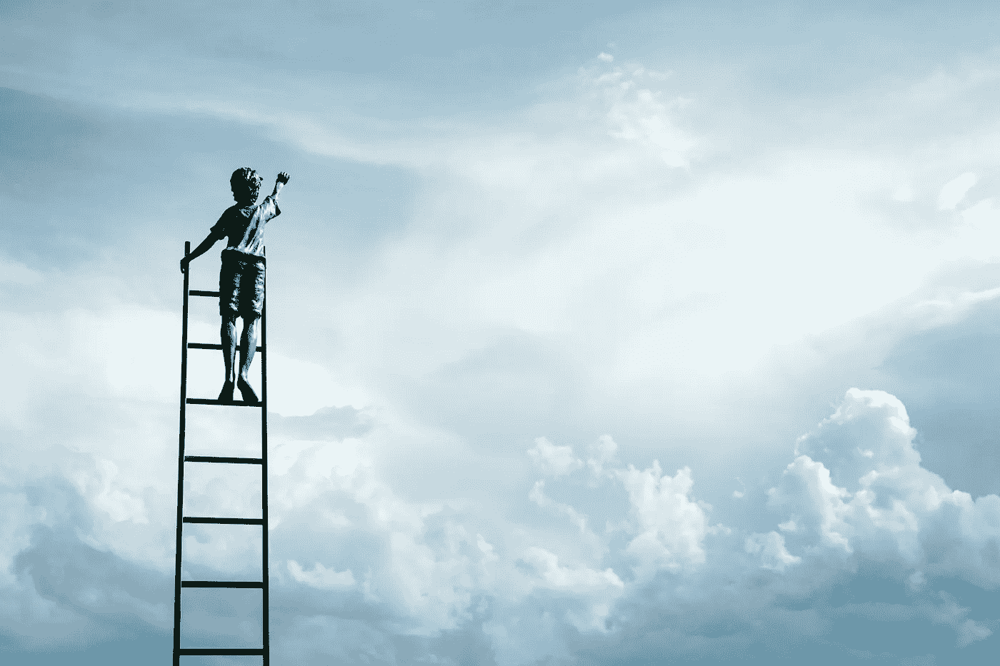

# 反思去年，为新的一年设定目标

> 原文：<https://medium.com/swlh/reflecting-on-last-year-and-setting-goals-for-the-new-year-81a2feb9ce02>

随着一年即将结束，花些时间回顾过去的一年及其所有事件总是有益的。反思这一年发生了什么，你完成了什么，还有哪些可以做得更好，这将为这一年画上句号，也将为有价值的学习提供空间。在考虑新的一年之前，花些时间回顾过去也是个好主意。

当你准备好结束上一年的篇章时，你就可以走向未来。从头开始，在接下来的一年里创造你想要的。什么都行:这是你的未来。如果目标看起来过高，也不要担心——经过深思熟虑的计划和执行，一切皆有可能。

[Photo: Jeremy Bishop/Unsplash]

# 回顾上一年

在日历上安排一个时间，坐在一个安静的地方，回顾过去的一年。

## 这一年发生了什么？

花点时间来评估这一年。反思并列出过去 12 个月中发生的所有事情。包括成就以及那些不一定对你有积极影响的事件。有时我们只关注成就和失败，但认识到我们无法控制的环境也很重要。所有这些事件都对你产生了影响，你可能会发现潜在的模式或联系，只要把它们写在纸上。

## 你从这些事件中学到了什么？

花点时间回顾一下哪些有效，哪些无效。此外，承认你是如何成长的，以及你是如何以不同于过去的方式处理过去一年的事情的。

## 你想留下什么？

有没有模式、关系或活动已经不再有用了？从前一年到新的一年的过渡是一个很好的时机来释放那些在过去可能对你有益但不再相关的事情。

## 你能从过去的一年中体会到什么？

心怀感激总是个好主意。即使这一年是你宁愿忘记的一年，但总有一些事情是你可以心怀感激的。

给自己充足的时间去回顾和分析。然后，正式结束你的一年。一旦你准备好了，是时候开始为下一年设定目标了。

[Photo: Samuel Zeller/Unsplash]

# 设定你的目标

下一步是想象未来，并设定下一年的目标。

## 到今年年底，你对自己有什么打算？

展望 2019 年底。你想到哪？你完成了什么？未来可能不仅仅包括成就，比如买房或者升职；你想象的未来也可以包含增强的性格特征，比如变得更友善，甚至生活方式的改变，比如花更多的时间和你的孩子一起做有趣的活动。

将你的目标分成几类:个人、工作、健康和社区。你可能会发现你在一门课上设定了太多的目标，而对另一门课却没有给予足够的关注。这些分类将帮助你创造一个更加平衡的未来。

当你设定目标时，确保它们是可衡量的和可实现的。即使一个意图是变得更友善或更自然，那会是什么样子呢？目标可以是每天做一件小小的，甚至是看不见的善事。

## 想办法

从这里，你可以计划你的一年，以确保你将达到你的目标。从结果开始回溯，看看你需要采取什么行动才能达到目的。如有必要，将一年分成几个季度和几个月，并定义在一年的不同时间点需要完成的里程碑。截止日期让你更有责任感，也更有可能实现你的所有目标。

一个关键的组成部分是确保这些里程碑和行动出现在你的日常日程或计划中。找到最适合你的方法。一个对我很有效的策略是全年给自己设置提醒，提醒我回顾我的目标，看看我做得怎么样。我也有提醒我为自己定义的不同行动，这有助于我确保我在一年中努力实现这些目标。

[Photo: Jeremy Bishop/Unsplash]

## 尝试一个不可能的目标

给自己定一个不可能的目标:做一件自己从来没有做过的事情。不可能的目标帮助你达到更高的目标，否则可能永远不会发生。如果你不抓住这个时刻，时间会不停地流逝，你可能永远不会尝试。

从 2016 年开始，我就一直在给自己设定和完成不可能的目标:

*   2016:一年读 50 本书。我把当代书籍和一些经典书籍结合在一起，并且每年持续阅读 50 本甚至更多。如果我没有设定读 50 本书的目标，我永远也改变不了我的习惯。
*   2017:开始这个博客。我费了很大劲才让它起步，但在我的同行教练小组的帮助下，我在 2017 年 9 月推出了它。
*   2018:写一本童书。我写了三个不同的故事，直到最后满意为止。在这一年的最后几个月，我请了一位插图画家，这本书现在已经完成了。*艾丽西娅和邦妮画壁画*将于 2019 年初以英语和西班牙语出版。
*   2019 年:写一本非虚构的书，我会在 2020 年出版。祝我好运。

每年，我不可能的目标都为我打开了一个新的世界。旅途中的探索几乎比实现这些目标还要好。例如，我的儿童书籍是我从未想过会做的事情。然而，在这个过程中，我发现了将一个角色带入生活并与周围的人分享的快乐。

新年快乐祝你一年充满探索、发现和成长。

**相关故事:**

[**当你达到目标后会发生什么**](/swlh/what-happens-when-you-have-achieved-your-goal-888cd1e4d639)

[**如何理解这个疯狂的世界**](/swlh/how-to-make-sense-of-this-crazy-world-2a7ac83f52fe)

[**如何通过阅读&学习**](/swlh/how-to-stay-up-to-date-by-reading-learning-c1396f2db02a) 保持最新

## 这篇文章发表在 [The Startup](https://medium.com/swlh) 上，这是 Medium 最大的创业刊物，拥有+402，714 名读者。

## 在此订阅接收[我们的头条新闻](http://growthsupply.com/the-startup-newsletter/)。

