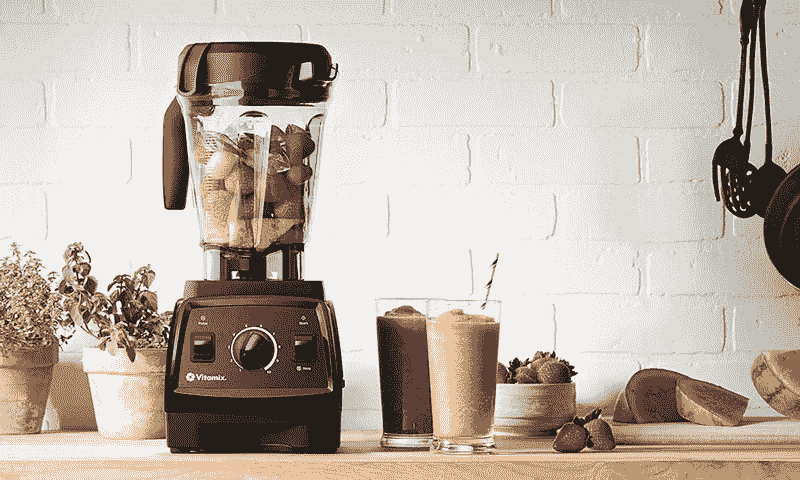
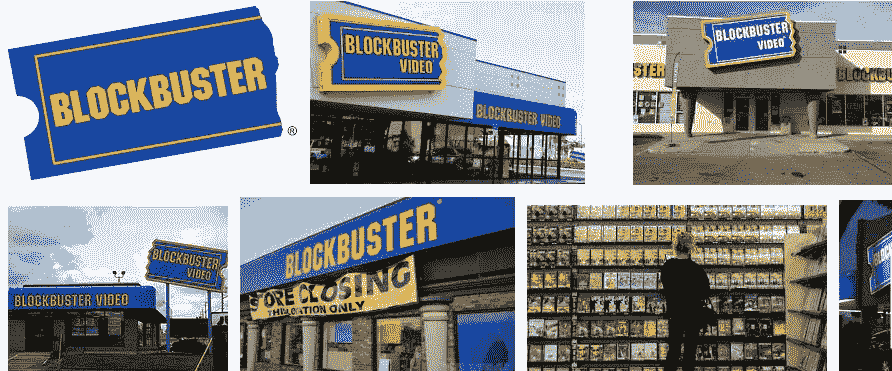
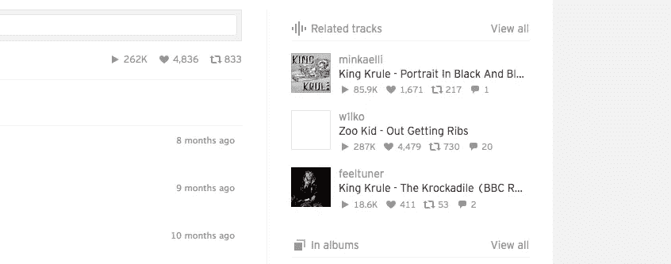

# 关于产品设计的思考

> 原文：<https://medium.com/swlh/reflection-on-product-design-2454f905d88e>

总的来说，我一直在思考产品设计和产品。我经常会问这样的问题，“这款应用的产品设计有什么特别之处？这个应用程序如何在我的生活中扮演重要角色？如果这个产品消失了，我的生活还会一样吗？”经过一些研究，以下是我对产品设计的看法。

**是什么让一个产品变得优秀？-** 我相信有许多因素在起作用，根据 Josh Porter 写的一篇文章，“[产品设计原则”](http://bokardo.com/principles-of-product-design/)，一个好的产品有 18 条原则。我不会一一列举，所以我选择了三个我认为对我来说最有意义的。

**有用是工作#1-** 如果一个产品没有用，我为什么要用它？我有一台搅拌机，每天早上用来做早餐奶昔，对我来说，这赋予了产品价值，因为这是我可以使用的东西。如果这台搅拌机不能碎冰，那么对我来说这将是一个失败的产品。由于我的搅拌机可以搅拌几乎任何东西，易于使用，并满足我的需求，它已经成为我生活中的一个主食。

**解决现有问题-** 如果一个问题还不存在，为什么要解决它。人们真的需要一个应用程序来告诉你最近的 7-11 还有多少士力架吗？(不过，我认为这样做很有趣)。网飞是一个应用程序打破租赁游戏的很好的例子。他们让我们舒舒服服地在家里租电影，借出了大片。我们只需要一个 WIFI 连接和每月 9.99 美元的付费订阅。

Ancient times

**体验就是产品-** 你更愿意使用一个会坏掉的笨重产品，还是能让你发挥创意的产品？我经常使用 SoundCloud，因为它给我带来了体验。这是唯一一款让我免费聆听未来艺术家音乐的应用。我喜欢的是你的订阅上总是有新的曲目。你关注的艺术家可以转发或上传他们自己的歌曲。你也可以点击一首歌曲，它会把你相关的歌曲链接起来，让你沉浸在一个全新的未被发现的音乐世界中。所有这些互动让 SoundCloud 成为我的一次经历。

related tracks will get you sifting through new music all the time.

制造一个伟大的产品有很多要素。细看细节让我意识到不仅仅是外表。它是关于有用性、体验、它解决的问题等等。

## 这个故事发表在 [The Startup](https://medium.com/swlh) 上，这是 Medium 最大的企业家出版物，拥有 287，184+人。

## 在此订阅接收[我们的头条新闻](http://growthsupply.com/the-startup-newsletter/)。

