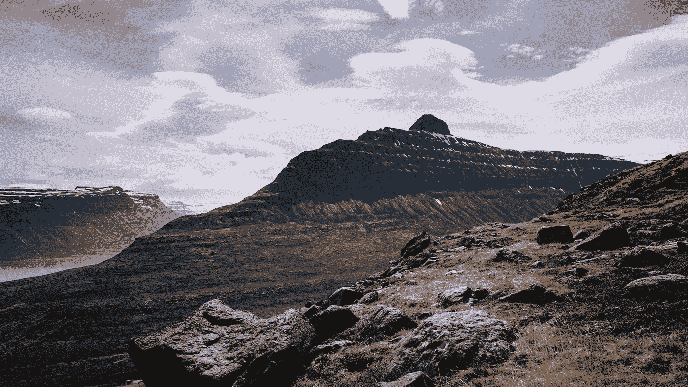

# 重视障碍胜于目标

> 原文：<https://medium.com/swlh/reframing-the-mountain-valuing-obstacles-over-goals-7093c2eebdb2>

High above Súðavík, Iceland — 2017

欧向后靠进那把半人体工学天井椅，金属而凉爽。不知何故，你的身体此刻到底需要什么。当你面前有一杯冷饮时，阳光有着不可思议的力量，尤其是在有好伙伴的附近。

这是经常发生的事。一小口。第二个。你仰着头，闭着眼睛看着太阳，沉浸在短暂的禅境中。