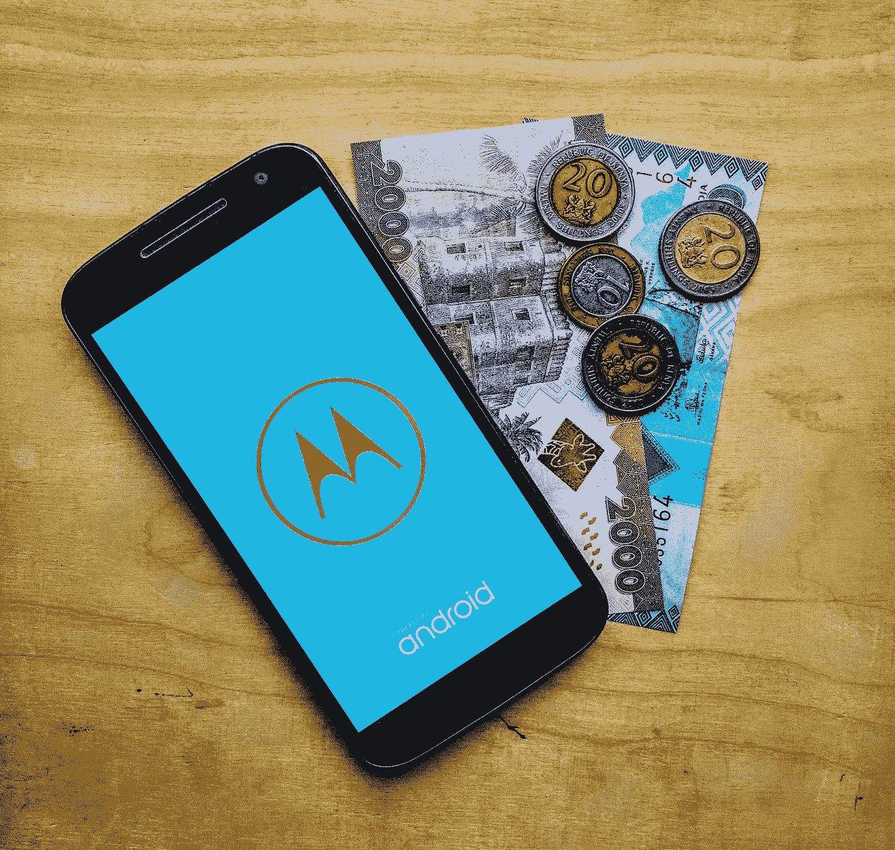

# 难民、数字技术和互助承诺

> 原文：<https://medium.com/swlh/refugees-digital-technology-and-the-promise-of-mutual-aid-868748f3bd9c>

> 来自 [aidx 论文 1](http://bit.ly/2CZMuJo) 的六个关键见解

*塔里克·希拉勒&杰拉德·麦克休*

人们帮助人们，这是一个简单而直观的命题，一个可能有着熟悉的竞选口号或组织使命的命题。这是许多从事难民工作的组织所渴望的理想，但却常常达不到。越来越不需要如此。

我们生活在一场技术革命之中，这场革命正在改变人类关系，以十年前无法想象的规模和方式将人们联系在一起并赋予他们权力，为解决古老的问题提供了新的机会。

虽然几乎每一个领域的努力都被这种转变所破坏，但一些最令人兴奋的变化正在数字领域发生，新兴技术与不断增加的数字连接相结合，开辟了全新的可能性世界。金融和通信技术、数字身份证、移动货币、人工智能和区块链不仅本身具有变革性，而且正在为进一步创新创造基础设施和生态系统。

然而，在技术对难民生活产生积极影响的地方，这往往是偶然的，是更广泛的技术变革的副产品，而不是有针对性的努力的结果。像 WhatsApp、脸书和谷歌地图这样的应用已经开始在许多难民的生活中发挥核心作用。但是，这些技术都不是为难民设计的，虽然它们解决了关键问题(如与家人沟通和定位)，但还有更多的事情可以做。

有意开发支持难民社区的技术产品意味着首先要了解难民面临的问题，然后与他们密切合作，共同设计解决方案。这不仅是一个激动人心的强有力的方法来帮助处境不利的人，而且有可能提供创新，使人们更广泛地受益。

难民社区已经在创新。当你的手机账户被暂停时，想办法给难民营里的家人汇钱；当工作受到限制时，想办法谋生；或者当生活费用完全超出收入时，想办法维持生计，这些都需要独创性。

在以人为中心的设计工具和框架的指导下， [aidx](http://www.aidx.io) 分别在土耳其、苏丹和肯尼亚的叙利亚、南苏丹和索马里难民中开展了一个研究项目。我们的目标是更好地了解难民在日常生活中面临的挑战，并深入了解帮助他们克服这些挑战的社会创新。以下是六个关键的见解

## ***关键见解***

**1。难民是面临特殊情况的普通人。**

虽然难民的处境非同寻常，但他们关心的许多问题是世界各地的人都熟悉的，找工作、付房租、处理医疗账单和接受教育。

**2。难民获得的大部分援助来自他们的社会网络和社区。**

自助网络，或者我们称之为互助网络，是难民日常生存的基本组成部分。他们使用复杂的社会系统，从正式到非正式，从两方协议到大型的高度协调的集体行动。这些网络促成的分享、给予和汇集在我们采访的难民中几乎无处不在。

**3。** **财政统筹是最有力的互助例子之一。**

这种做法，从高度结构化到非正式，在我们采访的人中非常普遍，并成为礼物、贷款和储蓄的来源。

**4。尽管互助有许多优点，但也带来了许多挑战。**

参加互助会非常耗时。不一致的期望和信任的破坏是痛苦的一个重要原因，社交网络差的人很难获得它的好处。由于严重依赖现金，金融资金池变得更加困难。

**5。数字技术未能支持互助系统。**

尽管弱势群体之间普遍存在互助，但很少有人致力于建立数字技术来加强和支持这些网络。

**6。有机会开发新的解决方案。**

这是一个独特的机会，可以将以人为中心的设计中的最佳实践与明智的技术选择相结合，以构建新产品，这些新产品以赋予个人权力和加强社区的方式映射互助的社会技术。

了解更多 [**下载 aidx 论文 1**](http://bit.ly/2CZMuJo)

## 这篇文章发表在 [The Startup](https://medium.com/swlh) 上，这是 Medium 最大的创业刊物，有+386，607 人关注。

## 在这里订阅接收[我们的头条新闻](http://growthsupply.com/the-startup-newsletter/)。

