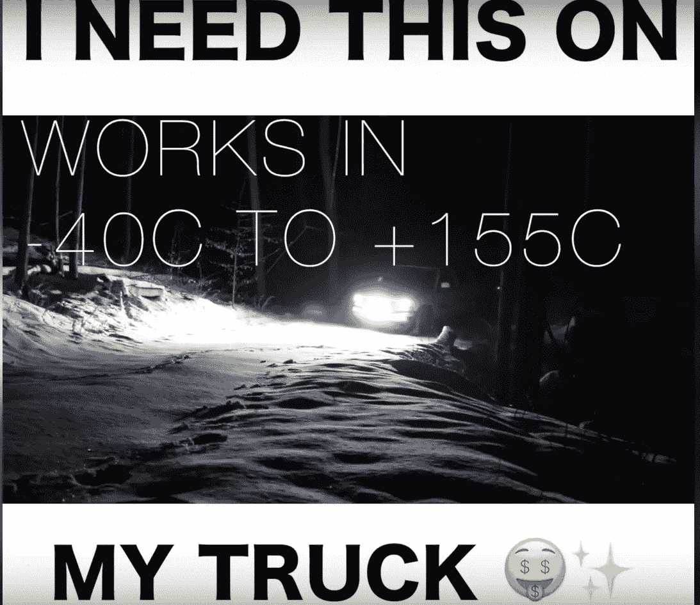

# 相关性:从你的 PPC 活动中获得更好结果的最容易实现的目标

> 原文：<https://medium.com/swlh/relevance-the-lowest-hanging-fruit-for-better-results-from-your-ppc-campaigns-ad147dd98703>

无论你是为自己的创业公司还是为预算有限的客户建立和优化营销活动，都很容易迷失在数据中。

> “哦，我看到在周三上午 8 点到 9 点之间，这个月有相当多的转换，所以我要为那个时间设置一个出价调整！
> 
> 竞选。已优化。"

-我(在做出产生 0 个实际结果的改变之前。)

当然，虽然识别数据模式并根据这些模式调整出价是预算大的大型活动优化的重要组成部分，每月每周每天都有大数据，但对于不同规模的活动来说，这通常不是一个有效的策略。

避免数据陷阱。

仅仅因为你安装了分析软件，你有数据和数字要看，并不意味着它们马上就相关了。

如果你每月总共有 10-50 次转换，在大多数情况下，你真的没有足够的数据来证明这些逐小时、逐邮政编码级别的变化。

因此，当你对时间、日期或区域进行出价调整时，即使你在短期内看到了结果，也不能保证即使不做改变，你也不会得到这些转换。(从中长期来看，你可能会看到这一幕。)

规模简直太小了。

那么你应该关注什么呢？

> *相关性。*

加倍努力，专注于让你的广告出现在合适的人面前。

让相关性成为你的指路明灯，引领你走向成功的营销活动，远在你有足够的数据进行更传统的“数字”优化之前。

确保你的广告尽可能与你的目标受众相关，确保它们能导向相关的登陆页面，并确保你的报价是相关的。

不要只相信我的话。

谷歌和脸书已经在试图通过谷歌的质量分数和脸书广告的相关性分数来强行灌输这种相关性概念。

但是许多新的广告商(尤其是以数据驱动为荣的自举公司)不听。

他们仍然搁置相关性和前期研究，并试图在没有数据的地方搞清楚数据集的意义。

如果你向相关受众投放相关广告，你不仅会获得更好的活动结果和更多的转化率，实际上你会获得更多的印象，更便宜的 CPC/CPM，因为平台也会为此奖励你。]

## 瞄准合适的受众—脸书

能够向某人展示与他们相关的广告，然后将他们发送到相关的登录页面，为他们提供相关的服务或产品的第一步是将您的广告真正放在正确的人面前。

对于脸书的广告，人们通常会跳过这一步，向不感兴趣的观众投放无针对性的广告，然后说“脸书的广告不适合我的生意”。

事情不是这样的。

是的，这是真的，FB 广告并不是最适合每一个项目/业务。

但是你不能只是写一个广告，创造一些数百万人的随机受众，运行你的广告，然后退休去巴哈马群岛享受你的竞选。

不要认为 PPC 是什么，你可以设置的在线广告，它基本上可以照顾自己，你应该想象你正试图亲自向某人出售你的产品。

> 想象你正在挨家挨户推销你的产品。

如果你打算花自己的时间挨家挨户推销东西，你会想尽可能多地了解附近的情况。这是确保你不虚此行的唯一方法。

比方说，你想出售你的新食谱:PB&J 100 种方法。此外，你有很多不同社区的人的数据，所以你可以根据许多不同的因素来决定去哪些社区。

你打算无视这些数据，去拜访每一个对食物感兴趣的人吗(提示:70 亿，还在继续)？

你将会花更多的时间去敲门，与那些永远不会买你产品的人交谈，而不是与天生就感兴趣的潜在客户交谈:

*   不喜欢 PB&J 三明治的人。
*   对花生过敏的人。
*   对小麦过敏的人。
*   没钱的人。
*   从不买烹饪书的人。
*   等等…

你会见到他们的。

更糟糕的是，在你意识到他们本来就不感兴趣之前，你会在他们每一个人身上花很多时间。

当你第一次策划广告活动时，你应该花更多的时间瞄准正确的受众，而不是把广告文案提炼出来(我稍后会告诉你如何快速完成好的广告文案)。

你可以把目标锁定在那些喜欢某个花生酱品牌的脸书页面、最近在看与你相似的烹饪书、经常在网上购物的人身上。

(更不用说基于收入、地区和年龄的目标了。)

不要一开始就有数百万的观众，而是把范围缩小到你的核心观众。

即使只有几千人，你也可以利用这些核心受众来判断哪些广告有效，哪些登陆页面/销售渠道，哪些优惠可以转化等等。

然后，您可以利用受众洞察和定制/相似受众进行扩展。

## 锁定正确的受众— AdWords

脸书广告和 AdWords 的主要区别在于，用 AW 你可以判断这个人当时的意图。

“我附近的餐馆”

这个简单的短语告诉我们当时正在搜索它的人的很多事情，特别是考虑到他们可能在手机上打开了 GPS，所以谷歌实际上可以给他们相关的建议。

“餐馆”告诉我们，很明显，这个人在某种程度上对餐馆感兴趣，但通过添加“我附近”，有一个非常强烈的暗示意图，即这个人正在寻找在不久的将来吃饭的餐馆。

“该地区最好的周二午餐优惠”

同样，意图非常明确，只要你在他们搜索的地区提供午餐，就很难出错。

## 相关广告— Adwords

但是，即使你有合适的受众，那些在你所在地区积极寻找餐馆的人，如果你不给他们看相关的广告，你也可能会彻底失败。

例如，如果我们使用最新的搜索短语:“该地区最好的周二午餐交易”

向他们展示相关广告有很多因素。

时间:他们正在寻找特定工作日的特价商品。你不希望给他们看一周中其他日子的打折广告，甚至给他们看你一周的午餐折扣也是不明智的。理想情况下，你会向他们展示他们正在寻找的唯一交易。

预算:这些人显然想要一笔好交易(他们关心成本和价值)，如果你不给他们看表明你提供一笔好交易的广告，那就不是与他们相关的广告。

地点:很明显，你需要将你的活动限制在那些有人会在午餐时间光顾你的餐馆的区域。这里考虑到，针对去餐馆吃饭的人的活动范围比寻找午餐地点(通常在他们的办公室或大学附近)的人更广。)

相关广告:

> "仅在周二提供 15 美元的烤三文鱼午餐套餐！"
> 
> http://www.yourrestaurant.com/area/lunch-deal
> 
> 毫无疑问，这是当地最物有所值的午餐。

时间、地点和费用都包含在一个非常简单的广告中。

没有相关的广告:

> "看看皮埃罗的午餐菜单，镇上最好的面食"
> 
> 我们供应按照传统食谱自制的意大利菜肴。
> 
> http://pierrosrestaurant.com/lunch-menu/best-pasta/

任何地方都没有提到交易，尽管标题中有“午餐”和“最好的”这两个词，但这并没有使它成为一个与寻找最好的午餐交易的人非常相关的广告。

它也没有在任何地方提到星期二，这是一个浪费的机会，让用户觉得你的广告是相关的。

Google AdWords 为您提供了向目标用户展示极其相关的广告所需的所有工具，您所需要做的就是花时间以正确的方式设置您的活动。

当瞄准某个关键词时，总是问你自己(从你的目标受众的角度)，如果你正在搜索，你是否会乐意点击你的广告。

如果答案是否定的，那么有些事情需要改变，无论是增加广告组的数量还是仅仅改变文案。

## 相关广告—脸书

在脸书上向观众展示相关广告的最可靠的方式，是在你制作一个广告之前，真正深入研究你的营销对象。

你的目标是喜欢某些页面的人吗？

浏览每一页。

深入的。

确定哪种内容(图片、文本和视频)最能吸引粉丝的注意力。

哪些标题做得好？什么长度的内容做得好？语气？

找出在那个领域里流行的内容背后的原因。

但是不要就此打住。(那是最简单的方法。)

加入相关的群和论坛，和真人对话。

看他们对什么有热情，有什么问题，用什么语言描述那些问题。(老派，我知道。)

一旦你完成了这一步，你就能为你的观众量身定做完美的广告。

这种广告的一个很好的例子是下面的广告，海登在他的视频中兜售封面，讲述他如何在这个非常脸书的广告上花 5 美元赚了 500 美元。

如果你在他的目标页面上找到了那种做得很好的内容，你马上就会明白为什么这个广告会有这样的效果。

它只是全面遵循了一个成功的公式。

*   视频。
*   令人瞠目结舌的珠光宝气(由黑暗突出)。
*   大文本激励人们开始播放视频，使用人们在相关小组中有机使用的语言“我需要这个在我的卡车上”，而不是“强大的 LED 照明，在有限的时间内只需 200 美元”。
*   号召人们给“需要”它的人贴上标签。(让观众做艰苦的提升。)

许多事情做得很好，你可以从中学习，并将其用于你的竞选活动。

## 相关登录页面

向相关的人展示相关的广告比以往任何时候都容易。如果你使用 AW 的关键词插入，你可以通过非常详细的方式锁定目标人群，然后你甚至可以准确地使用他们在你的广告中搜索的词。

但有一件事并不简单，那就是向所有从你的活动中获得的访问者展示相关的登陆页面。

我经常看到的一个错误是，有一个通用的登录页面，将所有广告组的访问者都发送到同一个登录页面。

如果你用谷歌搜索“长滩 Taco Truck”，广告商使用关键字插入在广告标题中向你显示“长滩 Taco Truck”，如果你将它们发送到你的聚合网站上的通用食品卡车类别页面，那就不是相关的登录页面。

一个相关的登录页面可能是位于长滩的一辆墨西哥卷饼车，也可能是长滩的一列墨西哥卷饼车。

对于脸书来说，更多的是确保你的登陆页面与平台相适应。如果你试图让人们加入一个活动/网络研讨会等，而你需要把人们送到一个有其他 PPC 的外部页面，在脸书创建一个活动，这样你就可以做真正的本地广告，这往往是一个更好的选择。

## 相关报价—价格

你可以把你的广告放在正确的观众面前。

你的广告可能很棒，很相关，而且点击率很高。

你甚至可以有一个很棒的登陆页面。

但是，如果你的提议与通过漏斗顶端的人不相关，你就不会有任何转化。

我们正在与一个客户合作，他正在进行一场成功的活动。他们带来了相当数量的客户，他们看到了积极的 ROAS，这确实是任何活动的最终目标。

他们决定将报价提高 50%(第一个月从 20 美元提高到 30 美元)，他们推测转换会受到足够小的冲击，他们会在更大的利润率中赚回来。

一夜之间，转化率几乎降至 0。

价格可能是让你的产品与受众相关的一个不可或缺的部分，如果你在销售一件高价商品，你需要确保你提供给的受众有购买能力。

当然，他们的兴趣与应该对你卖的东西感兴趣的人相匹配，但是你的报价在价格方面与他们相关吗？

## 相关优惠—平台

你在哪里做广告也会影响到你向别人出价的逻辑流程。

如果你在 AdWords 上做广告，并且你的目标关键词已经被证明是有意图的，那就有必要把重点放在销售你的商品上。

以产品和销售为重点的登录页面是合适的。

然而，如果你在脸书或其他社交网络上做广告，你卖的东西没有“冲动购买”范围内的价格标签，或者如果你在推广 B2B 产品，让某人直接进入销售页面很少是可行的办法。

你总是在高价商品上看到这种情况，比如昂贵的产品、度假或课程。

伟大的广告，良好的针对性(我点击了它)，良好的登录页面，有趣的设计和内容，然后我离开脸书，他们马上问我要 100 美元。(不会发生。)

现在，如果我在谷歌上搜索豪华厨师刀，或“商业撤退”，他们知道我的意图是真正找到一个像他们一样的产品或服务，这将是非常相关的。

但是，我在脸书，我不是在那里花钱，我是在那里给一些朋友发消息，看看我的朋友在做什么，也许读一些他们认为有趣的新闻/信息。

如果我看到一个有趣的广告，我可能会点击它，但我并不真的处于购物模式，而只是处于信息收集模式。

在脸书，大件商品营销活动的适当结构包括建立一个多阶段的销售漏斗。

*   漏斗顶端的广告推动了销售线索的产生。
*   结合电子邮件营销和再营销来吸引和确认销售线索。
*   然后完成交易。
*   最后，向那些你无法成交的人(废弃的购物车等)再营销。

# TL；速度三角形定位法(dead reckoning)

在大约 10 分钟和 2000 多字的时间里，我意识到不是每个人都会花时间去阅读这篇庞大的文章。

所以我把它缩小成一个 TL 的 4 点清单；人群博士:

*   尽可能缩小你的受众范围。(不仅仅是兴趣，在你的客户群中寻找关于年龄、地点、行为等等的模式。)
*   然后确保你的广告与观众相关。(找到你的目标客户常去的地方，FB 页面，群组，论坛，看看他们聊的最多的是什么。在你的广告中使用他们的关注点和语言。)
*   将广告中的用户发送到相关的登录页面。(不要依赖自动关键词插入给你相关的广告，然后把用户送到不相关的登陆页面，给他们想要的。)
*   给他们一个合适的提议。(确保这个提议对你的目标受众尽可能有吸引力。可能的话，提前给出价值。)

检查这四个项目可能会从您的活动中产生更切实的结果，而不是试图使用不相关的数据样本来为年轻或小型活动做出看似基于数据/数字的决定。

虽然数字可以帮助你改善一个已经在运作的活动(在某种程度上)，但诊断一个彻底的失败，或者从头开始是非常不同的。

请记住，你广告宣传的另一面是真实的，活生生的，有呼吸的，人类。

最有可能和你一样热衷于广告的人..甚至更少。

理想的广告为需要它的人提供价值。

T2 不会惹恼那些一百万年后都不会购买的人。

# 强制性行动呼吁

如果这篇文章对你有用，哪怕只是一个提醒，那就继续工作，根据需要修改你的活动。

这显然是这里的优先事项。

完成之后，考虑回来给我一些支持，或者在[推特](https://twitter.com/Ragnar_TM)上关注我，这样你就不会错过我下一篇关于类似话题的帖子。

## 这篇文章发表在 [The Startup](https://medium.com/swlh) 上，这是 Medium 最大的创业刊物，有 329，974 人关注。

## 订阅接收[我们的头条新闻](http://growthsupply.com/the-startup-newsletter/)。

