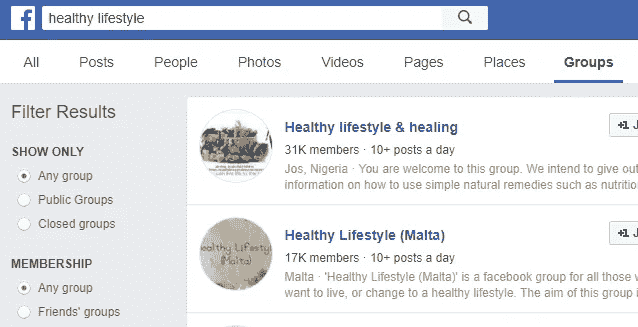

# 记住成功人士也有 24 小时

> 原文：<https://medium.com/swlh/remember-successful-people-have-24-hours-too-8c519fd4ba>

## 通过曝光最大化你的时间

Photo by [rawpixel.com](https://unsplash.com/photos/Hk89vWuWXfE?utm_source=unsplash&utm_medium=referral&utm_content=creditCopyText) on [Unsplash](https://unsplash.com/search/photos/time?utm_source=unsplash&utm_medium=referral&utm_content=creditCopyText)

前几天我在工作时，无意中听到了我的一个朋友正在听的格兰特·卡尔多内有声读物的一个片段。

卡尔多内说:

## "成功人士一天中拥有的时间和其他人一样多。"

你知道你反复听到一些事情，但并不是所有事情都对你有意义？

嗯，出于某种原因，这句话对我来说真的是*点击*。当我计算自己浪费了多少时间时，这实际上让我陷入了短暂的恐慌。我有些事情要弄清楚，然后很快*。*

*前几天我写了一篇[帖子](/@AleeshaLauray/do-these-5-things-to-become-uber-productive-34d0934c7a9b)关于我如何使用时间表来帮助我度过更有效率的一天。事实是，有时候，我所能做的就是陪陪我的孩子和一个中等职位。两个人都很棒，我可以成为像“耶，对我来说！”但这对我设想的目标来说还远远不够，所以我不会自我表扬。*

*我也不会开一个同情派对，然后认输，因为我真的想要我正在努力争取的东西。*

*如果有人带着两个孩子成功了，*我也可以。**

*如果别人在你的情况下成功了，你也能成功。*

*通常，我们已经有了问题的答案，但是我们没有利用它们。*

# *我一直在思考如何最大限度地利用我每天的时间，对我来说，更多的曝光将是关键。*

*哪里已经有观众了……一大票观众？*

## *#1 中等*

*这是我连续第 19 天在媒体上写作。准确地说，我有 1157 次浏览。我知道，我还没有进入大联盟，但是这个数字很重要。大多数观点来自于我向一家出版社提交的文章。*

*出版物就像媒体的杂志。*

*如果你有一篇文章符合某个特定出版物的主题，你可以提交你的文章，如果被批准，你就成为该出版物的作者。*

*我最近才开始提交我的文章，但是我建议你从头开始提交。这将使你能够利用出版物的大量读者，而如果你是新来的，自己做，这将需要时间来建立一个追随者。*

*我现在把我写的每一篇文章都提交给了一家出版社。*

***#脸书集团***

*我还没有开始分享我的中型职位，但我会在接下来的几周。我会把它们分享给脸书的团体。*

*有 1000 个脸书团体，拥有大量的追随者。可以分享博客、视频、图片等。*

*确保你的内容是有帮助的，并且与小组相关，因为虽然我还没有分享过帖子，但我是一些小组的成员，他们不喜欢垃圾邮件。*

**

*在搜索框中键入与你的领域相关的关键词，选择“群组”并分享出去。*

*去观众所在的地方。你会成长得更快，花费更少的时间和精力。*

***#3 联网***

**我能帮助谁，那也能帮助我吗？**

*寻找互利的网络机会。*

*这是我正在考虑的事情。*

*如果我卖健身器材，我可以和 YouTube 上的健身教练合作。我分享他们的日常锻炼，他们分享我的装备。*

*如果我卖素食食谱，我可以和一个素食美食家合作。我分享他们美味素食的照片，他们分享我的食谱。*

*在前面的例子中，如果你在以下方面有相对相似的#，可能效果最好。这个想法是你们两个通过对方的追随而同时成长。*

***互惠互利**。*

*考虑一下。*

> *成功和失败之间的巨大分界线可以用五个字来表达:“我没有时间。”*
> 
> *-富兰克林球场*

***我很想收到你的来信，***

**你有哪些获得更多曝光率的方法？**

*感谢您的阅读！❤*

*如果你喜欢这篇文章，请不要忘记鼓掌。*

*你想要我为你写作吗？*

*访问我 [**这里:**](http://www.aleeshalauray.com)*

*想看看我还在做什么吗？？*

*打招呼:*

*[**insta gram**](http://www.instagram.com/aleeshalauray)**|**[**Twitter**](https://twitter.com/aleeshalauray)**|**[**脸书**](https://www.facebook.com/AleeshaLauray/)**|**[**YouTube**](https://www.youtube.com/channel/UC-Pz9gmpYAH0sMExmiC628w?view_as=subscriber)*

**

## *这个故事发表在 [The Startup](https://medium.com/swlh) 上，这是 Medium 最大的创业刊物，拥有 295，232+人关注。*

## *在这里订阅接收[我们的头条新闻](http://growthsupply.com/the-startup-newsletter/)。*

**