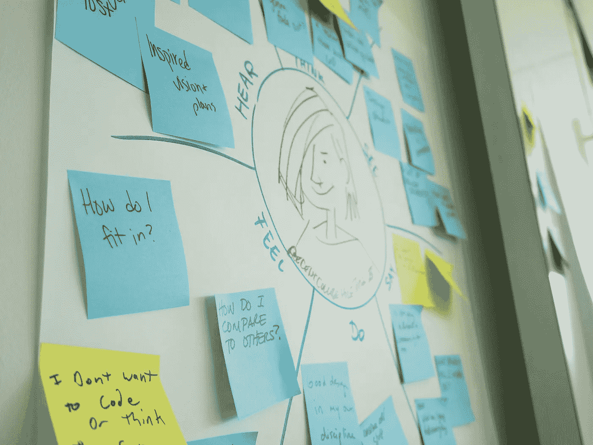

# 远程控制

> 原文：<https://medium.com/swlh/remote-control-e07c99a29b86>

## 分布式团队时代的领导力

> “我会尽力在一小时内给你答复。疯狂的互联网问题在这里。”

这是来自我的联合创始人和《T2》杂志主编迈尔斯的 ping。果然，我们的印刷季刊的[重新设计的最新版本得到了详细的回应。我一点也不知道他正蜷缩在墨西哥 Apatzingan 的一个会议外面——他的笔记本电脑和他的手机绑在一起，在那里，自卫民团的领导人正在讨论是否与政府达成协议。](/re-form/printworthy-7a4d672261a6)

Makeshift’s editor-in-chief collaborates synchronously on assignment.

这就是《临时凑合》的合作过程，这是一家媒体公司，在我们称之为*隐藏创造力的保护伞下报道经常危险的话题。我们是一个由分散在六个国家的 15 名志愿者和自由职业者组成的团队，加上遍布 80 多个国家的 350 名投稿人网络。从生产到营销再到团队庆祝，分布式工作是每天的现实。然而，在预算有限的情况下，我们推出了一款产品，每一期都让我更加自豪。现在我们正在取得胜利:上个季度，我们旗舰印刷杂志的发行量增加了两倍。本月晚些时候，我们将推出我们的 YouTube 频道。*

企业领导人对远程团队和协同团队的优势摇摆不定。最新的轰动是玛丽莎·梅耶尔将雅虎员工召回桑尼维尔。我仍然听到她 2013 年 2 月的“不在家工作备忘录”在高管圈子里闭门讨论。

事实是，在全球网络经济中，远程协作是一种现实，而且往往是一种优势，其后果比这种强硬措施让人相信的更加微妙。在权宜之计，我们承认远程协作的四个关键现实:

1.  **远程员工的工作效率更高，但创造力却更低**
2.  **团队在一起或分开时表现最好——但不要分裂**
3.  **软件是新的工作室**
4.  **会议依旧凌乱**

通过接受这些现实，临时团队已经成为远程协作的大师，在几个案例研究中有所体现。

## 现实第一

# 远程员工工作效率更高，但创造力更低

关于远程员工的一个误区是，他们坐在家里偷懒。对某些人来说，这可能是真的，但这些人就是在办公室玩 Snood 的人。对于任何有资格、有动力为你的使命做出贡献的团队成员来说，这是不正确的。事实上，斯坦福大学的一项研究表明，远程办公的员工效率更高。然而，作者警告说，“我们认为，工作越机器人化，好处就越大。”

在我之前在 T2 IBM 设计公司的工作中，我珍惜离开办公室的时间。我登记参加早会，然后我每天有数小时的时间去完成*的实际工作*。真是松了一口气！我的经理也留下了深刻的印象，我也赢得了快速周转的声誉。

问题是我错过了实时协作。面对面的头脑风暴、阅读肢体语言、与同事的意外冲突。创造性的火花并不总是在你决定与你的团队会面的一个小时内出现。这就是为什么，在我飞往奥斯汀工作室的日子里，我被临时会议和更新淹没了。在那些日子里，我觉得我没有完成任何“工作”,但吸收了大量新的输入。

Transparent meeting rooms yield accidental meetings. Credit: IBM

在临时搭建的网站上，我们在预算紧张的情况下从自由职业者和志愿者那里获得了非常高的产出，但我们有时会停滞不前。这就是我们平衡异步交流和同步集思广益会议的原因。所有计划好的会议都是通过视频会议进行的，而不是电话会议，而且每当我们觉得一个项目需要一些额外的动力时，我们会通过聊天来联系对方，进行视频通话。像 [Sqwiggle](https://www.sqwiggle.com) 这样的工具提供了您的团队成员全天的持久视图。尝试这些来建立一种文化，优先考虑同步性而不是孤立性。

在特殊场合，我们会召集整个团队。去年夏天，当我们发布重新设计的杂志时，我们举行了一次全员视频聊天，这本来是可以打破常规的。跨越 13 个小时的时区安排 15 个人并不容易，但这对于让每个人兴奋起来、团结起来、感觉像一个有凝聚力的团队是至关重要的。

Hollywood Squares, Makeshift Edition.

当足够多的团队成员发现自己在一个城市时，我们将举办一次异地活动。这通常意味着租一个 Airbnb，花一整天的时间去工作和做饭。结果是一股难以置信的新思想、实验和项目向前推进。

An editor, a publisher, and a salesperson walk into a room…

## 现实 2 号

# 团队在一起或分开时表现最好——但不要分裂

团队陷入的一个陷阱是让团队的大多数人共处一地，然后制造例外。一位创始工程师想搬到西雅图；一名营销人员有年幼的孩子，希望在家工作。这种核心和卫星模型看起来是一个不错的妥协，但它实际上是有毒的。

这样一个团队的大部分工作现在都发生在 meatspace。墙上贴满了便利贴和原型，产生关键决策的对话没有记录在案。数字文档或跟踪某人成为额外的开销，因此卫星雇员被排除在外。

在 IBM，每当我住进奥斯汀工作室，我都会绕着办公室跑几圈。这种例行公事意味着偶遇我很久没见的人，同样重要的是，瞥见新应用的模型或人物角色。几乎在任何一圈，我都会找到灵感或者合作的机会。然而，这基本上是我了解这些发展的唯一途径——在一家拥有近 50 万员工的全球公司中，在特定的时空点找到自己。

Hey, she might use my product too!

另一方面，一个完全虚拟的团队将文档构建到他们如何工作的结构中。举行会议？你可以确定一个谷歌文档正在运行，实时捕捉每个人的想法。准备好要审查的工件了吗？发布到我们的内部网 [Podio](http://podio.com) ，这样整个团队都可以看到并参与进来。我们做的每一件事和每一个决定都会被记录在案。

Capturing as we go…

Ready for feedback!

## 现实 3 号

# 软件是新的工作室

大多数团队在房地产上花费巨大的预算，遵循像[创造空间](http://www.amazon.com/Make-Space-Stage-Creative-Collaboration/dp/1118143728)这样的书的内部建筑咒语:开放式平面图、协作会议空间和个人或私人空间的混合。工作室设计现在是一种成熟的(尽管仍在发展中)实践，建筑师被付给大笔的钱来让你更加合作。

在 IBM，我对我们的旗舰奥斯汀工作室的创建做出了小小的贡献，随后在世界各地进行了复制和迭代。我看到建筑师和团队成员对最小的细节吹毛求疵。结果是一系列 IBM 从未见过的奇妙空间。

Looking through the floor plan in Austin. Credit: IBM

然而，当时可用于虚拟协作的工具少得可怜。这部分是神秘的 IT 政策和几乎不存在的预算造成的。但这不完全是 IBM 的错；根据牛津经济学的一项[研究，市场上的大多数协作工具还有很长的路要走——即使是视频聊天。对人们希望如何虚拟工作的思考和资源太少。](http://online.wsj.com/ad/article/globaltravel-face)

在临时公司，我们的投资是反向的。我们在房地产上不花一分钱，将预算用于试验和采用将推进我们实践的工具。这些工具是我们办公室的。

我们的大本营是 Podio，它是一个灵活适应我们工作方式的项目管理工具。不仅 Podio 的人深入思考了虚拟工作，而且该工具还要求我们的团队成员成为一种“虚拟工作空间设计师”，创建和迭代协作空间和工作流。它允许我们的团队拥有我们的空间，就像工作室中的团队通过重新安排桌子和在天花板上悬挂自行车来反叛一样。具体来说，Podio 为我们的团队带来了四大好处:

**透明—** 任何成员都可以看到整个组织的所有工作。文档是我们工作方式的一部分。

Status of all articles going into Issue 12 Laws & Orders — no reporting required.

**民主—** 任何团队成员都可以和其他人聊天。Podio 提出了一个基于优点而不是个性或地位的扁平等级体系。

An editor asks me a style question (left) and gives me work to do (right).

**责任—** 任何团队成员都可以将任务分配给其他人。Podio 允许我们将任务和评论直接与每件作品联系起来。

Tasking a team member to select winners for our recent shelfie competition.

**开放性—** 公共 API 意味着 Podio 可以很好地与 Google Docs、Dropbox 和许多其他第三方应用程序兼容。

Posting a Google Doc with an article’s copy to a Podio entity that also contains its photos, metadata, comments, and tasks.

有许多可用的工具，其他工具可能更适合您的需要。教训是在预算中为工具腾出空间，并创造一种文化来激励您的团队拥有他们的虚拟工作空间，试验新工具并改进他们的工作流程。

## 现实 4 号

# 会议仍然很混乱

虚拟合作者也不能幸免于任何办公室里常见的会议恐惧。有时虚拟会议更糟糕——通常是因为它们发生在电话会议上或者由一个人主导。当会议很少发生时，你倾向于把各种不同的讨论塞进一个小时，之后你不太确定发生了什么。

事实是，你的分散的团队成员实际上渴望人际关系，会议可以成为建立融洽和兴奋的机会。想象一下。

在 IBM Design 的出色指导下，临时组织直接采用了我帮助建立的面对面会议文化。我们合作的核心是由四种不同类型的会议组成的结构，以及您所处类型的明确性:

1.  **站立会议—** 这是非常简短的会议，旨在向您的团队介绍最新的状态和阻碍因素。他们通常每天或每周重复。不讨论工作内容。
2.  **工作会议—** 这是更长的会议，用于实际完成工作或集思广益。通常只有活跃的项目贡献者参加，尽管他们也可以包括客户和合作伙伴。
3.  **回放—** 这些是团队成员和利益相关者(有时包括客户或合作伙伴)对工作的回顾，交付的方式是将讨论中的交付内容与市场机会和期望的用户体验联系起来。
4.  **回顾—** 这些是对团队工作方式的回顾，通常在项目或里程碑回放结束时举行。团队反思他们喜欢什么，不喜欢什么，想法和问题。

如果你采用这种类型的结构，它将更好地利用每个人的时间，并鼓励工作和工作流程的持续改进。它们不需要预先计划；任何这些会议都可以通过 ping 命令临时开始。

A space at IBM designed specifically for playbacks — attendees look at the work, not each other. These are really easy to do over video chat with screen share.

A Makeshift retrospective held remotely. Let it all out in the open!

记得享受合作的乐趣。当团队距离较远时，你就有失去游戏感的风险。在你所有的虚拟空间中为个人聊天、玩笑和不敬的更新腾出空间。你的团队会欣赏它，他们的想法会因此变得更好。

*感谢* [*临时团队*](http://mkshft.org/about) *致力于我们的工作方式，并不断挑战自我以提高。感谢 Phil Gilbert、Charlie Hill、Adam Cutler 和 Ari Font 对 IBM Design 实验的经验和信任。*

发表于*[**【SWLH】**](https://medium.com/swlh)**(***创业、流浪、生活黑客)**

******