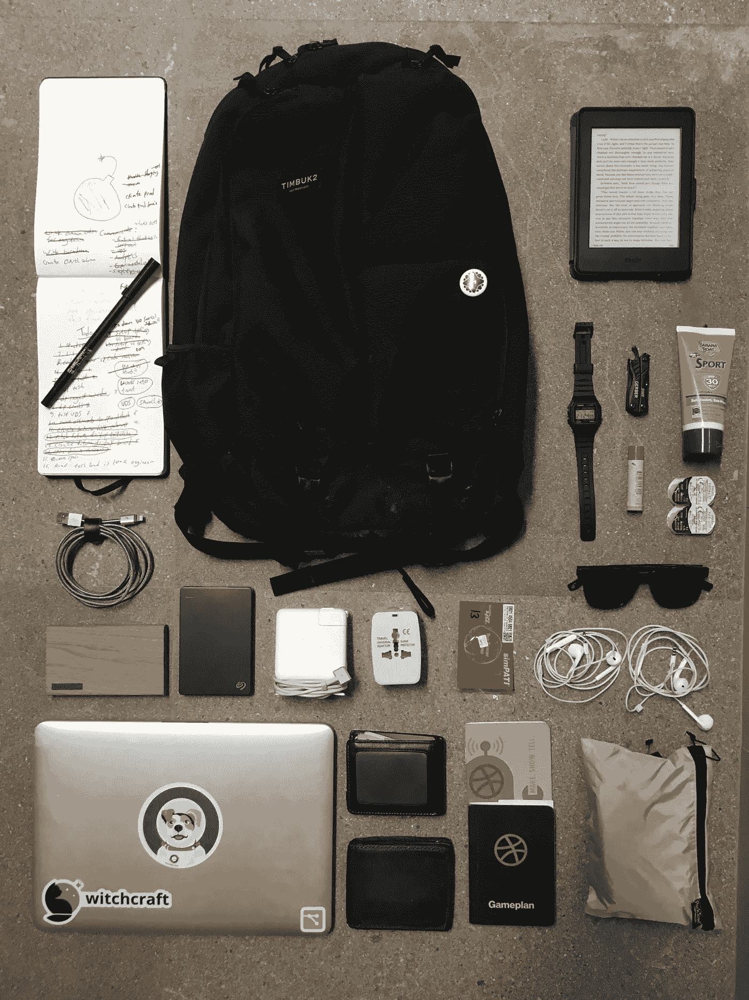
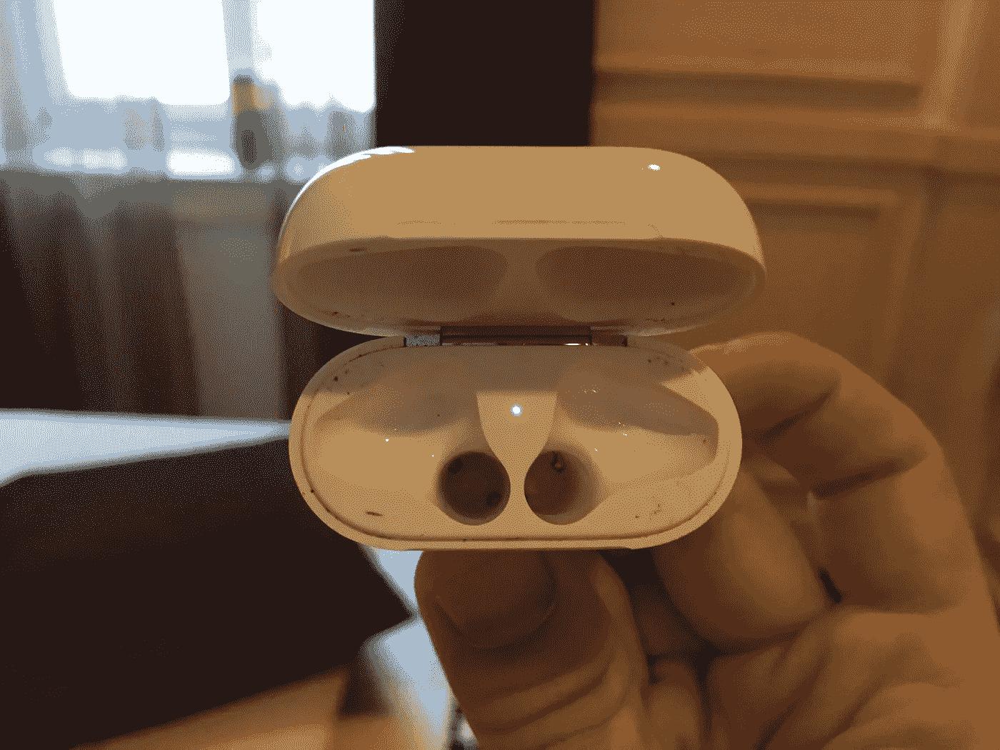

# 远程工程师:我的包里有什么

> 原文：<https://medium.com/swlh/remote-engineer-whats-in-my-bag-d3532fb1fdce>

“Just about…. there…” 📐

没有人会隐瞒这个观点:**我是远程工作的超级粉丝！**我坚信[工作场所更加分散的趋势别无选择，只能继续](https://news.ycombinator.com/item?id=16945229)。然而，我还没有天真到说远程工作是完美的，它给你的工作日增加了一系列新的复杂问题，你需要准备好处理这些问题。

> 远程工作给你的工作日增加了一系列新的复杂因素，你需要做好应对的准备🎒

无论是在你的家乡还是在世界的另一个地方，当你在旅途中时，都面临着以下挑战:

1.  保持联系。
2.  按时按部就班。
3.  保持干净和舒适。

这就是为什么我想分享我通常放在包里的东西。它应该有助于防止你像我一样艰难地学习。

# 注意力的中心

第一:我几乎每天都用的物品，重量级的。

## 那个包

一篇名为“我包里有什么”的文章有一个关于包本身的简介，这并不奇怪，所以让我们先把这个弄清楚。

当你在偏远的地方时，你会到处走动:在不同的地方，在不同的咖啡馆，在不同的交通中，更多的时候是从一些无线网络很差的地方到无线网络稍微差一点的地方。因此，重要的是你有一个包包:

1.  持久耐用
2.  舒适的
3.  有易于取用的口袋
4.  尺寸和重量小
5.  但是仍然有空间放你所有的东西和你在 A 点和 Z 点之间捡到的任何东西

为此我去了[廷巴克 2 的摊牌](https://amzn.to/2HNuPXA)。超级满意这个包，没什么好说的，它符合要求。

## 笔记本电脑

我有一台[macbook pro 13(2015 年初](https://amzn.to/2rkcwhE))，我仍然爱着❤️.

我从来没有掩饰过我对 bash 终端和正常工作的生态系统的热爱，也没有掩饰过我对 Macbook Pro 最新系列的厌恶(那个 32GB 的苹果在哪里？).考虑到这一点，我相信 2015 年初可能是有史以来最伟大的笔记本电脑之一，并且我不是唯一有这种感觉的人。除了技术规格之外，它在旅行时尤其耀眼，因为 mag-safe 适配器意味着:

*   如果有人在咖啡店里被我的绳子绊倒，我是安全的。
*   有人通常会有一个充电器，我可以在必要时借用。
*   它内置了线缆管理系统，使打包变得更加容易。

趁你还能抓住一个。

## 笔和纸

试图让团队开心，让项目走上正轨，让代码走出门外，这感觉就像是一场杂耍。然后你再加上远程工作的后勤工作，这就变成了一个马戏团。这就是为什么[我写列表，很多列表](/startup-frontier/why-i-make-lists-for-everything-24bfa36a01e1)。

用一支钢笔和一张老式的纸简单地写下我一天的清单，划掉项目，然后重新安排明天要做的事情，这是让你专注于手头任务的好方法。清单也可以作为你工作日的伟大书籍结尾；允许你把工作和娱乐分开。

> 清单也可以作为你工作日的伟大书籍结尾；允许你把工作和娱乐分开。🏖

人们经常试图将这些保存在各种待办应用中；不管出于什么原因，我都无法养成这个习惯，至少在屏幕前是这样。为此，我通常会用一支旧的时尚笔和纸来记录我的生活。这很好，因为这是我不用付钱的东西。

我也非常相信对你经常使用的工具进行投资，这就是为什么我的[笔记本](https://amzn.to/2rkcwhE)和[笔](https://amzn.to/2JRtJX8)比你在一元店买到的稍微贵一点。我发现它使我的写作与我的思想一起工作，而不是反对它，而是各得其所！

## 那些书

很简单:大量阅读很棒！拖着沉重的脚步去阅读，不太好！在你出发去任何地方之前，帮你自己一个忙，拿一个 [Kindle](https://amzn.to/2FH5ys6) ，它会改变你的通勤，不管它有多长。

特别感谢 Michelle 给了我这么棒的礼物！

# 电子版的

这些是我一直带在身边的东西，唯一的目的是保持充电，保持联系，并做好准备，以防意外发生。

## 旅行适配器

Credit to [xkcd](https://xkcd.com/927/)

每个国家都是独一无二的，不幸的是他们的电源适配器也是如此。这里的诀窍是在最小的尺寸里装一个能处理最多数量的插座。我用[这个](https://amzn.to/2rjo7gY)，到目前为止都很开心(虽然地面…实际上并不像它那样工作。

## 电池组

当你遥控时，你经常被拴在你的手机上，当你不拴在手机上时，你在导航，当你不在导航时，你要么在打电话，拼命地翻译，拍照，要么查看你的航班确认。所有这些都在消耗电池，否则，你最不需要的就是一个没电的电池，让你的下一次会议或去酒店变得复杂。相信我，随身携带一个[电池组](https://amzn.to/2w9N4Rr)可以避免这种头痛。

## 外部固态硬盘

一个好的固态硬盘有助于 3 种类型的事件:

1.  长途飞行和乘坐公共汽车的娱乐。*(电影)*
2.  笔记本电脑损坏或被盗。*(备份)*
3.  空间不足。*(生活)*

路上随身带一个。我用的是 1TB 希捷超薄固态硬盘，这里也没有抱怨，相当标准。

## 重型电话电缆

我提到过你应该投资在你经常使用的物品上，我也提到过你会花很多时间给手机充电！将两者放在一起，你就得到一根[高质量电话线](https://amzn.to/2FHFzRc)。

# 基本要素

这些会帮助你处理生活抛给你的事情。

## 快速干燥的毛巾

潮湿的自行车座椅、健身房淋浴、炎热的天气、一般天气和意想不到的长时间中途停留。手边放一条毛巾是个好建议，但是用传统的布料很难做到。拿起一条[轻便快干的旅行毛巾](https://amzn.to/2rjHJlH)。

## 廉价手表

> 不管现在是什么时间，只要你需要开始工作，就把手表设置在上午 9 点。⌚️

这是我在不同时区工作时最喜欢的技巧！通常你需要和你的团队有重叠，不管这是否意味着在当地时间凌晨 4 点起床。不管现在是什么时间，只要你需要开始工作，就把手表设置在上午 9 点。它会让你免去醒来时看到 300 这个数字的痛苦，让你的大脑进入你需要的时间表。额外提示保持防水和廉价，以保护自己免受海浪或小偷的袭击。我用的卡西欧非常适合这个。

## 太阳镜

咄！🕶

## 袖珍工具

为你的包拿一个小的多功能工具，它的大小和解决问题的比例对你有利。我有 Gerber 一角硬币，但我过去也用过 Leatherman 的果汁，而且很开心！

## 防晒霜、唇膏和隐形眼镜

如果你不舒服，你就不能做好工作，旅行也是不舒服的。

# 以防万一

## 额外的 SIM 卡

我有提到拴绳吗？在大多数国家，数据很便宜，但如果你一直在共享，有时上限会很低。手边多放一个 sim 卡以防万一。**但是要警惕 sim 卡商家，他们会尝试给你降级的版本，当你要求 4G 时给你 3G，当你要求 3G 时给你 1GB。**

## 备用耳机

我很容易失去东西，旅行增加了我这样做的机会。我尽量多带一套，因为在嘈杂的咖啡店里，没有耳机就不可能开会。

## 额外的笔记本

如果我忘记了我的主笔记本或者它没有空间了，这是个好主意。

## 额外钱包

好了，这才是真正的秘密！我有幸在第一世界国家长大；如果你正在读这篇文章，你也有一个很好的机会。然而，除此之外，你更有可能遇到想敲诈你的人，抢劫，贿赂或其他。

> 在手边准备一个额外的钱包，放一些零用现金、一张空的预付信用卡和一张驾照💸

因此，我经常会在手边放一个额外的钱包，里面有一些零用现金、一张空的预付信用卡和一张驾照。如果我陷入困境，我通常可以利用这一点来摆脱失去一切，有人想敲我竹杠。**这通常对大多数长期住宿都有好处。**

# 就是这样！

如果我有什么临别赠言，那就是:

> 像我一样打包，但不要像我一样，因为我，嗯，他失去了东西。

Why did I think it was a good idea to pay more to have my headphones broken into smaller pieces…

> ❤️如果你喜欢你所读的[在推特上关注我](https://twitter.com/bnchrch)
> 
> 🐙如果你对开发感兴趣[请在 Github 上关注我](https://github.com/bechurch)

## 这篇文章发表在 [The Startup](https://medium.com/swlh) 上，这是 Medium 最大的创业刊物，有 321，672+人关注。

## 在这里订阅接收[我们的头条新闻](http://growthsupply.com/the-startup-newsletter/)。

