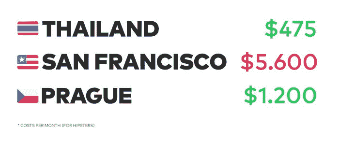
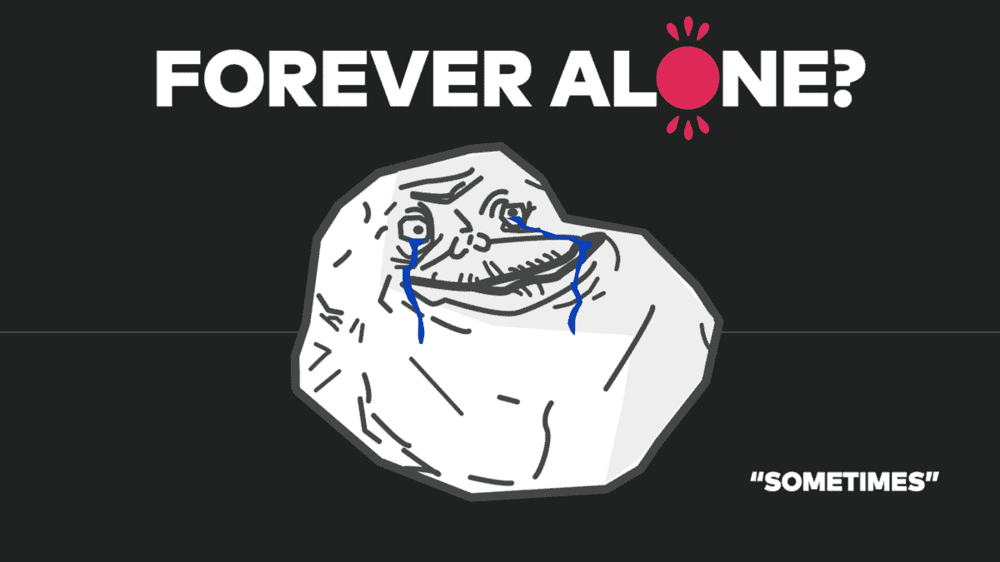

# 远程工作是未来！

> 原文：<https://medium.com/swlh/remote-work-is-the-future-bc0712f47a90>

## 他们没告诉你的远程工作。

远程工作仍然是一种相对较新的方式，但据报道，到 2020 年，几乎 50%的科技公司将有超过 30%的员工远程工作，这听起来很疯狂，也很棒。员工和公司都将从这一趋势中获得巨大的利益。 [**不喜欢看书？听这篇文章的音频版本。**](https://soundcloud.com/lubo-volkov/remote-work-is-the-future-1)

# 1)选择地点的自由

去偏远地区让人们有机会选择他们喜欢的任何地点。我是说任何地方。只要有合适的互联网连接，你可以在任何地方工作，甚至可以在南极工作(如果有星巴克的话)。在搬到下一个地方之前，请记住以下因素。

*   **互联网质量**
*   **服务质量**
*   **犯罪行为**
*   **天气**
*   **成本**

对于所有这些事情，我强烈建议你访问[流浪者列表](https://nomadlist.com/)，在那里你可以找到你下一次冒险所需的所有信息！那里的所有信息都是经过策划的，直接来自世界各地的数字游民。

# 2)成本

但是最大的好处是什么呢？能够裸体工作？不要！而是你可以选择住在生活成本更好的地方。从一个国家拿工资，在另一个国家花，是一个巨大的福利。想象一下，有一份旧金山的薪水(甚至更低)，却不需要支付旧金山湾区高昂的房租。你可以根据自己的喜好选择任何你喜欢的地点，这样可以节省很多钱。多少钱？下面我们来看看这个小例子。

如果你能够远程工作，实际上你会有更多的钱，因为你的费用要低得多。

想想财务稳定会给你和你的家庭带来的好处。你不再需要只搜索当地的工作。放聪明点。

# 3)你觉得孤独吗？

请记住，远程工作不同于在办公室工作。你身边根本没有人。你不能去和咖啡机旁边的人聊天。要成为一名远程工作者，你需要有正确的心态(或者你需要培养这种心态)，有时你可能会感到孤独。但是总是有通过 meetups、Skype、Slack 等与人和队友联系的选项。

> 在一天结束的时候，你需要成为一个真正强大的人来处理所有这些事情。远程工作并不适合所有人。

# 4)团队沟通

请记住，远程团队可以像您熟悉的任何其他团队一样工作，甚至在他们的过程中使用类似的工具。我在 [Toptal](http://www.toptal.com/) 工作，我看到这家公司从 7 名员工发展到 100 多名员工，却没有一间办公室。整个公司都是远程的，包括工程团队、设计团队、销售团队、成长团队等等。我们的联合创始人之一 Breanden 自从创办公司以来，一直在[马不停蹄地旅行。你可能会认为这很疯狂，真的没有其他大公司会这样做。](http://fourhourworkweek.com/2014/10/04/how-to-travel-to-20-countries-and-build-a-massive-business-in-the-process/)

我们如何做到这一点？

**日常交流和会议** *— Slack 和 Skype*

**每周演示** — *GoToMeeting*

**任务管理**——*特雷罗、吉拉和 Freshdesk*

**团队管理** — *自定义工具*

**设计合作**——*视觉、特雷罗、合作拍摄*

有了所有这些工具和适当的时间安排，你可以远程管理整个公司。此外，请记住，如果你有会议，保持快速和中肯，让每个人都可以回到自己的工作。会议是有毒的。

# 5)设计与远程工作

我已经远程工作了将近 5 年，现在领导着 Toptal 的设计团队。在我的职业生涯中，我发现了一些有趣的事情。

远程交付优秀的产品(设计方面)变得更加困难。

交付 98%正确的东西很容易，但是解决 2%的微小差异可能很困难。为什么？有些事情很难在网上交流。基于与在房间里的开发人员和在线的开发人员的交互的迭代是有区别的。相信我会有的！:)你不能简单地告诉他们把某个按钮上移 3 个像素。

它消耗更多的能量。

你需要比常规工作更远程地通知和激励人们。你基本上需要分享你的很多内在能量，并把它给其他人。

你需要更多的视觉效果。

当你向你的团队或开发人员提交反馈时，不管是什么，你都需要确保所有的东西都被恰当地描述了，并且有很好的视觉效果。

# 6)那么如何远程构建更好的产品呢？

事实上，我们已经找到了最有效的方法:完全远程地开发产品，然后在一段时间后一起旅行到一个地方进行头脑风暴，润色每个小细节，充电，激励团队，然后每个人都可以再次转移到不同的位置。理想情况下，你应该每 3/4 个月做一次才会有效，你们在一起的时间不应该超过 2 周，否则你会失去动力。

关键在于时机。您应该根据产品状态来管理这些会议。

# 7)远程工作的未来

还有一件事我很好奇。由于越来越多的公司将开始适应远程工作(由于成本、缺乏本地有才能的员工和其他好处)，我很好奇这将对经济产生多大影响。越来越多的人将在一个州挣钱，然后在另一个国家花光，这可能会影响经济，因为这样做的人越来越多。

你怎么想呢?你是一个愿意远程努力的设计或开发明星吗？来加入我们吧！我们一直在 Toptal 寻找惊人的人才。你可以在这里阅读更多关于总筛选流程的信息和[申请在这里](http://www.toptal.com/developers)。

> Lubo 是一位环游世界的设计师。他还领导着 Toptal 的设计团队。不断地谈论设计。

I was giving this talk on Behance Portfolio Review at Prague.

# [推特](https://twitter.com/0therPlanet)， [Instagram](https://instagram.com/lubosvolkov/) ， [Dribbble](https://dribbble.com/OtherPlanet) ， [Faceboo](http://www.facebook.com/luba.volkov) k

不要害怕问任何问题！谢谢大家:)

*发表于* **创业、旅游癖和生活黑客**

-