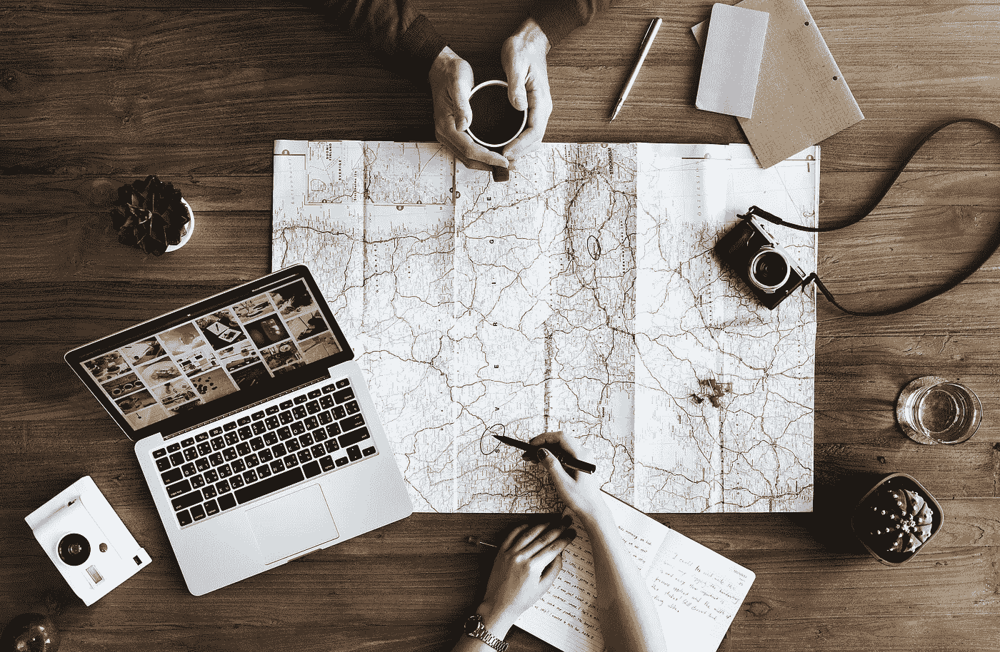

# 如果你想在 2019 年取得成功，请从你的生活中去除这 6 个有害习惯

> 原文：<https://medium.com/swlh/remove-these-6-toxic-habits-from-your-life-if-you-want-to-succeed-in-2019-6a9123dd72db>

坏习惯会在你不知不觉中悄悄降临到你身上。开始可能是无害的事情，滚雪球般变成更大的问题。

我们是习惯的动物。我们寻求常规来赋予我们的生活意义和目的。

问题是，很多这样的惯例和习惯是有害的。