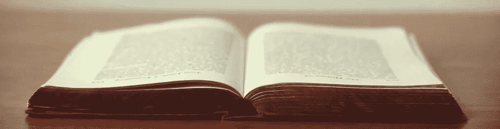
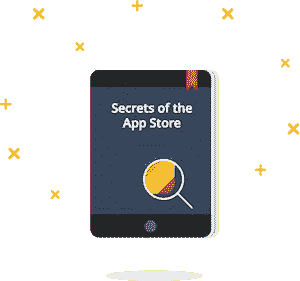
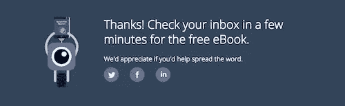
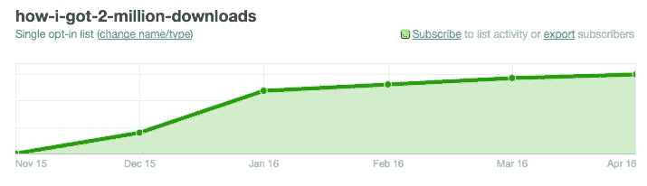

# 重新利用我们成功的内容为我们带来了成千上万的电子书下载

> 原文：<https://medium.com/swlh/repurposing-our-successful-content-got-us-thousands-of-ebook-downloads-27e740bcc372>



你时不时会写一些让你大吃一惊的东西。内容引人注目，标题吸引眼球，一切都井井有条。

你可以坐下来拍拍自己的背。干得好团队你！

但是，在它初次运行之后，你如何处理那些成功的内容呢？

我们想知道是否有一种方法可以将这些精彩的内容重新打包。人们会在书的形式中更彻底地消费它吗？作为奖励，我们认为它可能有助于建立我们的电子邮件列表。

将成功的内容改编成一本书比从头开始风险要小得多。你已经证明了内容是有趣的。把博客帖子当成你的 MVP。

在 Appbot，这正是我们所尝试的。首先，我们把我最成功的内容打包成一本书。内容如下的帖子:

*   应用商店描述
*   截屏
*   排行榜
*   更多

后来，我们发布了我的 230 万下载故事和一堆克莱尔的令人敬畏的定价内容。



要把这些精彩的内容写成一本书，需要几个步骤。以下是对我们有用的方法。

# 让它像一本书一样工作

当把一堆不同的内容汇集成一本书时，需要一点点的修改。不同时间写的内容不会自动流动。

寻找合乎逻辑的书籍章节来划分。考虑写介绍和段落，使文章流畅。

# 格式化

我们走了一条捷径，决定只做 PDF。

我们怀着最美好的愿望出发。我们按照“[创建带有页面](https://support.apple.com/en-au/HT202066)的 ePub 文件”开始。但是当我们导出时，格式爆炸了，最终放弃了这个想法。

如果你有任何关于为不同的书籍格式写电子书的好建议，我很乐意听听。

# 选择标题

为一本书选择一个好的标题就像选择一个好的博客标题一样。我的建议是:

*   瞄准你的观众
*   想想，你会点击它吗？
*   想出至少 10 个选项
*   A/B 测试——把登陆页面放上去，测试哪个标题点击率最高

# 获得反馈

有了[应用商店的秘密](https://appbot.co/books/secrets_of_the_app_store)，我们决定将它发送给几个有影响力的人。我们问他们是否想得到一个独家的第一次阅读(多荣幸啊，对吧？).

幸运的是，许多优秀的人接受了我们的提议。有些人甚至发来了一些很棒的反馈和引用供网站使用。

人们都很忙，如果你要做这件事，请确保提前几周做好。

# 登录页面

幸运的是，想出一个登录页面来收集电子邮件地址非常容易。

[这里有一个我们使用的例子](https://appbot.co/books/secrets_of_the_app_store)。

一个令人惊叹的电子书下载页面的关键部分是:

*   推销好处
*   展示社交证明(书籍下载次数、引用次数等)
*   行动号召(发送图书的电子邮件地址)
*   传记来证明你知道你的东西
*   一张你的照片给它一种个人的感觉。如果你不是最好看的，我建议你在照片中放一只玩具猴子或考卡来分散观众的注意力。

# 收集电子邮件并发送链接

幸运的是，我有一个很棒的联合创始人，他了解电子邮件。

我们使用了 Campaign Monitor，它给你一个漂亮的小表格，放在你的网站上收集电子邮件。一旦电子邮件被接受，您可以轻松地重定向回您的网站。

克莱尔在竞选监视器上设置了一个[自动化功能，一旦他们注册了这个名单，它就会发出电子邮件。](https://www.campaignmonitor.com/features/email-automation/)

# 鼓励分享

一旦用户输入电子邮件，这是一个让他们分享到他们的社交网络的好时机。谁不想分享大量免费内容呢？



# 分发书籍

对于 CDN，我们使用 Amazon Cloudfront，因为我们已经将它用于其他 Appbot 资产。然后你可以很容易地在电子邮件里放一个下载链接，无论他们在世界的哪个角落，下载速度都会快得惊人。或者不是，如果你的 CDN 很烂。

这里的一个巧妙之处是确保设置了 Content-Disposition 头，这样它就可以很好地下载，而不仅仅是在浏览器中打开。

```
Content-Disposition: attachment; filename=book.pdf;
```

我建议每个人都仔细阅读 [rfc2616](https://www.w3.org/Protocols/rfc2616/rfc2616-sec19.html) 。

我开玩笑的，真希望你没点那个。

# 推广电子书

所以你写了这本书，你有一个令人惊讶的纽约时报畅销书的标题，你准备好向世界释放它。

以下是我们如何推广我们产品的清单。

*   通过电子邮件发送您的邮件列表
*   在你的社交网络上分享
*   发布到产品搜索
*   运行一些脸书和/或推特广告
*   从您使用的原始内容添加一个链接
*   将其添加到您的博客，加入您的邮件列表
*   把它寄给你认识的可能感兴趣的朋友和同事
*   与你目标领域的有影响力的人分享

# 我们的结果

我们对这些书到目前为止的进展非常满意。所有的书都达到了几千的下载量。

*   [我是如何获得 230 万次下载的](https://appbot.co/books/how_i_got_2_million_downloads)
*   [应用商店的秘密](https://appbot.co/books/secrets_of_the_app_store)
*   [定价正确:应用定价手册](https://appbot.co/books/priced_right_the_app_pricing_playbook)



这些书每个月仍有数百次下载，为我们带来商机，我们还会收到读者发来的友好电子邮件。

# 为什么有效

人人都爱免费的东西。我们都已经习惯了网上令人敬畏的免费内容，有这么多这要感谢伟大的博客和服务，如媒体。但是书仍然是人们看重的东西，即使是电子书。所以免费得到一本书感觉像是一个我们无法拒绝的提议。

这篇文章最初出现在 Appbot 博客上。

喜欢这篇文章？如果[能从我们的免费书籍中拿一本](https://appbot.co/books)并推荐给我们，我们将不胜感激。

[Appbot](https://appbot.co) 消除了管理你的应用评论的痛苦，并展示你的客户所说的给你有价值的见解。