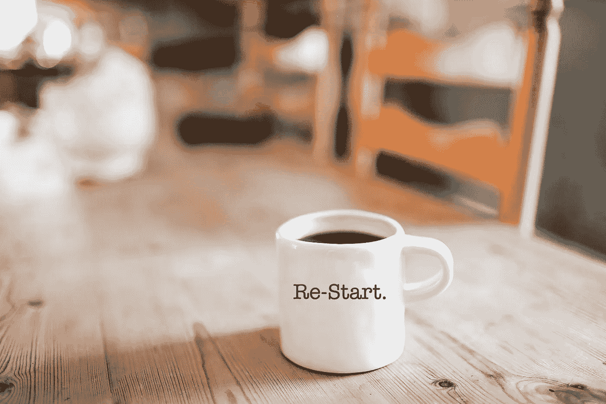

# 像启动一样重启

> 原文：<https://medium.com/swlh/restart-like-a-startup-e68090e6c51b>

Established businesses being forced to restart if they want to survive beyond 2018.

## 如果你是一家成立了 5 年或更长时间的公司，已经准备好了系统，并且正在考虑如何进入下一个阶段——也许你需要像创业公司一样重新开始…

如果你想要增长，这里有一些事情需要重新考虑。

# 前 5 年

“不惜一切代价”。任何工作。任何时间。任何方向。

创业的喜悦被漂亮地包裹在一条丝带里，上面写着“创业的喜悦”。它是新的。激动人心。你正在探索的道路上。寻找有效的方法。每天都在冒险和勇敢。

和你一起工作的任何人都可以沉浸在这种兴奋中。这意味着“全体人员集合”。当人们感到自己是创造的一部分时，他们愿意做任何事情来让事情发生。

创业心态中的一个心理触发因素是，知道你在创业之初就在那里，并且你帮助实现了创业。

第一个 5 年和接下来的 5 年可能会有很大的不同。在第 6 年雇用某人，他们想做的只是他们的工作。当创业文化被遗忘时，已经建立的企业就有了不同的能量。

随着时间的推移，你已经获得的成功会慢慢转化为保持你所拥有的——而不是离开地面。安全和风险是第六年不同的话题。但不一定非要这样。

# 动作和牵引力

开始某事的能量和行动最终会导致获得一些牵引力。车轮不会永远旋转。橡胶会在某个点卡住，这样你就可以移动了。

当你开始获得牵引力时，你的倾向是沿着能让你成功的道路前进。理所当然……也许吧？

如果成功是你的市场告诉你“这是我们想要走的方向”，而它与你开始的原因不一致——你需要做出决定。

对一些人来说，快乐被吸走了，因为早期的小成功决定了方向。就像毒品一样，成功会让人上瘾，会让人盲目追随。但这并不是你开始要建造的。

咨询的时候经常看到这种情况。把话题集中在赚钱上的企业将永远举步维艰。但最糟糕的是，他们将在两条战线上挣扎。第一，他们会在实际盈利能力上挣扎。第二，他们会挣扎于你只能从给人们的生活增加价值中得到的快乐。

以帮助他人为中心的目的是真正的快乐来源。

如果失去了快乐——一切都失去了。你不想最终为自己创造一份你希望没有的工作。你的工作应该会激励你。它应该包含你开始的原因。

方向可能会改变。但是如果感觉改变了，要小心。

如果你创建了一家公司，并保留了体现创业精神的创业文化，你就可以继续创新。摇动你自己的船。重塑你自己，不要停滞不前，因为一个方向的成功会指引你。

现在可以说，在市场上取得成功是你着手去做的事情。这是在帮助人们。只有当它在你开始的原因上打勾时才是真的。你正在做出你想要的改变吗(目的驱动)还是你已经背叛并走上了赚钱的道路(利润驱动)？这是有区别的。

# 在家里

一旦成立，企业通常会从招聘人才转向招聘替代者。他们不再找人来创造新的。他们开始寻找替代现有的人。无论是员工的自然更替，还是有人可以勾掉你已经取得的成功所创造的不断扩大的待办事项清单——如果你不不断更新、挑战、测试和失败——你就会失去你开始创造的东西。

兴奋、风险、成长的乐趣——与维持已建立的东西相对比，是人们抛售的原因，失去了他们的魔力，看到改变游戏规则的产品和服务成为另一个平凡的赚钱者。环顾四周。随处可见。戴尔电脑对苹果。网飞对百视达。泰斯拉对所有人！

你可以随心所欲地获利，但不要失去让你起床的那种急躁的冷静。在构建新的时，不要失去您为客户创造的惊喜因素。因为“惊人”才是导致盈利的原因。但对你来说，这是通往纯粹快乐的道路！

对于系统来说，有一种隐含的心理暗示，即只有做你一直在做的事情，才能达到你现在的位置。除此之外的任何事情都会激发风险感。这种风险导致人们退缩并遵从系统。一旦被创造出来，挑战你自己系统的勇气需要勇气。真正的勇气。你在强迫自己重新创造。从零开始创造，即使你有机器的轮子在转动。

在第六年，遵循系统会更容易。按照手册上说的做。对抗系统并把它做得更好的“鸡蛋对着脸”的现实在成熟企业中比在初创企业中带来更多的恐惧。但正是这种主动性刺激了人们。不仅仅是员工，还有顾客。

# 你会泄露你的秘密吗？

在我看来，特斯拉是我们在上个世纪见过的最具创新性的初创公司，如果不是永远的话。

你能说出有多少企业的创始人将他的全部个人财富投入到一个彻底改变汽车制造业的想法中，然后将这些计划免费提供给全世界使用？

当你如此相信用你所增加的价值来改变人们生活的想法时，你会愿意放弃“11 种秘密草药和香料”吗？

2014 年 6 月 12 日，创始人兼首席执行官埃隆·马斯克发布了一份名为[“我们所有的专利都属于你”](https://www.tesla.com/en_AU/blog/all-our-patent-are-belong-you)的声明

“特斯拉汽车公司的创立是为了加速可持续交通的到来。如果我们为制造引人注目的电动汽车扫清了道路，但随后却埋下知识产权的地雷来阻止他人，我们的行为就与这一目标背道而驰。特斯拉不会对任何真诚希望使用我们技术的人提起专利诉讼。”

特斯拉制定了免费开源电动汽车的计划。现在，汽车制造业已经发生了变化，几年内我们将看到全电动汽车主宰我们的道路。变化将席卷而来。早在 20 世纪初，随着亨利·福特 T 型车的发明和大规模生产，马车仅用了 4 年时间就从主流交通工具中完全消失了。

就像精酿啤酒突然出现一样，也许我们会在未来几年看到精酿电动汽车。生产零部件的企业，这样小企业就可以创造自己的汽车品牌。我们在所有其他领域都看到了这种指数增长。

这对你的企业的未来意味着什么，你怎样才能像创业公司一样重新开始？嗯，你下次团队会议的题目是什么？

# 开源打开了全球帮助的大门吗？

在软件开发中，开源是一个常见的术语。它是许多最大的在线平台的背后。现在，我们在世界上最大、最成熟的制造业背后看到了它。

无论你的行业有多成熟，你都可以像创业公司一样重新开始。

这可能并不意味着开源和放弃你所有的计划。也许是的。

开源吸引全球思维。人们都想有所贡献。能给人们的生活增加价值的惊人想法会吸引人才。但是你必须开始。没有人会为你启动它。告诉人们这件事不一定要完美。差不多就是这个意思。

像创业公司一样重新开始就是将年轻的能量注入到你已经建立的企业中。带着一些“未知”，让你的文化重新焕发生机。通过创造一些你认为会帮助人们的东西来增加一些风险、恐惧和兴奋。

你不需要等待市场调查。所有伟大的商业故事都是由创始人创造的，他们知道市场需要什么，甚至在他们准备付钱之前就知道了。是的，这可能意味着你提前了，市场还没有准备好。但是去告诉埃隆·马斯克，看看他会对你说什么！

不要因为太成功而停下来。重启。

## 这篇文章发表在[《创业](https://medium.com/swlh)》上，这是 Medium 最大的创业刊物，有 281，454+人关注。

## 订阅接收[我们的头条新闻](http://growthsupply.com/the-startup-newsletter/)。

