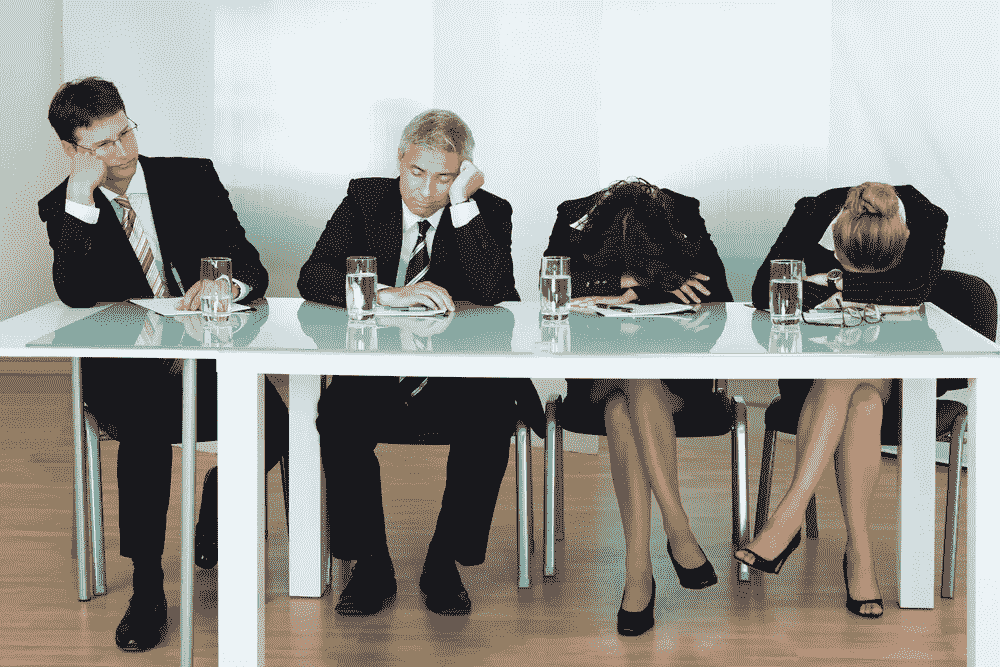

# 结果出来了。会议的效果如何？

> 原文：<https://medium.com/swlh/results-are-in-how-effective-are-meetings-b95af4a0ca10>

呃。会议。

这些考验耐心、耗费时间的习惯从工作之初就已经存在，现在依然存在。

但是它们有效吗？我们决定让我们的用户来找出答案。

我们对 700 多名 JotFormers 进行了调查，以了解哪些行业和工作职能在会议上花费的时间最多，他们认为他们的会议有多有效，以及有多少比例的会议是面对面进行的。

结果有点令人惊讶。

总的来说，会议被 JotForm 用户视为对时间的有效利用(*是令我惊讶的部分)。*

*从 1 到 5，1 表示“无效”，5 表示“非常有效”，只有 **16.6** 的 JotForm 用户选择了 1 或 2。这意味着，或多或少，大约 83%的 JotForm 用户认为他们的组织会议非常有用。*

*但从行业类型和公司内部角色的角度来看，这种差异非常显著。*

*我们将滑动标尺上的平均数视为一个小组的**会议有效性得分。***

# *哪些行业觉得会议最有用，最没用？*

*在政府部门工作的 JotForm 用户最喜欢会议。平均来说，他们给会议的有效性打了 4.38 分(满分 5 分)。奇怪的是，我们的政府雇员受访者亲自主持会议的比例也最高——88%。其余的受访者约 62%的时间是面对面的，其余时间是视频和电话会议。*

*以下是会议效率得分最高的五个行业:*

*   *政府:4.38*
*   *艺术和娱乐:4.17*
*   *设计:4.05*
*   *软件:4*
*   *出版:4*

*另一方面，游戏行业认为会议是最大的时间浪费，平均效率得分为 2。*

*   *游戏:2*
*   *金融:2.88*
*   *视频和摄影:2.75*
*   *工程:3*
*   *食品和饮料:3*

*很难从这些分数中得出结论，尽管你可以证明会议有效性分数高的行业更适合于更大范围的头脑风暴式的会议(我想政府是个例外)。*

# *哪些工作角色最有可能重视会议？*

*调查受访者通过四大工作职能来确定自己:助理、经理、主管和所有者/创始人。以下是他们的会议有效性得分:*

*   *关联:3.41*
*   *导演:3.59*
*   *经理:3.64*
*   *所有者:3.66*

*你在公司爬得越高，就越有可能重视会议，这令人惊讶吗？经理和所有者比助理级员工更有可能主持会议，所以这是有道理的。*

# *哪些行业开会时间最长？*

*总的来说，37%的 JotForm 用户每周至少花三个小时开会。你们中有 18%的人花了 5 个小时或更多的时间开会。这是无法回避的——时间太多了。*

*如果你从事广告、营销和公关行业，那么恭喜你！你们中有更多的人表示，你们每周花在会议上的时间超过了其他任何行业。鉴于这个行业由拥有大量客户的机构组成，这并不奇怪。然而，从百分比来看，其他五个行业实际上更有可能每周花五个小时以上开会。*

*以下是回答每周开会时间超过 5 小时的百分比最高的行业列表:*

*   *软件:46%*
*   *房地产:31%*
*   *租金:29%*
*   *信息技术:26%*
*   *非营利组织:25%*

*在一家软件公司工作，这看起来有点伤人。但我直接知道它是如何发生的。我每周与我的每个团队成员会面几次，讨论我们的进展。我和其他公司开会讨论合作事宜。我们会见帮助我们公关或写作的承包商。我们有总结会议。我甚至不在技术或设计方面，他们有很多事情要讨论。*

*我们在 JotForm 发现的一个解决方案是让团队在[单独的团队办公室](https://www.jotform.com/blog/should-you-walk-out-of-that-bad-meeting-even-if-its-rude/)工作，在那里他们可以随时分享和表达想法。每个人都知道他们小团队的其他人在做什么，这大大减少了额外会议的需要。*

*另一方面，以下五个行业每周花在会议上的时间最多，不超过一小时:*

*   *游戏:80%*
*   *家庭服务:78%*
*   *农业:64%*
*   *视频和摄影:50%*
*   *食品和饮料:48%*

# *提高会议效率的小贴士*

## *仅在绝对必要时会面*

*这听起来可能很明显。但是几乎每个组织都遭受某种程度的过度会议。*

*我知道我们做到了。我们过去经常召开状态会议，每个人都讨论他们正在做的事情。问题是，我们已经知道大多数人在做什么，如果我们不知道，我们可以通过电子邮件或 Slack 很快搞清楚。*

*所以我们结束了状态会议。你也应该这样。*

## *准时开始*

*唯一比某人开会迟到更烦人的是其他人都在等着他们。*

*为什么？*

*因为这简直是浪费每个人的时间。*

*准时开始会议是确保会议准时结束的最可靠的方法，或者是确保你会涵盖你需要涵盖的事情。如果你正在举行一个会议并等待某人，或者你没有准备好(例如，没有准备好技术或演示)，那么你就是在浪费公司的钱。*

## *创建议程*

*有议程可以减少跑题的对话。在我们开会之前，我们会分发一份议程表，任何人都可以添加建议。当开会的时间到了，我们就按名单往下走。它可以防止对话偏离轨道，避免会议进行得太长。*

*你呢？什么能帮助你更好地召开会议？请在评论中告诉我们。*

**最初发表于*[*【www.jotform.com】*](https://www.jotform.com/blog/results-are-in-how-effective-are-meetings/)*。**