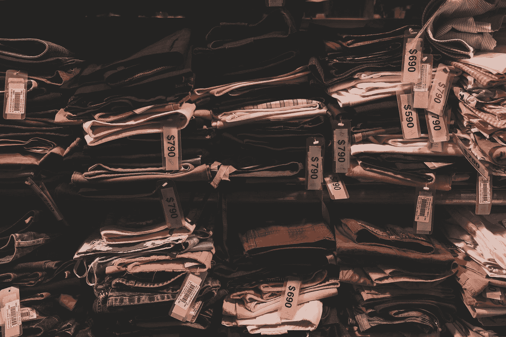

# 区块链推动的零售清算销售

> 原文：<https://medium.com/swlh/retail-liquidation-sales-powered-through-blockchain-b421d7b2a4f5>

“assorted-color textiles” by [Henry & Co.](https://unsplash.com/@hngstrm?utm_source=medium&utm_medium=referral) on [Unsplash](https://unsplash.com?utm_source=medium&utm_medium=referral)

这里有几十家零售店在 2018 年在多个地点关门，如果不是全部关门的话。尽管许多商店关门，但仍有许多未售出的产品留在货架上。清算销售通常是最快处理剩余产品的最常用机制。不幸的是，对商店来说，清算通常意味着价格越来越低，直到商品消失。然而，区块链技术的新进展带来了一个互惠互利的解决方案，对商店和顾客都有好处。

# **店铺关闭状态**

今年夏天，西尔斯控股列出了 46 家不盈利的商店，将于 11 月关闭。这份名单包括 33 家西尔斯商店和 13 家凯马特商店。除此之外，该集团今年早些时候还确定了另外 78 家关店。这些商店的下一步行动是什么？以有吸引力的价格出售产品，并提供尽可能多的流动资金，同时允许商店在合理的时间内关闭，以避免增加成本。

# **Prime 协议和 Genesis 2 小时送达**

作为 Buying.com Prime 协议的一部分，这种清算模式可以通过 buy . com 的 2 小时 Genesis 交付得到改善。通过移动应用程序，零售店(甚至制造商)可以上传交易并设置最小订单量。交易一旦上传，就会被推送给平台上的数百万用户。

将这些交易推向 Buying.com 用户群可以在几个方面帮助公司的清算销售:

*   它可以使清算销售进行得更快，并加快结算过程。
*   商店可以同时出售大量产品，因为清算交易变得数字化，而不仅仅是实体店的游戏。
*   在某些地方，这些商品可以在 2 小时内送达。

这些好处可以为清算过程带来革命性的改变。这不仅有助于商店节省成本，还能帮助网上购物者获得他们所在地区可能无法获得的清算交易。

# 每个人都将拥有数百万的购买力

通过 Buying.com，个人将数百万的购买力掌握在手中。该平台利用其用户基础来创造对产品的大规模需求，并通过将人们聚集在一起购买同一产品来实现批发价格。当一笔交易在网站上直播时，它会被推送给用户。达到最小订单量后，就可以进行批发交易了。然后，它被直接交付给个人，或者被发送到我们的一个分发节点。

# [**今天投资 Buying.com 预售，获得 20%代币奖励**](http://Buyingcom.ref-r.com/c/i/21101/17979482) **。**

我们的配送节点旨在成为邻居存储设施。他们把每个车库都变成了储藏室。通过在 Buying.com 生态系统中将代币作为抵押品，分销商在平台上拥有了抵押品。这对于清算交易之外的许多用例来说是革命性的。

# **关闭**

随着更多零售商寻找退出信号，清算交易将变得越来越受欢迎。Buying.com 的 Prime Protocol 可以为正在进行清算的商店提供许多功能，例如加快清算过程，并以推送通知的形式向拥有数百万用户的用户群提供清算物品。现在，您可以投资 Buying.com 的预售，并获得 20%的代币奖励。

## 这篇文章发表在 [The Startup](https://medium.com/swlh) 上，这是 Medium 最大的创业刊物，拥有+ 376，225 名读者。

## 在这里订阅接收[我们的头条新闻](http://growthsupply.com/the-startup-newsletter/)。

