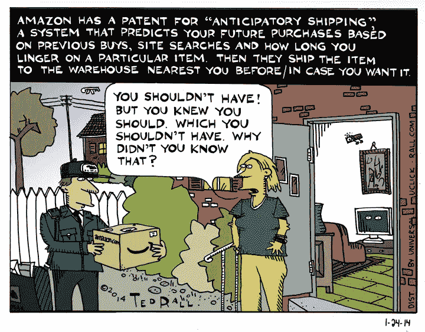

# 零售上市速度:不新鲜，也不会放缓

> 原文：<https://medium.com/swlh/retail-speed-to-market-not-new-not-slowing-down-663d0b51a1e4>

## 零售业一直有“对速度的需求”。

1858 年，罗兰·赫西·梅西创立了梅西百货。本杰明·奥特曼和洛德&泰勒很快就开张了，接着是麦克雷里和亚伯拉罕&斯特劳斯。这些纽约市的“百货商店”激烈竞争，成为第一个宣传和传递新兴时尚和趋势的商店。

20 世纪 50 年代，我的祖父是一家服装制造和销售公司的老板，他会和他的首席设计师(乘坐泛美航空公司的航班)飞往巴黎，参加时装秀。不允许使用摄像机，设计师会在模特走秀时勾勒出流行趋势。他们会拿着草图飞回美国，直接去北卡罗来纳州的工厂制作原型、样品并生产“流行”服装。这些服装将在一季后上市，与欧洲时装系列同时上市，比竞争对手早几个月或几周。

Author’s grandfather, top left, with models

# 我们需要加快速度。快多了。

今天的消费者期望立即得到满足。而且，公司都在排队服务这一愿望。

在消费者需求、“立即展示，立即购买”的时尚展示的推动下，“速度需求”加速增长，而社交媒体以前所未有的速度向更多购物者展示产品趋势，进一步提升了这种需求。

**时尚和零售业正走向“实时”供应链。**这一新的价值链将利用“测试、测量和优化”数据分析，在时间敏感、通常直接面向消费者的基础上，瞄准并服务大量独特的利基市场。

**更快的产品周期将提高我们客户的满意度，降低我们库存过剩的风险，并获得更高的利润。**

更短、更快、更频繁的产品运行是对大多数零售业务模式的根本性和破坏性改变，是对我们供应链的挑战，也是消费者数据获取和应用的转变。

支持这种快速上市计划的新工具正在出现。预测分析、供应商管理库存(VMI)、机器学习、人工智能、微型工厂、3d 打印和增强的直接面向消费者的交付的激增和优化正在将这一“实时”供应链带入生活。

为了跟上创新和面向消费者战略的飞速发展，我们需要做出更快、更高质量的决策。决策速度的加快需要重新培训和思考我们的流程、指导方针和规则。

# 快速时尚

华尔街日报追踪了 Zara 正在开发的一件带有富有表现力的硬件的外套。商店经理、设计师和商业化团队都在同一个办公室密切合作，开发一个概念。然后，样板师很快做出了符合潮流的服装原型。他们只花了五天时间就想出了一个设计。然后，镇上的制造商在 13 天内制作了 8000 件大衣。Zara 把它们送到西班牙萨拉戈萨的物流中心，然后用卡车运到巴塞罗那机场。24 小时内，他们到达 JFK，被送到第五大道的一家商店。顾客可以在不到一个月的时间里买到当地的“本月风味”。

 [## 快时尚:Zara 外套如何在 25 天内从设计走向第五大道

### 从西班牙 Zara 的设计工作室到曼哈顿的零售展示架，one coat 的旅程提供了一个内部…

www.wsj.com](https://www.wsj.com/articles/fast-fashion-how-a-zara-coat-went-from-design-to-fifth-avenue-in-25-days-1481020203) 

# 两点之间的最短距离

亚马逊已经为“[预期运输](https://www.google.com/patents/US8615473)”申请了专利，该专利使用人工智能来预测哪些产品将在消费者的地理位置中受欢迎，然后在客户下单之前将这些产品储存在附近的仓库中。

有一个零售饮水机的故事，讲的是一个叫 Marco 的男人，他回到家发现一个来自亚马逊的包裹放在他家门口。他很困惑，他没有从亚马逊订购任何东西。他走进家，打开盒子，发现只有一个灯泡。他坐在办公桌前，打开笔记本电脑向亚马逊发送投诉信息……就在这时，他台灯的灯泡“砰”地一声熄灭了。

上个月，亚马逊将当天送达和一日送达服务扩展到了美国的 8，000 个市场。这一扩展将这些服务扩展到了美国的大城市和小城镇。

 [## 亚马逊将当日送达和一日送达服务扩展到数千个城市

### 亚马逊今天宣布，它已经将其当天送达和一日送达服务扩展到数千个市场…

techcrunch.com](https://techcrunch.com/2017/12/13/amazon-expands-same-day-delivery-and-one-day-shipping-to-thousands-more-cities/) 

同样在上个月，Target Stores 为 [Shipt](https://www.linkedin.com/company/4809147/) 支付了 5.5 亿美元，使其 1800 家门店中的一半在明年夏天实现了当天送达，整个连锁店在明年圣诞节实现了当天送达。

**感受需求:**对更智能、更快捷、无摩擦的商务的需求，以满足我们日益苛刻的消费者，并以更低的风险创造更高的利润。

# “对速度的需求”也适用于零售业

零售业格局的变化导致许多商店关闭，许多传统意义上的零售工作岗位流失。然而，新的格局正在配送中心、物流、人工智能、虚拟现实、互动展示和其他学科创造新的零售工作岗位。随着零售业转型速度的加快，求职者必须以同样的速度寻求新的培训和发展新的工作技能。

2018 年，大卫·j·卡茨——纽约市

David J. Katz 是行业领先的跨国消费品公司 Randa Accessories 的首席营销官，也是世界上最大的男士配饰公司。

他的专长是与零售商、品牌和供应商合作，在不断发展的市场中创新并取得成功。

大卫被领英选为 2017 年“[最佳声音。](https://www.linkedin.com/pulse/linkedin-top-voices-2017-must-know-people-inspiring-todays-roth)“他被《女装日报》评为[引领时尚产业](https://www.google.com/url?sa=i&rct=j&q=&esrc=s&source=images&cd=&ved=0ahUKEwjO-M2y7ITYAhUHKiYKHcheAlkQjRwIBw&url=http%3A%2F%2Fwwd.com%2Fwwd-publications%2Fdigital-daily%2Fmondays-digital-daily-april-3-2017%2F&psig=AOvVaw1UUxt9X_VP2djw_y76zFzB&ust=1513180933315355)，被《先生》杂志评为[男装推动者](http://www.mr-mag.com/menswear-movers-of-2016/)。

他是一名公共演说家，也是畅销书《设计应对:有效的创意直接营销》的合著者。《纽约时报》、《华尔街日报》、《纽约杂志》、《赫芬顿邮报》、《先生杂志》、《WWD》。

大卫毕业于塔夫茨大学和哈佛商学院。他是神经生物学、消费者行为和“刺激与反应”的学生巴甫洛夫这个名字听起来很耳熟。

— — — — — — — — — — — -

#时尚，#零售，#营销，#创业，#工作，#职业，#广告，#快速营销，#技术，#大数据，#分析

## 这个故事发表在 [The Startup](https://medium.com/swlh) 上，这是 Medium 最大的企业家出版物，拥有 291，182+人。

## 在这里订阅接收[我们的头条新闻](http://growthsupply.com/the-startup-newsletter/)。

