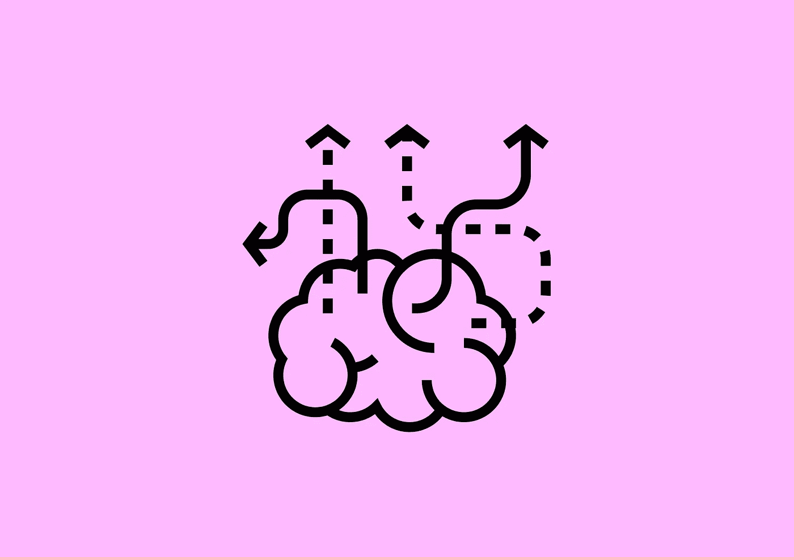

# 反思设计:第四部分。作为一名设计师，要超越过程、产品和用户来思考。

> 原文：<https://medium.com/swlh/rethink-design-part-four-think-beyond-process-products-and-users-as-a-designer-df3b8acc9b56>

# “高效设计”的理念超越了过程、产品和用户。它们是整体的。将它们作为你设计思维的一部分。

Think beyond process, products, and users as a designer.

让我们从理解谈论很多的“设计思维”开始。我们需要了解它的起源…