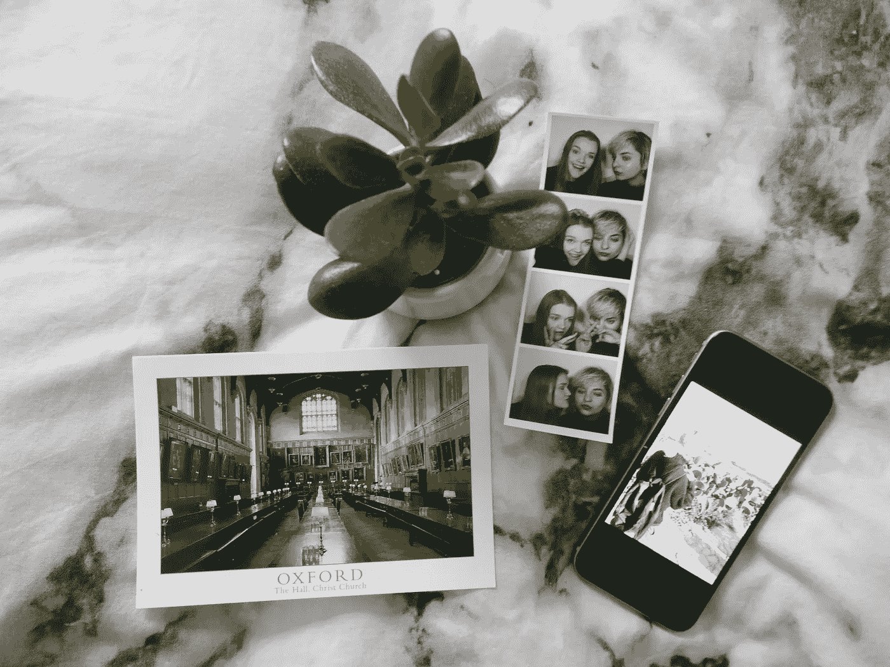

# 把它想象成一本书，反思你的智能手机瘾

> 原文：<https://medium.com/swlh/rethink-your-smartphone-addiction-by-imagining-it-as-a-book-2949923c315d>

作为一个社会，我们还没有真正理清智能手机礼仪。

我们的手机已经成为我们生活中无处不在的存在。我们没有明确的规范来确定何时不适合使用它们。

在大多数情况下， [3 或 4 条简单的建议](https://www.rosieleizrowice.com/blog/lifeadvice)会让你获得 80%的可能收益。当…