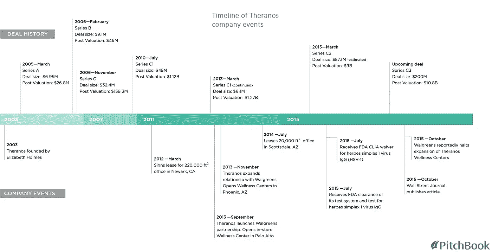

# 反思企业家精神

> 原文：<https://medium.com/swlh/rethinking-entrepreneurship-cbc7a3a6b5e2>

为什么每个人都应该更加关注 Theranos 丑闻。

Summary of Theranos inception, rise, and demise. **Source:** [**Pitchbook**](https://pitchbook.com/profiles/company/44161-48)

Theranos 的崩溃是近年来最有问题的科学欺诈和令人震惊的监管缺失的例子之一。

[Jean-Louis Gassée](https://medium.com/u/d6c6baafd47d?source=post_page-----cbc7a3a6b5e2--------------------------------) 在他最近详述下面这个问题的文章中，对似乎已经出错的一切给出了一个很好的引子。