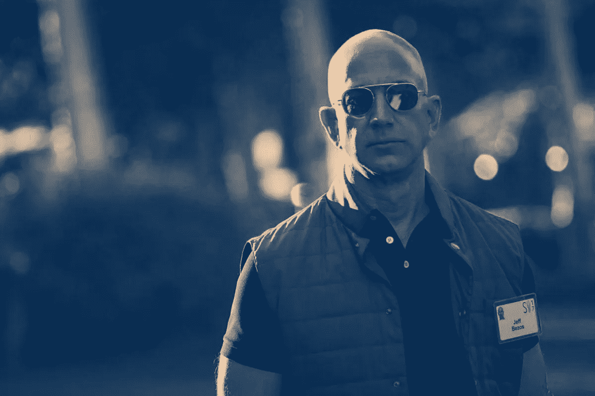
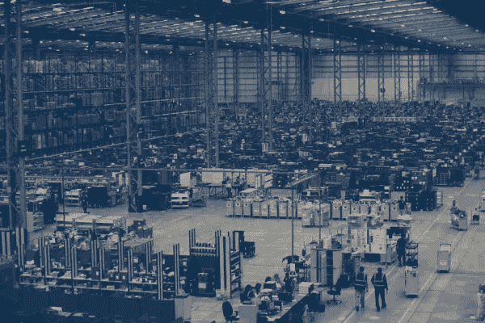
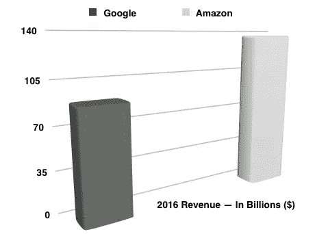
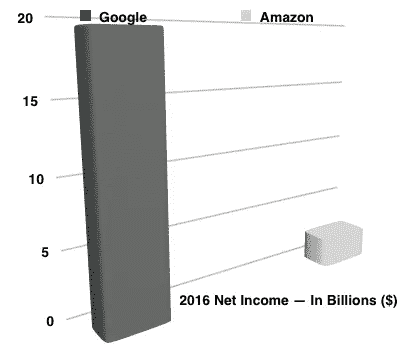

# 失败的回报:为什么杰夫·贝索斯不相信利润

> 原文：<https://medium.com/swlh/return-on-failure-why-jeff-bezos-doesnt-believe-in-profit-a4e08c93ba12>

[**由尼坦纳朗**](https://www.linkedin.com/in/nitant-narang-49446014/)

在讨论为什么和如何之前，让我们从最开始说起:1991 年，杰夫·贝索斯在蜡烛两头烧；他的小屋位于曼哈顿摩天大楼的高层，包括一张临时床，贝佐斯会不时地自己动手。对贝佐斯来说，在华尔街最前沿的量化对冲基金之一 DE Shaw 的不间断的[工作日](https://books.google.ca/books?id=t95iRvivDHIC&printsec=frontcover&dq=the+everything+store&hl=en&sa=X&ved=0ahUKEwjzhLKYw6XVAhVmjFQKHefACxAQ6AEIJjAA#v=onepage&q=regret%20minimization&f=false)，展现了任何保守、保守的华尔街银行家都无法想象的可能性。

作为该基金在非常新兴的互联网领域的投资负责人，贝佐斯对科技的早期发展有着独到的见解——尤其是个人电脑、拨号上网的普及及其极快的普及速度。贝佐斯在普林斯敦大学期间获得了深刻的分析和有条不紊的解决问题的方法，与他极其外向的性格和不懈的渴望相匹配，他希望以任何朝九晚五的工作所允许的速度产生影响。

目睹了互联网的飞速发展，以及它颠覆行业的戏剧性方式，贝佐斯很快意识到，如果有一个地方能与他的思维速度相匹配，那它必须位于万维网的某个地方；被它的可能性所震惊，贝佐斯探索了几个商业想法。然而，让他晚上睡不着觉的一个想法是*一切商店*——一个单一统一的在线集市，来自世界任何地方的任何人都可以找到并购买他们想要的任何东西。

贝佐斯与德肖的创始人(大卫·艾略特·肖本人)分享了这个想法，表达了他想离开公司，全职追求这个想法的愿望。在 DE Shaw，贝佐斯被认为是该基金最有前途的员工之一——有着稳定的工作和华尔街典型的超额完成者的薪水。由于要照顾一个家庭，贝佐斯不得不做出决定，为了一个尚未被证明是正确的想法而放弃一个稳定而有利可图的未来。

“他(我的老板)说服我在做出最终决定之前考虑 48 小时，”贝佐斯在一次采访中说。

# 后悔最小化框架

正是在这中间的 48 小时里，贝佐斯提出了一个决策框架。贝佐斯称之为后悔最小化框架——一个指导亚马逊决策至今的框架。对贝佐斯来说，后悔最小化框架就是做出无法理性或客观做出的*人生*决定的过程。

Jeff Bezos built a Regret Minimization Framework to make life decisions that could not be made rationally or objectively.

“我想预测自己 80 岁的时候，然后说，‘好吧，现在我回顾我的生活。我想把我后悔的次数减到最少……我知道当我 80 岁的时候，我不会后悔尝试过这个。我不会后悔尝试参与这个被称为互联网的东西，我认为这将是一件非常重要的事情。我知道如果我失败了，我不会后悔，但我知道我可能会后悔的一件事是从来没有尝试过。我知道这将每天困扰我，所以，当我这样想的时候，这是一个难以置信的[简单的决定](https://www.youtube.com/watch?v=jwG_qR6XmDQ)

那是在 1991 年。我们在 2017 年；亚马逊现在是一家价值 5000 亿美元的公司，杰夫·贝索斯是世界上最富有的 T4 人之一。

# 在亚马逊，ROF(失败回报)比 ROI 更有价值

亚马逊区别于其他公司的一点是，在亚马逊，永远不会像往常一样做生意。在公众眼中，亚马逊并不是一家真正的科技公司——至少不像谷歌或脸书那样；在大众的想象中，亚马逊是一个巨大的零售商，拥有像城镇一样大的仓库和超大规模的物流网络，可以在不到 24 小时内从埃塞俄比亚最偏远的咖啡种植园运送新鲜的阿拉比卡混合物。

然而，它的大部分顾客不会意识到亚马逊的真正优势在于实验——无情而病态的实验，几乎完全不顾股东的感受。这种狂热的实验驱动力让贝佐斯和他的增长倍增器大军全力支持那些看起来太有希望而无法克制的想法。无论是亚马逊 Echo，Fire Phone 的不幸遭遇，命运多舛的亚马逊网络商店，还是亚马逊网络服务(AWS)的市场垄断，几乎可以说亚马逊存在的理由是抵制任何和所有滑入单调的企业生活的冲动。

“为了发明，你必须进行实验，如果你事先知道它会起作用，那就不是实验。杰夫·贝索斯在给股东的一封信中写道:“大多数大型机构都接受发明的理念，但不愿意经历一系列失败的实验。”。

事实上，虽然亚马逊的实验产生了 Kindle、亚马逊网络服务、亚马逊市场等创新，但可以说没有其他财富 500 强公司像亚马逊一样经常失败。亚马逊的灾难清单很简单:亚马逊网络商店(与 Shopify 竞争的电子商务平台)；在 Fire 手机受到惨淡的接待后，亚马逊不得不进行 1.7 亿美元的减记，以说明其未售出的库存；WebPay 的快速终结，亚马逊对 PayPal 的回答；亚马逊目的地，它的酒店预订服务；Living Social，本来是要和 Groupon 竞争的——这只是名单的开始。

The one thing that distinguishes Amazon from other companies is that at Amazon, it’s never business as usual.

# 亚马逊如何承受失败？

2016 年，亚马逊的年收入增长了 [27%](http://www.seattletimes.com/business/amazon/amazon-revenues-hit-by-stronger-dollar-miss-wall-street-expectations/) ，首次超过了其金砖四国的竞争对手好市多。亚马逊的年收入为 1359.9 亿美元，受到了欢欣鼓舞的投资者的欢迎。奇怪的是，其净收入或利润为 23.71 亿美元，仅占其销售额的一小部分。相比之下，谷歌年收入为[894.6 亿美元](https://www.statista.com/statistics/266206/googles-annual-global-revenue/)，同年利润为[194.78 亿美元](https://www.statista.com/statistics/513049/alphabet-annual-global-income/)。

让我们试着在这些数字中描绘出奇怪的讽刺:

没错；亚马逊的销售额是谷歌销售额的 1.5 倍以上，但其利润仅略高于谷歌的十分之一。

然而，亚马逊 2016 年微不足道的净收入是其大批信徒庆祝的原因，他们展示了让贝佐斯免于让大多数其他首席执行官夜不能寐的惩罚性预期的历史。事实上，23.71 亿美元实际上是亚马逊的职业生涯最好成绩；在过去的 10 年里，该公司的净收入在很大程度上保持在 10 亿美元以下，甚至出现了亏损——2012 年和 2014 年报告了亏损。即使是 2016 年的增长也可以用亚马逊网络服务(AWS)的快速和惊人的成功来解释，这甚至不是亚马逊的核心业务。

亚马逊故事的核心问题是——为什么亚马逊的销售额如此之高，利润却异常之低？

许多分析师认为，亚马逊让顾客轻松获得每一件商品，并以尽可能低的价格销售的雄心，迫使该公司以非常低的利润率运营零售业务。这很可能是事实；但是，正如风险投资基金安德森·霍洛维茨[的合伙人建议的那样](https://a16z.com/2014/09/05/why-amazon-has-no-profits-and-why-it-works/)，亚马逊收入的很大一部分实际上被再投资到其庞大的实验实验室中。

可以说，尽管存在争议的风险，但亚马逊确实是一家财富 500 强公司，其职能类似于一家初创公司。贝佐斯没有从事实上的垄断中获得丰厚的回报，而是选择在实验的祭坛上烧尽亚马逊的现金。

即使——有些人可能会说——这样的烧钱水平可能会给公司带来生存风险。这是一个完全合理的结论，但也是一个被反复证明是错误的结论。事实上，有一份最有先见之明、最令人敬畏的华尔街分析师的名单，这些分析师因对亚马逊的商业模式发出不祥的警告并要求投资者抛售股票而玷污了自己的声誉。这是因为，贝佐斯常常击败市场，证明大多数人都是错的。

# 贝佐斯如何证明怀疑论者是错的，几乎每次都是如此

> “我们最终的财务指标是自由现金流……”
> —杰夫·贝索斯在 2004 年写给亚马逊股东的信中

不止一次有会计师说杰夫·贝索斯毁了财务报表——这是很强烈的言辞，尤其是对会计师而言。但是他们有充分的理由抱怨。

如果亚马逊的净收入对该公司的未来提出了严峻的问题，那么它的现金流描绘了一幅完全不同的画面(现金流，正如术语所暗示的那样，是一家公司在给定时间内手头拥有的资金量)。的确，很难想象一个花了这么多钱的公司会有如此强劲的现金流。

[阅读更多…](https://blog.procurify.com/2017/08/08/manage-cash-flow-jeff-bezos/)

## 这个故事发表在 [The Startup](https://medium.com/swlh) 上，这是 Medium 最大的企业家出版物，拥有 292，582+人。

## 在这里订阅接收[我们的头条新闻](http://growthsupply.com/the-startup-newsletter/)。

