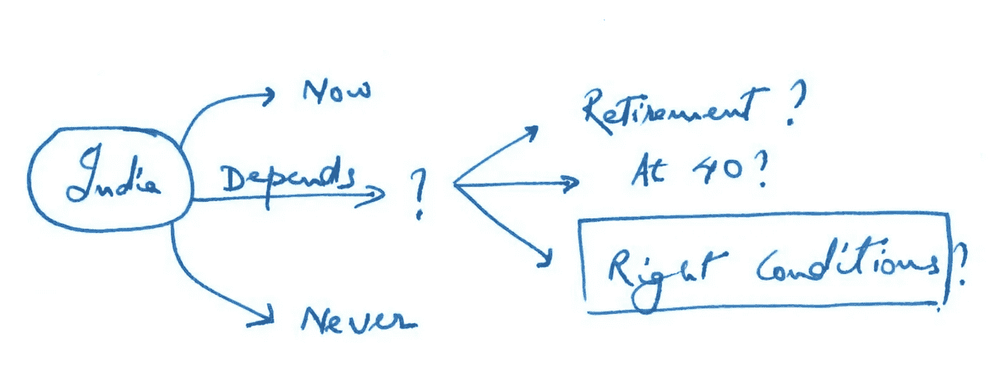

# 返回印度:决策框架

> 原文：<https://medium.com/swlh/returning-to-india-a-decision-framework-e685ce067304>

Photo by [Igor Ovsyannykov](https://unsplash.com/photos/EvoHdyfmVEc?utm_source=unsplash&utm_medium=referral&utm_content=creditCopyText) on [Unsplash](https://unsplash.com/search/photos/---india?utm_source=unsplash&utm_medium=referral&utm_content=creditCopyText)

# **一套帮助**移民**决定什么时候该回家的框架！**

我最近在[发表了一篇关于在美国生活了近 15 年后作为风险投资家返回印度的帖子](https://www.linkedin.com/feed/update/urn:li:activity:6387392206063439872/)，这让我意识到我的关系网中有多少人一直在思考这个更广泛的话题:出于各种原因，从目前居住的国家回到各自的祖国，从创业到加入大公司等等。

回到印度有太多的方面需要考虑:家庭、职业道路、日常生活、薪水、生活方式和总体幸福。真正帮助我做出这个决定的是我在评估这个决定的前三个因素时所经历的一系列框架:(1)我为什么要搬到印度？(2)什么时候搬家合适？(3)我在印度能做什么是我在美国能做的 10 倍？

如果您有任何问题，请随时在 [twitter](https://twitter.com/MohapatraHemant/) 或 [linkedin](https://www.linkedin.com/in/hemantmohapatra/) 上 ping/关注我。不胜感激如果你 [**转发**](https://twitter.com/intent/tweet?text=Set%20of%20frameworks%20to%20help%20immigrants%20decide%20when%20it%20is%20the%20right%20time%20to%20head%C2%A0home%21https%3A%2F%2Fmedium.com%2F%40MohapatraHemant%2Freturning-to-india-a-decision-framework-e685ce067304&source=webclient) ，或者 [**分享**](https://www.linkedin.com/shareArticle?mini=true&url=https%3A//medium.com/%40MohapatraHemant/returning-to-india-a-decision-framework-e685ce067304&title=Returning%20to%20India%3A%20A%20decision%20framework&summary=Set%20of%20frameworks%20to%20help%20immigrants%20decide%20when%20it%20is%20the%20right%20time%20to%20head%20home!&source=) **。**

## 1.“我死在哪里”框架:

如果你像我一样，在多个国家生活/工作过，去过很多地方，很可能你喜欢很多地方！当我思考我想长期生活在哪里的时候，我总是问自己，“我想生活在哪里”，这样下决心是不可能的。正确的问题是“我想死在哪里”。对于 T21 的问题，没有人感到困惑。

Framework #1 — the “where do I die” framework

当我心里知道这个问题的答案时，下一个问题是，“我离死亡有多远？”我要等到退休吗？直到我 40 岁？或者我现在该走了？这让我想到了第二个框架。

## 2.“何时是合适的时机”框架:

Framework #2 — the “right time” framework

这基本上是不言自明的。就我个人而言,“现在”的选择似乎很冲动——只有在家庭紧急情况下，或者在你被迫做出选择的情况下(比如签证问题)才会采取这种做法。“永不”选项通常是关于在你目前居住的国家有太深的根——一个对搬家、孩子、健康需求等不感兴趣的伴侣。幸运的是，我没有这样的限制，所以我可以专注于创造合适的条件，在这种条件下，回到印度将有最大的成功机会。

然而，为了达到“合适的条件”这一步，我们需要回到我所说的“职业差距分析”框架。这是我用过的最有用的框架之一，如果你诚实并坚持不懈地努力，它是有效的。

## 3.“职业差距”框架:

职业生涯是一场漫长的游戏。我认为我的职业生涯是一个 X-Y 图，在时间 T=0 时，我在左下方，并试图移动到右上方。要做到这一点，你需要*知道*右上角的*是什么*。下面举几个例子:

Framework #3: the career gap analysis framework

仔细想想你今天在哪里，5 年后你想去哪里。例如，如果你想创业，你需要建立一个“超级大国”——一个只有你能拿出来的东西，无论是技术实力、市场理解还是人脉。你还需要为一个想法建立信念和激情，以度过艰难时期，你必须成为一个执行机器，等等。开始研究这些。

但是怎么做呢？回车:Z 轴。

我认为 Z 轴是 Y 轴阶跃函数改善的驱动力。除非你把自己放在舒适区之外，否则成长(并且快速成长)真的很难。带来这种不适的是 Z 轴上的运动——成长的驱动力——例如，在同一家公司的*新角色*，继续你的*教育*，改变你的*公司*，改变*地点*等等。

以我的职业生涯为例。

Framework #3: my career gap analysis from 2010–present

我大学刚毕业时是一名工程师，但在写了 6 年多的代码后，我想要一个更加以业务为中心的配置文件。我在公司里担任了产品经理的角色(*角色*变化)，接着是 MBA ( *教育*，之后我加入了[这里的诀窍是真正理解你回来是为了什么，然后在其他事情上格外灵活。](https://medium.com/u/4f3f4ee0f977#4: the “right conditions” analysis framework</figcaption></figure>
</figure>
</figure>
</figure>
</figure>
</figure>
</figure>
</figure>
 [专业权重*{(健康分数* 0.3) +(自主分数* 0.2) + …} +个人权重* {(位置分数* 0.6) +(薪资分数* 0.4)}](https://medium.com/u/4f3f4ee0f977#4: the “right conditions” analysis framework</figcaption></figure>
</figure>
</figure>
</figure>
</figure>
</figure><p id=)[这里](/@MohapatraHemant)或[推特](https://twitter.com/MohapatraHemant/)，或 [linkedin](https://www.linkedin.com/in/hemantmohapatra/) 。

## 这篇文章发表在《创业公司》杂志上，这是 Medium 最大的创业刊物，有 318，583 人关注。

## 订阅接收[我们的头条](http://growthsupply.com/the-startup-newsletter/)。

