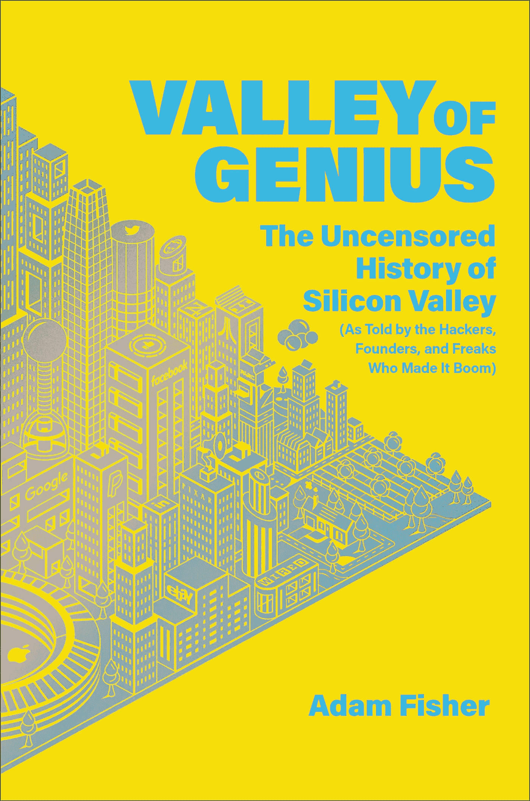
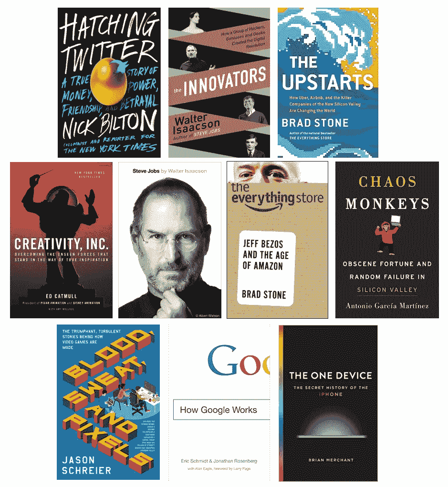

# [点评⭐⭐⭐]天才之谷

> 原文：<https://medium.com/swlh/review-valley-of-genius-914cc7d649f4>

## 一本不错的索引，可供其他名著阅读

我刚看完亚当·费舍尔的 [*天才之谷:未经审查的硅谷历史(正如让硅谷繁荣起来的黑客、创始人、怪胎们所讲述的)*](https://www.goodreads.com/book/show/36382335-valley-of-genius) ，一句话，还过得去。

这本书的独特和有趣之处不在于它的内容，而在于它的呈现方式:具体来说，就是叙事结构——没有一种叙事结构。

## 爆裂鼓手

费希尔的文章是费希尔直接采访过的[个人的一行一行的引语的集合，或者是科技新闻社区的其他成员的引语。在阅读之前，我不太确定会发生什么，因为这种结构很容易让参与者断章取义。](https://www.theverge.com/2018/8/16/17694438/valley-of-genius-adam-fisher-oral-history-silicon-valley-interview)

也就是说，它以一种公平和看似诚实的方式阅读，尽管考虑到这一任务，许多采访的编织做得相当好，但它仍然让读者在阅读过程中感到不适。尽管已经熟悉了许多提到的技术里程碑的原始故事，我仍然发现自己不得不在每页上多次切换上下文。这肯定是一个有趣的结构，这使得这本书更像一件“艺术品”而不是一本书。

有一个[的配套播客，以采访书中出现的一些名字为特色](https://twit.tv/shows/valley-of-genius)，老实说，这些更令人愉快，因为它们没有与其他采访逐行拼接。从一个人到另一个人对一个话题的持续思考是这本书文本的一个令人耳目一新的变化。这些采访和故事可以拍成一部优秀的纪录片。

我可以理解将这几千个小时的采访编织成一个连贯的叙事结构，不需要周围的文字，必须付出多年的努力，但它并没有完全转化为读者的价值，这是不幸的。

## 科技史上一些鲜为人知的角落

对我来说，这本书最令人愉快的部分之一是，这些采访中的许多名字来自那些你通常不会从其他渠道听说的人。每个人都知道史蒂夫·乔布斯说过的每一句话，但是你知道像迈克·斯莱德和查尔斯·西蒙尼这样的人吗？典型地，施乐 PARC 公司的故事在结尾讲述了比尔·盖茨和史蒂夫·乔布斯如何引领下一个计算时代，但是大量的细节被放在了早期阶段。Napster 是另一个很好的例子，它经常在脚注中被提及，但在这里得到了很好的端到端覆盖。

## 一个很好的索引，还可以阅读其他内容

《天才之谷》为你提供了一个很好的大纲，可以让你更深入地了解其他话题。觉得 GUI 的起源有趣吗？很好，现在你知道去寻找更多关于道格·恩格尔巴特的“[所有演示之母](https://en.wikipedia.org/wiki/The_Mother_of_All_Demos)”和 PARC 施乐的信息了。想知道更多关于 Twitter 如何从一个播客公司的灰烬中开始的吗？太好了，尼克·比尔顿的书现在应该在你的亚马逊购物车里了。也就是说，这本书的结构让不熟悉许多事实的读者很难理解，那么它到底是为谁而写的呢？

# 接下来呢？

那么，你还应该看看哪些书呢？

<More or less sorted in the order I enjoyed them, but all are highly recommended>

*   要阅读像这样的概括性文本，但要有一个更连贯的故事，请阅读沃尔特·伊萨克森的: [*《创新者:一群黑客、天才和极客如何创造数字革命》*](https://www.goodreads.com/book/show/21856367-the-innovators?from_search=true)
*   关于苹果**和苹果**，请阅读布莱恩·麦钱特的[*The One Device:iPhone 秘史*](https://www.goodreads.com/book/show/32603496-the-one-device?from_search=true) 和沃尔特·伊萨克森的 [*史蒂夫·乔布斯*](https://www.goodreads.com/book/show/11084145-steve-jobs?from_search=true)
*   谷歌**谷歌**，阅读埃里克·施密特的 [*谷歌如何运作*](https://www.goodreads.com/book/show/23263733-how-google-works)
*   阅读尼克·比尔顿的《推特:一个关于金钱、权力、友谊和背叛的真实故事》
*   关于**雅达利**(以及周边的游戏产业)，请阅读: [*热血、汗水和像素:杰森·施莱尔的《视频游戏如何制作背后的胜利、动荡的故事》*](https://www.goodreads.com/book/show/34376766-blood-sweat-and-pixels?ac=1&from_search=true)
*   对于**皮克斯**，阅读: [*创意公司*](https://www.goodreads.com/book/show/18077903-creativity-inc) 。作者:艾德·卡姆尔

本书中没有提到的其他关于大型科技公司的经典书籍包括:

*   关于亚马逊，请阅读布拉德·斯通的《百货店:杰夫·贝索斯和亚马逊时代》
*   关于 Airbnb 优步 T21，请阅读布拉德·斯通的《暴发户:优步、Airbnb 和新硅谷的黑仔公司如何改变世界》
*   关于**脸书**，请阅读安东尼奥·加西亚·马丁内兹的 [*混乱猴子:硅谷的淫秽财富和随机失败*](https://www.goodreads.com/book/show/28259132-chaos-monkeys?from_search=true) (这里也有点网飞/推特的味道)

我错过了什么书？接下来我应该读什么(或者是关于这个完全不同的话题)？

感谢阅读！

布莱克<[@ b _ t _ 沃尔什](https://twitter.com/b_t_walsh) >

## 这篇文章发表在 [The Startup](https://medium.com/swlh) 上，这是 Medium 最大的创业刊物，有+ 379，938 人关注。

## 在这里订阅接收[我们的头条新闻](http://growthsupply.com/the-startup-newsletter/)。

