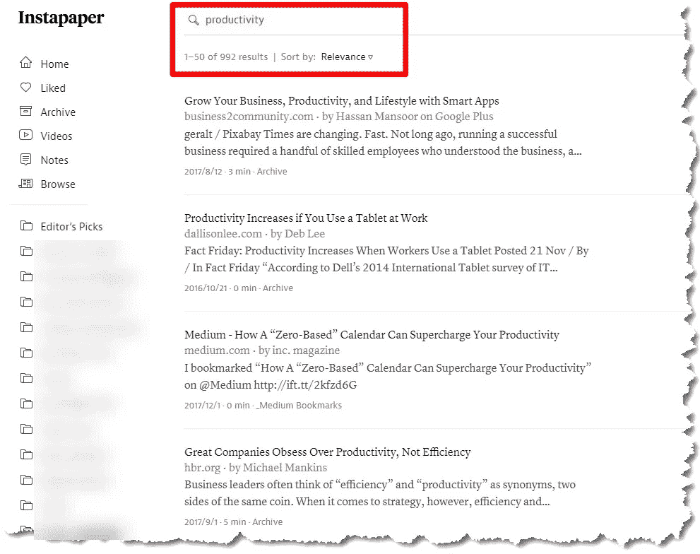
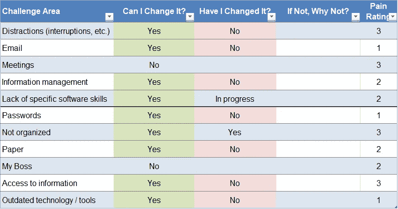
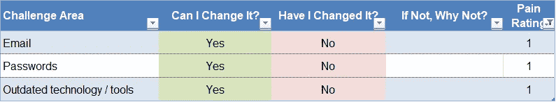

# 重温生产力习惯

> 原文：<https://medium.com/swlh/revisiting-productivity-habits-b4bce040c003>

## 让我们简单点！

生产率技巧非常受欢迎。

> 这个应用程序会救你。"
> 
> “这些技巧会让你的一天增加几个小时…”
> 
> 等等…

这是从我的 InstaPaper 服务中搜索“生产力”的结果——哇！

**Productivity Tips Everywhere! 992 related results just in my InstaPaper History**

# 问题是…

它们通常对我们大多数人不起作用。如果没有大量的纪律和行为改变来配合这些工具的话！

# 那么，我该如何提高生产率呢？

我试图让事情变得简单..

找出你日常生活中的痛点——这不会超过 10 分钟。

然后问自己这三个问题:

*   **我能改吗？**
*   ****我会改吗？****
*   ****如果不是**，为什么不是？**

**在这一点上，你很快就确定了 1) **需要**改变的地方，2)你**能够**改变的地方，3)或者已经接受了——暂时——你不会改变它！**

# ****我如何应用这种方法？****

**当我和客户一起工作时，我将这种方法形式化。**

**这是一个样本网格——这是最基本的，但是使用它可以很快地让你清楚自己的立场。你真的想变得更有效率吗？如果还没有，你会明白为什么！**

> **[**在此下载样本 Excel 文件！**](https://app.box.com/s/ihfp1yy4ty0avr9nlbuw716710m0k5id)**

****

****Sample Productivity Effort Grid****

**关于这个网格的一些观察:**

*   **保持“挑战领域”的广泛性——这并不是要详细描述您遇到的每一个棘手问题。观察应该简短而有方向性！**
*   **条件格式用于快速识别机会。**
*   **指定一个“疼痛等级”(我使用 1-3，1 表示最疼痛)。这样，从“1”开始，为你的努力提供焦点。**

****

****Filtered List provides focus!****

**就是这样。现在你有了一个简单的路线图来开始努力提高你的生产力！**

> **在以后的文章中，我将向你展示我是如何使用这个框架开始做出改变的——为什么、做什么以及如何做出改变！敬请期待！**

## **关于唐**

****

> **“是时候改变了”**

**Don 热衷于帮助专业人士和组织跟上并适应我们所处的不断变化的商业世界。**

> **[“你是做什么的？”](http://bit.ly/2pQwFdi)**

## **和唐联系！**

**[LinkedIn](https://www.linkedin.com/in/dontomoff) ， [Flipboard](https://flipboard.com/@dtomoff) ， [Twitter](https://twitter.com/@dtomoffcpa) ， [Snapchat](https://www.snapchat.com/add/dtomoff)**

****

## **这个故事发表在 [The Startup](https://medium.com/swlh) 上，这是 Medium 最大的创业刊物，拥有 339，876+人关注。**

## **在这里订阅接收[我们的头条新闻](http://growthsupply.com/the-startup-newsletter/)。**

****