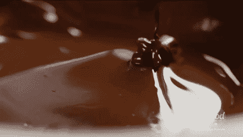
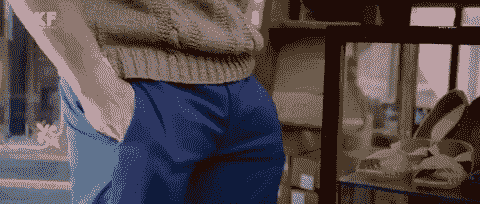

# 有钱，其他都很穷

> 原文：<https://medium.com/swlh/rich-in-money-poor-in-everything-else-b849beedbcb>

## 我为千万富翁工作时发生了什么

几年前，我给一个 11 岁的孩子上私人音乐课。为了保护她的隐私，我称她为阿莱西娅。我通过教她学到的东西影响了我对生活的看法。

阿莱西娅出生在一个非常富裕的家庭。他们住在汉普斯特德(英国伦敦)的一所大房子里，有一个住家女佣和保姆。他们在纽约曼哈顿还有一套公寓，在百慕大还有一栋海滨别墅。她的父母开豪华车——一辆路虎和一辆劳斯莱斯。当她姐姐 17 岁时，她的父母给她买了一辆奥迪 A3，尽管她还没有通过驾照考试。

# 不同的宇宙

我记得我们的第一课。我到了阿莱西娅的家，受到了女仆的欢迎。当我走进去的时候，我看到了我从未见过的东西——
永无止境的空间。它看起来像一座城堡。仅在门厅里，就有悬挂在天花板上的枝形吊灯、带镀金栏杆的闪亮大理石楼梯、一架三角钢琴和精美的艺术画作。我很敬畏。我从未见过这么多财富。这似乎是一场梦。太不真实了。**我久闻其名的是***[**理想生活**](/@saaroron/i-finally-became-successful-whats-next-3fdfe4f8b7a0) **。但是不知怎么的，我一直在想那天早些时候我在火车站看到的一个无家可归的人。我仿佛置身于另一个世界，然而它离火车站只有三英里远。***

*当阿莱西娅的母亲出现时，我在大厅里站了一两分钟，观察这座宏伟房子的所有细节。她向我打招呼，介绍了阿莱西娅。我不禁觉得她在试图打动我。我记不全了，但当她谈到他们举办的一次筹款活动和他们在亚洲度过的一次假期时，有很多人掉了她的名字。她还一直在说她老公的工作(某公司董事长)。阿莱西娅的母亲习惯于向人们叫好。她的目的是觉得自己高人一等。当她告诉我一个弦乐四重奏乐队在他们家的一个客厅(他们有三个客厅)里为这个家庭举办了一场私人音乐会时，我简直不知所措。*

*女佣把我和阿莱西娅带到主客厅，我们一年到头都在这里上音乐课。阿莱西娅是一个典型的 11 岁女孩。她快乐、友好、随和。她起初很害羞，但很快就敞开心扉，开始表达她对音乐和舞蹈的热爱。她上过芭蕾课，她喜欢唱歌。*

# *请向我的巧克力商问好*

**

*接下来的一周，当我走进房子时，我闻到一股香味。阿莱西娅的妈妈邀请我去厨房。它比我当时住的单间公寓还大。我注意到一个 30 多岁的年轻人站在柜台旁，搅拌着一碗融化的巧克力。“那不可能是阿莱西娅的父亲，”我想。“马丁，请向萨尔问好，他是阿莱西娅的音乐老师。萨尔，这是马丁，我们的巧克力商。”我简直不敢相信——他们有自己的巧克力店！*

*几分钟后，女佣给了我一杯饮料。“请给我一杯水，”我说。我感到不舒服。我不喜欢在餐馆里被服务员招待，所以让一个女仆来照顾我的需求是很尴尬的。
女佣回来了。她端着一个银托盘，递给我一杯水。“水温可以吗？”她问。我以为她在开玩笑，但我很快意识到她在等我的认可。客厅的墙上挂满了印象派艺术画作。阿莱西娅似乎一点也不在乎。她更感兴趣的是听我的歌，以及在舞台上现场表演的感觉。我问她是否愿意有一天在舞台上唱歌。阿莱西娅满面笑容地点点头。*

# *一切都计划好了*

**

*几个月后，我正要按门铃，突然听到里面传来大声的叫喊:“你需要学会如何承担责任！已经长大了，不要再像个孩子了！”这是阿莱西娅母亲的声音。我一按门铃，叫喊声就停止了。
阿莱西娅对那堂课感到沮丧，我试图让她振作起来。
“什么时候下课？”她问。“你今天不开心吗？”我质疑“不是那个。我很忙，现在没有太多时间听音乐。”
我很奇怪，一个 11 岁的女孩怎么会这么忙。“我有很多功课要做，因为我妈妈要求老师给我额外的作业，”她继续说道。“为什么？”我很惊讶。“嗯，我申请的是全国最好的学校，所以需要备考。”
“是什么让它成为最好的学校？”我问。“我不知道。但如果我被这所学校录取，我就有更大的机会被剑桥大学录取，”阿莱西娅自信地说。那时，我再也忍不住了:“但是你才 11 岁……你还有将近十年的时间，也许你真的会上大学，也许不会。”**沉默**。说话的是阿莱西娅，但不是她自己。她刚刚背诵了她被告知的东西。这与她成为歌手或舞者的梦想无关，但她觉得这很重要。我想帮助她，告诉她生活还有更多精彩——但我不想让她困惑。
**坐在我前面的这个可爱的小女孩，她的童年被偷走了**。太可怕了。她的整个人生结构已经被预先计划好了。*

*年底前一个月，我到达时，阿莱西娅正在做作业。我让她停下来，这样我们就可以开始上课了。“这真的很重要，”她说。“好吧，但你的音乐也是，”我回答道。当她说:“但是音乐只是一种爱好”时，我很震惊。这是为了我的未来。”我觉得被冒犯了。但是我不能指责阿莱西娅的粗鲁。她只是在重复她在家里听到的信息。当一个孩子被告知音乐没有价值时，你怎么能指望她欣赏她的音乐课呢？我对阿莱西娅父母的虚伪感到敬畏。他们邀请一个弦乐四重奏乐队在他们的客厅演奏，但同时又认为音乐不是一份“真正的工作”？这不仅仅是冒犯，更是侮辱！*

# *我欠你多少？*

**

> *“我认识的一些最悲惨的人是美国最富有的人，他们是我见过的最悲惨的人。”~查克·诺里斯*

*在 T21 教阿莱西娅的一年多时间里，我没见她和自己的母亲开过一次玩笑，更不用说拥抱了。似乎他们的整个关系是建立在对良好学习和考试成绩的奖励上的。*

*一个星期天的下午，阿莱西娅兴高采烈，面带微笑，穿着芭蕾舞装四处蹦跳。她说她爸爸来看过她的表演。那是我第一次见到他。看起来他在尽力示好，但他太习惯当老板了。阿莱西娅的父亲宣布，他将加入我们的课程，以监督它。晚上 8 点，下课的时候，他把我送到门口。“我通常不会那么早回家，”他说。“哦，你通常晚上 8 点以后才回家吗？”我问。“哦，是的，”他满脸笑容地回答道，“我通常从早上 7 点工作到晚上 11 点。我住在办公室旁边的酒店房间里，一周三晚。”
“哇，”我诚实地回答。他似乎很高兴。在回家的路上，我试图弄明白为什么阿莱西娅的父亲对他从不回家感到自豪。当然，**我们应该吹嘘我们有多少空闲时间，而不是吹嘘我们离成为奴隶有多近。以他的钱数，他应该有他想要的自由时间。但是保持他努力工作的商人名声是唯一让他觉得自己有价值的事情。***

*阿莱西娅的母亲会在每个月底给我开一张支票。每次她都会说:“我不会一直数我欠你多少，只要告诉我是多少，我就会还你。”。听起来她要么是在测试我的诚实，要么是想让我为自己的服务定价过高并撒谎。有一次，她递给我一个信封，说道:“我今天已经用完了支票簿，所以我要付给你现金。”到家后，我打开信封，发现她多付了我 5 英镑(7 美元)。我觉得让她知道是合适的，所以我给她发了短信。第二个月，她说:“多少钱？我不想因为我的错误多付你一分钱！”然后大笑起来。*

# *然后我突然想到*

**

> *"富人只不过是有钱的穷人。"*
> 
> *~厕所区域*

*他的钱对她来说不重要。她有那么多钱，即使再多一百万也不会有什么不同。她在寻找优越感和尊重。她试图维护她富人的声誉。她有钱，但在其他方面很穷。*

*这个发现对我来说是一个悲伤的时刻。我不再对阿莱西娅父母的行为感到震惊。我为他们感到难过。但最主要的是，我为阿莱西娅感到难过，因为我知道她注定要过同样的生活。没有人给过她[任何生活工具](/swlh/why-having-0-is-much-better-than-having-1-15729410c2d1)，除了如何变得富有的工具。住在豪华的房子里，拥有最新的玩具，上全国最好的学校——这些都没有给阿莱西娅带来任何快乐或意义。她父母所有的金钱、工作、名誉、头衔和财产都一文不值。他们几乎不在家享受这些东西。即使在家里，他们也不理解享受的概念。这是一所充满空虚和寂寞的房子。*

*我们都需要有一个意义。**如果我们因为** [**追逐虚假的理想**](/@saaroron/you-were-born-you-survived-now-what-fe277c75e3b9) **而忽视自己太久——我们最终会空虚**。*

# *想想阿莱西娅*

**

> *“成为墓地首富对我来说无所谓。晚上睡觉的时候说我们做了一些很棒的事情，这对我来说很重要。”~史蒂夫·乔布斯*

*事实是——世界上没有任何金钱可以让你变得富有风度、富有人际关系、富有家庭生活、富有价值观。
世界上没有钱可以买到哪怕是一丁点的自爱或自我意识。最重要的是——世界上没有钱可以让你在自我实现的旅程中更进一步。其实更有可能让你倒退一步。*

*所以，下次你发现自己在喂[假理想怪物](/@saaroron/my-dream-wedding-the-best-day-of-my-life-f9bbe2ba7705)，追逐金钱就好像这是一个你必须赢的上瘾游戏——请停止。停下来问问你自己——这让我更接近实现我的目标了吗？这对我有什么意义吗？它对我的自我实现之旅有帮助吗？它有助于我的意识吗？*

*下一次，金钱似乎是你所有担忧和担心的最终答案——停下来想一想。想想阿莱西娅。*

> *如果你觉得那是你想做的，就一起鼓掌👏*

# *感谢阅读！更多帖子请[跟我来](/@saaroron)。*

**

## *这篇文章发表在 [The Startup](https://medium.com/swlh) 上，这是 Medium 最大的创业刊物，有 313，216+人关注。*

## *在这里订阅接收[我们的头条新闻](http://growthsupply.com/the-startup-newsletter/)。*

**